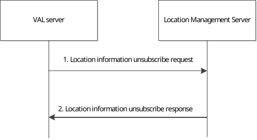

# 9.3.16 Location information unsubscribe procedure

Figure 9.3.16-1 illustrates the high level procedure of location information unsubscribe request. The same procedure can be applied for the location management client and other entities that would like to unsubscribe to the VAL UE's location information.

Figure 9.3.16-1: Location information unsubscribe procedure

1\. The VAL server sends location information unsubscribe request to the location management server to unsubscribe the subscription to the VAL UE's location information.

2\. The location management server replies with location information unsubscribe response indicating the unsubscribe status.
