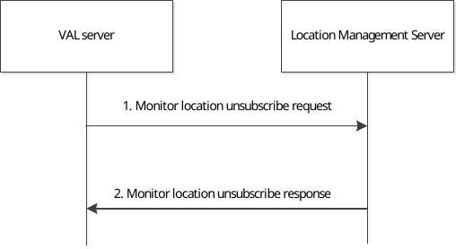

# 9.3.17 Monitor location unsubscribe procedure

Figure 9.3.17-1 illustrates the high level procedure of location monitoring unsubscribe request. The same procedure can be applied for other entities that would like to unsubscribe the subscription to monitor the VAL UE's location in a given area of interest.

Figure 9.3.17-1: Monitor location unsubscribe procedure

1\. The VAL server sends Monitor location unsubscribe request to the location management server to unsubscribe the subscription to monitor the VAL UE's location in a given area of interest.

2\. The location management server replies with Monitor location unsubscribe response indicating the unsubscribe status.
