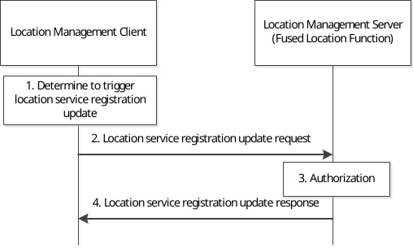

# 9.3.18 Location service registration update procedure

Figure 9.3.18-1 illustrates the procedure of client-triggered location service registration update. The location management client may update its supported location capabilities (e.g. location access type, position methods) which has registered to the location management server before.

Pre-condition:

The location management client has registered to the location management server.

Figure 9.3.18-1: Location service registration update procedure

1\. The location management client decides to trigger the registration update request to location management server to update the location capabilities which have registered to the location management server before.

2\. The location management client sends location service registration update request to the location management server with the identifier of the VAL UE, the VAL service ID and updated location capabilities.

3\. The location management server checks the authorization for the VAL UE's registration update request. If the authorization is successful, the location management server will update the UE's location capabilities received in step 2.

4\. The location management server sends location service registration update response to the location management client.
