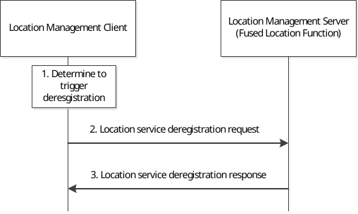

# 9.3.19 Location service deregistration procedure

Figure 9.3.19-1 illustrates the procedure of client-triggered location service deregistration. By deregistration, the location management client may deregister the available location services which have registered to the location management server before.

Pre-condition:

The location management client has registered to the location management server.

Figure 9.3.19-1: Location service deregistration procedure

1\. The location management client decides to trigger the deresgistration request to location management server to deregister the location services which have registered to the location management server before.

2\. The location management client sends location service deregistration request to the location management server with the identifier of the UE.

3\. The location management server sends location service deregistration response to the location management client and removes all registration information of the UE.
