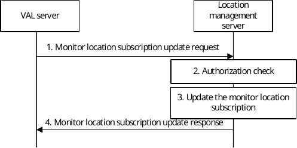

# 9.3.2.12a Monitor location subscription update procedure

Figure 9.3.2.12a -1 illustrates the high level procedure for allowing a VAL server update an existing monitor location subscription at the location management server.

Pre-conditions:

\- the VAL server has an active monitor location subscription at the location management server.

Figure 9.3.2.12a -1: Monitor location subscription update procedure

1\. When the VAL server decides to update an active monitor location subscription, it sends a monitor location subscription update request to the location management server including the information specified in table 9.3.2.11.

2\. The location management server shall check if the VAL server is authorized to update the subscription.

3\. If the VAL server is authorized to update the subscription, the location management server updates the monitor location subscription.

4\. The location management server sends a monitor location subscription update response to the VAL server including the information as specified in table 9.3.2.12.
