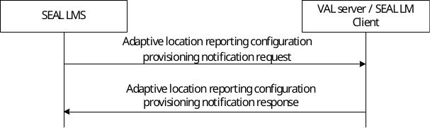

# 9.3.20 SEAL location management server provides adaptive configuration

Figure 9.3.20-1 illustrates procedure for SEAL LMS to provide adaptive location configuration suggestion to the VAL server for the VAL UE for which VAL server has requested for adaptive reporting (as specified in clause 9.3.5).

NOTE: The procedure is applicable to SEAL location management client-2 (as specified in above clause 9.3.5) if SEAL location management client-2 has requested adaptive reporting.

Pre-conditions:

1\. The VAL server has requested to SEAL LMS to suggest adaptive configuration for VAL UE;

2\. The VAL server has provided endpoint information in the Location reporting trigger to the SEAL LMS.

3\. The SEAL LMS has received location reports from SEAL client and based on the different information the SEAL LMS as determined the new/adaptive location configuration.

4\. The SEAL LMS has subscribed the energy information analytics from the ADAES for the target SEAL client. Based on the received energy information statistic and prediction for the target SEAL client, the SEAL LMS has determined the new/adaptive location configuration.

Figure 9.3.20-1: Adaptive location reporting configuration provisioning

1\. The SEAL LMS sends a message to the VAL server (or authorized SEAL location management client). The message includes UE identity and suggested updates for location reporting trigger configuration.

2\. Upon receiving the request from the SEAL LMS, the VAL server (or authorized SEAL location management client) sends a response message. The response message includes whether the VAL server accepts or rejects the updated location reporting configuration suggestion or not. If the VAL server accepts the location reporting configuration as suggested by the SEAL LMS, then the SEAL LMS updates the location reporting configuration to the SEAL location management client of the target UE.
