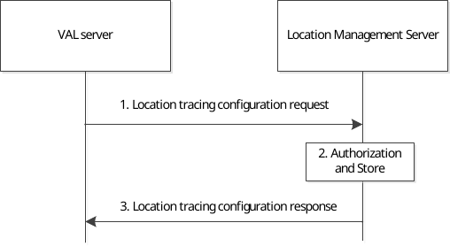
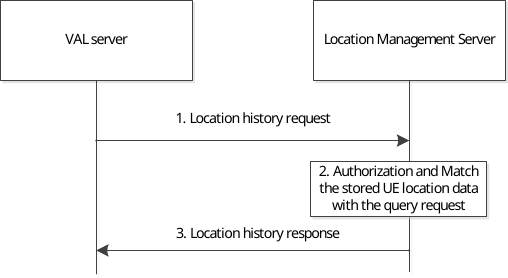
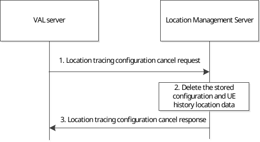
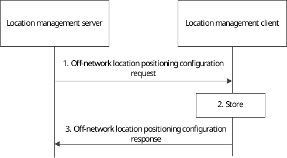
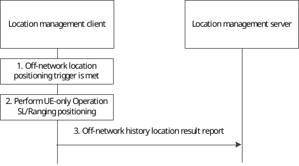

# 9.3.21 Location history querying procedure

## 9.3.21.1 Location tracing configuration create procedure

Figure 9.3.21.1-1 illustrates the high level procedure of creating location tracing configuration from VAL server to the location management server.

Figure 9.3.21.1-1: Location tracing configuration procedure

1\. The VAL server sends a location tracing configuration request to the location management server to configure the location tracing service in advance. The location tracing configuration request may contain the geographical area for history location tracing, events/conditions for triggering the location history report, location QoS, the identities for the UE and service, the time till when the SEAL LM needs to store the location history data and the required positioning method(s) , etc.

NOTE: Step 1 can be also performed when the VAL server requires updating the location tracing configuration corresponding to location management server.

2\. The location management server checks whether the VAL server is authorized to request the location tracing configuration service. If the request is approved, the location management server stores the configuration received in step 1. If the request includes multiple UEs, the location management server creates and stores the contexts for each UE.

3\. The location management server sends the location tracing configuration responses to the VAL server.

## 9.3.21.2 Location history request procedure

Figure 9.3.21.2-1 illustrates the high level procedure of location history request which the VAL server triggers to query the history location data for some specific UEs in some specific conditions.

Pre-conditions:

1\. The location management server has obtained the UE location data from multiple sources as defined in clause 9.3.3 and clause 9.3.5 periodically based on the event triggers or conditions received in the request of step 1 in clause 9.3.21.1.

Figure 9.3.21.2-1: Location history request procedure

1\. The VAL server sends a location history request to the location management server with the specific conditions (e.g. the given location area, time/period, etc.) to query the history location data for a single UE or multiple UEs.

2\. The location management server checks the authorization for the request. If the request is authorized, the location management server matches the obtained UE location data with the location history request. Before the match, the location management server may transform the obtained UE location data into the same format of the location area information received in step 1 if needed.

3\. The location management server sends a location history response to the VAL server with the matched UE location information. If there is no matched UE location data, the failure reason can be included.

## 9.3.21.3 Location tracing configuration cancel procedure

Figure 9.3.21.3-1 illustrates the high level procedure of location tracing configuration cancel request which the VAL server triggers to cancel the location tracing configuration for a single UE or multiple UEs.

Figure 9.3.21.3-1: Location tracing configuration cancel procedure

1\. If the VAL server decides to stop the location tracing services for the UE(s), it sends a location tracing configuration cancel request to the location management server with the UE identities.

2\. The location management server stops getting the UE's location and deletes the stored UE location data and the location tracing configuration for the service.

3\. The location management server sends location tracing configuration cancel response to the VAL server.

## 9.3.21.4 Off-network history location result retrieve

### 9.3.21.4.1 Off-network location positioning configuration

Figure 9.3.21.4.1-1 illustrates the high level procedure of provisioning the off-network location positioning and report configuration from location management server to the location management client. This procedure is also used to update the configuration.

Figure 9.3.21.4.1-1: Off-network location positioning configuration

1\. The location management server sends an Off-network location positioning and report configuration request to the location management client to configure the off-network location positioning and report policy to be used later. The request includes events/conditions for triggering the location history report, requested location type (i.e., absolute location or relative location), location QoS, the required positioning mechanism (i.e., UE-only Operation SL/Ranging), time duration for the off-networking positioning and report.

NOTE: Step 1 can be also performed when the LM server requires updating the configuration corresponding to location management client.

2\. The location management client checks whether the VAL server is authorized to configure off-network location positioning and report policy. If the request is approved, the location management client stores the configuration received in step 1.

3\. The location management server sends the Off-network location positioning and report configuration response to the location management server.

### 9.3.21.4.2 Off-network history location result report

Figure 9.3.21.4.2-1 illustrates the high level procedure of reporting the cached history location result to the location management server.

Pre-condition:

\- The location management client is configured with the off-networking location positioning and report policy.

Figure 9.3.21.4.2-1: Off-network history location result report

1\. The Off-network location positioning trigger is met, e.g., the reference VAL UE which hosts the location management client detects it is in off-network and the target VAL UE identified by the target UE identity is also in off-network.

2\. The location management client checks whether it is within the valid period as indicated by the time duration if configured. If yes, the location management client initiates the UE-only Operation SL/Ranging as described in 3GPP TS 23.586 \[57\], obtains its own location or the target VAL UE location, and caches the location result with time stamp. This step may be performed periodically as configured.

3\. When the connectivity is back and it is within the valid period as indicated by the time duration, the location management client sends the Off-network history location result to the location management server.
