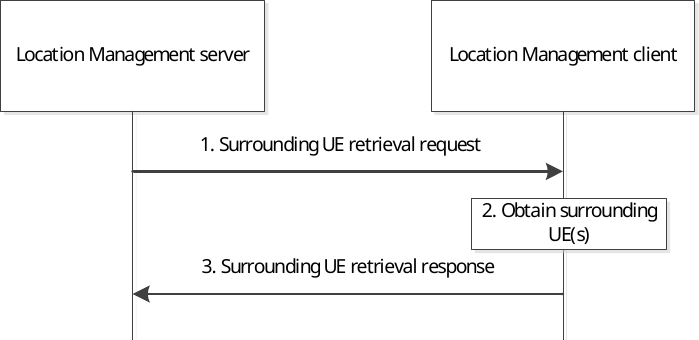

# 9.3.22 Surrounding UEs retrieval procedure

Figure 9.3.22-1 illustrates the procedure of surrounding UE(s) retrieval. The location management server can use this procedure to know how many UE(s) are close to the requested UE hosting the location management client, and their identities.

Figure 9.3.22-1: Surrounding UE(s) retrieval procedure

1\. The location management server decides to send Surrounding UE retrieval request to the location management client. The request may include surrounding UE retrieval method.

2\. The location management client obtains UE(s) close to itself. The location management client considers the surrounding UE retrieval method (if received) during the obtaining procedure.

3\. The location management client sends its surrounding UE(s) to the location management server in Surrouding UE retrieval response.
