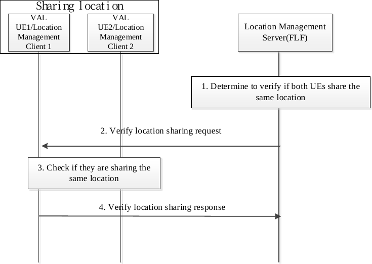
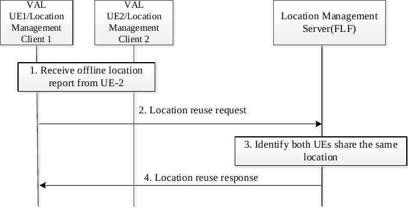

# 9.3.23 Optimization of location service for multiple UEs sharing the same location

## 9.3.23.1 General

If multiple VAL UEs share the same location area with each other, and when the VAL server requests the location information for each UE among them, the location management server will select one or several of them to obtain the location data instead of triggering all of UE's positioning procedure, which could reduce the signaling messages, save energy and power consumption, etc.

The following are the procedures to describe the related functions for such scenario.

## 9.3.23.2 Procedure of LM Server identifying the UEs sharing the same location

Figure 9.3.23.2-1 describes the procedure on how the location management server identifies the UEs that are sharing the same location.

Pre-condition:

\- The VAL UE1 and VAL UE2 are associated and may belong to the same user or different users.

\- The location management client 1(in VAL UE1) and location management client 2(in VAL UE2) have reported the location capabilities (e.g. associated ID) for VAL UE1 and VAL UE2 to location management server respectively as defined in clause 9.3.15.

NOTE: The associated ID for VAL UE1 and VAL UE2 is same.

Figure 9.3.23.2-1: Procedure of LM Server identifying the UEs that sharing the same location

1\. The location management server identifies the registered location management client1 and location management server client 2 are associated and may share the same location with each other based on the received location service registration information (e.g. same associated ID as defined in clause 9.3.15). Then it further verifies if they are sharing the same location at present.

2\. The location management server initiates the verify location sharing request to the location management server client 1 with the UE ID of location management client 2 to verify if they are sharing the same location.

NOTE: The step 2 may occur after the location management server receives the location request to the location management client 2 from the VAL server.

3\. The location management client 1 checks if the location management client 2 is close enough and shares the same location via the following ways.

\- The location management client 1 may trigger the location reporting to the location management client 2 via some positioning capabilities (e.g., ProSe) and receive off-network location report from the location management client 2 and determines that the VAL UE2 is within allowed proximity range of the VAL UE1 as specified in step 1 of clause 9.3.23.3.

\- The location management client 1 may ask the VAL user to check if VAL UE1 and VAL UE2 are in the same location. If the answer is yes, the VAL user may inform the location management client 1 that the VAL UE1 and VAL UE2 are in the same location area.

4\. The location management server client 1 sends the verify location sharing response to the location management server with the confirmation of sharing same location with location management client 2, and the validity timer is also included to indicate the valid duration for the confirmation.

> Before the validity timer expired, if the location management client 1 discovers the location management client 2 is far away from itself and they are not able to share the same location, the location management client 1 will inform the location management server they no longer sharing the same location as specified in step 2(disable) of clause 9.3.23.3.
>
> If the response is negative (e.g. the location management client 1 confirms the location management client 2 is not close with location management client 1 or the location management client 1 can't confirm whether both of UEs are closing enough), the location management server will not reuse the stored UE1's location for UE2.

## 9.3.23.3 Location reuse request

Figure 9.3.23.3-1 illustrates the procedure of client-triggered enable location reuse request.

Pre-condition:

1\. All UEs in the association are registered to share the location.

2\. UE has configured other UEs in the association to receive offline location reports as specified in clause 9.5.3.

3\. The VAL UE1 and VAL UE2 are associated and may belong to the same user or different users.

4\. The LM Client 1(in VAL UE1) and LM Client 2(in VAL UE2) have reported the location capabilities (e.g. associated ID) for VAL UE1 and VAL UE2 to LM server respectively as defined in clause 9.3.15.

Figure 9.3.23.3-1: Location reuse procedure

1\. The SEAL LMC-1 (in UE-1) receives off-network location report from the SEAL LMC-2 (in UE-2). Based on location report, if UE-2 is within certain range of UE-1, the SEAL LMC-1 determines that the UE-2 is within allowed proximity range of the UE-1 (i.e. UE-1 and UE-2 are close enough) and so UE-1's location can be used by SEAL LMS instead of UE-2's location.

Based on location report, if UE-2 is out of certain range of UE-1, the SEAL LMC-1 determines that the UE-2 is outside allowed proximity range of the UE-1 (i.e. UE-1 and UE-2 are not close enough) and so UE-1's location can not be used by SEAL LMS instead of UE-2's location.

2\. The SEAL LMC-1 (in UE-1) sends location reuse request message to the SEAL LMS to enable reuse of location of UE-1 for UE-2. If both UE1 and UE2 are close enough (i.e. within allowed proximity range), the request includes indication to enable reuse of location of UE-1 for UE-2. If both UE1 and UE2 are not close enough (i.e. outside allowed proximity range), the request includes indication to disable reuse of location of UE-1 for UE-2. The request message also includes VAL user’s identity, identity of VAL UE-1, identity of UE-2 and latest location report of UE-1 as specificed in clause 9.3.2.59.

3\. The SEAL LMS authorizes the request. If authorized, the SEAL LMS identifies that if SEAL LMC-1 and SEAL LMC-2 are associated (e.g. same associated ID) or not based on the received registration information of SEAL LMC-1 and SEAL LMC-2, and if reusing of location is allowed or not.

4\. If both UE-1 and UE-2 are assocaited and reusing of location is allowed (as determined in step-3), then the SEAL LMS stores the location of UE-1. If the request includes indication to enable reuse of location of UE-1, the SEAL LMS enables reuse of location of UE-1 for UE-2. If the request includes indication to disable reuse of location of UE-1, the SEAL LMS disables reuse of location of UE-1 for UE-2. The SEAL LMS sends response back to the SEAL LMC-1.

> When location reuse is enabled, if location request for UE-2 is received from VAL server, the SEAL LMS reuses and provides the location of UE-1 (instead of determining the location of UE-2) to the VAL server. When location reuse is disable, if location request for UE-2 is received from VAL server, the SEAL LMS provides the location of UE-2 only (by determining the location of UE-2) to the VAL server.
