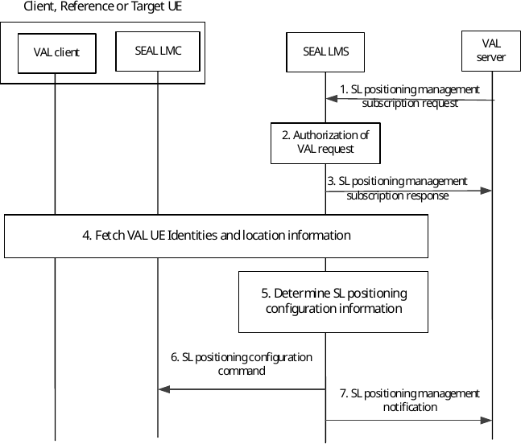

# 9.3.24 Support for sidelink positioning / ranging management

## 9.3.24.1 Procedure of SL positioning /ranging management service

The procedure provides a mechanism for configuring and provisioning information on the entities to be used and their responsibilities for a SL positioning / ranging service. In this procedure, an SL positioning enabler capability at LMS is authorized / delegated by SL positioning server to support the provisioning/delivery of ranging services in an area.

Figure 9.3.24.1-1 shows a high-level procedure with the details.

Figure 9.3.24.1-1: Support for SL positioning procedure

1\. The VAL server (SL Positioning / Ranging Server) sends an SL positioning management subscription request including IEs as defined in clause 9.3.2.61 to SEAL LMS to provision and manage SL positioning / ranging operation and configurations.

2\. The SEAL LMS authorizes the VAL subscription request.

3\. The SEAL LMS sends an SL positioning management subscription response to the requestor VAL Server.

4\. The SEAL LMS discovers all the SEAL LMCs in the target service area, and categorizes them by their capabilities and selection criteria specified by VAL server in step 1 as target UE, Reference UEs, or even Located UEs (if Reference UE location is known or out of coverage scenarios). The identification of UEs in a target area happens via existing SEAL LMS procedures (as in clauses 9.3.10 and 9.3.12).

5\. The SEAL LMS after getting all UE information at the target area, calculates the relative distances among them, and may request/receive HDMaps (e.g., from other VAL servers) for the target area.

Then, SEAL LMS evaluates the need of reference UE (based the information in step 4), and if reference UE is needed (e.g. in NLoS situation), the SEAL LMS selects the appropriate VAL UE to be served as reference UEs and configures the VAL UEs (target, reference) with configuration information. The LMS may also leverage analytics services (e.g. NWDAF) to obtain VAL UE location related predictions (e.g. UE location prediction, relative distance prediction) to discover reference UEs.

NOTE: The selection of UE as reference UEs can be based on their capabilities and the selection criteria specified by the VAL server.

6\. The SEAL LMS configures the SEAL LMCs with the configuration information applicable to the corresponding VAL UEs based on step 5, and in particular the expected role (acting as reference UE, target UE) in relation ranging/SL positioning service. Based on this configuration, the LM clients interacts each other using off-network location management procedures as described in clause 9.5.

> The LMS may ask the client VAL UEs to report the SL positioning parameters (e.g. distance, direction or both) between target UEs and reference UEs.

7\. The SEAL LMS sends a SL positioning management notification message to the VAL server to indicate the roles of the VAL UEs, the SL positioning parameters and acknowledging that the SL positioning provisioning is performed immediately.
