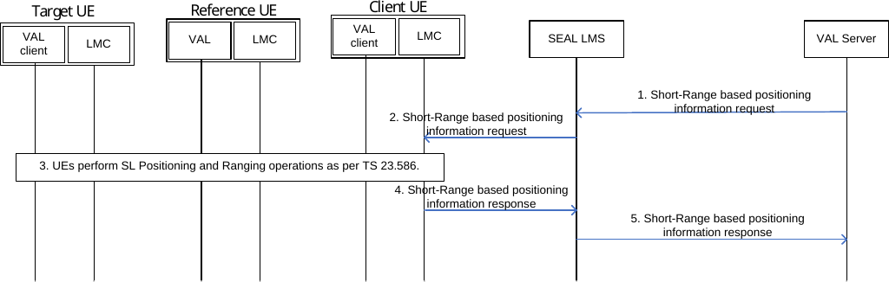

# 9.3.25 Short-Range based positioning information

Figure 9.3.25-1 describes a procedure to expose Short-Range based positioning information to third parties.

Pre-condition:

1\. Target and reference UEs are configured and provisioned for SL positioning management service as described in clause 9.3.24.

Figure 9.3.25-1: Short-Range based positioning information procedure

1\. A VAL server sends a Short-Range based positioning information request to SEAL LMS to initiate ranging/SL positioning operation for target and reference UEs. The request includes the VAL service identifier, the UE list (client, target and reference UEs), the requested Short-Range based positioning information (e.g. range, direction, relative position, relative velocity, etc.), QoS requirement, and expiration of the Short-Range based positioning information request.

2\. The SEAL LMS sends a request to the Client UE to initiate the Short-Range based positioning information procedure between the target and reference UEs using the information provided in step 1.

3\. The Client UE initiates the Ranging/SL positioning operation as described in 3GPP TS 23.586 \[57\] or in off network location reporting as specified in clause 9.5. Either UE-only operation or Network-based operation is performed when using procedure in 3GPP TS 23.586 \[57\].

4\. The Client UE sends the Short-Range based positioning information results to the SEAL LMS, which uses the Short-Range based positioning information results to derive a field of view for the target UE. The SEAL LMS uses the range and direction between the target UE and reference UEs to determine target UEs that are within a field of view of the reference UE.

5\. The SEAL LMS sends a response to the VAL server with the requested Short-Range based positioning information and exposes location information of target UEs within a field of view of the reference UE.
