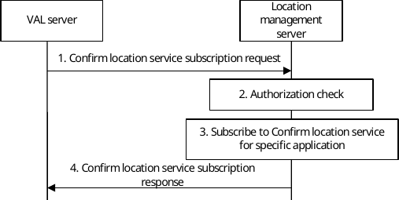
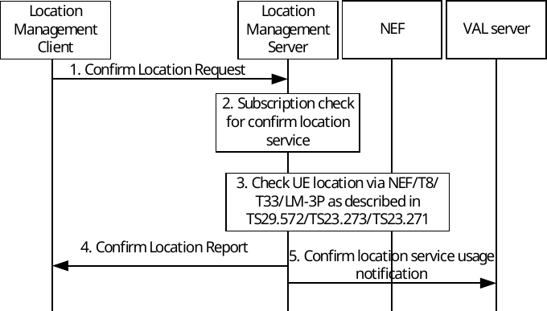

# 9.3.26 Verify UE location procedure

## 9.3.26.1 General

Verify UE location could be used by multiple applications that need confirmed location to provide their service. The UE application logic would first confirm customer location before accepting customer requests for service in a specific location.

This procedure provides the VAL server application with subscription for verification service and supports verification of UE provided location by the LMS. Only UEs using application with such subscription can use the confirm location verification from LMS. Sharing of UE location to the network is only possible with user consent. The network provided location is not directly shared but only verification is provided to the requesting LM client. The verified location is for internal UE usage.

## 9.3.26.2 Confirm location service subscription

The application is running on a VAL server. The application would like to use confirm location service and subscribes to LMS for it using the following procedure:

Figure 9.3.26.2-1: Procedure of confirm location service subscription

1\. The VAL server subscribes to LMS by sending Confirm location service subscription request to receive notification every time UE using specific application is requesting confirmation of location.

2\. The LMS shall check if the VAL server is authorized to subscribe for the confirm location service notifications for a specific application identifier.

3\. If the VAL server and specific application are authorized to subscribe for confirm location service, the LMS creates subscription based on provided parameters in the request.

4\. The LMS sends to VAL server confirm location service subscription response.

## 9.3.26.3 Confirm location verification

The location management client (LMC)/application in the UE gets its location from non-3GPP positioning. The application in the UE wants to check if this is really the correct location.

Pre-conditions:

1\. The LMC is authorized to discover the related LMS;

2\. LMS is authorized to use Nnef Event Exposure API, based on SLA with NEF/5GS of MNO;

3\. It is assumed there is user consent given in the UE for exposing location information from UE to LMS;

4\. VAL server has subscribed to LMS for notification, whenever LMC requests for confirm location report from the LMS.

Figure 9.3.26.3-1: Procedure of confirm location verification

1\. The UE sends Confirm Location request from the LMC towards LMS. It contains the location measured from the UE (non-3GPP location information, e.g. GNSS). It contains latitude and longitude, accuracy, timestamp, carrier name, cell id (known to the UE from the network signalling), application identifier.

2\. The LMS shall check if there is subscription (based on VAL subscription in clause 9.3.26.2) for confirm location service with the specific application identifier received in step 1. If subscription is present, step 3 is performed. If subscription is not present, the LMS replies back to LMC with confirm location status unknown (specified in step 4).

3\. LMS requests UE location from 5GC/LMF via NEF/GMLC (LMS send determine Location operation via NEF (N33 interface) or via GMLC (Nglc interface) and using Nlmf_Location API defined in 3GPP TS 29.572 \[8\] – parameters available from the location reporting are described in the TS). It also requests accuracy to be a parameter present in the response. LMS can also perform a location information request to GMLC directly or via NEF (as defined in clause 6.1.2 of 3GPP TS 23.273 \[5\]), acting as AF. LMS can also perform a location information request to 3rd party location servers via LM-3P interface as defined in clause 9.2.2. LMS can also use the T8 interface to obtain UE location. Or the LMS may already have the UE location based on the methods described in clause 9.3.4 and 9.3.5. The received response contains the UE location from the network. LMS can use event exposure using NEF according to table 4.15.3.1-1 of 3GPP TS 23.502 \[11\] to obtain user location information from AMF. Finally, the LMS compares the location provided from the network with the location provided from the LMC.

4\. LMS sends confirm location report to LMC with confirmed location status (e.g. unknown, verified, mismatch in the same country, mismatch in other country, roaming country mismatch, error unauthorized, etc.) as specified in clause 9.3.2.76.

5\. The LMS sends Confirm location service usage notification towards the VAL server with the UE identifier and application using the service.
