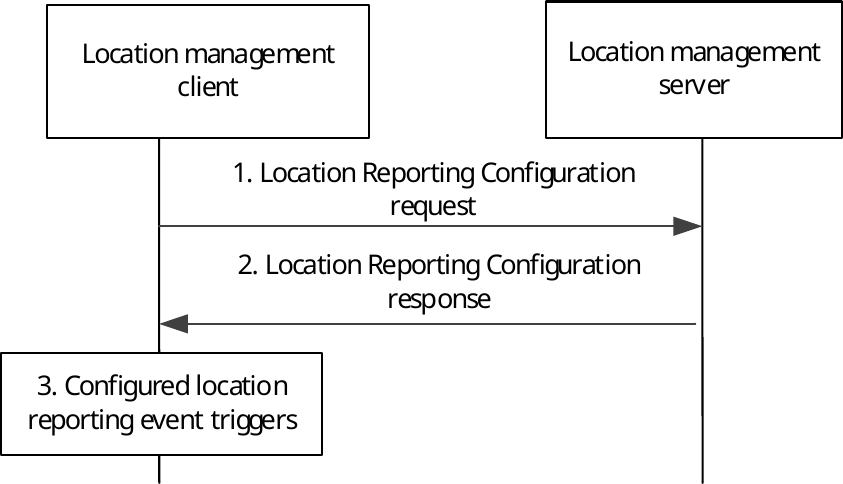
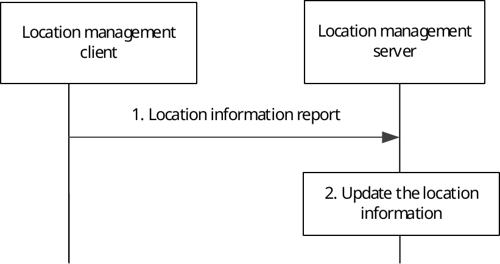
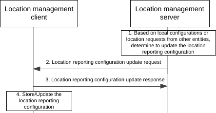

# 9.3.3 Event-triggered location reporting procedure

## 9.3.3.1 General

The location management server provides location reporting configuration to the location management clients, indicating what information the location management server expects and what events will trigger the sending of this information to the location management server. The decision to report location information can be triggered at the location management client by different conditions, e.g., the reception of the location reporting configuration, initial registration, distance travelled, elapsed time, cell change, MBMS SAI change, MBMS session change, leaving a specific MBMS bearer service area, tracking area change, PLMN change, call initiation, GPS coordinates change inside or outside a service area, periodic reporting after leaving a geographic area, or other types of events such as emergency. The location report can include information described as ECGI, MBMS SAIs, geographic coordinates and other location information.

## 9.3.3.2 Fetching location reporting configuration

Figure 9.3.3.2-1 illustrates the procedure for fetching location reporting configuration.

Pre-condition:

\- If multicast delivery mode is used, the MBMS bearer being used is activated by the location management server.

\- The location management client is aware that the location reporting configuration is available at the location management server.

Figure 9.3.3.2-1: Fetching location reporting configuration procedure

1\. The location management client sends location reporting configuration request message to the location management server.

2\. The location management server sends location reporting configuration message to the location management client(s) containing the initial location reporting event triggers configuration (or a subsequent update) , e.g. minimum time between consecutive reports, SAI changes, access RAT changes, or ECGI changes for reporting the location of the VAL UE. This message can be sent over a unicast bearer to a specific location management client or as a group message over an MBMS bearer to update the location reporting configuration for multiple location management clients at the same time.

NOTE 1: The location reporting configuration information can be made part of the user profile, in which case the sending of the message is not necessary.

NOTE 2: Different location management clients may be given different location reporting criteria.

3\. The location management client stores or updates the location reporting event triggers configuration. A location reporting event occurs, triggering step 3.

## 9.3.3.3 Location reporting

Figure 9.3.3.3-1 illustrates the procedure for location reporting.

Figure 9.3.3.3-1: Location reporting procedure

1\. The location management client sends a location information report to the location management server, containing location information identified by the location management server and available to the location management client. The location management client may include low battery indication if experience the low battery charge.

2\. Upon receiving the report, the location management server updates location of the reporting location management client. If the location management server does not have location information of the reporting location management client before, then just stores the reporting location information for that location management client. If low battery indication is received, the location management server may initiate the location reporting adaptation if the adaptive reporting is requested in step 1 of clause 9.3.5.

## 9.3.3.4 Update Location reporting configuration

The location management server may update the location reporting configuration information and inform the location management client of the update ones at any time by triggering the location reporting configuration update procedure.

Figure 9.3.3.4-1 illustrates the procedure for location reporting configuration update.

Figure 9.3.3.4-1: Location reporting configuration update procedure

1\. Based on the local configurations or the location information request from other entities (e.g., another location management client, VAL server) or if the VAL server updates the geographical location information of the existing VAL service area ID and there is triggering criteria corresponding to the updated VAL service area ID, the location management server decides to update the location reporting configuration and informs the updated information to the location management client.

2\. The location management server sends location reporting configuration update request message to the location management client(s) which may contain the updated location reporting configuration, e.g. the event triggers, the minimum time between consecutive reports, the requested location access type and positioning methods when VAL UE fetches the UE location report. This message can be sent over a unicast bearer to a specific location management client or as a group message over an MBMS bearer to update the location reporting configuration for multiple location management clients at the same time. If the location reporting trigger from VAL server contains the triggering criteria based on the VAL service area ID, then the location management server converts those triggers into geographical area based triggers while sending it to the location management client.

NOTE: Different location management clients may be given different location reporting criteria.

3\. The location management client(s) reply with location reporting configuration update response to the location management server with the update result.

4\. The location management client stores or updates the new location reporting configuration received in step 2.
