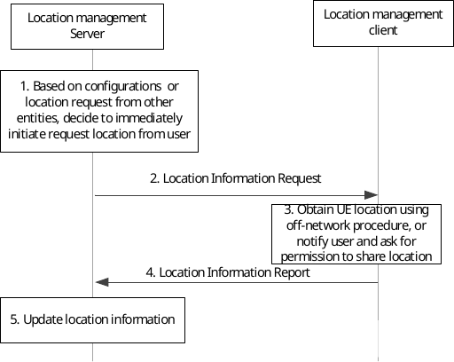

# 9.3.4 On-demand location reporting procedure

The location management server can request UE location information at any time by sending a location information request to the location management client, which may trigger location management client to immediately send the location report.

Figure 9.3.4-1: On-demand location information reporting procedure

1\. Based on configurations such as periodical location information timer, or location information request from other entities (e.g., another location management client, VAL server), location management server initiates the immediately request location information from the location management client.

2\. The location management server sends a location information request to the location management client.

3\. If the target VAL UE ID or user ID is not equal to its own VAL UE or VAL User identity, the LM client triggers off-network location management procedures as described in clause 9.5 to obtain target VAL UE location. If the received UE positioning method is PC5 SEAL LM, target VAL UE location information (including velocity) is obtained via off-network procedure as defined in clause 9.5; if the received UE positioning method is non-3GPP (e.g. WiFi, BT), target VAL UE location information (including velocity) is obtained via the corresponding non-3GPP method. If SEAL LM client is unable to find the target VAL UE's location (either the target VAL UE has moved away, or required positioning method is not supported by target VAL UE) then SEAL LM client may send the failure message to the SEAL LM server. If the target VAL UE ID or user ID is equal to its own VAL UE or VAL user identity, VAL user or VAL UE is notified and asked about the permission to share its location. VAL user can accept or deny the request.

4\. The location management client immediately responds to the location management server with a report containing location information identified by the location management server and available to the location management client or the failure reason when the requested UE's location information cannot be obtained.

5\. Upon receiving the report, the location management server updates location of the reporting location management client. If the location management server does not have location information of the reporting location management client before, then just stores the reporting location information for that location management client.
