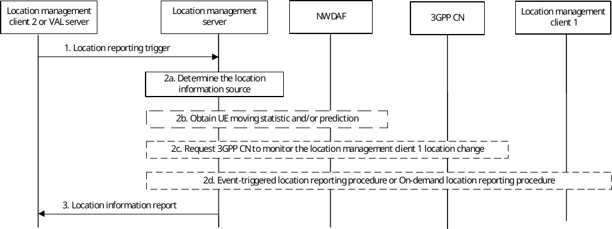

# 9.3.5 Client-triggered or VAL server-triggered location reporting procedure

Figure 9.3.5-1 illustrates the high level procedure of client-triggered or VAL server-triggered location reporting.

Figure 9.3.5-1: Client-triggered location reporting procedure

1\. Location management client 2 (authorized VAL user or VAL UE) or VAL server sends a location reporting trigger to the location management server to activate a location reporting procedure for obtaining the location information of location management client 1. The location reporting event triggers as specified in table 9.3.2.4-1, e.g. minimum time between consecutive reports, SAI changes, access RAT changes, or ECGI changes for reporting the location of the VAL UE, are included.

NOTE: Step 1 can be performed when location management client 2 or VAL server require to update the location reporting trigger corresponding to location management client 1.

2\. Location management server checks whether location management client 2 or VAL server is authorized to send a location reporting trigger. If the immediate report indicator is included or the triggering criteria is periodical reporting in step 1 and there is valid location report of the target UE (i.e. the timer for the stored location report is not expired), the location management server reuses the stored UE location report and sends the report to the location management client 2 or VAL server.

a\. The location management server determines the location information source (i.e. location management client 1 and/or 3GPP CN (e.g. NEF service for location, access type and roaming status monitoring as specified in 3GPP TS 23.502 \[11\])) according to energy requirement from the VAL server in step 1.

b\. If the adaptive reporting is requested in step 1, the location management server interacts with NWDAF (e.g., UE mobility analytics as defined in clause 6.7.2 of 3GPP TS 23.288 \[34\]) to obtain the location management client 1 moving statistic and prediction.

If the adaptive reporting is requested and the energy saving indicator is included in step 1, the location management server subscribes the energy information analytics from ADAES as defined in clause 8.x of 3GPP TS 23.436 \[49\] to obtain the energy information statistic and prediction for the location management client 1.

i\. If "DIRECT UPDATE" is requested, the location management server determines the reporting configuration based on VAL service ID, VAL server ID, Energy requirement, and the retrieved location management client 1 moving statistic and prediction and the energy information analytics (stats or prediction). In order to adapt the configuration, the location management server may determine, for example, whether to increase or decrease the frequency of the report based on the UE's mobility pattern and the energy information analytics (stats or prediction), or update location change condition (e.g., to change the location accuracy based on e.g. the energy saving indication).

ii\. If "SUGGESTIVE UPDATE" is requested, the location management server initially uses the configuration provided by VAL server and later dynamically adjusts the reporting configuration to determine adaptive location configuration based on VAL service ID, VAL server ID, Energy requirement, and by analysing the retrieved location management client 1 moving statistic and prediction, received location information and the energy information analytics (stats or prediction). In order to adapt the configuration, the location management server may determine, for example, whether to increase or decrease the frequency of the report based on the UE's mobility pattern and the energy information analytics (stats or prediction), or update the location change condition (e.g., to change the location accuracy based on e.g. the energy saving indication).

c\. If the valid location report is not available and 3GPP CN was selected as a source of location data in step 2a, the location management server requests 3GPP CN to monitor the location management client 1 location change.

d\. If the valid location report is not available and location management client was selected as a source of location data in step 2a, depending on the information specified by the location reporting trigger or determined reporting configuration (if "DIRECT UPDATE" is requested), location management server initiates an on-demand location reporting procedure or an event-triggered location reporting procedure for the location of location management client 1.

3\. Once the location information of the location management client 1 is available in the location management server, a location information report is sent to the location management client 2 or VAL server.

Further, if adaptive reporting is enabled by the VAL server with "SUGGESTIVE UPDATE", the location management server dynamically adjusts the reporting configuration as specified above (in step 2.a.ii).

Once location configuration is adjusted and if it is required to update the triggers to the SEAL client, the SEAL LMS may suggest the adaptive location configuration to the VAL server (or authorized SEAL location management client) as specified in clause 9.3.20. If VAL server accepts the suggested adaptive location configuration, then the location management server initiates an on-demand location reporting procedure or an event-triggered location reporting procedure for the location of location management client 1. If VAL server rejects the suggested adaptive location configuration, then the location management server will discard the updated configuration.
