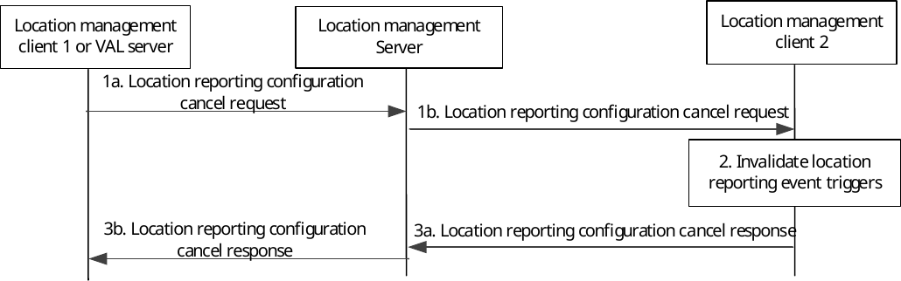

# 9.3.6 Location reporting triggers configuration cancel

Figure 9.3.6-1 illustrates the procedure used for cancelling the location reporting triggers configuration at the target location management client.

Pre-conditions:

1\. The location management server has subscribed the location management client 2 location with the location reporting event triggers.

2\. If multicast delivery mode is used, the MBMS bearer being used is activated by the location management server.

Figure 9.3.6-1: Location reporting triggers configuration cancel

1\. The location management client 1 (authorized VAL user or VAL UE) or VAL server sends a location reporting configuration cancel request to the location management server (1a). The location management server sends the location reporting configuration cancel request to the location management client 2 to stop receiving the UE location information (1b). This message can be sent via unicast or multicast.

NOTE: Step 1b can be initiated without step 1a.

2\. The location management client invalidates the location reporting triggers configuration and no longer reports its location to the location management server.

3\. The location management client 2 sends the location reporting configuration cancel response to the location management server (3a) as an acknowledgement. The location management server sends the location reporting configuration cancel response to the location management client 1 (3b) as an acknowledgement.
