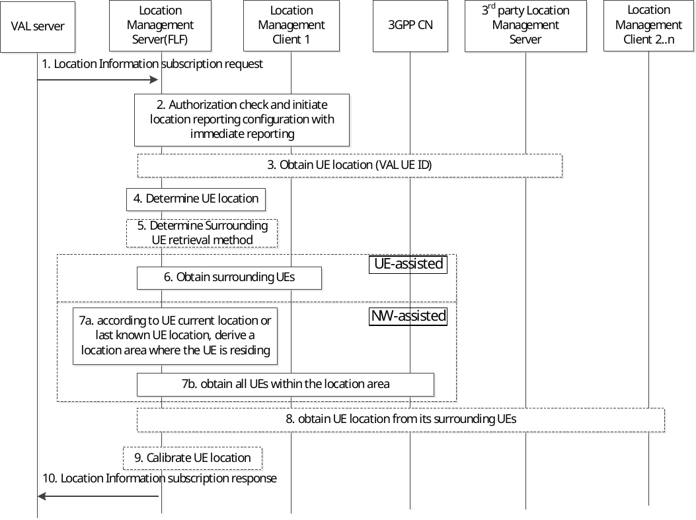

# 9.3.7 Location information subscription procedure

Figure 9.3.7-1 illustrates the high level procedure of location information subscription request. The same procedure can be applied for location management client and other entities that would like to subscribe to VAL user or VAL UE location information. This procedure is also used for initiating tracking a UE's location. The procedure considers target UE location information provided by its surrounding UEs, the procedure can improve location accuracy and can be used also for target UE temporarily out of 3GPP radio coverage. Location management client 1 is used as example in the figure as target UE that the VAL server is interested to know its location information.

Figure 9.3.7-1: Location information subscription request procedure

1\. The VAL server sends a location information subscription request to the location management server to subscribe location information of one or more VAL users or VAL UEs. The request may include an indication for supplementary location information, the location QoS which contains the location accuracy, response Time and QoS class as defined in clause 4.1b of TS 23.273 \[50\], the velocity information of target UEs, and an indication whether the statistic of target UE location is needed per e.g., temporal/spatial granularity. If the indication whether the statistic of target UE location is needed, the corresponding time/location information should also be included. In addition, the VAL server may request velocity information of the VAL UEs/Users in step 1.

2\. The location management server shall check if the VAL server is authorized to initiate the location information subscription request and may retrieve the available and proper location access type and positioning methods (e.g. as described in TS 23.273 \[50\] and TS 29.572 \[51\]) for the target VAL UE based on the received location QoS. Further, the location management server may initiate location reporting configuration optionally including the retrieved location access type and positioning methods with the location management client of the UE for immediate reporting.

3\. The location management server may optionally subscribe for UE location information from 3GPP core network for the UE. If the indication for supplementary location information is included in step 1, then UE location information is obtained from the 3GPP core network and/or the 3rd party location management server.

If the velocity information of target UE is requested in step 1, the location management server asks the location management client or 3GPP core network to report the target UE location data with the requested velocity information.

NOTE 1: How the location management server obtains the UE location from the 3rd party location management server is out of scope of this specification.

4\. The location management server determines the UE location information of the UE as received in steps 2 and 3 and checks if it meets the location QoS requirements (if any) or not.

If the indication whether the statistic of target UE location is included in step 1, the location management server performs the following actions based on different granularity.

> If the indication whether the statistic of target UE location is needed per temporal granularity is included in step 1, the location management server calculates the UE location data received in step 3 per the temporal granularity with the requested time condition.
>
> If the indication whether the statistic of target UE location is needed per spatial granularity is included in step 1, the location management server calculates the UE location data received in step 3 per the spatial granularity with the requested location information.

5\. The location management server may optionally request the UE location from its surrounding UEs (as described in step 5 to 9). The location management server decides how to retrieve surrounding UEs which may be based on location management client 1 registered positioning method in location service registration. If the location management server decides to use UE-assisted surrounding UE retrieval, step 6 is executed; otherwise, NW-assisted surrounding UE retrieval is used as described in step 7.

6\. The location management server requests the location management client 1 with an optional surrounding UE retrieval method (e.g. ProSe, BT, WiFi) to provide its surrounding UEs and the location management client 1 responds the location management server with VAL UE/User ID of discovered UEs as described in clause 9.3.22;

NOTE 2: For ProSe capable UE, the User Info ID defined in 3GPP TS 23.586 \[57\] can represent VAL user ID. For Bluetooth capable UE, the Bluetooth MAC address can represent VAL UE ID. For WiFi Direct capable UE, the WiFi MAC address can represent VAL UE ID.

7a. The location management server derives an appropriate location area (where UE to UE communication is possible) internally using the location information of UE 1 (determined in step 4) as reference location. If the UE 1 location is last known UE location, the location management server uses UE mobility analytics service from 3GPP CN to derive UE location estimation for UE 1.

7b. The location management server uses 3GPP CN service (NEF service of Number of UEs present in a geographical area) to obtain all UEs within the derived location area in step 6.

8\. The location management server selects a set of UEs (location management client 2..n) from UEs obtained in step 6 or step 7 based on registered location service information (e.g. positioning method) from location management client 2..n. Then location management server sends location request to location management client 2..n using On-demand location reporting procedure (as defined in clause 9.3.4) to obtain UE 1 location including an optional UE positioning method (e.g. PC5 SEAL LM, BT, WiFi) to be used to retrieve location.

NOTE 3: The location management server can, based on local policy, select an UE without LM registration and trigger location request to the UE. If so, the request can be ignored by the UE (e.g., if SEAL LM-UU service is not supported) or the UE can reject the request (if the required positioning method is not supported).

9\. The location management server akes the location information of UE 1 reported by location management client 2..n into consideration to calibrate UE 1 location determined in step 4.

NOTE 4: It is assumed that different location information collected over different positioning method may have differences in accuracy. How location management server processes calibration is implementation specific.

10\. The location management server replies with a location information subscription response indicating the subscription status and if immediate reporting was requested, the location information of the VAL UE(s).

NOTE 5: The VAL server can use obtained UE location and velocity in application specific ways (e.g. traffic monitoring in V2X).
