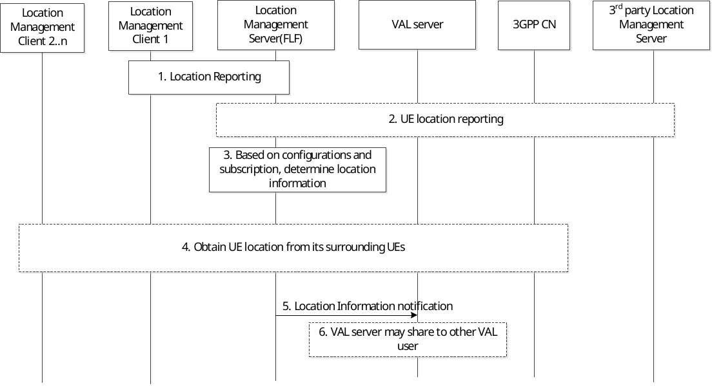

# 9.3.8 Event-trigger location information notification procedure

Figure 9.3.8-1 illustrates the high level procedure of event-trigger usage of location information. The same procedure can be applied for location management client and other entities that would like to subscribe to location information of VAL user or VAL UE. This procedure is also used for obtaining latest UE's location for tracking purpose.

Figure 9.3.8-1: Event-trigger usage of location information procedure

1\. The location management server receives the latest location information of the UE as per the location report procedure described in clause 9.3.3.3.

2\. The location management server may optionally receive the location information of the UE from 3GPP core and/or the 3rd party location management server network. If the indication for supplementary location information is included in the subscription, then UE location information is obtained from the 3GPP core network and/or the 3rd party location management server. If the velocity information of target UE is requested, the location management server asks the location management client or 3GPP core network to report the target UE location data with the requested velocity information.

3\. Based on the configurations, e.g., subscription, periodical location information timer, location management server is triggered to report the latest user location information to VAL server. The location management server determines the location information of UE as received in steps 1 and 2, including the supplementary location information (if indicated). The location management server may report the location to the VAL server considering the location information received via non-3GPP positioning technologies (e.g. GNSS, Bluetooth), for instance, to improve the location accuracy. The location management server may reuse the stored and valid UE location information (if any) to report to the VAL server/location management client to reduce the response time when the trigger condition is time-based (the triggering criteria is periodical reporting). And the LM server may interact with NWDAF to obtain the target UE’s prediction location as defined in clause 6.7.2 of 3GPP TS 23.288 \[34\] to report to the VAL server during the periodic time interval.

> If the indication whether the statistic of target UE location is included in the request from the VAL server/location management client, the location management server calculates the received UE location data per temporal/spatial granularity as requested and then expose them to the VAL server/location management client for the valued-added location information.

4\. Same as step 5-9 of Figure 9.3.7-1.

4\. The location management server sends the location information report including the latest location information of one or more VAL users or VAL UEs to the VAL server or to the location management client that has previously configured. In addition, velocity of the requested VAL UEs may be included as part of the location information report.

5\. VAL server may further share this location information to a group or to another VAL user or VAL UE.

NOTE: For other entities, the step 5 can be skipped if not needed.
