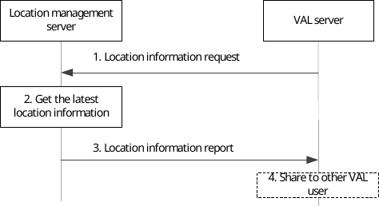

# 9.3.9 On-demand usage of location information procedure

The VAL server can request UE location information at any time by sending a location information request to the location management server, which may trigger location management server to immediately send the location report.

Figure 9.3.9-1 illustrates the high level procedure of on demand usage of location information. The same procedure can be applied for location management client and other entities that would like to subscribe to location information of VAL user or VAL UE.

Pre-condition:

\- The LM Server has confirmed the target UE is associated with other UEs and they are sharing the same location.

\- The LM Server has obtained the UE’s location who is associated with the target UE.

Figure 9.3.9-1: On-demand usage of location information procedure

1\. VAL server sends a location information request to the location management server to request locations for one or more VAL UEs or VAL user(s) which may include the location QoS that contains the location accuracy, response Time and QoS class as defined in clause 4.1b of TS 23.273 \[50\].

2\. The location management server checks if there is stored and valid UE location report (e.g. the timer for the stored UE location report is not expired) for the target UE. If available, it reuses the stored UE location information and reports it to the VAL server. If there isn’t, it acquires the latest location of the UEs being requested, by triggering an on-demand location report procedure as described in subclause 9.3.4, or from PLMN operator, and checks if the obtained location of the VAL UE could meet the location QoS requirements (if any).

> If the LM Server identified that target UE is associated with other UE(s) and they are sharing the same location as specified in clause of 9.3.23.2 or 9.3.23.3, it determines to reuse the associated UE's location data instead of obtaining the target UE's location data directly. The LM Server may select the associated UE(s) based on the requested LCS QoS, and the operator's policies, etc. But if the LM Server doesn’t store the associated UE's location data or the stored location data is invalid (e.g. the valid timer for the confirmation of sharing location information is expired, or the verify location sharing response is negative), the LM Server will ask the target UE to report the UE location data as described in clause 9.3.4.

3\. Then, location management server immediately sends the location information report including the latest location information of associated UE(s) or acquired of target one or more VAL users or VAL UEs. The location management server may report the location to the VAL server considering the location information received via non-3GPP positioning technologies (e.g. GNSS, Bluetooth), for instance, to improve the location accuracy.

4\. VAL server may further share this location information to a group or to another VAL user or VAL UE.

NOTE: For other entities, the step 4 can be skipped if not needed.
