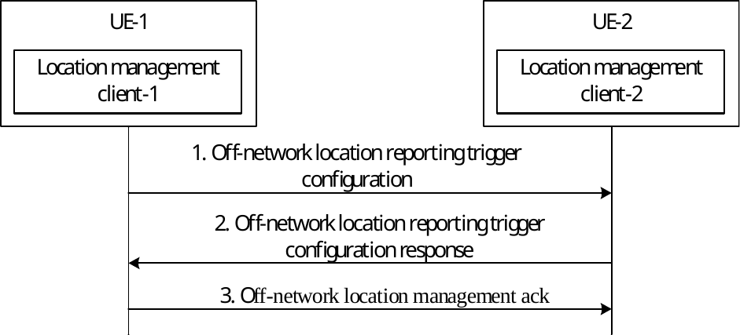
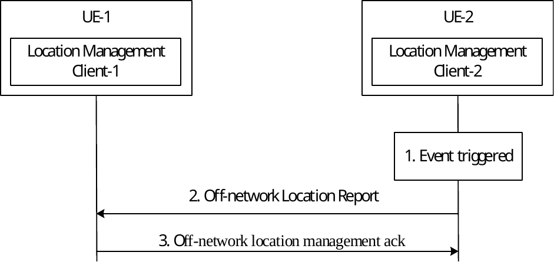
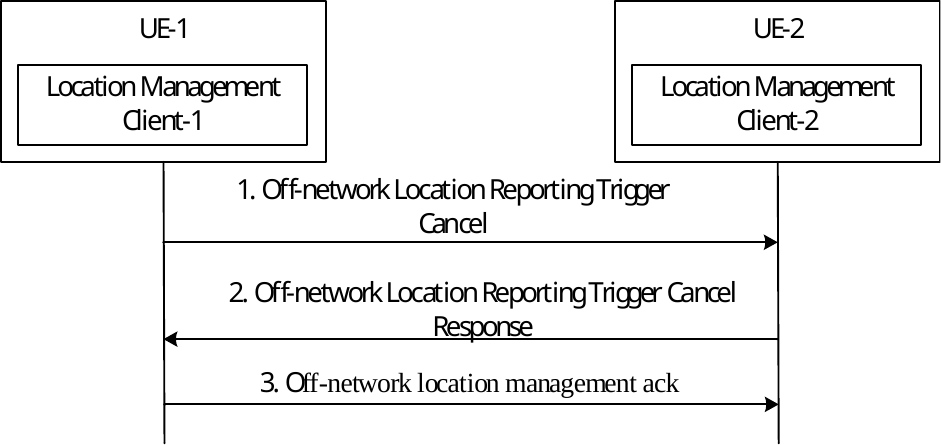
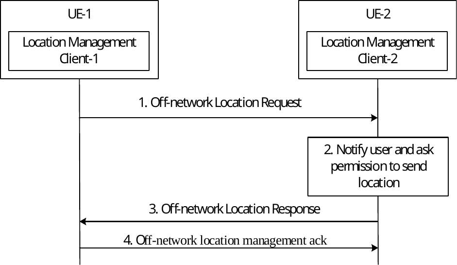

# 9.5 Procedures and information flows for location management (Off-network)

## 9.5.1 General

Location information of VAL service user shall be provided by the location management client of one UE to the location management client of another UE. The location information reporting triggers are based on the location reporting configuration. Different type of location information can be provided e.g. retrieved from non-3GPP source.

NOTE: VAL clients sharing location information directly at vertical enabler layer is outside the scope of this specification.

## 9.5.2 Information flows for off network location management

### 9.5.2.1 Off-network location reporting trigger configuration

Table 9.5.2.1-1 describes the information flow from the location management client-1 to the location management client-2 for the off-network location reporting configuration.

Table 9.5.2.1-1: Off-network location reporting trigger configuration

|                                          |        |                                                                                                                                                                          |
|------------------------------------------|--------|--------------------------------------------------------------------------------------------------------------------------------------------------------------------------|
| Information element                      | Status | Description                                                                                                                                                              |
| Identity                                 | M      | Identity of the VAL user to which the location reporting configuration is targeted or identity of the VAL UE.                                                            |
| Requested location information           | M      | Identifies what location information is requested                                                                                                                        |
| List of triggering criteria(s)           | M      | One or more triggering criteria that identifies when the location management client will send the location report. Each triggering criteria is identified by trigger-id. |
| Minimum time between consecutive reports | O      | Defaults to 0 if absent otherwise indicates the time interval between consecutive reports                                                                                |
| Life Time of the configuration           | O      | Time till when location report configurations are valid.                                                                                                                 |

### 9.5.2.2 Off-network location reporting trigger configuration response

Table 9.5.2.2-1 describes the information flow from the location management client-2 to the location management client-1 for the off-network location reporting configuration response. The Off-network location reporting trigger configuration response acts as an acknowledgement to the location management client-1.

Table 9.5.2.2-1: Off-network location reporting trigger configuration response

|                     |        |                                                    |
|---------------------|--------|----------------------------------------------------|
| Information element | Status | Description                                        |
| Result              | M      | Indicates the success or failure for the operation |
| Cause               | O      | Provides reason for the failure.                   |

### 9.5.2.3 Off-network location management ack

The Off-network location management ack message is sent from the message receiver location management client-2 to message originator location management client-1.

### 9.5.2.4 Off-network location report

Table 9.5.2.4-1 describes the information flow from the location management client-2 to the location management client-1 for the off-network location report.

Table 9.5.2.4-1: Off-network location report

|                          |        |                                                                                                                                       |
|--------------------------|--------|---------------------------------------------------------------------------------------------------------------------------------------|
| Information element      | Status | Description                                                                                                                           |
| Triggering event         | M      | Identity of the event that triggered the sending of the report                                                                        |
| Location Information     | M      | Location information shared by VAL client e.g. retrieved from non-3GPP source, obtained via Sidelink positioning/Ranging method, etc. |
| Acknowledgement Required | O      | If present, indicate the recipient of the message to acknowledge the message.                                                         |

### 9.5.2.5 Off-network location reporting trigger cancel

Table 9.5.2.5-1 describes the information flow from the location management client-1 to the location management client-2 for the off-network location reporting trigger cancel.

Table 9.5.2.5-1: Off-network location reporting trigger cancels

|                     |        |                                                                                                                |
|---------------------|--------|----------------------------------------------------------------------------------------------------------------|
| Information element | Status | Description                                                                                                    |
| Identity            | M      | Identity of the VAL user to which the location reporting trigger cancel is targeted or identity of the VAL UE. |

### 9.5.2.6 Off-network location reporting trigger cancel response

Table 9.5.2.6-1 describes the information flow from the location management client-2 to the location management client-1 for the off-network location reporting cancel response. The Off-network location reporting trigger cancel response acts as an acknowledgement to the location management client-1.

Table 9.5.2.6-1: Off-network location reporting trigger cancel response

|                     |        |                                                    |
|---------------------|--------|----------------------------------------------------|
| Information element | Status | Description                                        |
| Result              | M      | Indicates the success or failure for the operation |

### 9.5.2.7 Off-network location request

Table 9.5.2.7-1 describes the information flow from the location management client-1 to the location management client-2 for the off-network location request.

Table 9.5.2.7-1: Off-network location request

|                                |        |                                                                                               |
|--------------------------------|--------|-----------------------------------------------------------------------------------------------|
| Information element            | Status | Description                                                                                   |
| Identity                       | M      | Identity of the VAL user to which the location request is targeted or identity of the VAL UE. |
| Requested location information | M      | Identifies what location information is requested                                             |
| Requested velocity indication  | O      | It indicates whether the velocity of the requested VAL users/UEs is needed.                   |

### 9.5.2.8 Off-network location response

Table 9.5.2.8-1 describes the information flow from the location management client-2 to the location management client-1 for the off-network location response. The Off-network location response acts as an acknowledgement to the location management client-1.

Table 9.5.2.8-1: Off-network location response

|                      |        |                                                                                                                                       |
|----------------------|--------|---------------------------------------------------------------------------------------------------------------------------------------|
| Information element  | Status | Description                                                                                                                           |
| Result               | M      | Indicates the success or failure for the operation                                                                                    |
| Location Information | M      | Location information shared by VAL client e.g. retrieved from non-3GPP source, obtained via Sidelink positioning/Ranging method, etc. |
| Velocity information | O      | Velocity information                                                                                                                  |

## 9.5.3 Event-triggered location reporting procedure

### 9.5.3.1 Location reporting trigger configuration

Figure 9.5.3.1-1 illustrates the procedure for configuring location reporting triggers from the location management client-1 residing in UE-1 to the location management client-2 residing in UE-2.

Pre-condition:

\- The UE-1 and UE-2 are within PC5 communication range of each other, and aware of Layer-2 ID of each other.

\- The VAL service user in UE-1 is authorized to configure location reporting trigger to the UE-2.

\- The VAL service user in UE-1 requests to configure location reporting triggers to the UE-2.

Figure 9.5.3.1-1: Location reporting trigger configuration

1\. The location management client-1 in UE-1 sends off network location reporting trigger configuration message to the location management client-2 in UE-2 containing the initial location reporting event triggers configuration (or a subsequent update) for reporting the location of the VAL UE. The message includes information elements as specified in Table 9.5.2.1-1.

2\. The location management client-2 stores the location reporting configuration, and sends off network location reporting trigger configuration response to the location management client-1. The message includes information elements as specified in Table 9.5.2.2-1.

3\. Upon receiving the off network location reporting trigger configuration response message, the location management client-1 sends off-network location management ack messages. The message includes information elements as specified in clause 9.5.2.3.

### 9.5.3.2 Location reporting

Figure 9.5.3.2-1 illustrates the procedure for sending off-network location report from the location management client-2 residing in UE-2 to the location management client-1 residing in UE-1.

Pre-condition:

\- The UE-1 and UE-2 are within PC5 communication range of each other, and aware of Layer-2 ID of each other.

\- The location management client-1 has previously configured off-network location reporting triggers to the location management client-2 as specified in clause 9.5.3.1.

Figure 9.5.3.2-1: Location reporting

1\. The location management client-2 is monitoring the location reporting triggers and one of the event is triggered.

2\. The location management client-2 sends the off-network location report message. The message includes information elements as specified in Table 9.5.2.4-1.

3\. Upon receiving the off network location report message, the location management client-1 sends the off-network location management ack message if requested in the received message. The message includes information elements as specified in clause 9.5.2.3.

### 9.5.3.3 Location reporting trigger cancel

Figure 9.5.3.3-1 illustrates the procedure for sending off-network location reporting trigger cancel from the location management client-1 residing in UE-1 to the location management client-2 residing in UE-2.

Pre-condition:

\- The UE-1 and UE-2 are within PC5 communication range of each other, and aware of Layer-2 ID of each other.

\- The location management client-1 has previously configured location reporting triggers to the location management client-2 as specified in clause 9.5.3.1.

Figure 9.5.3.3-1: Location reporting trigger cancel

1\. The location management client-1 in UE-1 sends off network location reporting trigger cancel message to the location management client-2 in UE-2 to cancel the location reporting trigger configuration. The message includes information elements as specified in Table 9.5.2.5-1.

2\. The location management client-2 clears the location reporting configuration, and sends off network location reporting trigger cancel response to the location management client-1. The message includes information elements as specified in Table 9.5.2.6-1.

3\. Upon receiving the off network location reporting trigger configuration response message, the location management client-1 sends off-network location management ack message. The message includes information elements as specified in clause 9.5.2.3.

## 9.5.4 On-demand location reporting procedure

Figure 9.5.4-1 illustrates the procedure for on-demand location report from the location management client-1 residing in UE-1 to the location management client-2 residing in UE-2.

Pre-condition:

\- The UE-1 and UE-2 are within PC5 communication range of each other, and aware of Layer-2 ID of each other.

\- The VAL service user in UE-1 is authorized to request location report from the UE-2.

\- The VAL service user in UE-1 requests immediate location reporting to the UE-2.

Figure 9.5.4-1: Location reporting trigger cancel

1\. Based on configurations such as periodical location information timer the location management client-1 initiates the immediately request location information from the location management client-2. The location management client-1 sends an off-network location request to the location management client-2. The message includes information elements as specified in Table 9.5.2.7-1.

2\. VAL user or VAL UE is notified and asked about the permission to share its location. VAL user can accept or deny the request

3\. The location management client-2 immediately responds to the location management client-1. If permission is received from the VAL user, the location management client-2 includes a report containing location information identified by the location management client-1 and available to the location management client-2. The message includes information elements as specified in Table 9.5.2.8-1.

4\. Upon receiving the off network location reporting trigger configuration response message, the location management client-1 sends off-network location management ack message. The message includes information elements as specified in clause 9.5.2.3
