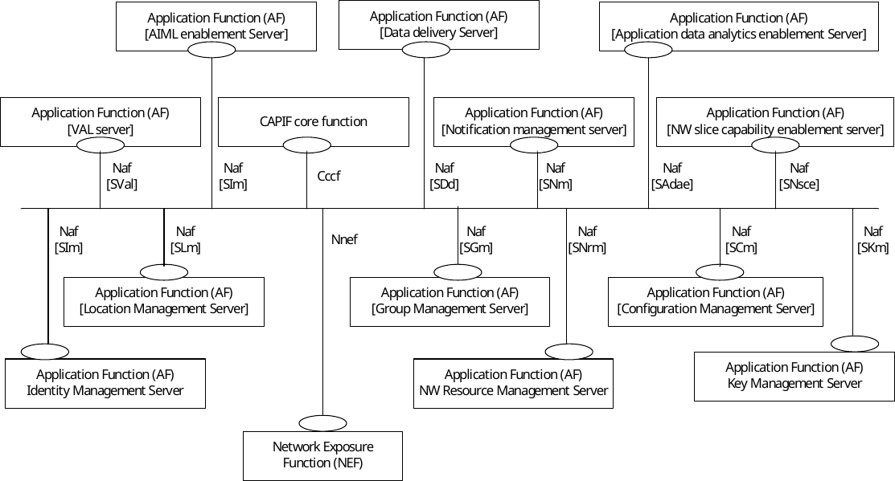
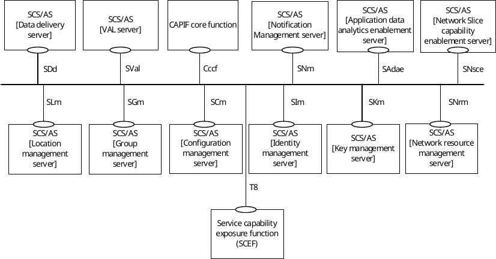
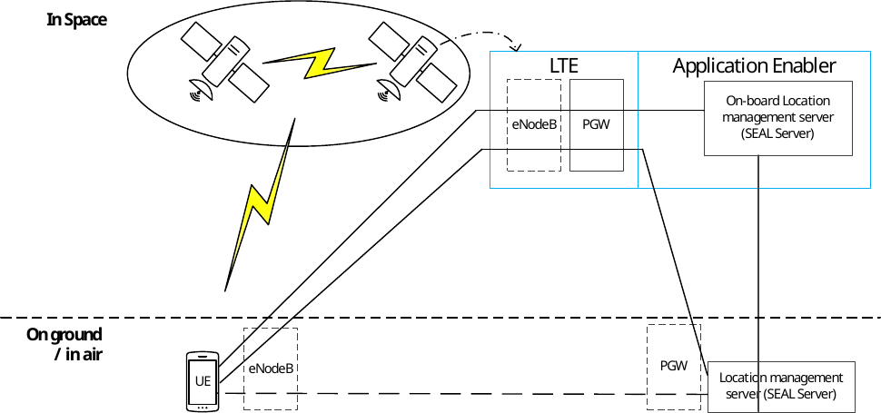

# Annex A (informative): SEAL integration with 3GPP network exposure systems

NOTE: Not all possible SEAL integration with 3GPP network exposure systems are illustrated in this subclause.

Figure A-1 illustrates the service-based interface representation of the functional model for SEAL services integration with 5GC network exposure system.

Figure A-1: SEAL integration with 5GC network exposure system

The details of NEF and its role in exposing network capabilities of 5GS to 3rd party applications are specified in 3GPP TS 23.501 \[10\] and the details of NEF service operations are specified in 3GPP TS 23.502 \[11\].

Figure A-2 illustrates the service-based interface representation of the functional model for SEAL services integration with EPC network exposure system.

Figure A-2: SEAL integration with EPC network exposure system

The details of SCEF and its role in exposing network capabilities of EPS to 3rd party applications are specified in 3GPP TS 23.682 \[13\].

## A.1 Deployment of SEAL enablers on-board satellite

### A.1.1 General

This clause describes examples of SEAL enablers deployment on-board satellite as follows:

\- SEAL location enabler on-board satellite;

### A.1.2 SEAL location enabler on-board satellite

Figure A.1.2-1, illustrates the deployment of location enabler on-board satellite for assisting location management service.

Figure A.1.2-1: Deployment of location enabler on-board satellite for assisting\
location management service

The SEAL location management server is deployed onboard the satellite (GEO, MEO, or LEO) to complement and ensure continuity of the location management service, especially when the feeder link is not available and S&F is supported.

In this deployment option, the location management server is deployed both on the ground and onboard the satellite. The UE can be on the ground/sea or in the air (e.g. drone). The PGW to access the onboard location management server is deployed on one or more satellites. The RAN (e.g. eNB) can either be deployed on the ground/sea (e.g. on a ship) and connected to the satellite PGW or be deployed on a regenerative satellite. The LTE control plane functions (e.g. MME) are deployed on the ground and/or on the satellite, which are not depicted in the figure for simplicity. The PGW is deployed on the ground to access the location management server on the ground, and the UE can reach the location management server on the ground or via space. The onboard location management server can be mobile depending on the satellite on which it is deployed: GEO, MEO, or LEO.

The location management server, with the fused location function, may combine/aggregate location information from multiple sources, including the location determined onboard the satellite, to provide a more accurate UE location. The location management server onboard the satellite also assists in reporting the value-added location information (e.g. monitoring location deviation events, historical location data, periodic verification of UE location, predictions related to UE location, etc.) to the VAL server via satellite access.
