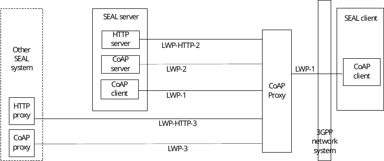

# Annex C (normative): Protocol realizations of LWP in the signalling control plane

## C.1 General

This annex specifies protocol realizations of the light-weight protocol in the signalling control plane.

## C.2 Usage of CoAP as LWP

This clause specifies how the CoAP protocol shall be used to realize the generic light-weight protocol in the signalling control plane.

The Constrained Application Protocol (CoAP) is a light-weight protocol defined by IETF in RFC 7252 \[32\] and designed specifically for application layer communication for constrained devices. CoAP provides a request/response interaction model between application endpoints, supports built-in discovery of services and resources, and includes key concepts of the Web such as URIs and Internet media types. CoAP is designed to easily interface with HTTP for integration with the Web while meeting specialized requirements such as multicast support, very low overhead, and simplicity for constrained environments. RFC 7252 \[32\] specifies bindings to UDP and DTLS. IETF RFC 8323 \[33\] specifies bindings to TCP, WebSocket and TLS.

Figure C.2-1 illustrates the functional model for the LWP signalling control plane when CoAP is used as the LWP.

Figure C.2-1: Functional model for LWP signalling control plane when CoAP is used as LWP

When CoAP is used to realize the generic light-weight protocol defined in clause 6.2, then,

1\. CoAP client is a realization of the LWP client

2\. CoAP proxy is a realization of the LWP proxy, with the following clarifications:

a\. CoAP proxy shall be able to terminate a DTLS, TLS or secure WebSocket session on LWP-1 reference point;

b\. CoAP proxy shall be able to act as a cross-protocol CoAP-HTTP proxy to support LWP-HTTP-2 and LWP-HTTP-3 reference points;

3\. CoAP server is a realization of the LWP server

4\. CoAP supports the interactions over LWP-1, LWP-2 and LWP-3 reference points

5\. The usage of CoAP by the SEAL service enablers shall follow the rules set out in clause 6.4.3.5.
