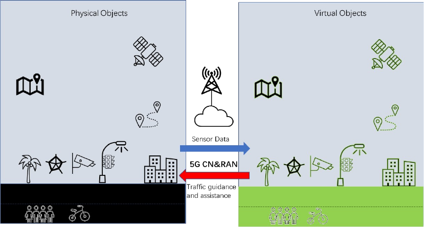

# Annex E (informative): Support for Mobile Metaverse use case

In Mobile Metaverse one use case is the 5G-enabled Traffic Flow Simulation and Situation Awareness in which the real conditions of a road including vehicles and other factors are captured with sensors, modelled in a simulation and used to provide guidance for vehicles and users for efficiency and safety. This is a specific example of a broad category of 'situational awareness' services that capture 'virtual representations' of the real world to then advise or control actions taken in the real world. As shown in Figure F-1. real-time processing and computing can be conducted to support traffic simulation and also situational awareness and real time path guidance and real-time safety, or security alerts can be generated for ICVs as well as the driver and passengers.

Figure F-1: Use case of 5G-enabled Traffic Flow Simulation and Situational Awareness \[3GPP TR 22.856\]

In this use case, the mobile metaverse service requirements are applicable to communication among different entities for multi-user interactions (as can be seen also in Figure F-1). The sessions include UE to UE communications and UE to virtual UE (at the server side) communications.

More specifically, in an example for two identified VAL UEs the following types of VAL sessions may be present:

\- VAL session \#1: Metaverse app in VAL client 1 sends to virtual UE 1 (in DN side at the VAL server) sensor data / measurements on the physical environment related to VAL UE1 over VAL-UU interface. Virtual UE1 sends back haptic feedback to UE1 (for UE1 and/or UE2 and the environment).

\- VAL session \#2: Metaverse app in VAL client 2 sends to virtual UE 2 (in DN side at the VAL server) sensor data / measurements on the physical environment related to VAL UE2 over VAL-UU interface. Virtual UE2 sends back haptic feedback to UE2 (for UE1 and/or UE2 and the environment).

\- App-specific session \#3: Exchange of service related / feedback data between virtual UEs (for example micro-transactions such as avatar updates/modifications or environment changes).

\- App-specific session \#4: Sensor data / measurements are exchanged between VAL UEs (communication can be over side link) for traffic related to the metaverse service.

To support such use case, SEAL NRM as in clause 14.3.9.2.3 supports the discovery of the virtual UEs (as counterparts of the physical UEs) and identify the sessions required as well as the per session requirement in both physical and virtual world.
