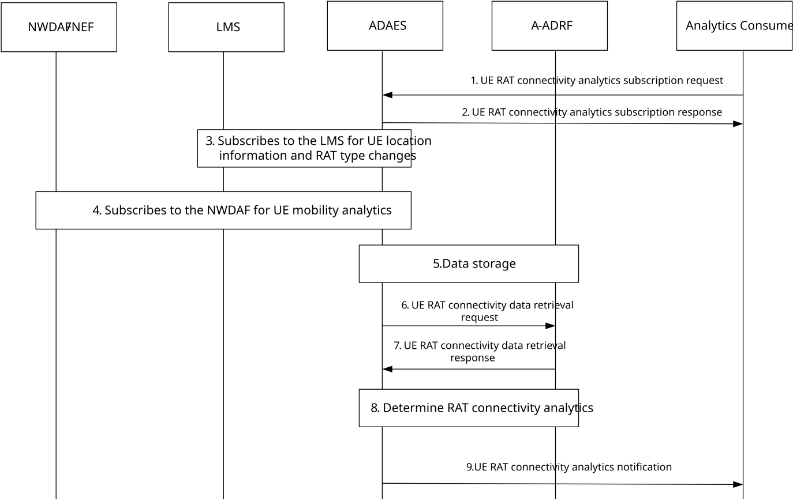
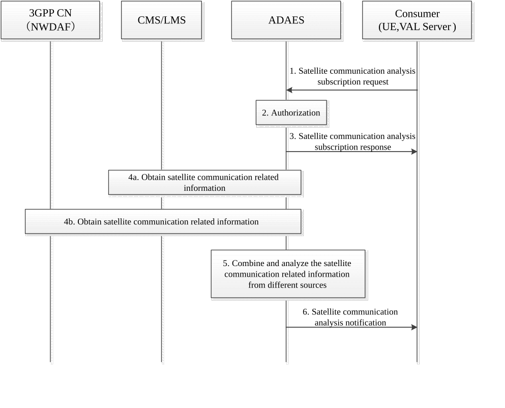

# 10.2 Support for UE RAT connectivity analytics

## 10.2.1 General

This clause describes the procedure for supporting UE RAT connectivity analytics for satellite access. The ADAES service consumer can subscribe and receive notifications about UE RAT connectivity analytics events. This analytics helps to predict the type of satellite RAT that a UE will latch onto on a particular location and/or particular time and helps the analytics consumer to decide on the actions to improve the service experience over the satellite access.

## 10.2.2 Procedure

Figure 10.2.2-1 illustrates the procedure for UE RAT connectivity analytics.

Pre-conditions:

1\. The ADAES is registered and capable of interacting with 5GS to UE mobility analytics.

Figure 10.2.2-1: Procedure for supporting UE RAT connectivity analytics

1\. The analytics consumer (e.g.VAL server) makes a subscription request to ADAE server for UE RAT connectivity prediction/stats, including an analytics event ID for UE RAT Connectivity analytics. The request may include also the target area, a target VAL service, or a VAL UE, or group of UEs of the VAL service, time validity. If the VAL UEs are provided by the VAL server, this request may also include the expected route or a set of waypoints for the UEs of the VAL application.

2\. The ADAE server sends a UE RAT connectivity analytics subscription response as an ACK to the VAL server.

3\. The ADAE server subscribes to the SEAL Location management server to get the location information of the VAL UE along with the RAT type. It can set the trigger criteria of receiving the location information of the UE whenever UE RAT type changes as specified in 3GPP TS 23.434 \[2\] clause 9.3.5.

4\. The ADAE server subscribes for NWDAF UE mobility analytics per VAL UE (for all the VAL UEs) and gets notification on the per UE location/mobility analytics based on 3GPP TS 23.288 \[4\] clause 6.7.2.

5\. If the data is collected from multiple sources, the ADAES combines or correlates the data/analytics from steps 3-4 and stores the data into A-ADRF if needed.

6\. The ADAE server optionally requests UE RAT connectivity historical analytics/data from A-ADRF for the corresponding VAL UEs.

7\. Based on the request, the ADAE server receives UE RAT connectivity historical analytics/data from A-ADRF for the corresponding VAL UEs.

8\. The ADAE server abstracts or correlates the data/analytics from steps 5-6 and provides analytics on the UE RAT connectivity for the target VAL application.

9\. The ADAE server sends the UE RAT connectivity analytics notification to the consumer.

## 10.2.3 Information flows

### 10.2.3.1 UE RAT connectivity analytics subscription request

Table 10.2.3.1-1 describes information elements for the UE RAT connectivity analytics subscription request from the VAL server/Analytics consumer to the ADAE server.

Table 10.2.3.1-1

| Information element             | Status | Description                                                                                                                                                                                                                          |
|---------------------------------|--------|--------------------------------------------------------------------------------------------------------------------------------------------------------------------------------------------------------------------------------------|
| VAL server ID                   | M      | The identifier of the VAL server.                                                                                                                                                                                                    |
| Analytics ID                    | M      | The identifier of the UE RAT connectivity analytics event.                                                                                                                                                                           |
| VAL UE ID(s) or Group ID        | M      | The identity of the VAL UE(s) or group of UEs for which the analytics subscription applies                                                                                                                                           |
| VAL service ID                  | O      | The identifier of the VAL service for which location accuracy analytics is requested.                                                                                                                                                |
| Preferred confidence level      | O      | The level of accuracy for the analytics service (in case of prediction).                                                                                                                                                             |
| Area of Interest                | O      | The geographical or service area for which the subscription request applies.                                                                                                                                                         |
| Time validity                   | O      | The time validity of the subscription request.                                                                                                                                                                                       |
| UE mobility / route information | O      | Information on the target UE or group UE mobility including the expected route/set of waypoints.                                                                                                                                     |
| Reporting requirements          | O      | It describes the requirements for analytics reporting. This requirement may include e.g. the type and frequency of reporting (periodic or event triggered), the reporting periodicity in case of periodic, and reporting thresholds. |

### 10.2.3.2 UE RAT Connectivity analytics subscription response

Table 10.2.3.2-1 describes information elements for the UE RAT connectivity analytics subscription response from the ADAE server to the VAL server/Analytics consumer.

Table 10.2.3.2-1

| Information element | Status | Description                                                                             |
|---------------------|--------|-----------------------------------------------------------------------------------------|
| Result              | M      | The result of the analytics subscription request (positive or negative acknowledgement) |

### 10.2.3.3 UE RAT Connectivity data retrieval request

Table 10.2.3.3-1 describes information elements for the UE RAT connectivity data retrieval request from the ADAE server to the A-ADRF.

Table 10.2.3.3-1

| Information element              | Status | Description                                                                                                                                                                                                                        |
|----------------------------------|--------|------------------------------------------------------------------------------------------------------------------------------------------------------------------------------------------------------------------------------------|
| ADAE server ID                   | M      | The identifier of the ADAE server                                                                                                                                                                                                  |
| Analytics ID                     | M      | The identifier of the analytics event i.e. UE RAT connectivity analytics                                                                                                                                                           |
| List of VAL UE IDs and addresses | M      | The VAL UE(s) identifiers and IP address(es) for which the data/analytics apply                                                                                                                                                    |
| VAL service ID                   | O      | The service ID, in case of requesting historical data for a particular VAL service.                                                                                                                                                |
| Reporting configuration          | O      | The configuration for data reporting. This requirement may include e.g. the frequency of reporting (periodic), the reporting periodicity in case of periodic, and reporting thresholds, whether data abstraction is needed or not. |
| Data collection requirements     | O      | The requirements for data collection, including the format of data, frequency of reporting, level of abstraction of data, level of accuracy of data.                                                                               |
| Area of Interest                 | O      | The geographical or service area for which the subscription request applies                                                                                                                                                        |
| Time validity                    | O      | The time validity of the request                                                                                                                                                                                                   |

### 10.2.3.4 UE RAT Connectivity data retrieval response

Table 10.2.3.4-1 describes information elements for the UE RAT connectivity data retrieval response from the A-ADRF to the ADAE server.

Table 10.2.3.4-1

| Information element              | Status | Description                                                                                                                                                                  |
|----------------------------------|--------|------------------------------------------------------------------------------------------------------------------------------------------------------------------------------|
| Analytics ID                     | M      | The identifier of the analytics event.                                                                                                                                       |
| List of VAL UE IDs and addresses | M      | The VAL UE(s) identifiers and IP address(es) for which the analytics apply                                                                                                   |
| VAL service ID                   | O      | The service ID, in case of requesting historical data for a particular VAL service.                                                                                          |
| Analytics Output                 | M      | The reported analytics for the UE RAT connectivity, which can be in form of offline stats/historical data for a specific VAL service or for particular UE(s) or group of UEs |

### 10.2.3.5 UE RAT Connectivity analytics notification

Table 10.2.3.5-1 describes information elements for the UE RAT connectivity analytics notification from the A-ADRF to the ADAE server.

Table 10.2.3.5-1

| Information element                            | Status | Description                                                                                             |
|------------------------------------------------|--------|---------------------------------------------------------------------------------------------------------|
| Analytics ID                                   | M      | The identifier of the analytics event (UE RAT connectivity)                                             |
| VAL UE ID(s)                                   | O      | The identity of the VAL UE(s) for which the analytics applies.                                          |
| VAL service ID                                 | O      | The identifier of the VAL service for which the analytics applies.                                      |
| Analytics Output                               | M      | The analytics output which can be predictive or statistical parameter.                                  |
| \> RAT type prediction for given waypoints     | O      | A predicted or expected RAT type changes for a particular VAL service or UEs for the given waypoints.   |
| \>\> Applicable area                           | O      | The set of location co-ordinates or waypoints for which the analytics output is applicable.             |
| \>\> Applicable time period                    | O      | The time period that the analytics applies to.                                                          |
| Confidence level                               | O      | For predictive analytics, the achieved confidence level can be provided.                                |
| \> RAT type prediction for a given time period | O      | A predicted or expected RAT type changes for a particular VAL service or UEs for the given time period. |
| \>\> Applicable time period                    | O      | The time period that the analytics applies to.                                                          |
| \>\> Confidence level                          | O      | For predictive analytics, the achieved confidence level can be provided.                                |

## 10.2.4 ADAE server APIs

### 10.2.4.1 General

This clause provides the APIs provided by ADAES related to satellite access.

### 10.2.4.2 ADAE server APIs

Table 10.2.4.2-1 illustrates the ADAE server APIs related to satellite access.

Table 10.2.4.2-1: List of ADAE server APIs

| API Name                              | API Operations | Known Consumer(s) | Communication Type |
|---------------------------------------|----------------|-------------------|--------------------|
| SS_ADAE_UE_RAT_connectivity_analytics | Subscribe      | VAL server        | Subscribe/Notify   |
|                                       | Notify         |                   |                    |

### 10.2.4.3 SS_ADAE_UE_RAT_connectivity_analytics API

#### 10.2.4.3.1 General

**API description:** This API enables the analytics consumer (e.g., the VAL server) to communicate with the ADAE server for requesting or subscribing to UE RAT connectivity analytics.

#### 10.2.4.3.2 Subscribe

**API operation name:** UE_RAT_connectivity_analytics_subscribe

**Description:** The consumer subscribes to the ADAE server for UE RAT connectivity analytics.

**Inputs:** See clause 10.2.3.1.

**Outputs:** See clause 10.2.3.2*.*

See clause 10.2.2 for details of usage of this operation.

#### 10.2.4.3.3 Notify

**API operation name:** UE_RAT_connectivity_analytics_notify

**Description:** The consumer is notified by the ADAE server on the Server-to-server performance analytics.

**Inputs:** -

**Outputs:** See clause 10.2.3.5*.*

See clause 10.2.2 for details of usage of this operation.

## 10.2.5 A-ADRF APIs

### 10.2.5.1 General

This clause provides the APIs provided by A-ADRF related to satellite access.

### 10.2.5.2 A-ADRF APIs

Table 10.2.5.2-1 illustrates the A-ADRF APIs related to satellite access.

Table 10.2.5.2-1: List of A-ADRF APIs

| API Name                              | API Operations | Known Consumer(s) | Communication Type |
|---------------------------------------|----------------|-------------------|--------------------|
| SS_ADRF_UE_RAT_connectivity_analytics | Get            | ADAES             | Request/Response   |

### 10.2.5.3 SS_AADRF_UE RAT connectivity analytics API

#### 10.2.5.3.1 General

**API description:** This API enables the ADAE server to communicate with the A-ADRF to request UE RAT connectivity analytics of VAL UEs.

#### 10.2.5.3.2 Get

**API operation name:** UE_RAT_connectivity_analytics_Data_Get

**Description:** The consumer is receiving offline UE RAT connectivity analytics/data from A-ADRF.

**Inputs:** See clause 10.2.3.3.

**Outputs:** See clause 10.2.3.4*.*

See clause 10.2.2 for details of usage of this operation.

10.3 Support for application satellite coverage availability information (ASCAI) analytics

10.3.1 General

This clause describes the procedure for supporting application satellite coverage availability information (ASCAI) analytics. The VAL server or the UE may act as consumers to subscribe the analytics related to the application satellite coverage availability information (ASCAI) from ADAES. They may ask to analyse the application satellite coverage availability information of the target UE to assist the UE's satellite access or to minimize the impact on services (e.g. inform the VAL server in time to pause the downlink data when the target UE is unavailable under the satellite coverage).

## 10.3.2 Procedure

Figure 10.3.2-1 illustrates the high-level procedure of Satellite related information subscription.

Pre-condition:

1\. The following NFs in the application enablement layer (e.g., ADAES, CMS, and LMS) are all deployed on the ground.

> 2\. The UE cannot use ASCAI (Application Satellite Coverage Availability Information) to conclude when and where the satellite coverage is available or not in an area.

10.3.2-1: Procedure of Satellite related information subscription

1\. Consumers (e.g., the VAL server or UE) initiate a satellite communication analytics subscription request to the ADAES, with the analytics ID (i.e. the application satellite coverage availability information), analytics type (statistics or prediction), target UE ID, service ID, target service area, reporting conditions (e.g., periodic reporting or event-triggered reporting), etc.

2\. The ADAES checks whether the VAL server is authorized to invoke such request.

3\. If the request is authorized, the ADAES enabler sends a satellite communication analytics subscription response to the VAL server.

4a. ADAES may obtain the satellite related information for the target UE from the SEAL servers in the following ways:

\- ADAES may obtain the ASCAI related to the target UE from the configuration management server as specified in clause 21.2.2.1 of 3GPP TS 23.434 \[4\];

\- ADAES may retrieve the location information and access type of the target UE from the location management server as specified in clause 9.3.5 of 3GPP TS 23.434 \[4\].

4b. ADAES may obtain the satellite related information for the target UE from the 3GPP CN in the following ways:

\- ADAES may obtain the location information and UE mobility analytics information for the target UE from the 3GPP CN (i.e., NWDAF) as specified in clause 6.7.2 of 3GPP TS 23.288 \[9\]).

5\. The ADAES stores and analyses the received satellite related information based on the satellite communication analytics subscription service request received in step 1. The ADAES may generate the calculation and predicted ASCAI information for the target UE in a specific service area/time point. E.g., the available satellites for the target UE in a certain area, the predicted time point when the target UE enters/exits the coverage of a certain satellite, or the predicted time periods during which the target UE is available under the coverage of a certain satellite.

NOTE 1: Whether the ADAES provides the predictive satellite related information depends on the prediction parameter is included in Step 1or not.

6a. The ADAES will report the ASCAI analytics (including the statistics and prediction information) to the consumer via the satellite communication analytics notification message. And the consumers may take actions to minimize the service impact if there is. For example, the VAL server may promptly adjust the downlink data polices.

6b. Optionally, the ADAES may generate the corresponding data polices based on the analysed satellite related information and sends these data polices to the consumer directly. These data polices below only apply when the target UE is unavailable under the satellite coverage:

\- Reject forwarding the data for new uplink and downlink data;

\- Pending forwarding the data and cache for new uplink and downlink data;

\- Forwarding the data according to priority for existing uplink and downlink data.

NOTE 2: The priority for the forwarding polices may be set according to the service QoS/QoE, user levels, operator policies, pre-configurations, etc.

## 10.3.3 Information flows

10.3.3.1 Satellite communication analytics subscription request

Table 10.3.3.1-1 describes information elements for the satellite communication analytics subscription request from the Consumers (e.g., the VAL server or UE) to the ADAE server.

Table 10.3.3.1-1: Satellite communication analytics subscription request

| Information element    | Status | Description                                                                                                                                                                                                                          |
|------------------------|--------|--------------------------------------------------------------------------------------------------------------------------------------------------------------------------------------------------------------------------------------|
| Consumer ID            | M      | The identifier of the VAL server or UE.                                                                                                                                                                                              |
| Analytics ID           | M      | The identifier of the analytics event (i.e. application satellite coverage availability information event).                                                                                                                          |
| Analytics type         | M      | Describes the required analytics type, i.e. statistics or prediction.                                                                                                                                                                |
| VAL service ID         | O      | The identifier of the VAL service for which satellite communication analytics is requested.                                                                                                                                          |
| Target UE ID           | O      | The identifier of the target UE.                                                                                                                                                                                                     |
| Target service area    | O      | Describes the target area of interest.                                                                                                                                                                                               |
| Reporting requirements | O      | It describes the requirements for analytics reporting. This requirement may include e.g. the type and frequency of reporting (periodic or event triggered), the reporting periodicity in case of periodic, and reporting thresholds. |

10.3.3.2 Satellite communication analytics subscription response

Table 10.3.3.2-1 describes information elements for the satellite communication analytics subscription response from the ADAE server to the Consumers (e.g., the VAL server or UE).

Table 10.3.3.2-1: Satellite communication analytic subscription response

| Information element | Status | Description                                                                             |
|---------------------|--------|-----------------------------------------------------------------------------------------|
| Result              | M      | The result of the analytics subscription request (positive or negative acknowledgement) |

10.3.3.3 Satellite communication analytics notification

Table 10.3.3.3-1 describes information elements for the satellite communication analytics notification from the ADAE server to the Consumers (e.g., the VAL server or UE).

Table 10.3.3.3-1: Satellite communication analytics notification

| Information element           | Status | Description                                                                                                                                                                                                                                                                                                                          |
|-------------------------------|--------|--------------------------------------------------------------------------------------------------------------------------------------------------------------------------------------------------------------------------------------------------------------------------------------------------------------------------------------|
| Analytics ID                  | M      | The identifier of the analytics event (the application satellite coverage availability information)                                                                                                                                                                                                                                  |
| VAL UE ID(s)                  | O      | The identity of the VAL UE(s) for which the analytics applies.                                                                                                                                                                                                                                                                       |
| VAL service ID                | O      | The identifier of the VAL service for which the analytics applies.                                                                                                                                                                                                                                                                   |
| Analytics Output              | M      | The analytics output which can be predictive or statistical parameter.                                                                                                                                                                                                                                                               |
| \>ASCAI analytics information | O      | The ASCAI statistics and prediction information (e.g., the available satellites for the target UE in a certain area, the predicted time point when the target UE enters/exits the coverage of a certain satellite, or the predicted time periods during which the target UE is available under the coverage of a certain satellite). |
| \>\> Confidence level         | O      | For predictive analytics, the achieved confidence level can be provided.                                                                                                                                                                                                                                                             |
| \>Data policies information   | O      | The corresponding data polices based on the analysed satellite related information.                                                                                                                                                                                                                                                  |

## 10.3.4 ADAE server APIs

### 10.3.4.1 General

This clause provides the APIs provided by ADAES related to satellite communication ASACI analytics.

### 10.3.4.2 ADAE server APIs

Table 10.3.4.2-1 illustrates the ADAE server APIs related to satellite communication ASACI analytics.

Table 10.3.4.2-1: List of ADAE server APIs

<table>
<colgroup>
<col style="width: 44%" />
<col style="width: 23%" />
<col style="width: 14%" />
<col style="width: 17%" />
</colgroup>
<thead>
<tr class="header">
<th>API Name</th>
<th>API Operations</th>
<th>Known Consumer(s)</th>
<th>Communication Type</th>
</tr>
</thead>
<tbody>
<tr class="odd">
<td rowspan="2">SS_ADAE_Satellite_Communication_ASACI_analytics</td>
<td>Subscribe</td>
<td rowspan="2">
VAL server,

VAL UE
</td>
<td rowspan="2">Subscribe/Notify</td>
</tr>
<tr class="even">
<td>Notify</td>
</tr>
</tbody>
</table>

### 10.3.4.3 SS_ADAE_Satellite_Communication_ASACI_analytics

#### 10.3.4.3.1 General

**API description:** This API enables the analytics consumer (e.g., the VAL server, the VAL UE) to communicate with the ADAE server for subscribing to satellite communication ASACI analytics.

#### 10.3.4.3.2 Subscribe

**API operation name:** Satellite_Communication_ASACI_subscribe

**Description:** The consumer subscribes to the ADAE server for satellite communication ASACI analytics.

**Inputs:** See clause 10.3.3.1.

**Outputs:** See clause 10.3.3.2*.*

See clause 10.3.2 for details of usage of this operation.

#### 10.3.4.3.3 Notify

**API operation name:** Satellite_Communication_ASACI_notify

**Description:** The consumer is notified by the ADAE server for satellite communication ASACI analytics.

**Inputs:** See clause 10.3.3.1.

**Outputs:** See clause 10.3.3.3.

See clause 10.3.2 for details of usage of this operation.
