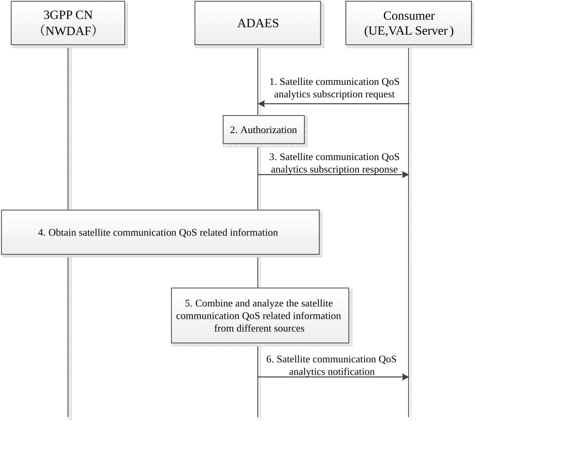

# 10.4 Support for QoS analytics for services over satellite access

## 10.4.1 General

This clause describes the procedure for supporting QoS analytics for services over satellite access. The VAL server or the UE may act as consumers to subscribe the QoS analytics related to the services over satellite access from ADAES. They may ask to provide the preferred or predicted QoS for the requested service over satellite access.

## 10.4.2 Procedure

Figure 10.4.2-1 illustrates the high-level procedure of QoS analytics for services over satellite access.

Pre-condition:

1\. The ADAES, VAL UE, VAL server, 3GPP CN (e.g., NWDAF) are all deployed on the ground.

> 2\. The target UE is accessing the satellite.

10.4.2-1: Procedure of QoS analytics for services over satellite access

1\. Consumers (e.g., the VAL server or UE) initiate a satellite communication QoS analytics subscription request to the ADAES, with the analytics ID (i.e. QoS for the satellite communication), analytics type (statistics or prediction), target UE ID, service ID, target service area, reporting conditions (e.g., periodic reporting or event-triggered reporting), service QoS parameters, etc.

NOTE 1: The definition of QoS can refer to clause 5.7 of 3GPP TS 23.501 \[10\].

2\. The ADAES checks whether the VAL server is authorized to invoke such request.

3\. If the request is authorized, the ADAES enabler sends a satellite communication QoS analytics subscription response to the VAL server.

4\. ADAES may obtain the satellite communication QoS related information for the target UE from the 3GPP CN (i.e., NWDAF, via NEF), including the location information, RAT type (i.e. satellite), UE mobility analysis information, DN performance and QoS analytics information (such as the time delay, the traffic data flow and the uplink/downlink QoS parameters when the UE accesses via satellite access) as specified in clause 6.14 and clause 6.23 of 3GPP TS 23.288 \[9\]).

5\. Upon receiving the satellite communication QoS related information for the target UE from step 4, the ADAES stores and analyses this information based on the service request received in step 1 to generate the performance or service quality (i.e., QoS) statistics and predictions related to satellite access. E.g., the ADAES may provide the preferred satellite and the preferred satellite type (such as GEO, MEO, LEO) when the UE is using the satellite access to meet the requested QoS requirements, or the recommended/predicted QoS parameters for the specific service when the UE is accessing the dedicated satellite.

6\. The ADAES reports the QoS analytics related to satellite communication, including preferred and predicted information (e.g. the preferred satellite and satellite type, recommended/predicted QoS parameters), to the consumer via satellite communication QoS analytics notification message. And the consumers may take actions to minimize the service impact if there is. For example, when the target UE is accessing the GEO satellite, the VAL server may decrease the service QoS (e.g., latency), etc.

NOTE 2: The actions from the consumer to minimize the service impact are out of scope of this specification.

## 10.4.3 Information flows

10.4.3.1 Satellite communication QoS analytics subscription request

Table 10.4.3.1-1 describes information elements for the satellite communication QoS analytics subscription request from the Consumers (e.g., the VAL server or UE) to the ADAE server.

Table 10.4.3.1-1: Satellite communication QoS analytics subscription request

| Information element    | Status | Description                                                                                                                                                                                                                       |
|------------------------|--------|-----------------------------------------------------------------------------------------------------------------------------------------------------------------------------------------------------------------------------------|
| Consumer ID            | M      | The identifier of the VAL server or UE.                                                                                                                                                                                           |
| Analytics ID           | M      | The identifier of the analytics event (i.e. QoS for the satellite communication event).                                                                                                                                           |
| Analytics type         | M      | Describes the required analytics type, i.e. statistics or prediction.                                                                                                                                                             |
| VAL service ID         | O      | The identifier of the VAL service for which Satellite communication QoS analytics is requested.                                                                                                                                   |
| Target UE ID           | O      | The identifier of the target UE.                                                                                                                                                                                                  |
| Target service area    | O      | Describes the target area of interest.                                                                                                                                                                                            |
| Reporting requirements | O      | Describes the requirements for analytics reporting. This requirement may include e.g. the type and frequency of reporting (periodic or event triggered), the reporting periodicity in case of periodic, and reporting thresholds. |
| Service QoS parameters | O      | Describes the QoS parameters of current service.                                                                                                                                                                                  |

### 10.4.3.2 Satellite communication QoS analytics subscription response

Table 10.4.3.2-1 describes information elements for the satellite communication QoS analytics subscription response from the ADAE server to the Consumers (e.g., the VAL server or UE).

Table 10.4.3.2-1: Satellite communication analysis subscription response

| Information element | Status | Description                                                                             |
|---------------------|--------|-----------------------------------------------------------------------------------------|
| Result              | M      | The result of the analytics subscription request (positive or negative acknowledgement) |

### 10.4.3.3 Satellite communication QoS analytics notification

Table 10.4.3.3-1 describes information elements for the satellite communication QoS analytics notification from the ADAE server to the Consumers (e.g., the VAL server or UE).

Table 10.4.3.3-1: Satellite communication QoS analytics notification

| Information element   | Status | Description                                                                                                                             |
|-----------------------|--------|-----------------------------------------------------------------------------------------------------------------------------------------|
| Analytics ID          | M      | The identifier of the analytics event (QoS for the satellite communication)                                                             |
| VAL UE ID(s)          | O      | The identity of the VAL UE(s) for which the analytics applies.                                                                          |
| VAL service ID        | O      | The identifier of the VAL service for which the analytics applies.                                                                      |
| Analytics Output      | M      | The analytics output which can be predictive or statistical parameter.                                                                  |
| \> QoS analytics      | O      | The preferred and predicted information. For example, the preferred satellite and satellite type, recommended/predicted QoS parameters. |
| \>\> Confidence level | O      | For predictive analytics, the achieved confidence level can be provided.                                                                |

## 10.4.4 ADAE server APIs

### 10.4.4.1 General

This clause provides the APIs provided by ADAES related to satellite communication QoS analytics.

### 10.4.4.2 ADAE server APIs

Table 10.4.4.2-1 illustrates the ADAE server APIs related to satellite communication QoS analytics.

Table 10.4.4.2-1: List of ADAE server APIs

<table>
<colgroup>
<col style="width: 44%" />
<col style="width: 23%" />
<col style="width: 15%" />
<col style="width: 16%" />
</colgroup>
<thead>
<tr class="header">
<th>API Name</th>
<th>API Operations</th>
<th>Known Consumer(s)</th>
<th>Communication Type</th>
</tr>
</thead>
<tbody>
<tr class="odd">
<td rowspan="2">SS_ADAE_Satellite_Communication_QoS_analytics</td>
<td>Subscribe</td>
<td rowspan="2">
VAL server,

VAL UE
</td>
<td rowspan="2">Subscribe/Notify</td>
</tr>
<tr class="even">
<td>Notify</td>
</tr>
</tbody>
</table>

### 10.4.4.3 SS_ADAE_Satellite_Communication_QoS_analytics

#### 10.4.4.3.1 General

**API description:** This API enables the analytics consumer (e.g., the VAL server, the VAL UE) to communicate with the ADAE server for subscribing to satellite communication QoS analytics.

#### 10.4.4.3.2 Subscribe

**API operation name:** Satellite_Communication_QoS_subscribe

**Description:** The consumer subscribes to the ADAE server for satellite communication QoS analytics.

**Inputs:** See clause 10.4.3.1.

**Outputs:** See clause 10.4.3.2*.*

See clause 10.4.2 for details of usage of this operation.

#### 10.4.4.3.3 Notify

**API operation name:** Satellite_Communication_QoS \_notify

**Description:** The consumer is notified by the ADAE server for satellite communication QoS analytics.

**Inputs:** See clause 10.4.3.1.

**Outputs:** See clause 10.4.3.3.

See clause 10.4.2 for details of usage of this operation.
