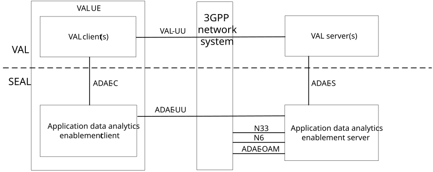
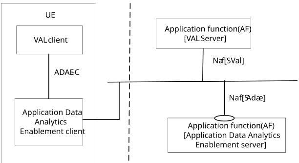
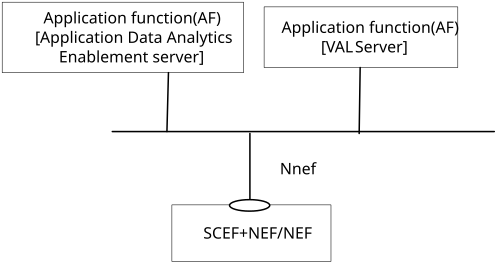
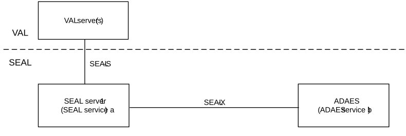
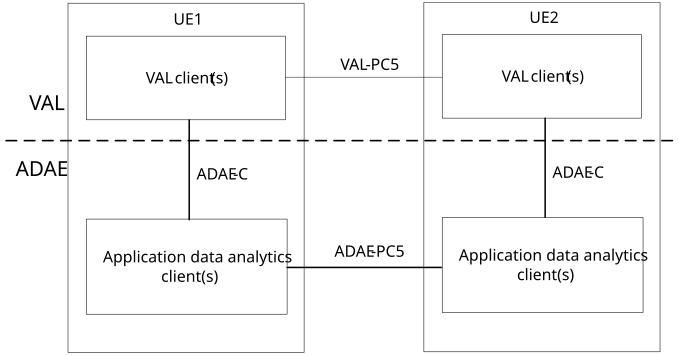
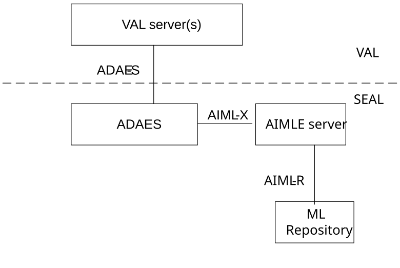
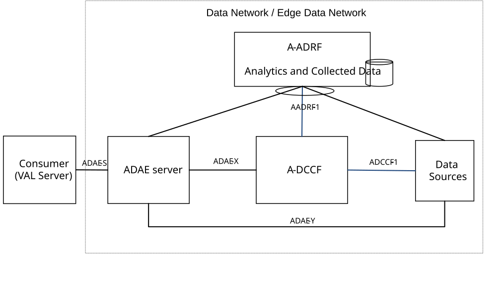

# 5 Application architecture for ADAES

## 5.1 General

This clause provides the functional architecture for ADAE. This includes the on-network and off-network functional models which are provided in detail in clause 5.2.

In addition, the ADAE internal architecture is described in 5.3, which aligns with the 3GPP data analytics framework (specified in TS 23.288 \[4\]) and introduces new logical entities within ADAE framework, such as the A-DCCF and A-ADRF.

## 5.2 Functional architecture

### 5.2.1 General

The functional architecture for the application data analytics enablement is based on the generic functional model specified in clause 6.2 of 3GPP TS 23.434 \[2\]. It is organized into functional entities to describe a functional architecture which addresses the support for application data analytics enablement aspects for vertical applications.

### 5.2.2 On-network Functional Architecture

For the on-network functional architecture, both service-based representation and reference point representation are provided.

Figure 5.2.2-1 depicts the application data analytics enablement architecture in the non-roaming case, using the reference point representation showing how various entities interact with each other.

Figure 5.2.2-1: Architecture for application data analytics enablement – reference points representation

The application data analytics enablement client communicates with the application data analytics enablement server over the ADAE-UU reference point. The application data analytics enablement client provides the support for application data analytics enablement functions to the VAL client(s) over ADAE‑C reference point. The VAL server(s) communicates with the application data analytics enablement server over the ADAE-S reference point. The application data analytics enablement server, acting as AF, may communicate with the 5G Core Network functions (over N33 reference point to NEF and N6 reference point to UPF) and OAM (over ADAE-OAM interface).

Figure 5.2.2-2 exhibits the service-based interfaces for providing and consuming application data analytics enablement services. The application data analytics enablement server could provide service to VAL server and ADAE client through interface SAdae.

Figure 5.2.2-2: Architecture for application data analytics enablement – Service based representation

Figure 5.2.2-3 illustrates the service-based representation for utilization of the 5GS network services based on the 5GS SBA specified in 3GPP TS 23.501 \[9\].

Figure 5.2.2-3: Architecture for application data analytics enablement utilizing the 5GS network services based on the 5GS SBA – Service based representation

Figure 5.2.2-4 illustrates the architecture for inter-service communication between ADAES server and other SEAL server.

Figure 5.2.2-4: Inter-service communication between ADAES server and other SEAL server

The ADAE server interacts with another SEAL server for inter-service communication over SEAL-X reference point.

### 5.2.3 Off-network Functional Architecture

Figure 5.2.3-1 illustrates the generic off-network functional model for ADAE.

Figure 5.2.3-1: Generic off-network functional model

In the vertical application layer, the VAL client of UE1 communicates with VAL client of UE2 over VAL-PC5 reference point. An application data analytics enablement client of UE1 interacts with the corresponding application data analytics enablement client of UE2 over ADAE-PC5 reference points. The UE1, if connected to the network via Uu reference point, can also act as a UE-to-network relay, to enable UE2 to access the VAL server(s) over the VAL-UU reference point.

The service-based interface representation is specified in clause 15 of 3GPP TS 23.434 \[2\].

### 5.2.4 Functional Architecture for supporting interactions with SEAL AIMLE

Figure 5.2.4-1 illustrates the architecture representation including AIMLE (as specified in 3GPP TS 23.482 \[19\]) for supporting ML-enabled analytics in ADAES. In this representation, the AIML support capabilities serve ADAES to enhance its analytics services. Based on the VAL request to provide ML-enabled analytics, ADAES may consume AIMLE services (e.g., for ML model training for a given analytics ID) to derive application layer data analytics.

Figure 5.2.4-1: Architecture representation for supporting AIML-enabled ADAE analytics.

For the interaction between AIMLE server and ADAES, AIML-X is introduced to support consuming AIMLE services for deriving ADAE analytics (e.g. VAL server performance analytics).

The ML repository is specified in 3GPP TS 23.482 \[19\] as a repository for the ML model and registry for the ML-related information (such as ML/FL members). This repository may be utilized by ADAES via AIMLE server (via AIML-R) for fetching ML-related information (e.g., trained ML model, ML/FL members) which is used for a given ADAE analytics event.

Further details on the AIMLE capabilities and architecture, where the ADAES is a consumer of the AIMLE services, are specified in 3GPP TS 23.482 \[19\].

## 5.3 ADAE internal architecture

In ADAE framework, A-DCCF and A-ADRF can be defined as functionalities within the internal ADAE architecture and can offer the following functionalities:

\- Application layer - Data Collection and Coordination Function (A-DCCF) coordinates the collection and distribution of data requested by the consumer (ADAE server). Data Collection Coordination is supported by a A-DCCF. ADAE server can send requests for data to the A-DCCF rather than directly to the Data Sources. A-DCCF may also perform data processing/abstraction and data preparation based on the VAL server requirements.

\- Application layer – Analytics and Data Repository Function (A-ADRF) stores historical data and/or analytics, i.e., data and/or analytics related to past time period that has been obtained by the consumer (e.g. ADAE server). After the consumer obtains data and/or analytics, consumer may store historical data and/or analytics in an A-ADRF. Whether the consumer directly contacts the A-ADRF or goes via the A-DCCF is based on configuration.

Figure 5.3-1 illustrates the generic functional model for ADAE when re-using the 3GPP network data analytics model.

Figure 5.3-1: ADAE internal functional architecture

In this model, an A-DCCF is used to fetch data or put data into an application-level entity (e.g. A-ADRF, Data Source). Such A-DCCF coordinates the collection and distribution of data requested by ADAE server (over ADCCF-1, ADAE-X). ADAE server can also directly interact with the Data Sources via ADAE-Y.

Also, Application layer – Analytics and Data Repository Function (A-ADRF) can be used to store historical data and/or analytics, i.e., data and/or analytics related to past time period that has been obtained by the ADAE server (via AADRF-1) or other NFs/NWDAF. ADAE server can also fetch historical data from A-ADRF. Whether the ADAE server directly contacts the A-ADRF or goes via the A-DCCF is based on configuration.

Data Sources can be 5GS data sources (5GC, OAM) or enablement layer data sources (SEAL, EEL) or external data sources at the DN side (VAL server/ EAS) and VAL UEs. A-DCCF and A-ADRF can be used only for interacting with certain data sources (e.g., 5GC, OAM) based on configuration, and can be hidden from the VAL layer.

NOTE: If the Data Source is the VAL UE, then the data collection mechanism shall reuse the SA4 mechanism based on EVEX study (TS 26.531 \[3\]).

## 5.4 Functional entities description

### 5.4.1 General

The functional entities for ADAE service are described in the following subclauses.

### 5.4.2 Application Data Analytics Enablement client

The application data analytics enablement and provides client side functionalities for the functionalties provided by the application data analytics enablement server. The application data analytics enablement client interacts with the application data analytics enablement server.

### 5.4.3 Application Data Analytics Enablement server

The application data analytics enablement server functional entity provides application layer analytics to support the VAL applications. The application data analytics enablement server acts as CAPIF's API exposing function as specified in 3GPP TS 23.222 \[8\]. The application data analytics enablement server also supports interactions with the corresponding application data analytics enablement server in distributed SEAL deployments. The ADAE server also interacts with 3GPP core network over N33 or N6 interface to subscribe to changes in configuration or other application server specific events. The ADAE server also acts as a co-ordinating entity to collect data from different sources and perform necessary actions to provide required analytics.

The ADAE server provides following server side functionalities:

\- monitoring performance of an application (VAL server or EAS, application session) and providing support for application performance analytics;

\- monitoring performance of a given network slice (from a list of subscribed slices for the VAL customer) and also usage pattern, and providing support for slice-specific application performance analytics and slice usage pattern analytics;

\- monitoring performance of an application session among two or more VAL UEs within a service or group, and providing support for UE-to-UE application performance analytics;

\- monitoring accuracy of a location and providing support for location accuracy analytics;

\- monitoring availability and service level for service APIs and providing support for service API analytics;

\- monitoring edge load parameters and providing support for edge load analytics;

\- monitoring ranging/SL positioning data and location information, and providing support for collision detection analytics.

\- monitoring location information and providing support for location-related UE group analytics.

\- monitoring application layer AI/ML member capability data and providing support for Application Layer AI/ML Member Capability Analytics.

To support ML-enabled analytics services, the ADAE server may provide the above server-side functionalities by consuming SEAL AIMLE services (as specified in 3GPP TS 23.482 \[19\]).

## 5.5 Reference points description

### 5.5.1 General

The reference points for the functional model for application data analytics enablement are described in the following subclauses.

### 5.5.2 ADAE-UU

The interactions related to application data analytics enablement functions between the application data analytics enablement client and the application data analytics enablement server are supported by ADAE-UU reference point. This reference point utilizes Uu reference point as described in 3GPP TS 23.401 \[16\] and 3GPP TS 23.501 \[9\].

### 5.5.3 ADAE-PC5

The interactions related to application data analytics enablement functions between the application data analytics enablement clients located in different VAL UEs are supported by the ADAE-PC5 reference point. This reference point utilizes PC5 reference point as described in 3GPP TS 23.303 \[17\].

### 5.5.4 ADAE-C

The interactions related to application data analytics enablement functions between the VAL client(s) and the application data analytics enablement client within a VAL UE are supported by the ADAE-C reference point.

### 5.5.5 ADAE-S

The interactions related to application data analytics enablement functions between the VAL server(s) and the application data analytics enablement server are supported by the ADAE-S reference point. This reference point is an instance of CAPIF-2 reference point as specified in 3GPP TS 23.222 \[8\].

### 5.5.4 ADAE-X

The interactions related to application data analytics enablement functions between the application data analytics enablement server and the Application-layer DCCF (A-DCCF) for data coordination aspects are supported by the ADAE-X reference point.

### 5.5.5 ADAE-Y

The interactions related to application data analytics enablement functions between the application data analytics enablement server and the data producers (or data sources) for collecting data to be used for the ADAE analytics services (if A-DCCF is not used) are supported by the ADAE-Y reference point.

### 5.5.6 ADCCF-1

The interactions related to application data analytics enablement functions between the application layer data collection and coordination entity and the data sources for data coordination aspects are supported by the ADCCF-1 reference point.

### 5.5.7 AADRF-1

The interactions related to application data analytics enablement functions between the application data analytics enablement server (or the A-DCCF) and the application layer - analytics and data repository function (A-ADRF) for storing data and analytics related to the ADAE analytics services (if A-DCCF is not used) are supported by the AADRF-1 reference point.

### 5.5.8 SEAL-X

The interactions between the NSCE servers and other SEAL servers are generically referred to as SEAL‑X reference point. The specific SEAL server interactions corresponding to SEAL-X are described in 3GPP TS 23.434 \[2\].

### 5.5.9 AIML-X

The interactions between the SEAL AIMLE server and ADAES for supporting ML-enabled analytics is generically referred to as AIML‑X reference point. AIML-X is an instance of SEAL-X as described 3GPP TS 23.434 \[2\].
