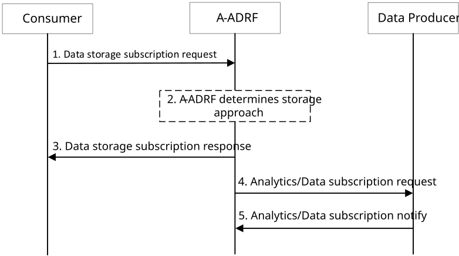
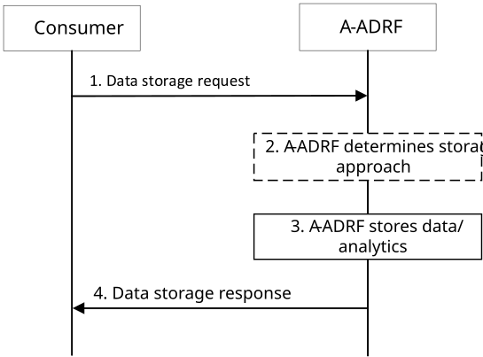
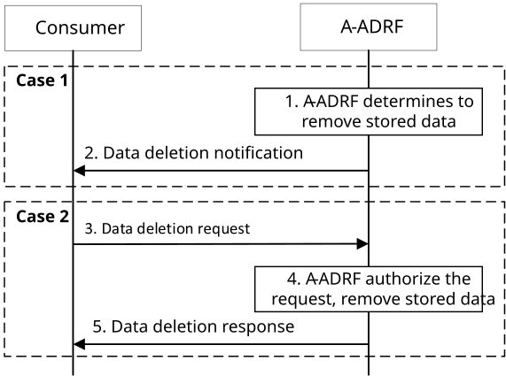

# 8.10 Procedure on support for data storage

## 8.10.1 General

This clause describes procedures for supporting data storage to A-ADRF and remove stored date from the A-ADRF.

## 8.10.2 Procedure

### 8.10.2.1 Notification based data storage

Figure 8.10.2.1-1 illustrates the procedure for consumer to request A-ADRF to initiate request for data or analytics to store.

Pre-conditions:

1\. Analytics or data consumer requests ADAE server, A-DCCF or data sources to store analytics or data to A-ADRF.

2\. ADAE server, A-DCCF or A-ADRF are configured with default operator storage policies.

Figure 8.10.2.1-1: Support for data storage to A-ADRF

1\. The consumer (A-DCCF or ADAE server) requests that the A-ADRF subscribes to Data Producer for receiving notifications. The determination may be made based on configuration or information supplied by the data or analytics. As specified in Table 8.10.3.2-1, the request to the A-ADRF specifies the data and/or analytics to which the A-ADRF will subscribe. The request includes identity of the consumer, security credential(s) for authorization and verification, and may include Storage Handling information (e.g. an expiration time for how long the data or analytics should be stored), indicate if a notification alerting the consumer needs to be sent prior to data deletion from the A-ADRF, notification endpoint information for use by the A-ADRF to send notifications (implicit subscription) alerting the consumer that data is about to be deleted, as specified in Table 8.10.3.2-1.

2\. The A-ADRF may, based on implementation, determine whether the same data and/or analytics is already stored or being stored, based on the information sent in step 1 by the consumer. Based on Storage Handling information, the A-ADRF determines the Storage Approach (e.g. lifetime for the stored data and whether consumer is notified prior to data deletion).

3\. If the data and/or analytics is already stored and/or being stored in the A-ADRF, the A-ADRF sends data storage subscription response message to the consumer indicating that data and/or analytics is stored. The storage subscription response includes the Storage Approach, as specified in Table 8.10.3.3-1.

4\. The A-ADRF subscribes to the data producer (e.g. A-DCCF, ADAE server) to receive notifications with data or analytics, providing its notification endpoint address and a notification correlation ID.

5\. The data producer sends data or analytics notifications containing the notification correlation ID provided by the A-ADRF to notification endpoint address. The analytics or data notifications shall contain timestamp. The ADRF stores the notifications.

### 8.10.2.2 Direct data storage

Figure 8.10.2.2-1 illustrates the procedure for the consumer to request A-ADRF for data or analytics storage.

Pre-conditions:

1\. ADAE server or A-DCCF has data or analytics to be stored to A-ADRF.

2\. ADAE server, A-DCCF or A-ADRF are configured with default operator storage policies.

Figure 8.10.2.2-1: Support for data storage to A-ADRF

1\. The consumer (e.g. ADAE server, A-DCCF) sends data storage request to the A-ADRF for storing data and/or analytics. The request message includes identity of the consumer, security credential(s) for authorization and verification, collected data with timestamp and/or analytics with timestamp, and may include Storage Handling information (e.g. a lifetime for how long the data or analytics should be stored), indicate if a notification alerting the consumer needs to be sent prior to data deletion from the A-ADRF, notification endpoint information for use by the A-ADRF to send notifications (implicit subscription) alerting the consumer that data is about to be deleted, as specified in Table 8.10.3.4-1.

2\. Based on Storage Handling information (if available), the A-ADRF determines the Storage Approach (e.g. lifetime for storing data and whether consumer is notified prior to data deletion).

3\. The A-ADRF stores the data and/or analytics sent by the consumer. The A-ADRF may, based on implementation, determine whether the same data and/or analytics is already stored or being stored based on the information sent in step 1 by the consumer and, if the same data and/or analytics is already stored or being stored in the A-ADRF, the A-ADRF decides to not store again the data and/or analytics sent by the consumer.

4\. The ADRF sends data storage response message to the consumer indicating that data and/or analytics is stored, whether the A-ADRF determined at step 3 that data or analytics is already stored and the Storage Approach, as specified in Table 8.10.3.5-1.

### 8.10.2.3 Data removal from an A-ADRF

Figure 8.10.2.3-1 illustrates the procedure for the consumer to remove data previously stored in an A-ADRF, and for the A-ADRF to remove stored data with notification alerting to the consumer that data is about to be deleted.

Pre-conditions:

1\. Case 1, A-ADRF Managing the Storage Approach: Consumer has data stored at the A-ADRF. The Storage Approach indicate that the consumer will be notified prior to data deletion, and the corresponding Data Deletion Notification Endpoint is known by the A-ADRF.

2\. Case 2, Consumer Managing the Storage Approach: Consumer has data stored at the A-ADRF. The Storage Approach indicate that the consumer will not be notified prior to data deletion, or the corresponding Data Deletion Notification Endpoint is not known at the A-ADRF.

Figure 8.10.2.3-1: Support for data removal from A-ADRF

**Conditional on A-ADRF Managing the Storage Approach (Case 1)**

1\. A-ADRF determines to remove data or analytics previously stored by a consumer (e.g. ADAE server, A-DCCF), as the lifetime of the stored data or analytics has expired (according to the Storage Approach).

2\. If indicated by the Storage Approach, the A-ADRF sends a data deletion notification alerting the consumer that data is about to be deleted. The data deletion notification message includes Data or Analytics Deletion Alert, as specified in Table 8.10.3.6-1.

NOTE: This is an implicit subscription.Conditional on Consumer Managing the Storage Approach (Case 2)

3\. The consumer (e.g. ADAE server, A-DCCF) determines that the data or analytics has to be deleted. The consumer sends data deletion request to the A-ADRF to remove specified data previously stored at the A-ADRF by the consumer. The request message includes the identifier(s) of the data set to be removed, as specified in Table 8.10.3.7-1.

4\. The A-ADRF checks the relevant authorization for the request. If the authorization is successful, the A-ADRF deletes all copies of the stored data.

5\. The A-ADRF sends data deletion response to the consumer. The response includes the deletion result (i.e. data deleted, data not found, data found but not deleted), as specified in Table 8.10.3.8-1.

## 8.10.3 Information flows

### 8.10.3.1 General

The following information flows are specified for data storage based on 8.10.2.

### 8.10.3.2 Data storage subscription request

Table 8.10.3.2-1 describes information elements for the data storage subscription request from the consumer (ADAE server, A-DCCF) to the A-ADRF.

Table 8.10.3.2-1: Data storage subscription request

| Information element                   | Status | Description                                                                                                                                                                                                                                               |
|---------------------------------------|--------|-----------------------------------------------------------------------------------------------------------------------------------------------------------------------------------------------------------------------------------------------------------|
| Consumer ID                           | M      | The identifier of the consumer (ADAE server, A-DCCF).                                                                                                                                                                                                     |
| Data Producer ID                      | O      | The identifier of the data producer (e.g. ADAE server, A-DCCF).                                                                                                                                                                                           |
| Analytics ID                          | O      | The identifier of the analytics event. This IE shall be provided when Analytics Producer ID is present.                                                                                                                                                   |
| Analytics Type                        | O      | The type of analytics for the event, which include category (e.g. statistics or predictive analytics), may include mode (e.g. offline or online) and indication on ML-enabled analytics. This IE shall be provided when Analytics Producer ID is present. |
| Target Data Producer Profile Criteria | O      | Characteristics of the data producers to be used. This IE shall be provided when Data Producer ID is present.                                                                                                                                             |
| Area of Interest                      | O      | The geographical or service area for which the subscription request applies.                                                                                                                                                                              |
| Time Validity                         | O      | The time validity of the subscription request to the A-ADRF.                                                                                                                                                                                              |
| Storage Handling information          | O      | The information for storage handling.                                                                                                                                                                                                                     |
| \> Lifetime                           | O      | A lifetime for how long the data or analytics should be stored.                                                                                                                                                                                           |
| \> Alert Indicator                    | O      | To indicate that a notification alerting the consumer be sent prior to data deletion from the A-ADRF.                                                                                                                                                     |
| Data Deletion Notification Endpoint   | O      | Information of the notification endpoint, which is used by the A-ADRF to send data or analytics deletion alert.                                                                                                                                           |

### 8.10.3.3 Data storage subscription response

Table 8.10.3.3-1 describes information elements for the data storage subscription response from the A-ADRF to the consumer (ADAE server, A-DCCF).

Table 8.10.3.3-1: Data storage subscription response

| Information element | Status | Description                                                                                                               |
|---------------------|--------|---------------------------------------------------------------------------------------------------------------------------|
| Result              | M      | The result of the data storage subscription request (positive or negative acknowledgement).                               |
| Storage Approach    | M      | Represent the Storage Approach (e.g. lifetime for storing data, and whether consumer is notified prior to data deletion). |

### 8.10.3.4 Data storage request

Table 8.10.3.4-1 describes information elements for the data storage request from the consumer (ADAE server, A-DCCF) to the A-ADRF.

Table 8.10.3.4-1: Data storage request

| Information element                 | Status | Description                                                                                                                                                                                                                         |
|-------------------------------------|--------|-------------------------------------------------------------------------------------------------------------------------------------------------------------------------------------------------------------------------------------|
| Consumer ID                         | M      | The identifier of the consumer (ADAE server, A-DCCF).                                                                                                                                                                               |
| Data Type                           | M      | To indicate the data type (e.g. data or analytics).                                                                                                                                                                                 |
| Content                             | M      | The data or analytics to be stored.                                                                                                                                                                                                 |
| Timestamp                           | M      | The timestamp of the data or analytics.                                                                                                                                                                                             |
| Analytics ID                        | O      | The identifier of the analytics event. This IE shall be provided if the Storage Type is analytics.                                                                                                                                  |
| Analytics Type                      | O      | The type of analytics, which include category (e.g. statistics or predictive analytics), may include mode (e.g. offline or online) and indication on ML-enabled analytics. This IE shall be provided if the Data Type is analytics. |
| Data Source Information             | O      | Information of the data source. This IE shall be provided if the Data Type is data.                                                                                                                                                 |
| Storage Handling information        | O      | The information for storage handling.                                                                                                                                                                                               |
| \> Lifetime                         | O      | A lifetime for how long the data or analytics should be stored.                                                                                                                                                                     |
| \> Alert Indicator                  | O      | To indicate that a notification alerting the consumer be sent prior to data deletion from the A-ADRF.                                                                                                                               |
| Data Deletion Notification Endpoint | O      | Information of the notification endpoint, which is used by the A-ADRF to send data or analytics deletion alert.                                                                                                                     |

### 8.10.3.5 Data storage response

Table 8.10.3.5-1 describes information elements for the data storage response from the A-ADRF to the consumer (ADAE server, A-DCCF).

Table 8.10.3.5-1: Data storage response

| Information element | Status | Description                                                                                                               |
|---------------------|--------|---------------------------------------------------------------------------------------------------------------------------|
| Result              | M      | The result of the data storage request (positive or negative acknowledgement).                                            |
| Storage Approach    | M      | Represent the Storage Approach (e.g. lifetime for storing data, and whether consumer is notified prior to data deletion). |

### 8.10.3.6 Data deletion notification

Table 8.10.3.6-1 describes information elements for the data deletion notification from the A-ADRF to the consumer (ADAE server, A-DCCF).

Table 8.10.3.6-1: Data deletion notification

| Information element              | Status | Description                                                         |
|----------------------------------|--------|---------------------------------------------------------------------|
| Consumer ID                      | M      | The identifier of the consumer (ADAE server, A-DCCF).               |
| Data or Analytics Deletion Alert | M      | Indicates that the stored data or analytics is about to be deleted. |
| Identifier(s) of data set        | M      | Identifier(s) of the data set to be deleted.                        |

### 8.10.3.7 Data deletion request

Table 8.10.3.7-1 describes information elements for the data deletion request from the consumer (ADAE server, A-DCCF) to the A-ADRF.

Table 8.10.3.7-1: Data deletion request

| Information element       | Status | Description                                           |
|---------------------------|--------|-------------------------------------------------------|
| Consumer ID               | M      | The identifier of the consumer (ADAE server, A-DCCF). |
| Identifier(s) of data set | M      | Identifier(s) of the data set to be deleted.          |

### 8.10.3.8 Data deletion response

Table 8.10.3.8-1 describes information elements for the data deletion response from the A-ADRF to the consumer (ADAE server, A-DCCF).

Table 8.10.3.8-1: Data deletion response

| Information element       | Status | Description                                                                                 |
|---------------------------|--------|---------------------------------------------------------------------------------------------|
| Identifier(s) of data set | M      | Identifier(s) of the data set.                                                              |
| Deletion result           | M      | The result of data deletion, i.e. data deleted, data not found, data found but not deleted. |
