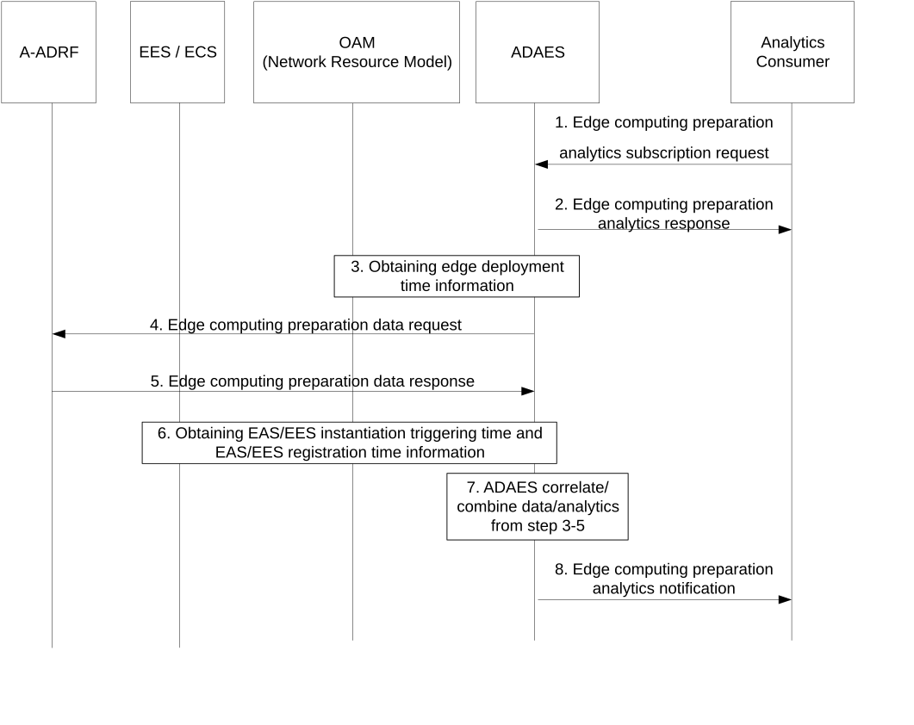
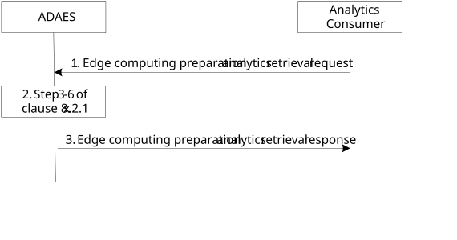

# 8.11 Procedure for edge computing preparation analytics

## 8.11.1 General

This clause describes the procedure for edge computing preparation analytics.

## 8.11.2 Procedure

### 8.11.2.1 Subscribe-notify model

Figure 8.11.2.1-1 illustrates the procedure for edge computing preparation analytics.

Pre-conditions:

1\. ADAES is connected to A-ADRF.

2\. ADAES has subscribed to OAM for receiving management analytics.

Figure 8.11.2.1-1: ADAES support for edge computing preparation analytics subscribe-notify model

1\. The analytics consumer (e.g., VAL server, ECS, EES) of the ADAE server analytics service sends an Edge computing preparation analytics subscription request to the ADAE server.

2\. The ADAE server sends an Edge computing preparation analytics response as an ACK to the analytics consumer.

3\. The ADAE server utilizes OAM (Network Resource Model) for edge deployment time information for EAS, EES, or ECS. The deployment time information is determined from the Process Monitor that specifies, for instance, NOT_STARTED, RUNNING and start and/or end time for these states as described in 3GPP TS 28.623 \[15\].

4\. The ADAE server requests historical edge deployment time information of EAS, EES, and/or ECS from A-ADRF by sending an Edge computing preparation data request.

5\. Based on the request, the ADAE server receives historical edge deployment time information of EAS, EES, and/or ECS by receiving an Edge computing preparation data response from A-ADRF.

6\. The ADAE server collects EAS and/or EES instantiation triggering time and their registration time from the corresponding EES/ECS to determine when the instantiation request is sent to OAM and when EAS/EES service is ready.

7\. The ADAE server abstracts or correlates the data/analytics from step 3-6. Based on the request in step 1, ADAES may also provide predictions for the edge deployment time.

> 8\. The ADAE server sends an Edge computing preparation analytics notification to the analytics consumer, based on the request and the derived analytics in step 7. Such analytics indicate analytics and/or prediction of the edge deployment time for EAS, EES, and/or ECS.

### 8.11.2.2 Request-response model

Figure 8.11.2.2-1 illustrates the procedure where the analytics consumer (e.g., VAL server, ECS, EES) requests edge computing preparation analytics using the request/response model.

Pre-conditions:

1\. ADAES is connected to A-ADRF.

2\. ADAES has subscribed to OAM for receiving management analytics.

Figure 8.11.2.2-1: ADAES support for edge computing preparation analytics request/response model

1\. The analytics consumer (e.g., VAL server, ECS, EES) sends an Edge computing preparation analytics retrieval request to the ADAES.

2\. Upon receiving the request, the ADAE server authenticates and authorizes the analytics consumer. If the analytics consumer is authorized, the ADAES performs step 3-7 of clause 8.11.2.1.

3\. The ADAES sends an Edge computing preparation analytics retrieval response to the analytics consumer.

## 8.11.3 Information flows

### 8.11.3.1 General

The following information flows are specified for edge computing preparation analytics based on 8.11.2.

### 8.11.3.2 Edge computing preparation analytics subscription request

Table 8.11.3.2-1 describes information elements for the edge computing preparation analytics subscription request from the analytics consumer (e.g., the VAL server, ECS, EES) to the ADAE server.

Table 8.11.3.2-1: Edge computing preparation analytics subscription request

| Information element               | Status | Description                                                                                                                                                                                                                |
|-----------------------------------|--------|----------------------------------------------------------------------------------------------------------------------------------------------------------------------------------------------------------------------------|
| Analytics Consumer ID             | M      | The identifier of the analytics consumer (VAL server, ECS etc.).                                                                                                                                                           |
| Analytics ID                      | O      | The identifier of the analytics event. This ID can be for example "edge computing preparation analytics".                                                                                                                  |
| Analytics type                    | M      | The type of analytics for the event, e.g. statistics or predictions.                                                                                                                                                       |
| Reporting requirements            | O      | Requirements for analytics reporting. The requirements may include for example when the deployment information of the target (EAS, EES, ECS) is set to a specific state (such as "finished") or when the state is changed. |
| DNN/DNAI                          | O      | DNN or DNAIs information of the EDN for which the subscription applies.                                                                                                                                                    |
| ECS provider ID                   | O      | The identifier of the ECS provider                                                                                                                                                                                         |
| ECS endpoint                      | O      | By providing the ECS endpoint, the consumer wants to subscribe to the EES instantiation info (EESs that will register in the ECS)                                                                                          |
| EES provider ID                   | O      | The identifier of the EES provider                                                                                                                                                                                         |
| EES endpoint                      | O      | By providing the EES endpoint, the consumer wants to subscribe to the EAS instantiation info (EASs that will register in the EES)                                                                                          |
| EAS provider ID                   | O      | The identifier of the EAS provider                                                                                                                                                                                         |
| EAS ID                            | O      | Identifies an EAS service.                                                                                                                                                                                                 |
| EAS/EES/ECS resource requirements | O      | The resources (i.e. available compute, graphical compute, memory, storage) needed for EAS/EES/ECS as described in Table 8.2.5-1 in 3GPP TS 23.558 \[14\].                                                                  |
| Preferred confidence level        | O      | The level of accuracy for the analytics service (in case of prediction).                                                                                                                                                   |
| Area of Interest                  | O      | The geographical or service area for which the requirement request applies.                                                                                                                                                |
| Time validity                     | O      | The time validity of the subscription request.                                                                                                                                                                             |

### 8.11.3.3 Edge computing preparation analytics subscription response

Table 8.11.3.3-1 describes information elements for the edge computing analytics preparation analytics subscription response from the ADAE server to the analytics consumer.

Table 8.11.3.3-1: Edge computing preparation analytics subscription response

| Information element | Status | Description                                                                              |
|---------------------|--------|------------------------------------------------------------------------------------------|
| Result              | M      | The result of the analytics subscription request (positive or negative acknowledgement). |

### 8.11.3.4 Edge computing preparation analytics notification

Table 8.11.3.4-1 describes information elements for the edge computing preparation analytics notification from the ADAE server to the analytics consumer.

Table 8.11.3.4-1: Edge computing preparation analytics notification

| Information element | Status | Description                                                                                             |
|---------------------|--------|---------------------------------------------------------------------------------------------------------|
| Analytics ID        | O      | The identifier of the analytics event.                                                                  |
| Analytics Output    | M      | Represents the analytics output including prediction or statistics for the EAS/EES/ECS deployment time. |
| Confidence level    | O      | For predictive analytics, the achieved confidence level can be provided.                                |

### 8.11.3.5 Edge computing preparation data request

Table 8.11.3.5-1 describes information elements for the edge computing preparation data request from the ADAE server to the A-ADRF/EES/ECS.

Table 8.11.3.5-1: Edge computing preparation data request

| Information element                                                                                                                                                                                                                                                                                | Status   | Description                                      |
|----------------------------------------------------------------------------------------------------------------------------------------------------------------------------------------------------------------------------------------------------------------------------------------------------|----------|--------------------------------------------------|
| ADAE server ID                                                                                                                                                                                                                                                                                     | M        | The identifier of the ADAE server.               |
| Analytics ID                                                                                                                                                                                                                                                                                       | M        | The identifier of the analytics event.           |
| Target ECS information                                                                                                                                                                                                                                                                             | O (NOTE) | This identifier shows the target ECS information |
| Target EES information                                                                                                                                                                                                                                                                             | O (NOTE) | This identifier shows the target EES information |
| Target EAS information                                                                                                                                                                                                                                                                             | O (NOTE) | This identifier shows the target EAS information |
| Time validity                                                                                                                                                                                                                                                                                      | O        | The time validity of the request.                |
| NOTE: At least one of these shall be present for A-ADRF as receiver. Target ECS information is included for collecting EES instantiation triggering time and EES registration time. Target EES information is included for collecting EAS instantiation triggering time and EAS registration time. |          |                                                  |

### 8.11.3.6 Edge computing preparation data response

Table 8.11.3.6-1 describes information elements for the edge computing preparation data response from the A-ADRF/EES/ECS to the ADAE server.

Table 8.11.3.6-1: Edge computing preparation data response

| Information element | Status | Description                                                                                                                                                                                                                                       |
|---------------------|--------|---------------------------------------------------------------------------------------------------------------------------------------------------------------------------------------------------------------------------------------------------|
| Analytics ID        | M      | The identifier of the analytics event.                                                                                                                                                                                                            |
| Data Type           | M      | The type of reported data samples which can be network data, application data, edge data, or different granularities / abstraction of data (e.g., real time, non-real time).                                                                      |
| Data Output         | M      | The reported data, which can be in form of measurements or offline/historical data on the requested parameter based on the request. The reported data includes historical ECS/EES/EAS deployment time information, EES/EAS registration data etc. |

### 8.11.3.7 Edge computing preparation analytics retrieval request

Table 8.11.3.7-1 describes information elements for the Edge computing preparation analytics retrieval request from the analytics consumer to the ADAE server.

Table 8.11.3.7-1: Edge computing preparation analytics retrieval request

| Information element               | Status | Description                                                                                                                                               |
|-----------------------------------|--------|-----------------------------------------------------------------------------------------------------------------------------------------------------------|
| Analytics Consumer ID             | M      | The identifier of the analytics consumer (VAL server, ECS etc.).                                                                                          |
| Analytics ID                      | O      | The identifier of the analytics event. This ID can be for example “edge computing preparation analytics”.                                                 |
| Analytics type                    | M      | Whether analytics event is about prediction or statistics.                                                                                                |
| DNN/DNAI                          | O      | DNN or DNAIs information of the EDN for which the subscription applies.                                                                                   |
| ECS provider ID                   | O      | The identifier of the ECS provider                                                                                                                        |
| ECS endpoint                      | O      | By providing the ECS endpoint, the consumer wants to subscribe to the EES instantiation info (EESs that will register in the ECS)                         |
| EES provider ID                   | O      | The identifier of the EES provider                                                                                                                        |
| EES endpoint                      | O      | By providing the EES endpoint, the consumer wants to subscribe to the EAS instantiation info (EASs that will register in the EES)                         |
| EAS provider ID                   | O      | The identifier of the EAS provider                                                                                                                        |
| EAS ID                            | O      | Identifies an EAS service.                                                                                                                                |
| EAS/EES/ECS resource requirements | O      | The resources (i.e. available compute, graphical compute, memory, storage) needed for EAS/EES/ECS as described in Table 8.2.5-1 in 3GPP TS 23.558 \[14\]. |
| Preferred confidence level        | O      | The level of accuracy for the analytics service (in case of prediction).                                                                                  |
| Area of Interest                  | O      | The geographical or service area for which the requirement request applies.                                                                               |
| Time duration                     | O      | Time duration since when analytics data is required.                                                                                                      |

### 8.11.3.8 Edge computing preparation analytics retrieval response

Table 8.11.3.8-1 describes information elements for the Edge computing preparation analytics retrieval response from the ADAE server to the analytics consumer.

Table 8.11.3.8-1: Edge computing preparation analytics retrieval response

| Information element | Status | Description                                                                                             |
|---------------------|--------|---------------------------------------------------------------------------------------------------------|
| Results             | M      | The result of the analytics data request (positive or negative acknowledgement).                        |
| Analytics ID        | O      | The identifier of the analytics event.                                                                  |
| Analytics Output    | M      | Represents the analytics output including prediction or statistics for the EAS/EES/ECS deployment time. |
| Confidence level    | O      | For predictive analytics, the achieved confidence level can be provided.                                |
