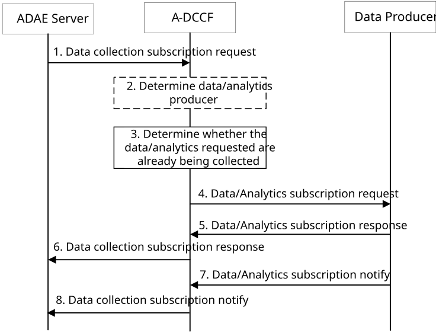
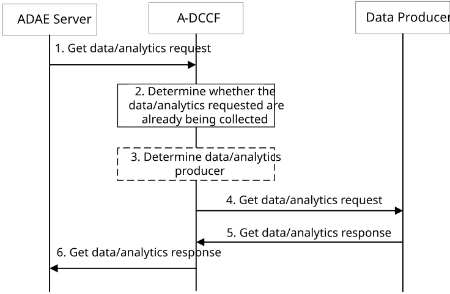

# 8.12 Procedure for supporting data collection to A-DCCF

## 8.12.1 General

This clause describes two procedures (covering both subscribe-notify and request-response models in 8.12.2.1 and 8.12.2.2 respectively) for supporting data collection at A-DCCF.

## 8.12.2 Procedure

### 8.12.2.1 Subscribe-notify model

Figure 8.12.2.1-1 illustrates the procedure for consumer to request A-DCCF to initiate subscription for data or analytics collection. The procedure may be utilized by the consumer to update the subscription for data or analytics collection.

Pre-conditions:

1\. Consumer (ADAE server) collects data or analytics via A-DCCF from data producer.

Figure 8.12.2.1-1: Support for data collection over A-DCCF

1\. The consumer (ADAE server) sends a data collection subscription request to A-DCCF for collecting data/analytics. As specified in Table 8.12.3.2-1, the request message includes identifier of the consumer (ADAE server ID), Data Collection Event ID, and Data Collection Requirements. The request message may include the identifier of Data Producer, Analytics ID, target data producer profile criteria, process requirements, Area of Interest, Time validity, storage requirements, and notification endpoints. The consumer decides to go via A-DCCF based on internal configuration. In cases where A-DCCF is used to obtain the ML model performance evaluation, the request should include the ML model ID, the ML consumer list, and the VAL service ID.

2\. If the data producer is not identified by the consumer, the A-DCCF determines the data procedure that can provide data/analytics. If the consumer requested storage of data/analytics in an A-ADRF but the A-ADRF ID is not provided by the consumer, or the collected data/analytics is to be stored in an A-ADRF according to configuration on the A-DCCF, the A-DCCF selects an A-ADRF to store the collected data/analytics.

3\. The A-DCCF determines whether the data/analytics requested in step 1 are already being collected. If the requested data/analytics are already being collected by a consumer, the A-DCCF adds the new consumer to the list of consumers that are subscribed for these data/analytics.

4\. If the data/analytics subscribed in step 1 is not being collected by the A-DCCF, the A-DCCF subscribes to the data producer for data/analytics.

If the data/analytics subscribed in step 1 partially matches the data/analytics that is already being collected by the A-DCCF, a modification of this subscription to the data producer would satisfy both the existing data/analytics subscriptions as well as the newly requested data/analytics, the A-DCCF requests an update of the previous subscription to the data producer. The A-DCCF adds the consumer to the list of consumers that are subscribed for these data/analytics.

5\. Upon received the data/analytics subscription request from the A-DCCF, the data producer determines whether the required data/analytics can be provided and sends data/analytics subscription response to the A-DCCF.

6\. The A-DCCF sends data/analytics subscription response to the consumer.

7\. When the required data/analytics are available, the data producer notifies the data/analytics to the A-DCCF.

8\. The A-DCCF notifies the data/analytics to all notification endpoints indicated in step 1. Data/analytics sent to notification endpoints may be processed by the DCCF upon to the request in step 1. The DCCF may store the data/analytics in the A-ADRF if requested by the consumer or if required by A-DCCF configuration.

### 8.12.2.2 Request-response model

Figure 8.12.2.2-1 illustrates the procedure for the consumer to request A-DCCF for data or analytics collection.

Figure 8.12.2.2-1: Support for Get data/analytics over A-DCCF

1\. The consumer (ADAE server) sends a Get data/analytics request to A-DCCF for data/analytics collection. As specified in Table 8.12.3.5-1, the request message includes identifier of the consumer (ADAE server ID), and Data/Analytics Requirements. The request message may include the identifier of Data Producer, Analytics ID, target data producer profile criteria, process requirements, storage requirements, and notification endpoints. The consumer decides to go via A-DCCF based on internal configuration. In cases where A-DCCF is used to obtain the ML model performance evaluation, the request shall include the ML model ID, the ML consumer list, and the VAL service ID.

2\. The A-DCCF determines whether the data/analytics requested in step 1 are already being collected. If the requested data/analytics are already being collected by a consumer, the A-DCCF adds the new consumer to the list of consumers that are subscribed for these data/analytics.

3\. If the data/analytics requested in step 1 is not being collected by the A-DCCF, and the data producer is not identified by the consumer, the A-DCCF determines the data procedure that can provide data/analytics. If the consumer requested storage of data/analytics in an A-ADRF but the A-ADRF ID is not provided by the consumer, or the collected data/analytics is to be stored in an A-ADRF according to configuration on the A-DCCF, the A-DCCF selects an A-ADRF to store the collected data/analytics.

4\. The A-DCCF sends Get data/analytics request to the data producer for data/analytics.

5\. Upon received the data/analytics request from the A-DCCF, the data producer determines whether the required data/analytics can be provided and sends data/analytics response to the A-DCCF. The required data/analytics may be contained in the response if they are available at the data producer.

6\. The A-DCCF sends data/analytics response to the consumer. The required data/analytics may be contained in the response if get from the data producer.

## 8.12.3 Information flows

### 8.12.3.1 General

The following information flows are specified for data collection based on clause 8.12.2.

### 8.12.3.2 Data collection subscription request

Table 8.12.3.2-1 describes information elements for the data collection subscription request from the consumer (ADAE server) to the A-DCCF.

Table 8.12.3.2-1: Data collection subscription request

<table>
<colgroup>
<col style="width: 33%" />
<col style="width: 16%" />
<col style="width: 50%" />
</colgroup>
<thead>
<tr class="header">
<th>Information element</th>
<th>Status</th>
<th>Description</th>
</tr>
</thead>
<tbody>
<tr class="odd">
<td>Consumer ID</td>
<td>M</td>
<td>The identifier of the consumer (ADAE server ID).</td>
</tr>
<tr class="even">
<td>Data Collection Event ID</td>
<td>M</td>
<td>The identifier of the data collection event.</td>
</tr>
<tr class="odd">
<td>Data Collection requirements</td>
<td>M</td>
<td>The requirements for data collection, including the format of data, frequency of reporting, level of abstraction of data, level of accuracy of data.</td>
</tr>
<tr class="even">
<td>Analytics ID</td>
<td>O</td>
<td>The identifier of the analytics event, for which the data collection is needed.</td>
</tr>
<tr class="odd">
<td>ML model ID</td>
<td>
O

(NOTE)
</td>
<td>The ML model identifier.</td>
</tr>
<tr class="even">
<td>ML consumer List</td>
<td>
O

(NOTE)
</td>
<td>The consumers that use the ML model identified by the ML model ID.</td>
</tr>
<tr class="odd">
<td>VAL service ID</td>
<td>
O

(NOTE)
</td>
<td>Indicates the VAL service ID.</td>
</tr>
<tr class="even">
<td>List of Data Producer IDs</td>
<td>O</td>
<td>The list of Data Producer IDs.</td>
</tr>
<tr class="odd">
<td>Target data producer profile criteria</td>
<td>O</td>
<td>Characteristics of the data producers to be used.</td>
</tr>
<tr class="even">
<td>Area of Interest</td>
<td>O</td>
<td>The geographical or service area for which the requirement request applies</td>
</tr>
<tr class="odd">
<td>Time validity</td>
<td>O</td>
<td>The time validity of the request</td>
</tr>
<tr class="even">
<td>Process requirements</td>
<td>O</td>
<td>Requirements on processing the collected data/analytics.</td>
</tr>
<tr class="odd">
<td>Storage requirements</td>
<td>O</td>
<td>Requirements on storage of the collected data/analytics.</td>
</tr>
<tr class="even">
<td>&gt; A-ADRF ID</td>
<td>O</td>
<td>The identifier of A-ADRF for store the collected data/analytics.</td>
</tr>
<tr class="odd">
<td>Notification endpoints ID or address</td>
<td>O</td>
<td>The identifier or address of the notification endpoints.</td>
</tr>
<tr class="even">
<td colspan="3">NOTE: The IEs shall be provided for ML model performance collection.</td>
</tr>
</tbody>
</table>

### 8.12.3.3 Data collection subscription response

Table 8.12.3.3-1 describes information elements for the data collection subscription response from the A-DCCF to the consumer (ADAE server).

Table 8.12.3.3-1: Data collection subscription response

| Information element | Status | Description                                                                                    |
|---------------------|--------|------------------------------------------------------------------------------------------------|
| Result              | M      | The result of the data collection subscription request (positive or negative acknowledgement). |

### 8.12.3.4 Data collection notification

Table 8.12.3.4-1 describes information elements for the data collection notification from the A-DCCF to the consumer (ADAE server).

Table 8.12.3.4-1: Data collection notification

<table>
<colgroup>
<col style="width: 33%" />
<col style="width: 16%" />
<col style="width: 50%" />
</colgroup>
<thead>
<tr class="header">
<th>Information element</th>
<th>Status</th>
<th>Description</th>
</tr>
</thead>
<tbody>
<tr class="odd">
<td>Data Collection Event ID</td>
<td>M</td>
<td>The identifier of the data collection event.</td>
</tr>
<tr class="even">
<td>Analytics ID</td>
<td>O</td>
<td>The identifier of the analytics event.</td>
</tr>
<tr class="odd">
<td>Analytics Type</td>
<td>O</td>
<td>The type of reported analytics, which can be statistics, prediction, etc.</td>
</tr>
<tr class="even">
<td>ML model ID</td>
<td>
O

(NOTE)
</td>
<td>The ML model identifier.</td>
</tr>
<tr class="odd">
<td>ML consumer list</td>
<td>
O

(NOTE)
</td>
<td>The consumers that use the ML model identified by the ML model ID.</td>
</tr>
<tr class="even">
<td>Data Type</td>
<td>O</td>
<td>The type of reported data samples, which can be UE data, network data, application data, edge data, or different granularities/abstraction of data (e.g. real time, non-real time).</td>
</tr>
<tr class="odd">
<td>Data Output</td>
<td>M</td>
<td>The reported data/analytics, which can be inform of measurements or offline/historical data/analytics or ML model performance indication based on subscription.</td>
</tr>
<tr class="even">
<td>Process information</td>
<td>O</td>
<td>Information of the processing of the collected data/analytics.</td>
</tr>
<tr class="odd">
<td>Storage information</td>
<td>O</td>
<td>Information of the storage of the collected data/analytics.</td>
</tr>
<tr class="even">
<td>&gt; A-ADRF ID</td>
<td>O</td>
<td>The identifier of A-ADRF for store the collected data/analytics.</td>
</tr>
<tr class="odd">
<td colspan="3">NOTE: The IEs shall be provided for ML model performance collection.</td>
</tr>
</tbody>
</table>

### 8.12.3.5 Get Data/Analytics request

Table 8.12.3.5-1 describes information elements for the Get data/analytics request from the consumer (ADAE server) to the A-DCCF.

Table 8.12.3.5-1: Get Data/Analytics request

<table>
<colgroup>
<col style="width: 33%" />
<col style="width: 16%" />
<col style="width: 50%" />
</colgroup>
<thead>
<tr class="header">
<th>Information element</th>
<th>Status</th>
<th>Description</th>
</tr>
</thead>
<tbody>
<tr class="odd">
<td>Consumer ID</td>
<td>M</td>
<td>The identifier of the consumer (ADAE server ID).</td>
</tr>
<tr class="even">
<td>Data/Analytics requirements</td>
<td>M</td>
<td>The requirements for data/analytics collection, including the format of data, level of abstraction of data, level of accuracy of data.</td>
</tr>
<tr class="odd">
<td>Analytics ID</td>
<td>O</td>
<td>The identifier of the analytics event for the required analytics.</td>
</tr>
<tr class="even">
<td>ML model ID</td>
<td>
O

(NOTE)
</td>
<td>The ML model identifier.</td>
</tr>
<tr class="odd">
<td>ML consumer List</td>
<td>
O

(NOTE)
</td>
<td>The consumers that use the ML model identified by the ML model ID.</td>
</tr>
<tr class="even">
<td>VAL service ID</td>
<td>
O

(NOTE)
</td>
<td>Indicates the VAL service ID.</td>
</tr>
<tr class="odd">
<td>List of Data Producer IDs</td>
<td>O</td>
<td>The list of Data Producer IDs.</td>
</tr>
<tr class="even">
<td>Target data producer profile criteria</td>
<td>O</td>
<td>Characteristics of the data producers to be used.</td>
</tr>
<tr class="odd">
<td>Area of Interest</td>
<td>O</td>
<td>The geographical or service area for which the requirement request applies</td>
</tr>
<tr class="even">
<td>Time validity</td>
<td>O</td>
<td>The time validity of the request</td>
</tr>
<tr class="odd">
<td>Process requirements</td>
<td>O</td>
<td>Requirements on processing the collected data/analytics.</td>
</tr>
<tr class="even">
<td>Storage requirements</td>
<td>O</td>
<td>Requirements on storage of the collected data/analytics.</td>
</tr>
<tr class="odd">
<td>&gt; A-ADRF ID</td>
<td>O</td>
<td>The identifier of A-ADRF for store the collected data/analytics.</td>
</tr>
<tr class="even">
<td>Notification endpoints ID or address</td>
<td>O</td>
<td>The identifier or address of the notification endpoints.</td>
</tr>
<tr class="odd">
<td colspan="3">NOTE: The IEs shall be provided for ML model performance collection.</td>
</tr>
</tbody>
</table>

### 8.12.3.6 Data collection response

Table 8.12.3.6-1 describes information elements for the data collection response from the A-DCCF to the consumer (ADAE server).

Table 8.12.3.6-1: Data collection response

<table>
<colgroup>
<col style="width: 33%" />
<col style="width: 16%" />
<col style="width: 50%" />
</colgroup>
<thead>
<tr class="header">
<th>Information element</th>
<th>Status</th>
<th>Description</th>
</tr>
</thead>
<tbody>
<tr class="odd">
<td>Result</td>
<td>M</td>
<td>The result of the analytics data request (positive or negative acknowledgement).</td>
</tr>
<tr class="even">
<td>Analytics ID</td>
<td>O</td>
<td>The identifier of the analytics event.</td>
</tr>
<tr class="odd">
<td>Analytics Type</td>
<td>O</td>
<td>The type of reported analytics, which can be statistics, prediction, etc.</td>
</tr>
<tr class="even">
<td>ML model ID</td>
<td>
O

(NOTE)
</td>
<td>The ML model identifier.</td>
</tr>
<tr class="odd">
<td>ML consumer list</td>
<td>
O

(NOTE)
</td>
<td>The consumers that use the ML model identified by the ML model ID.</td>
</tr>
<tr class="even">
<td>Data Type</td>
<td>O</td>
<td>The type of reported data samples, which can be UE data, network data, application data, edge data, or different granularities/abstraction of data (e.g. real time, non-real time).</td>
</tr>
<tr class="odd">
<td>Data Output</td>
<td>M</td>
<td>The reported data/analytics, which can be inform of measurements or offline/historical data/analytics or ML model performance indication based on subscription.</td>
</tr>
<tr class="even">
<td>Process information</td>
<td>O</td>
<td>Information of the processing of the collected data/analytics.</td>
</tr>
<tr class="odd">
<td>Storage information</td>
<td>O</td>
<td>Information of the storage of the collected data/analytics.</td>
</tr>
<tr class="even">
<td>&gt; A-ADRF ID</td>
<td>O</td>
<td>The identifier of A-ADRF for store the collected data/analytics.</td>
</tr>
<tr class="odd">
<td colspan="3">NOTE: The IEs shall be provided for ML model performance collection.</td>
</tr>
</tbody>
</table>

### 8.12.3.7 Data producer profile

The data producer profile IE includes information about the data generation/production capability of the data producer to support data collection for data analytics service and the availability/accessibility of the generated/produced data, as defined in Table 8.12.3.7-1.

Table 8.12.3.7-1: Data producer profile

<table>
<colgroup>
<col style="width: 33%" />
<col style="width: 16%" />
<col style="width: 50%" />
</colgroup>
<tbody>
<tr class="odd">
<td><strong>Information element</strong></td>
<td><strong>Status</strong></td>
<td><strong>Description</strong></td>
</tr>
<tr class="even">
<td>Data Producer ID</td>
<td>M</td>
<td>ID of the data producer.</td>
</tr>
<tr class="odd">
<td>Data producer type (NOTE)</td>
<td>M</td>
<td>Specifies the type of the data producer, e.g., ADAEC, A-DCCF, A-ADRF, VAL server, SEAL server, SEAL client, EES, EAS.</td>
</tr>
<tr class="even">
<td>Data type (NOTE)</td>
<td>M</td>
<td>Type of information that can be provided by the data producer, e.g., performance indicators, reproducer usage data, server load data, application performance, edge load.</td>
</tr>
<tr class="odd">
<td>Data producer role (NOTE)</td>
<td>O</td>
<td>Role of the data producer, e.g., generating entity, original producer, repository.</td>
</tr>
<tr class="even">
<td>Original producer ID (NOTE)</td>
<td>O</td>
<td>
If the data producer role is not “original producer” or “generating entity”, specifies the Producer ID of the original data producer for the data provided by this data producer.

If the data producer type is A-DCCF, this is a list of Data Producer IDs.
</td>
</tr>
<tr class="odd">
<td>Data freshness (NOTE)</td>
<td>O</td>
<td>If the data producer role is not “original producer” or “generating entity”, length of time elapsed after the data is generated until is available at the data producer. Alternatively, the data collection rate supported by the producer is provided.</td>
</tr>
<tr class="even">
<td>Data producer capability (NOTE)</td>
<td>O</td>
<td>Indicates data producer capabilities for this data type, e.g. how long the data can be stored, support for anonymization, data generation rate and schedule.</td>
</tr>
<tr class="odd">
<td colspan="3">NOTE: When the Data producer profile IE is used for Target data producer profile criteria (e.g. Table 8.12.3.2-1 and Table 8.12.3.5-1), this IE may be a list of values.</td>
</tr>
</tbody>
</table>
