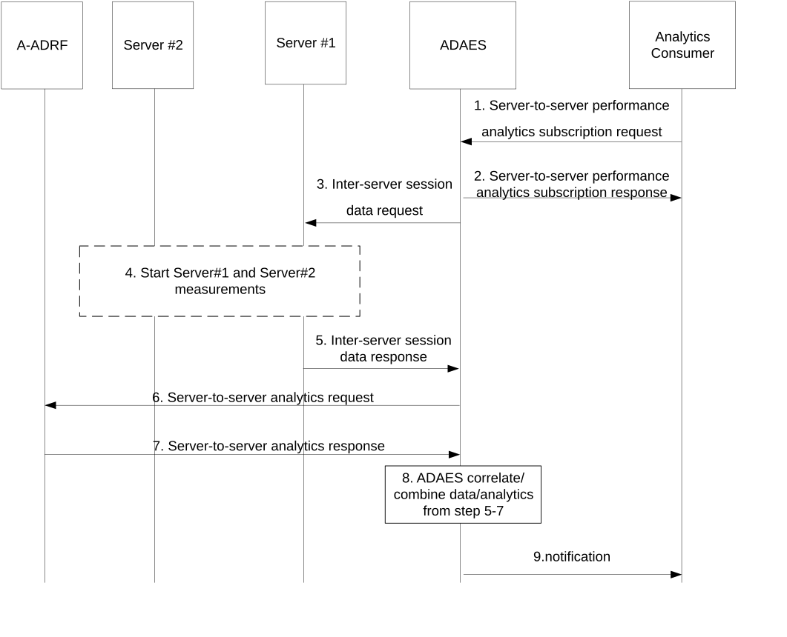

# 8.13 Procedure on support for server-to-server performance analytics

## 8.13.1 General

This clause describes the procedure for server-to-server performance analytics.

## 8.13.2 Procedure

Figure 8.13.2.1-1 illustrates the procedure for server-to-server performance analytics.

Pre-conditions:

1\. ADAES is connected to A-ADRF and the target server (server#1).

Figure 8.13.2.1-1: ADAES support for server-to-server performance analytics

1\. The analytics consumer (e.g., VAL server, EES) of the ADAE server analytics service sends a server-to-server analytics subscription request to the ADAE server. Such request can include whether the analytics notification shall be periodic or based on an expected application QoS change (in that case also the thresholds can be provided at the request)

2\. The ADAE server sends a server-to-server analytics subscription response as an ACK to the analytics consumer.

3\. The ADAE server identifies server#1 where the session performance analytics need to be performed. The ADAES server sends an Inter-server data request to server \#1. Such request includes QoS attributes to be analysed (latency, bitrate, jitter, application layer PER) based on the request in step 1.

4\. Bases on the request, measurement may be started between the server#1 and server#2. Such data can be about the latency, throughput, jitter, QoE measurements, PQI load, etc.

NOTE: How the measurement is collected is out of 3GPP scope. The measurement data can be already available in server#1 or server#2.

5\. Server#1 sends the analytics to the ADAE server in an Inter-server data response message.

6\. The ADAE server requests historical inter-server performance analytics from A-ADRF by sending a Server-to-server analytics request.

7\. Based on the request, the ADAE server receives historical inter-server performance analytics by receiving a Server-to-server analytics response from A-ADRF.

8\. The ADAE server abstracts or correlates the data/analytics from step 5-7. Based on the request in step 1, ADAES may also provide predictions for performance change.

> 9\. The ADAE server sends a server-to-server analytics notification to the analytics consumer.

## 8.13.3 Information flows

### 8.13.3.1 General

The following information flows are specified for server-to-server performance analytics based on 8.13.2.

### 8.13.3.2 Server-to-server performance analytics subscription request

Table 8.13.3.2-1 describes information elements for the server-to-server performance analytics subscription request from the analytics consumer (e.g., the VAL server, EES) to the ADAE server.

Table 8.13.3.2-1: Server-to-server performance analytics subscription request

| Information element                      | Status | Description                                                                                                                                                                                                                |
|------------------------------------------|--------|----------------------------------------------------------------------------------------------------------------------------------------------------------------------------------------------------------------------------|
| Analytics Consumer ID                    | M      | The identifier of the analytics consumer (VAL server, EES etc.).                                                                                                                                                           |
| Analytics ID                             | O      | The identifier of the analytics event. This ID can be for example “server-to-server performance analytics”.                                                                                                                |
| Analytics type                           | M      | The type of analytics for the event, e.g. statistics or predictions.                                                                                                                                                       |
| List of server identifiers and addresses | M      | Identifier of the servers, e.g. SEAL server ID, EASID, EESID, and IP address(es) for which the analytics subscription applies.                                                                                             |
| VAL service ID                           | O      | The VAL service for which the subscription applies.                                                                                                                                                                        |
| Reporting requirements                   | O      | Requirements for analytics reporting. The requirements may include for example the type and frequency of reporting (periodic or event triggered), the reporting periodicity in case of periodic, and reporting thresholds. |
| Area of Interest                         | O      | The geographical or service area for which the subscription request applies.                                                                                                                                               |
| Preferred confidence level               | O      | The level of accuracy for the analytics service (in case of prediction).                                                                                                                                                   |
| Time validity                            | O      | The time validity of the subscription request.                                                                                                                                                                             |

### 8.13.3.3 Server-to-server performance analytics subscription response

Table 8.13.3.3-1 describes information elements for the server-to-server performance analytics subscription response from the ADAE server to the analytics consumer.

Table 8.13.3.3-1: Server-to-server performance analytics subscription response

| Information element | Status | Description                                                                              |
|---------------------|--------|------------------------------------------------------------------------------------------|
| Result              | M      | The result of the analytics subscription request (positive or negative acknowledgement). |

### 8.13.3.4 Server-to-server performance analytics notification

Table 8.13.3.4-1 describes information elements for the server-to-server performance analytics notification from the ADAE server to the analytics consumer.

Table 8.13.3.4-1: Server-to-server performance analytics notification

<table>
<colgroup>
<col style="width: 33%" />
<col style="width: 16%" />
<col style="width: 50%" />
</colgroup>
<thead>
<tr class="header">
<th>Information element</th>
<th>Status</th>
<th>Description</th>
</tr>
</thead>
<tbody>
<tr class="odd">
<td>Analytics ID</td>
<td>O</td>
<td>The identifier of the analytics event. This ID can be for example “server-to-server performance analytics”.</td>
</tr>
<tr class="even">
<td>Analytics Output</td>
<td>M</td>
<td>
The predictive or statistical parameter, which can be:

- A server-to-server session predicted or expected performance change

- A server-to-server session performance sustainability over a given time horizon/area

- QoS measurements from the session (e.g. latency)
</td>
</tr>
<tr class="odd">
<td>Confidence level</td>
<td>O</td>
<td>For predictive analytics, the achieved confidence level can be provided.</td>
</tr>
</tbody>
</table>

### 8.13.3.5 Inter-server session data request

Table 8.13.3.5-1 describes information elements for the Inter-server session data request from the target server to the ADAE server.

Table 8.13.3.5-1: Inter-server session data request

| Information element                      | Status | Description                                                                                                                                                                                             |
|------------------------------------------|--------|---------------------------------------------------------------------------------------------------------------------------------------------------------------------------------------------------------|
| ADAE server ID                           | M      | The identifier of the ADAE server.                                                                                                                                                                      |
| Analytics ID                             | O      | The identifier of the analytics event. This ID can be for example “Server-to-server performance analytics”.                                                                                             |
| Analytics type                           | M      | Whether analytics event is about prediction or statistics.                                                                                                                                              |
| List of server identifiers and addresses | M      | Identifier of the servers, e.g. SEAL server ID, EASID, EESID, and IP address(es) for which the analytics subscription applies.                                                                          |
| QoS attributes                           | M      | The QoS attributes (latency, bitrate, jitter, application layer PER) to be collected.                                                                                                                   |
| Data collection requirements             | O      | The requirements for data collection, including the format of data, level of abstraction of data, level of accuracy of data, if the measurements should be from real-time measurements or offline data. |
| Time validity                            | O      | The time validity of the request.                                                                                                                                                                       |

### 8.13.3.6 Inter-server session data response

Table 8.13.3.6-1 describes information elements for the Inter-server session data response from the ADAE server to the target server.

Table 8.13.3.6-1: Inter-server session data response

| Information element                      | Status | Description                                                                                                                                                            |
|------------------------------------------|--------|------------------------------------------------------------------------------------------------------------------------------------------------------------------------|
| Results                                  | M      | The result of the analytics data request (positive or negative acknowledgement).                                                                                       |
| Analytics ID                             | O      | The identifier of the analytics event.                                                                                                                                 |
| List of server identifiers and addresses | O      | Identifier of the servers, e.g. SEAL server ID, EASID, EESID, and IP address(es) for which the analytics subscription applies.                                         |
| Data Output                              | O      | The reported data for the server-to server sessions, which can be in form of offline stats/historical data or real-time measurements on the requested QoS parameters.. |

### 8.13.3.7 Server-to-server analytics request

Table 8.13.3.7-1 describes information elements for the server-to-server analytics request from the ADAE server to the A-ADRF.

Table 8.13.3.7-1: Server-to-server analytics request

| Information element                      | Status | Description                                                                                                 |
|------------------------------------------|--------|-------------------------------------------------------------------------------------------------------------|
| ADAE server ID                           | M      | The identifier of the ADAE server.                                                                          |
| Analytics ID                             | M      | The identifier of the analytics event.                                                                      |
| List of server identifiers and addresses | M      | Identifier of the servers, e.g. SEAL server ID, EASID, EESID, for which the analytics subscription applies. |
| QoS attributes                           | M      | The QoS attributes (latency, bitrate, jitter, application layer PER) to be collected.                       |
| Time validity                            | O      | The time validity of the request.                                                                           |

### 8.13.3.8 Server-to-server analytics response

Table 8.13.3.8-1 describes information elements for the server-to-server analytics response from the A-ADRF to the ADAE server.

Table 8.13.3.8-1: Server-to-server analytics response

| Information element                      | Status | Description                                                                                                                                                                                   |
|------------------------------------------|--------|-----------------------------------------------------------------------------------------------------------------------------------------------------------------------------------------------|
| Analytics ID                             | M      | The identifier of the analytics event.                                                                                                                                                        |
| List of server identifiers and addresses | M      | Identifier of the servers, e.g. SEAL server ID, EASID, EESID, for which the analytics subscription applies.                                                                                   |
| Data Output                              | M      | The reported data, which can be in form of measurements or offline/historical data on the requested QoS attributes. The reported data includes historical inter-server performance analytics. |
