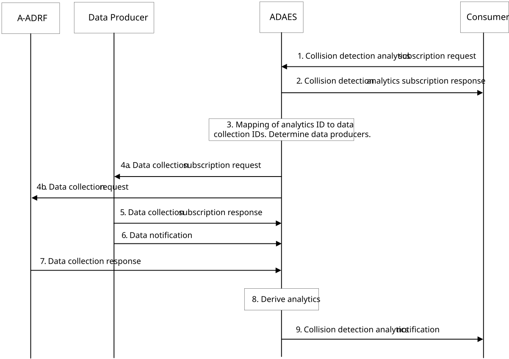
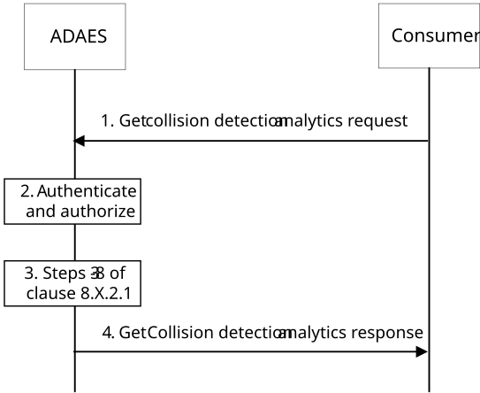

# 8.14 Procedure for Collision Detection Analytics

## 8.14.1 General

This clause describes two procedures (covering both subscribe-notify and request-response models in 8.14.2.1 and 8.14.2.2 respectively) for supporting collision detection analytics, where the collision detection analytics are performed based on data collected from the Data Producer (e.g. 5GC NFs (e.g. GMLC, NWDAF), ADAE Client, LM server, LM client, 3rd party LM server) and A-ADRF.

## 8.14.2 Procedure

### 8.14.2.1 Subscribe-notify model

Pre-conditions:

\- Information about environment, e.g. static devices, are available from the 3rd party LM server.

\- The location information about the UEs is available at SEAL LM server and/or LM client.

\- The Ranging/Sidelink Positioning information exposure of the UEs is allowed at 5GC.

Figure 8.14.2.1-1: ADAES support for collision detection analytics

1\. The analytics consumer (e.g. VAL Server, LM server, UAE server, UAS application specific server) sends collision detection analytics subscription request to ADAE server. The Analytics ID in the request message is set to "Collision detection analytics for target UE(s)" or "Collision detection analytics for any UEs". For analytics subscription request, the request contains message as defined in table 8.14.3.2-1.

2\. Upon receiving the event subscription request from the consumer, the ADAE server checks for the relevant authorization for the event subscription. If the authorization is successful, the ADAE server stores the request information. The ADAE server sends a service API event subscription response indicating successful subscription.

3\. The ADAES maps the analytics event ID to a list of data collection event identifiers, and a list of data producer IDs. Such mapping may be preconfigured by OAM or may be determined by ADAES based on the analytics event type/vertical type and/or data producer profile.

4\. The ADAE server sends data collection subscription request to the Data Producer (e.g. 5GC NFs (e.g. GMLC, NWDAF), ADAE Client, LM server, LM client, 3rd party LM server) and a data collection request to the Data Producer (e.g. A-ADRF for historical data) with the respective Data Collection Event ID and the requirement for collection of ranging and/or sidelink positioning related data or analytics of UEs, and location information of UEs. Data collection at the UE(s) reuses mechanism defined in 3GPP TS 26.531 \[3\].

5\. The Data Producer sends data collection subscription response as a positive or negative acknowledgement to the ADAE server.

6\. The ADAE server based on data collection subscription receive ranging and/or sidelink positioning related data/analytics of UEs and location information of UEs from the Data Producer (e.g. 5GC NFs (e.g. GMLC, NWDAF), ADAE Client, LM server, LM client, 3rd party LM server).

NOTE: The procedures for UE related data collection need to take user consent into account.

7\. The ADAE server based on data collection request receive ranging and/or sidelink positioning related historical data of UEs from Data Producer (e.g. A-ADRF).

8\. The ADAE server performs analytics relevant operations to generate the analytics for the collision detection between any target VAL UEs, collision detection between any UEs and target VAL UEs, or collision detection between any UE within the Area of Interest and based on the request provided in step 1 and the data/analytics received from the Data Producer (e.g. 5GC NFs (e.g. GMLC, NWDAF), ADAE Client, LM server, LM client, 3rd party LM server, A-ADRF for historical data).

9\. The ADAE server sends collision detection analytics notifications to the consumer with the required collision detection analytics. The notification contains message as defined in table 8.14.3.4-1.

### 8.14.2.2 Request-response model

Pre-conditions:

\- ADAE Server already have the analytics data derived from steps 3-6 in the procedure introduced in clause 8.14.2.1.

Figure 8.14.2.2-1: ADAES support for collision detection analytics

1\. The analytics consumer (e.g. VAL Server, LM Server, UAE server, UAS application specific server) sends a get collision detection analytics request message to the ADAE server to receive analytics data for collision detection analytics with Analytics ID in the request message setting to "Collision detection analytics for target UE(s)" or "Collision detection analytics for any UEs". The request contains message as defined in table 8.14.3.8-1.

2\. Upon receiving the request, the ADAE server authenticates and authorizes the analytics consumer.

3\. If the analytics consumer is authorized, the ADAE server may get the analytics by performing steps 3 to 8 of clause 8.14.2.1.

4\. If the analytics consumer is authorized, the ADAE server sends a get collision detection analytics response message including the analytics data (statistical and/or predictive) of the collision detection analytics as defined in table 8.14.3.9-1.

## 8.14.3 Information flows

### 8.14.3.1 General

The following information flows are specified for collision detection analytics based on clause 8.14.2.

### 8.14.3.2 Collision detection analytics subscription request

Table 8.14.3.2-1 describes the information flow from the consumer (e.g. VAL Server, LM Server, UAE server, UAS application specific server) as a request or update request for the collision detection analytics.

Table 8.14.3.2-1: Collision detection analytics subscription request

<table>
<colgroup>
<col style="width: 33%" />
<col style="width: 16%" />
<col style="width: 50%" />
</colgroup>
<tbody>
<tr class="odd">
<td>Information element</td>
<td>Status</td>
<td>Description</td>
</tr>
<tr class="even">
<td>Requestor ID</td>
<td>
M

(NOTE 1)
</td>
<td>The identifier of the consumer.</td>
</tr>
<tr class="odd">
<td>Analytics ID</td>
<td>
O

(NOTE 1)
</td>
<td>The identifier of the analytics event. This ID can be for example "Collision Detection analytics for target UE(s)", "Collision Detection analytics for any UEs".</td>
</tr>
<tr class="even">
<td>Analytics type</td>
<td>M</td>
<td>The type of analytics for the event, e.g. statistics or predictions,</td>
</tr>
<tr class="odd">
<td>Analytics filter information</td>
<td>M</td>
<td>Filter information for the analytics event.</td>
</tr>
<tr class="even">
<td>&gt; Filter for Collision between interested UE(s) and target UE(s)</td>
<td>
O

(NOTE 2)
</td>
<td>The filter information for the Collision Detection analytics for target UE(s).</td>
</tr>
<tr class="odd">
<td>&gt;&gt;Target VAL UE ID(s)</td>
<td>M</td>
<td>The identifier(s) of VAL UE(s) for which the analytics subscription applies.</td>
</tr>
<tr class="even">
<td>&gt;&gt; Interested VAL UE ID(s)</td>
<td>
O

(see NOTE 3)
</td>
<td>The identifier(s) of a list of the interested UE(s) collision with that shall be analysed.</td>
</tr>
<tr class="odd">
<td>&gt;&gt;Target VAL server ID</td>
<td>O</td>
<td>If consumer is different from the VAL server, this identifier shows the target VAL server for which the analytics subscription applies.</td>
</tr>
<tr class="even">
<td>&gt;&gt;Area of Interest</td>
<td>
O

(see NOTE 3)
</td>
<td>The geographical or service area for which the subscription request applies.</td>
</tr>
<tr class="odd">
<td>&gt; Filter for Collision detection between any UE(s)</td>
<td>
O

(NOTE 2)
</td>
<td>The filter information for the Collision Detection analytics for any UE(s) in an area.</td>
</tr>
<tr class="even">
<td>&gt;&gt;Target VAL server ID</td>
<td>O</td>
<td>If consumer is different from the VAL server, this identifier shows the target VAL server for which the analytics subscription applies.</td>
</tr>
<tr class="odd">
<td>&gt;&gt;Area of Interest</td>
<td>M</td>
<td>The geographical or service area for which the subscription request applies.</td>
</tr>
<tr class="even">
<td>Collision detection criteria</td>
<td>O</td>
<td>The parameters for collision detection analytics apply.</td>
</tr>
<tr class="odd">
<td>&gt;Distance</td>
<td>O</td>
<td>The allowed minimum distance between UEs. The collision is detected if the distance between the UEs is less than the provided value.</td>
</tr>
<tr class="even">
<td>Reporting requirements</td>
<td>O</td>
<td>It describes the requirements for analytics reporting. This requirement may include e.g. the type and frequency of reporting (periodic or event triggered), the reporting periodicity in case of periodic, and reporting thresholds in case of event triggered.</td>
</tr>
<tr class="odd">
<td>Preferred confidence level</td>
<td>O</td>
<td>The level of accuracy for the analytics service (in case of prediction).</td>
</tr>
<tr class="even">
<td>Time validity</td>
<td>O</td>
<td>The time validity of the subscription request.</td>
</tr>
<tr class="odd">
<td colspan="3">
NOTE 1: This information element shall not be updated.

NOTE 2: One of the elements shall be provided.

NOTE 3: If the IE "Filter for Collision between the interested UE(s) and target UE(s)" is present, at least one of the elements shall be provided.
</td>
</tr>
</tbody>
</table>

### 8.14.3.3 Collision detection analytics subscription response

Table 8.14.3.3-1 describes the information elements for the collision detection analytics subscription response from the ADAE server to the consumer.

Table 8.14.3.3-1: Collision detection analytics subscription response

|                     |        |                                                                                          |
|---------------------|--------|------------------------------------------------------------------------------------------|
| Information element | Status | Description                                                                              |
| Result              | M      | The result of the analytics subscription request (positive or negative acknowledgement). |

### 8.14.3.4 Collision detection analytics notification

Table 8.14.3.4-1 describes the information flow from the ADAES to the consumer (e.g. VAL Server, LM Server, UAE server, UAS application specific server) as a response for the collision detection analytics.

Table 8.14.3.4-1: Collision detection analytics notification

<table>
<colgroup>
<col style="width: 33%" />
<col style="width: 16%" />
<col style="width: 50%" />
</colgroup>
<tbody>
<tr class="odd">
<td>Information element</td>
<td>Status</td>
<td>Description</td>
</tr>
<tr class="even">
<td>Analytics ID</td>
<td>M</td>
<td>The identifier of the analytics event. This ID can be for example "Collision Detection analytics for target UE(s)", "Collision Detection analytics for any UEs".</td>
</tr>
<tr class="odd">
<td>Outputs for Collision between any UE(s) and target UE(s)</td>
<td>
O

(see NOTE)
</td>
<td>The analytics (predictive or statistical parameter) for Collision Detection analytics for target UE(s).</td>
</tr>
<tr class="even">
<td>&gt; List of target VAL UE(s)</td>
<td>M</td>
<td>The analytics outputs of the list of target VAL UE(s).</td>
</tr>
<tr class="odd">
<td>&gt;&gt;Target VAL UE ID</td>
<td>M</td>
<td>The identifier of target VAL UE for which the analytics outputs apply.</td>
</tr>
<tr class="even">
<td>&gt;&gt;Potential collision VAL UE ID(s)</td>
<td>M</td>
<td>The identifier(s) of the potential collision VAL UE(s) for which the analytics outputs apply.</td>
</tr>
<tr class="odd">
<td>&gt;&gt;Time of potential collisions</td>
<td>M</td>
<td>Time of the potential collisions between the target UE and the UEs.</td>
</tr>
<tr class="even">
<td>&gt;&gt;Location of potential collisions</td>
<td>M</td>
<td>Location of the potential collisions between the target UE and the UEs.</td>
</tr>
<tr class="odd">
<td>&gt;&gt;Direction of moving</td>
<td>O</td>
<td>Direction of the target UE and the UEs moving.</td>
</tr>
<tr class="even">
<td>&gt;&gt;Velocity of moving</td>
<td>O</td>
<td>Velocity of the target UE and the UEs moving.</td>
</tr>
<tr class="odd">
<td>&gt;&gt;Confidence level</td>
<td>O</td>
<td>For predictive analytics, the achieved confidence level can be provided.</td>
</tr>
<tr class="even">
<td>Outputs for Collision between any UE(s)</td>
<td>
O

(NOTE)
</td>
<td>The analytics (predictive or statistical parameter) for Collision Detection analytics for any UEs.</td>
</tr>
<tr class="odd">
<td>&gt;Potential collision VAL UE ID(s)</td>
<td>M</td>
<td>The identifier(s) of the potential collision VAL UE(s) for which the analytics outputs apply.</td>
</tr>
<tr class="even">
<td>&gt;Time of potential collisions</td>
<td>M</td>
<td>Time of the potential collisions between the UEs.</td>
</tr>
<tr class="odd">
<td>&gt;Location of potential collisions</td>
<td>M</td>
<td>Location of the potential collisions between the UEs.</td>
</tr>
<tr class="even">
<td>&gt;Confidence level</td>
<td>O</td>
<td>For predictive analytics, the achieved confidence level can be provided.</td>
</tr>
<tr class="odd">
<td colspan="3">NOTE: One of the elements shall be provided.</td>
</tr>
</tbody>
</table>

### 8.14.3.5 Ranging/SL positioning data and location information collection subscription request

Table 8.14.3.5-1 describes information elements for the Ranging/SL positioning data and location information collection subscription request from the ADAE server to the Data Producer, e.g. 5GC NFs (e.g. GMLC, NWDAF), ADAE Client, LM server, LM client, 3rd party LM server, A-ADRF for historical data.

Table 8.14.3.5-1: Data collection subscription request

| Information element                     | Status | Description                                                                                                                                          |
|-----------------------------------------|--------|------------------------------------------------------------------------------------------------------------------------------------------------------|
| Requestor ID                            | M      | The identifier of the consumer.                                                                                                                      |
| Data Collection Event ID                | M      | The identifier of the data collection event                                                                                                          |
| Data Collection requirements            | M      | The requirements for data collection, including the format of data, frequency of reporting, level of abstraction of data, level of accuracy of data. |
| Analytics ID                            | O      | The identifier of the analytics event, for which the data collection is needed.                                                                      |
| List of Data Producer IDs               | O      | In case when this request is performed via A-DCCF, then the list of Data Producer IDs is needed.                                                     |
| \>Target data producer profile criteria | O      | Characteristics of the data producers to be used.                                                                                                    |
| \>VAL UE IDs                            | O      | The VAL UE(s) identifiers for which the data/analytics apply.                                                                                        |
| Area of Interest                        | O      | The geographical or service area for which the requirement request applies.                                                                          |
| Time validity                           | O      | The time validity of the request.                                                                                                                    |

### 8.14.3.6 Ranging/SL positioning data and location information collection subscription response

Table 8.14.3.6-1 describes information elements for the Data collection subscription response from the Data Producer, e.g. 5GC NFs (e.g. GMLC, NWDAF), ADAE Client, LM server, LM client, 3rd party LM server, A-ADRF for historical data.

Table 8.14.3.6-1: Data collection subscription response

| Information element | Status | Description                                                                                                                                    |
|---------------------|--------|------------------------------------------------------------------------------------------------------------------------------------------------|
| Result              | M      | The result of the Ranging/SL positioning data and location information collection subscription request (positive or negative acknowledgement). |

### 8.14.3.7 Data Notification

Table 8.14.3.7-1 describes information elements for the Data Notification from the Data Producer to the ADAE server.

Table 8.14.3.7-1: Data notification

| Information element      | Status | Description                                                                                                                                                                                                                                                                                                                                                                                                                                                                |
|--------------------------|--------|----------------------------------------------------------------------------------------------------------------------------------------------------------------------------------------------------------------------------------------------------------------------------------------------------------------------------------------------------------------------------------------------------------------------------------------------------------------------------|
| Data Collection Event ID | M      | The identifier of the data collection event.                                                                                                                                                                                                                                                                                                                                                                                                                               |
| Data Producer ID         | M      | The identity of Data Producer.                                                                                                                                                                                                                                                                                                                                                                                                                                             |
| Analytics ID             | O      | The identifier of the analytics event.                                                                                                                                                                                                                                                                                                                                                                                                                                     |
| Data Type                | M      | The type of reported data samples which can be network data, application data, edge data, or different granularities / abstraction of data (e.g. real time, non-real time). This also indicates whether data are offline (from A-ADRF or not).                                                                                                                                                                                                                             |
| Data Output              | M      | The reported data, which can be inform of measurements or offline/historical data on the requested parameter based on subscription. Such data can be ranging/sidelink positioning information of UEs, location information of UEs (moving devices like UAS devices, V2X devices, robots, and/or people with UE), and the location information about environment (static devices like infrastructures) for a given time and area of interest, Relative Proximity analytics. |

### 8.14.3.8 Get analytics data request

Table 8.14.3.8-1 describes information elements for the collision detection analytics request from the analytics consumer to the ADAE server.

Table 8.14.3.8-1: Get analytics data request

<table>
<colgroup>
<col style="width: 33%" />
<col style="width: 16%" />
<col style="width: 50%" />
</colgroup>
<tbody>
<tr class="odd">
<td>Information element</td>
<td>Status</td>
<td>Description</td>
</tr>
<tr class="even">
<td>Requestor ID</td>
<td>M</td>
<td>The identifier of the consumer.</td>
</tr>
<tr class="odd">
<td>Analytics ID</td>
<td>O</td>
<td>The identifier of the analytics event. This ID can be for example "Collision Detection analytics for target UE(s)" , "Collision Detection analytics for any UEs".</td>
</tr>
<tr class="even">
<td>Analytics type</td>
<td>M</td>
<td>The type of analytics for the event, e.g. statistics or predictions.</td>
</tr>
<tr class="odd">
<td>Analytics filter information</td>
<td>M</td>
<td>Filter information for the analytics event</td>
</tr>
<tr class="even">
<td>&gt; Filter for Collision between interested UE(s) and target UE(s)</td>
<td>
O

(see NOTE 1)
</td>
<td>The filter information for the Collision Detection analytics for target UE(s).</td>
</tr>
<tr class="odd">
<td>&gt;&gt;Target VAL UE ID(s)</td>
<td>M</td>
<td>The identifier(s) of VAL UE(s) for which the request applies</td>
</tr>
<tr class="even">
<td>&gt;&gt; Interested VAL UE ID(s)</td>
<td>
O

(see NOTE 2)
</td>
<td>The identifier(s) of a list of the interested UE(s) collision with that shall be analysed.</td>
</tr>
<tr class="odd">
<td>&gt;Target VAL server ID</td>
<td>O</td>
<td>If consumer is different from the VAL server, this identifier shows the target VAL server for which the request applies.</td>
</tr>
<tr class="even">
<td>&gt;Area of Interest</td>
<td>
O

(see NOTE 2)
</td>
<td>The geographical or service area for which the subscription request applies</td>
</tr>
<tr class="odd">
<td>&gt; Filter for Collision detection between any UE(s)</td>
<td>
O

(see NOTE 1)
</td>
<td>The filter information for the Collision Detection analytics for any UE(s) in an area.</td>
</tr>
<tr class="even">
<td>&gt;&gt;Target VAL server ID</td>
<td>O</td>
<td>If consumer is different from the VAL server, this identifier shows the target VAL server for which the request applies.</td>
</tr>
<tr class="odd">
<td>&gt;&gt;Area of Interest</td>
<td>M</td>
<td>The geographical or service area for which the request applies.</td>
</tr>
<tr class="even">
<td>Collision detection criteria</td>
<td>O</td>
<td>The parameters for collision detection analytics apply.</td>
</tr>
<tr class="odd">
<td>&gt;Distance</td>
<td>O</td>
<td>The allowed minimum distance between UEs.</td>
</tr>
<tr class="even">
<td>Preferred confidence level</td>
<td>O</td>
<td>The level of accuracy for the analytics service (in case of prediction).</td>
</tr>
<tr class="odd">
<td>Time duration</td>
<td>O</td>
<td>Time duration since when analytics data is required.</td>
</tr>
<tr class="even">
<td colspan="3">
NOTE 1: One of the elements shall be provided.

NOTE 2: If the IE "Filter for Collision between any UE(s) and target UE(s)" is present, at least one of the elements shall be provided.
</td>
</tr>
</tbody>
</table>

### 8.14.3.9 Get analytics data response

Table 8.14.3.9-1 describes information elements for the Get collision detection analytics response from the ADAE server to the consumer.

Table 8.14.3.9-1: Get analytics response

<table>
<colgroup>
<col style="width: 33%" />
<col style="width: 16%" />
<col style="width: 50%" />
</colgroup>
<thead>
<tr class="header">
<th>Information element</th>
<th>Status</th>
<th>Description</th>
</tr>
</thead>
<tbody>
<tr class="odd">
<td>Analytics ID</td>
<td>O</td>
<td>The identifier of the analytics event. This ID can be for example "Collision Detection analytics for target UE(s)", "Collision Detection analytics for any UEs"".</td>
</tr>
<tr class="even">
<td>Outputs for Collision between any UE(s) and target UE(s)</td>
<td>
O

(see NOTE)
</td>
<td>The analytics (predictive or statistical parameter) for Collision Detection analytics for target UE(s).</td>
</tr>
<tr class="odd">
<td>&gt; List of target VAL UE(s)</td>
<td>M</td>
<td>The analytics outputs of the list of target VAL UE(s).</td>
</tr>
<tr class="even">
<td>&gt;&gt;Target VAL UE ID</td>
<td>M</td>
<td>The identifier of target VAL UE for which the analytics outputs apply.</td>
</tr>
<tr class="odd">
<td>&gt;&gt;Potential collision VAL UE ID(s)</td>
<td>M</td>
<td>The identifier(s) of the potential collision VAL UE(s) for which the analytics outputs apply.</td>
</tr>
<tr class="even">
<td>&gt;&gt;Time of potential collisions</td>
<td>M</td>
<td>Time of the potential collisions between the UEs.</td>
</tr>
<tr class="odd">
<td>&gt;&gt;Location of potential collisions</td>
<td>M</td>
<td>Location of the potential collisions between the UEs.</td>
</tr>
<tr class="even">
<td>&gt;&gt;Direction of moving</td>
<td>O</td>
<td>Direction of the UEs moving.</td>
</tr>
<tr class="odd">
<td>&gt;&gt;Velocity of moving</td>
<td>O</td>
<td>Velocity of the UEs moving.</td>
</tr>
<tr class="even">
<td>&gt;&gt;Timestamp</td>
<td>O</td>
<td>Time stamp of the collected analytics data.</td>
</tr>
<tr class="odd">
<td>&gt;&gt;Confidence level</td>
<td>O</td>
<td>For predictive analytics, the achieved confidence level can be provided.</td>
</tr>
<tr class="even">
<td>Outputs for Collision between any UE(s)</td>
<td>
O

(see NOTE)
</td>
<td>The analytics (predictive or statistical parameter) for Collision Detection analytics for any UEs.</td>
</tr>
<tr class="odd">
<td>&gt;Potential collision VAL UE ID(s)</td>
<td>M</td>
<td>The identifier(s) of the potential collision VAL UE(s) for which the analytics outputs apply.</td>
</tr>
<tr class="even">
<td>&gt;Time of potential collisions</td>
<td>M</td>
<td>Time of the potential collisions between the UEs.</td>
</tr>
<tr class="odd">
<td>&gt;Location of potential collisions</td>
<td>M</td>
<td>Location of the potential collisions between the UEs.</td>
</tr>
<tr class="even">
<td>&gt;Timestamp</td>
<td>O</td>
<td>Time stamp of the collected analytics data.</td>
</tr>
<tr class="odd">
<td>&gt;Confidence level</td>
<td>O</td>
<td>For predictive analytics, the achieved confidence level can be provided.</td>
</tr>
<tr class="even">
<td colspan="3">NOTE: One of the elements shall be provided.</td>
</tr>
</tbody>
</table>
