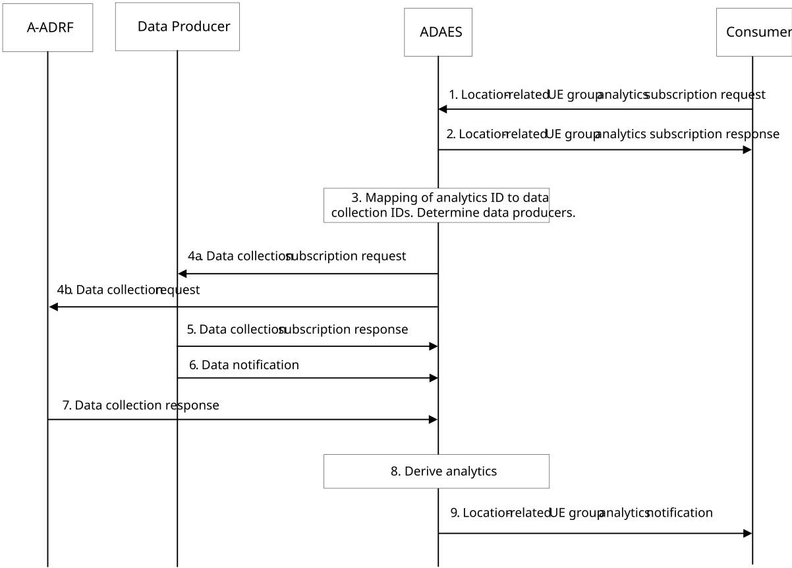
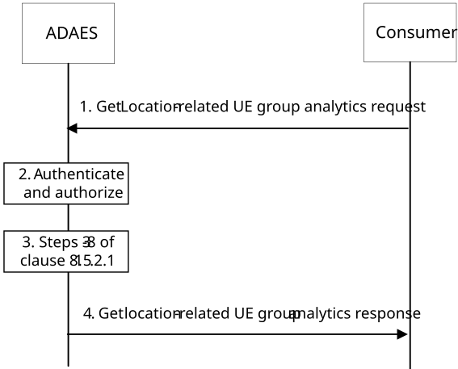

# 8.15 Procedure for Location-related UE Group Analytics

## 8.15.1 General

This clause describes two procedures (covering both subscribe-notify and request-response models in 8.15.2.1 and 8.15.2.2 respectively) for supporting location-related UE group analytics, where the location-related UE group analytics are performed based on data collected from the Data Producer (e.g. 5GC NFs (e.g. GMLC (via NEF), NWDAF), ADAE Client, LM server) and A-ADRF.

## 8.15.2 Procedure

### 8.15.2.1 Subscribe-notify model

Pre-conditions:

\- The location information about the UEs is available at SEAL LM server.

\- The location information of the UEs exposure is allowed at 5GC.

\- The location information about the AIoT devices is available at AIoT enablement (AIOTE) server.

Figure 8.15.2.1-1: ADAES support for location-related UE group analytics

1\. The analytics consumer (e.g. LMS, AIoTE server) sends location-related UE group analytics subscription request to ADAE server. The Analytics ID in the request message is set to "UE group route analytics" or "UE group member deviation". For analytics subscription request, the request contains message as defined in table 8.15.3.2-1.

2\. Upon receiving the event subscription request from the consumer, the ADAE server checks for the relevant authorization for the event subscription. If the authorization is successful, the ADAE server stores the request information. The ADAE server sends a service API event subscription response indicating successful subscription.

3\. The ADAES maps the analytics event ID to a list of data collection event identifiers, and a list of data producer IDs. Such mapping may be preconfigured by OAM or may be determined by ADAES based on the analytics event type/vertical type and/or data producer profile.

4\. The ADAE server sends a data collection subscription request to the Data Producer (e.g. 5GC NFs (e.g. GMLC (via NEF), NWDAF), ADAE Client, LM server) and a data collection request to the Data Producer (e.g. A-ADRF for historical data) with the respective Data Collection Event ID and the requirement for collection location related data/analytics of UEs. Data collection at the UE(s) reuses the mechanism defined in 3GPP TS 26.531 \[3\].

NOTE 1: If the analytics consumer is AIoTE server, it will send the obtained AIoT device location information to the ADAE server which does not need to send a data collection subscription request to the Data Producer (e.g. 5GC) to query the AIoT device location data.

5\. The Data Producer sends data collection subscription response as a positive or negative acknowledgement to the ADAE server.

6\. The ADAE server based on data collection subscription receives location related data/analytics of UEs from the Data Producer (e.g. 5GC NFs (e.g. GMLC (via NEF), NWDAF), ADAE Client, LM server).

7\. The ADAE server based on data collection request receives location related historical data of UEs from the Data Producer (e.g. A-ADRF).

NOTE 2: The procedures for UE location information collection need to take user consent into account.

8\. The ADAE server performs analytics relevant operations to generate the analytics based on the data received from the Data Producer (e.g. 5GC NFs (e.g. GMLC, NWDAF), ADAE Client, LM server, AIoTE server, A-ADRF for historical data). In detail, the ADAE server may generate analytics in the following ways.

\- For UE group route analytics: Inputs include the location information of UE(s) from LM server (e.g. UE's location in clause 9.3.7 of 3GPP TS 23.434 \[2\]), the analytics from NWDAF (e.g. UE mobility analytics, Movement behaviour analytics, UE communication analytics, and/or Dispersion analytics in 3GPP TS 23.288 \[4\]). For example, UE's location service from LMS allows ADAES to obtain the UE location, UE mobility analytics provides potential moving direction of the UE(s), Dispersion analytics gives ADAES information on UE data volume dispersion predictions, etc., by combining all the information collected, predictions on UE group route can be generated.

\- For UE group member deviation analytics: Inputs include the Ranging/Sidelink Positioning location information of the UE group member from GMLC (via NEF) (e.g. Ranging/Sidelink Positioning location results in clause 6.20 of 3GPP TS 23.273 \[18\]), location information of the UE group member from LM server (e.g. UE's location in clause 9.3.7 of 3GPP TS 23.434 \[2\]), the location information of group of AIoT devices from the AIoTE server (e.g., AIoT devices’ location specified in clause 7.5.2 of 3GPP TS 23.370 \[22\]) and the analytics from NWDAF (e.g. UE mobility analytics, Movement behaviour analytics, Relative Proximity analytics, and/or Abnormal behaviour analytics in 3GPP TS 23.288 \[4\]) of this UE group member. The ADAE server can aggregate the collected information (e.g. distance between UEs from the Ranging/Sidelink Positioning location information service, predictions on distance between UEs from the Relative Proximity analytics, etc.) and derive which UE group member is deviating (or will deviate) from other group member(s) or target group member (e.g. UE's ranging information with any other UE(s) in a group is larger than a threshold, and such trend shows longer and longer ranging within a time period, the UE moving direction is different from any other UE(s) in a group or target group member, or the UE moving path is different from the planned location route).

9\. The ADAE server sends location-related UE group analytics notifications to the consumer (e.g., LMS, AIoTE server) with the required location-related UE group analytics.

### 8.15.2.2 Request-response model

Pre-conditions:

\- ADAE Server already has the analytics data derived from steps 3-6 in the procedure introduced in clause 8.15.2.1.

Figure 8.15.2.2-1: ADAES support for location-related UE group analytics

1\. The analytics consumer (i.e. LMS) sends a get location-related UE group analytics request message to the ADAE server to receive analytics data for location-related UE group analytics with Analytics ID in the request message setting to "UE group route analytics" or "UE group member deviation". The request contains message as defined in table 8.15.3.8-1.

2\. Upon receiving the request, the ADAE server authenticates and authorizes the analytics consumer.

3\. If the analytics consumer is authorized, the ADAE server may get the analytics by performing steps 3 to 8 of clause 8.15.2.1.

4\. If the analytics consumer is authorized, the ADAE server sends a get location-related UE group analytics response message including the analytics data (statistical and/or predictive) of the location-related UE group analytics.

## 8.15.3 Information flows

### 8.15.3.1 General

The following information flows are specified for location-related UE group analytics based on clause 8.15.2.

### 8.15.3.2 Location-related UE group analytics subscription request

Table 8.15.3.2-1 describes the information flow from the consumer (e.g., LMS, AIoTE server) as a request or update request for the location-related UE group analytics.

Table 8.15.3.2-1: Location-related UE group analytics subscription request

<table>
<colgroup>
<col style="width: 33%" />
<col style="width: 16%" />
<col style="width: 50%" />
</colgroup>
<tbody>
<tr class="odd">
<td>Information element</td>
<td>Status</td>
<td>Description</td>
</tr>
<tr class="even">
<td>Requestor ID</td>
<td>
M

(NOTE 1)
</td>
<td>The identifier of the consumer.</td>
</tr>
<tr class="odd">
<td>Analytics ID</td>
<td>
O

(NOTE 1)
</td>
<td>The identifier of the analytics event. This ID can be for example "UE group route analytics" or "UE group member deviation analytics".</td>
</tr>
<tr class="even">
<td>Analytics type</td>
<td>M</td>
<td>The type of analytics for the event, e.g. statistics or predictions,</td>
</tr>
<tr class="odd">
<td>Analytics filter information</td>
<td>M</td>
<td>Filter information for the analytics event.</td>
</tr>
<tr class="even">
<td>&gt;Application Group ID</td>
<td>
O

(NOTE 2)
</td>
<td>Application group identifier for which the analytics subscription applies.</td>
</tr>
<tr class="odd">
<td>&gt;Target VAL UE ID(s)</td>
<td>
O

(NOTE 2)
</td>
<td>The identifier(s) of the VAL UE(s) for which the analytics subscription applies.</td>
</tr>
<tr class="even">
<td>&gt;Area of Interest</td>
<td>O</td>
<td>The geographical or service area for which the subscription request applies.</td>
</tr>
<tr class="odd">
<td>&gt;Application Group profile(s)</td>
<td>O</td>
<td>Information about the Application Group(s) with common EAS (as defined in 3GPP TS 23.558 [14] Table 8.15.11-1).</td>
</tr>
<tr class="even">
<td>&gt;Deviation</td>
<td>O</td>
<td>Deviation information, e.g. different moving direction or moving speed, distance with the target group member UE larger than a threshold, different from the planned information.</td>
</tr>
<tr class="odd">
<td>&gt;&gt;Target Group member UE ID</td>
<td>O</td>
<td>The identifier of the target group member UE.</td>
</tr>
<tr class="even">
<td>&gt;&gt;Planned information</td>
<td>O</td>
<td>Indicate the planned information (e.g.planned location route) for the target VAL UE(s).</td>
</tr>
<tr class="odd">
<td>&gt;&gt;Deviation criteria</td>
<td>O</td>
<td>The criteria used for detecting deviation of group member UE, e.g. distance, moving direction, moving speed, planned information.</td>
</tr>
<tr class="even">
<td>Reporting requirements</td>
<td>O</td>
<td>It describes the requirements for analytics reporting. This requirement may include e.g. the type and frequency of reporting (periodic or event triggered), the reporting periodicity in case of periodic, and reporting thresholds.</td>
</tr>
<tr class="odd">
<td>Preferred confidence level</td>
<td>O</td>
<td>The level of accuracy for the analytics service (in case of prediction).</td>
</tr>
<tr class="even">
<td>Time validity</td>
<td>O</td>
<td>The time validity of the subscription request.</td>
</tr>
<tr class="odd">
<td colspan="3">
NOTE 1: This information element shall not be updated.

NOTE 2: One of the elements shall be provided.
</td>
</tr>
</tbody>
</table>

### 8.15.3.3 Location-related UE group analytics subscription response

Table 8.15.3.3-1 describes the information elements for the location-related UE group analytics subscription response from the ADAE server to the consumer.

Table 8.15.3.3-1: Location-related UE group analytics subscription response

|                     |        |                                                                                          |
|---------------------|--------|------------------------------------------------------------------------------------------|
| Information element | Status | Description                                                                              |
| Result              | M      | The result of the analytics subscription request (positive or negative acknowledgement). |

### 8.15.3.4 Location-related UE group analytics notification

Table 8.15.3.4-1 describes the information flow from the ADAES to the consumer (LM Server) as a response for the location-related UE group analytics.

Table 8.15.3.4-1: Location-related UE group analytics notification

<table>
<colgroup>
<col style="width: 33%" />
<col style="width: 16%" />
<col style="width: 50%" />
</colgroup>
<tbody>
<tr class="odd">
<td>Information element</td>
<td>Status</td>
<td>Description</td>
</tr>
<tr class="even">
<td>Analytics ID</td>
<td>M</td>
<td>The identifier of the analytics event. This ID can be for example "UE group route analytics" or "UE group member deviation analytics".</td>
</tr>
<tr class="odd">
<td>Outputs for UE group route</td>
<td>
O

(NOTE 1)
</td>
<td>The reported analytics for UE group route analytics apply.</td>
</tr>
<tr class="even">
<td>&gt;List of EAS ID(s)</td>
<td>M</td>
<td>List of identifiers of EAS.</td>
</tr>
<tr class="odd">
<td>&gt;&gt;EAS ID(s)</td>
<td>O</td>
<td>Identifier(s) of EAS(s).</td>
</tr>
<tr class="even">
<td>&gt;&gt;Route ID</td>
<td>M</td>
<td>The identifier of the common route for the UE(s) to EAS(s).</td>
</tr>
<tr class="odd">
<td>&gt;&gt;VAL UE ID(s)</td>
<td>M</td>
<td>The identifiers of the VAL UE(s) which with the common route to the EAS(s).</td>
</tr>
<tr class="even">
<td>Outputs for UE group member deviation</td>
<td>
O

(NOTE 1, NOTE 2)
</td>
<td>The reported analytics for group member deviation analytics apply.</td>
</tr>
<tr class="odd">
<td>&gt;Application Group ID</td>
<td>M</td>
<td>Application group identifier.</td>
</tr>
<tr class="even">
<td>&gt;&gt;Target Group member UE ID</td>
<td>O</td>
<td>The identifier of the target group member UE.</td>
</tr>
<tr class="odd">
<td>&gt;List of VAL UE ID(s)</td>
<td>M</td>
<td>The VAL UE(s) which with different behaviour with the majority group members or the target group member.</td>
</tr>
<tr class="even">
<td>&gt;&gt;VAL UE ID</td>
<td>O</td>
<td>Identifier of the VAL UE.</td>
</tr>
<tr class="odd">
<td>&gt;&gt;Deviation</td>
<td>O</td>
<td>Detail information of deviation for the VAL UE, e.g., different moving direction or moving speed, distance with the target group member, different from the planned location route, etc.</td>
</tr>
<tr class="even">
<td>&gt;&gt;Time duration</td>
<td>O</td>
<td>The time duration of this UE deviation.</td>
</tr>
<tr class="odd">
<td>Validity Time</td>
<td>O</td>
<td>The valid time duration of the analytics.</td>
</tr>
<tr class="even">
<td>Confidence level</td>
<td>O</td>
<td>For predictive analytics, the achieved confidence level can be provided.</td>
</tr>
<tr class="odd">
<td colspan="3">
NOTE 1: One of these shall be present based on the analytics event.

NOTE 2: Statistics on UE deviation including e.g. minimum, maximum, and average UEs moving into area, moving out of area, moving speed, and distance from target group member.
</td>
</tr>
</tbody>
</table>

### 8.15.3.5 Location information collection subscription request

Table 8.15.3.5-1 describes information elements for the Ranging/SL positioning data and location information collection subscription request from the ADAE server to the Data Producer, e.g. 5GC NFs (e.g. GMLC, NWDAF), ADAE Client, LM server, A-ADRF for historical data.

Table 8.15.3.5-1: Data collection subscription request

| Information element                     | Status | Description                                                                                                                                                                     |
|-----------------------------------------|--------|---------------------------------------------------------------------------------------------------------------------------------------------------------------------------------|
| Requestor ID                            | M      | The identifier of the consumer.                                                                                                                                                 |
| Data Collection Event ID                | M      | The identifier of the data collection event                                                                                                                                     |
| Data Collection requirements            | M      | The requirements for data collection, including the format of data, frequency of reporting, level of abstraction of data, level of accuracy of data.                            |
| Analytics ID                            | O      | The identifier of the analytics event, for which the data collection is needed. This ID can be for example "UE group route analytics" or "UE group member deviation analytics". |
| List of Data Producer IDs               | O      | In case when this request is performed via A-DCCF, then the list of Data Producer IDs is needed.                                                                                |
| \>Target data producer profile criteria | O      | Characteristics of the data producers to be used.                                                                                                                               |
| \>VAL UE IDs                            | O      | The VAL UE(s) identifiers for which the data/analytics apply.                                                                                                                   |
| Area of Interest                        | O      | The geographical or service area for which the requirement request applies.                                                                                                     |
| Time validity                           | O      | The time validity of the request.                                                                                                                                               |

### 8.15.3.6 Location information collection subscription response

Table 8.15.3.6-1 describes information elements for the Data collection subscription response from the Data Producer, e.g. 5GC NFs (e.g. GMLC, NWDAF), ADAE Client, LM server, A-ADRF for historical data.

Table 8.15.3.6-1: Data collection subscription response

| Information element | Status | Description                                                                                                    |
|---------------------|--------|----------------------------------------------------------------------------------------------------------------|
| Result              | M      | The result of the location information collection subscription request (positive or negative acknowledgement). |

### 8.15.3.7 Data Notification

Table 8.15.3.7-1 describes information elements for the Data Notification from the Data Producer to the ADAE server.

Table 8.15.3.7-1: Data notification

| Information element      | Status | Description                                                                                                                                                                                                                                                                                                                                                                                                                                                                                                                                                                                                                                          |
|--------------------------|--------|------------------------------------------------------------------------------------------------------------------------------------------------------------------------------------------------------------------------------------------------------------------------------------------------------------------------------------------------------------------------------------------------------------------------------------------------------------------------------------------------------------------------------------------------------------------------------------------------------------------------------------------------------|
| Data Collection Event ID | M      | The identifier of the data collection event.                                                                                                                                                                                                                                                                                                                                                                                                                                                                                                                                                                                                         |
| Data Producer ID         | M      | The identity of Data Producer.                                                                                                                                                                                                                                                                                                                                                                                                                                                                                                                                                                                                                       |
| Analytics ID             | O      | The identifier of the analytics event. This ID can be for example "UE group route analytics" or "UE group member deviation analytics".                                                                                                                                                                                                                                                                                                                                                                                                                                                                                                               |
| Data Type                | M      | The type of reported data samples which can be network data, application data, edge data, or different granularities / abstraction of data (e.g. real time, non-real time). This also indicates whether data are offline (from A-ADRF or not).                                                                                                                                                                                                                                                                                                                                                                                                       |
| Data Output              | M      | The reported data, which can be inform of measurements or offline/historical data on the requested parameter based on subscription. Such data can be location information of UEs (moving devices like UAS devices, V2X devices, robots, and/or people with UE, static devices like infrastructures) for a given time and area of interest, measurement of UE(s) moving in or moving out of the area of interest, UE mobility analytics, Ranging/Sidelink Positioning location information of UEs, Movement behaviour analytics, UE communication analytics, Dispersion analytics, Relative Proximity analytics, and/or Abnormal behaviour analytics. |

### 8.15.3.8 Get analytics data request

Table 8.15.3.8-1 describes information elements for the location-related UE group analytics request from the analytics consumer to the ADAE server.

Table 8.15.3.8-1: Get analytics data request

<table>
<colgroup>
<col style="width: 33%" />
<col style="width: 16%" />
<col style="width: 50%" />
</colgroup>
<tbody>
<tr class="odd">
<td>Information element</td>
<td>Status</td>
<td>Description</td>
</tr>
<tr class="even">
<td>Requestor ID</td>
<td>M</td>
<td>The identifier of the consumer.</td>
</tr>
<tr class="odd">
<td>Analytics ID</td>
<td>M</td>
<td>The identifier of the analytics event. This ID can be for example "UE group route analytics" or "UE group member deviation analytics".</td>
</tr>
<tr class="even">
<td>Analytics type</td>
<td>M</td>
<td>The type of analytics for the event, e.g. statistics or predictions,</td>
</tr>
<tr class="odd">
<td>Analytics filter information</td>
<td>M</td>
<td>Filter information for the analytics event.</td>
</tr>
<tr class="even">
<td>&gt;Application Group ID</td>
<td>
O

(NOTE)
</td>
<td>Application group identifier for which the analytics subscription applies.</td>
</tr>
<tr class="odd">
<td>&gt;Target VAL UE ID(s)</td>
<td>
O

(NOTE)
</td>
<td>The identifier(s) of the VAL UE(s) for which the analytics subscription applies.</td>
</tr>
<tr class="even">
<td>&gt;Area of Interest</td>
<td>O</td>
<td>The geographical or service area for which the subscription request applies.</td>
</tr>
<tr class="odd">
<td>&gt;Application Group profile(s)</td>
<td>O</td>
<td>Information about the Application Group(s) with common EAS (as defined in 3GPP TS 23.558 [14] Table 8.15.11-1).</td>
</tr>
<tr class="even">
<td>&gt;Deviation</td>
<td>O</td>
<td>Deviation information, e.g. different moving direction or moving speed, distance with the target group member UE larger than a threshold.</td>
</tr>
<tr class="odd">
<td>&gt;&gt;Target Group member UE ID</td>
<td>O</td>
<td>The identifier of the target group member UE.</td>
</tr>
<tr class="even">
<td>&gt;&gt;Deviation criteria</td>
<td>O</td>
<td>The criteria used for detecting deviation of group member UE, e.g. distance, moving direction, moving speed.</td>
</tr>
<tr class="odd">
<td>Preferred confidence level</td>
<td>O</td>
<td>The level of accuracy for the analytics service (in case of prediction).</td>
</tr>
<tr class="even">
<td colspan="3">NOTE: One of elements shall be provided.</td>
</tr>
</tbody>
</table>

### 8.15.3.9 Get analytics data response

Table 8.15.3.9-1 describes information elements for the Get location-related UE group analytics response from the ADAE server to the consumer.

Table 8.15.3.9-1: Get analytics response

<table>
<colgroup>
<col style="width: 33%" />
<col style="width: 16%" />
<col style="width: 50%" />
</colgroup>
<thead>
<tr class="header">
<th>Information element</th>
<th>Status</th>
<th>Description</th>
</tr>
</thead>
<tbody>
<tr class="odd">
<td>Analytics ID</td>
<td>M</td>
<td>The identifier of the analytics event. This ID can be for example "UE group route analytics" or "UE group member deviation analytics".</td>
</tr>
<tr class="even">
<td>Outputs for UE group route</td>
<td>
O

(NOTE 1)
</td>
<td>The reported analytics for UE group route analytics apply.</td>
</tr>
<tr class="odd">
<td>&gt;List of EAS ID(s)</td>
<td>M</td>
<td>List of identifiers of EAS.</td>
</tr>
<tr class="even">
<td>&gt;&gt;EAS ID(s)</td>
<td>O</td>
<td>Identifier(s) of EAS(s).</td>
</tr>
<tr class="odd">
<td>&gt;&gt;Route ID</td>
<td>M</td>
<td>The identifier of the common route for the UE(s) to EAS(s).</td>
</tr>
<tr class="even">
<td>&gt;&gt;VAL UE ID(s)</td>
<td>M</td>
<td>The identifiers of the VAL UE(s) which with the common route to the EAS(s).</td>
</tr>
<tr class="odd">
<td>&gt;Timestamp</td>
<td>O</td>
<td>Time stamp of the collected analytics data.</td>
</tr>
<tr class="even">
<td>Outputs for UE group member deviation</td>
<td>
O

(NOTE 1, NOTE 2)
</td>
<td>The reported analytics for group member deviation analytics apply.</td>
</tr>
<tr class="odd">
<td>&gt;Application Group ID</td>
<td>M</td>
<td>Application group identifier.</td>
</tr>
<tr class="even">
<td>&gt;&gt;Target Group member UE ID</td>
<td>O</td>
<td>The identifier of the target group member UE.</td>
</tr>
<tr class="odd">
<td>&gt;List of VAL UE ID(s)</td>
<td>M</td>
<td>The VAL UE(s) which with different behaviour with the majority group members or the target group member.</td>
</tr>
<tr class="even">
<td>&gt;&gt;VAL UE ID</td>
<td>O</td>
<td>Identifier of the VAL UE.</td>
</tr>
<tr class="odd">
<td>&gt;&gt;Deviation</td>
<td>O</td>
<td>Detail information of deviation for the VAL UE, e.g., different moving direction or moving speed, distance with the target group member.</td>
</tr>
<tr class="even">
<td>&gt;&gt;Time duration</td>
<td>O</td>
<td>The time duration of this UE deviation.</td>
</tr>
<tr class="odd">
<td>&gt;Timestamp</td>
<td>O</td>
<td>Time stamp of the collected analytics data.</td>
</tr>
<tr class="even">
<td>Validity Time</td>
<td>O</td>
<td>The valid time duration of the analytics.</td>
</tr>
<tr class="odd">
<td>Confidence level</td>
<td>O</td>
<td>For predictive analytics, the achieved confidence level can be provided.</td>
</tr>
<tr class="even">
<td colspan="3">
NOTE 1: One of these shall be present based on the analytics event.

NOTE 2: Statistics on UE deviation including e.g. minimum, maximum, and average UEs moving into area, moving out of area, moving speed, and distance from target group member.
</td>
</tr>
</tbody>
</table>
