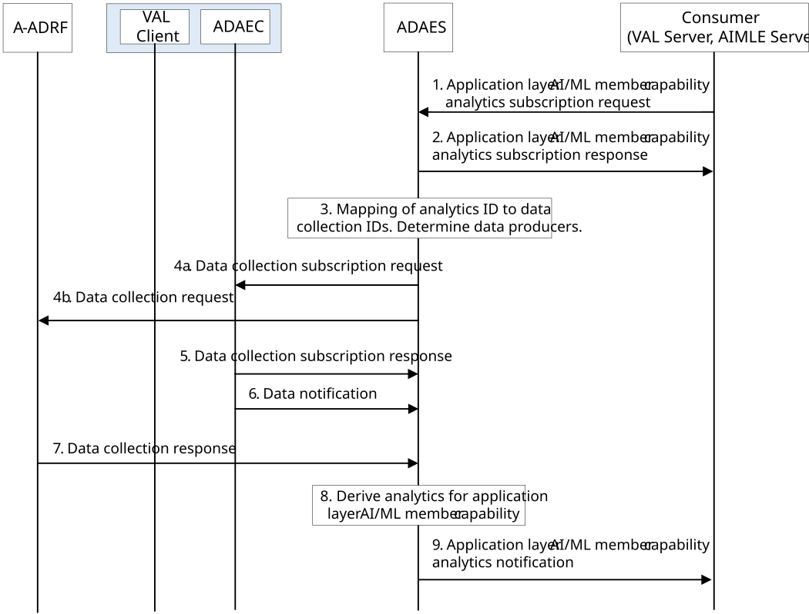
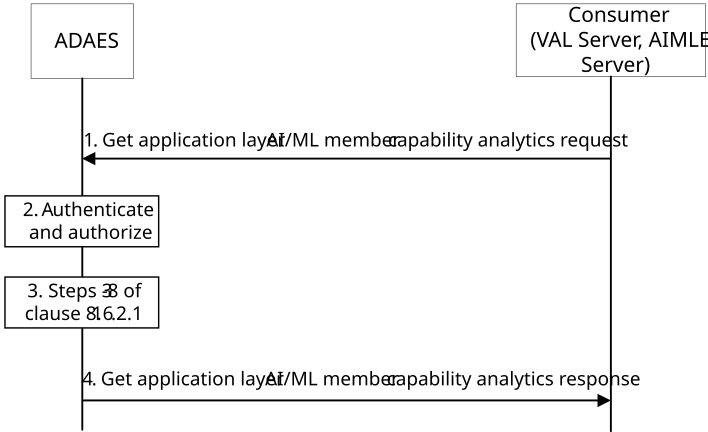

# 8.16 Procedure for Application Layer AI/ML Member Capability Analytics

## 8.16.1 General

This clause describes two procedures (covering both subscribe-notify and request-response models in 8.16.2.1 and 8.16.2.2 respectively) for supporting application layer AI/ML member capability analytics, where the application layer AI/ML member capability analytics are performed based on data collected from the Data Producer (e.g. ADAE client) and A-ADRF.

## 8.16.2 Procedure

8.16.2.1 Subscribe-notify model 

Figure 8.16.2.1-1: ADAES support for application layer AI/ML Member capability analytics

1\. The analytics consumer (e.g. VAL Server, AIMLE Server) sends application layer AI/ML member capability analytics subscription request to ADAE server. For analytics subscription request, the request contains message as defined in Table 8.16.3.2-1.

2\. Upon receiving the event subscription request from the consumer, the ADAE server checks for the relevant authorization for the event subscription. If the authorization is successful, the ADAE server stores the request information. The ADAE server sends a service API event subscription response indicating successful subscription.

3\. The ADAES maps the analytics event ID to a list of data collection event identifiers, and a list of data producer IDs. Such mapping may be preconfigured by OAM or may be determined by ADAES based on the analytics event type/vertical type and/or data producer profile.

4\. The ADAE server sends a data collection subscription request to the Data Producers (ADAE client) or a data collection request to the Data Producers (A-ADRF) with the respective Data Collection Event ID and the requirement for data collection. Data collection at the UE(s) reuses the mechanism defined in 3GPP TS 26.531 \[3\].

5\. The Data Producers (ADAE client) send data collection subscription response as a positive or negative acknowledgement to the ADAE server.

6\. The ADAE server based on data collection subscription receive data on the application layer AI/ML Member capability based on the data collection event ID from ADAE client.

7\. The ADAE server based on data collection request receive data/analytics on the application layer AI/ML Member capability based on the data/analytics collection event ID from A-ADRF.

NOTE 1: The procedures for data collection for application layer AI/ML Member capability analytics need to take user consent into account.

8\. The ADAES performs analytics relevant operations to generate the analytics based on the data/analytics received from the ADAEC.

9\. The ADAES sends application layer AI/ML member capability analytics notifications to the consumer with the required application layer AI/ML Member capability analytics.

NOTE 2: The format for the application layer AI/ML Member capability attributes will be standardized in stage 3.

### 8.16.2.2 Request-response model

Pre-conditions:

\- ADAE server already have the analytics data derived from steps 3-8 in the procedure introduced in clause 8.16.2.1.

Figure 8.16.2.2-1: ADAES support for application layer AI/ML Member capability analytics

1\. The analytics consumer (e.g. VAL Server, AIMLE Server) sends a get application layer AI/ML member capability analytics request message to the ADAE server to receive analytics data for application layer AI/ML Member capability. The request contains message as defined in Table 8.16.3.8-1.

2\. Upon receiving the request, the ADAE server authenticates and authorizes the analytics consumer.

3\. If the analytics consumer is authorized, the ADAE server may get the analytics by performing step 3 to 8 of clause 8.16.2.1.

4\. The ADAE server sends a get application layer AI/ML member capability analytics response message including the analytics data (statistical and/or predictive) of the application layer AI/ML Member capability.

## 8.16.3 Information flows

### 8.16.3.1 General

The following information flows are specified for application layer AI/ML Member capability analytics based on clause 8.16.2.

### 8.16.3.2 Application Layer AI/ML Member capability analytics subscription request

Table 8.16.3.2-1 describes the information flow from the consumer (e.g. VAL server, AIMLE server) as a request or update request for the application layer AI/ML Member capability analytics.

Table 8.16.3.2-1: Application Layer AI/ML Member capability analytics subscription request

<table>
<colgroup>
<col style="width: 33%" />
<col style="width: 16%" />
<col style="width: 50%" />
</colgroup>
<thead>
<tr class="header">
<th>Information element</th>
<th>Status</th>
<th>Description</th>
</tr>
</thead>
<tbody>
<tr class="odd">
<td>Requestor ID</td>
<td>
M

(NOTE)
</td>
<td>The identifier of the consumer.</td>
</tr>
<tr class="even">
<td>Analytics ID</td>
<td>
M

(NOTE)
</td>
<td>The identifier of the analytics event. This ID can be for example "Application layer AI/ML Member capability analytics".</td>
</tr>
<tr class="odd">
<td>Analytics type</td>
<td>M</td>
<td>The type of analytics for the event, e.g. statistics or predictions.</td>
</tr>
<tr class="even">
<td>List of VAL users or AI/ML Member IDs</td>
<td>M</td>
<td>The VAL users or AI/ML Member (s) identifiers for which the data/analytics apply.</td>
</tr>
<tr class="odd">
<td>VAL service ID</td>
<td>O</td>
<td>The identifier of the VAL service which is associated with application layer AI/ML Member capability.</td>
</tr>
<tr class="even">
<td>Application layer AI/ML Member capability attributes</td>
<td>M</td>
<td>The application layer AI/ML Member capability attributes to be analyzed at the ADAE client, e.g. communication capability (e.g. maximum/minimum number of supported active connections).</td>
</tr>
<tr class="odd">
<td>Reporting requirements</td>
<td>O</td>
<td>It describes the requirements for analytics reporting. This requirement may include e.g. the type and frequency of reporting (periodic or event triggered), the reporting periodicity in case of periodic, and reporting thresholds.</td>
</tr>
<tr class="even">
<td>Area of Interest</td>
<td>O</td>
<td>The geographical or service area for which the subscription request applies.</td>
</tr>
<tr class="odd">
<td>Preferred confidence level</td>
<td>O</td>
<td>The level of accuracy for the analytics service (in case of prediction).</td>
</tr>
<tr class="even">
<td>Time validity</td>
<td>O</td>
<td>The time validity of the subscription request.</td>
</tr>
<tr class="odd">
<td colspan="3">NOTE: This information element shall not be updated.</td>
</tr>
</tbody>
</table>

### 8.16.3.3 Application Layer AI/ML Member capability analytics subscription response

Table 8.16.3.3-1 describes the information elements for the application layer AI/ML Member capability analytics subscription response from the ADAE server to the consumer.

Table 8.16.3.3-1: Application layer AI/ML Member capability analytics subscription response

| Information element | Status | Description                                                                              |
|---------------------|--------|------------------------------------------------------------------------------------------|
| Result              | M      | The result of the analytics subscription request (positive or negative acknowledgement). |

### 8.16.3.4 Application layer AI/ML Member capability analytics notification

Table 8.16.3.4-1 describes the information flow from the ADAES to the consumer (e.g. VAL Server, AIMLE Server) as a response for the application layer AI/ML Member capability analytics.

Table 8.16.3.4-1: Application layer AI/ML Member capability analytics notification

| Information element                       | Status | Description                                                                                                                                       |
|-------------------------------------------|--------|---------------------------------------------------------------------------------------------------------------------------------------------------|
| Analytics ID                              | M      | The identifier of the analytics event. This ID can be for example "Application layer AI/ML Member capability analytics".                          |
| List of VAL users or AI/ML Member IDs     | M      | The VAL users or AI/ML Member(s) identifiers for which the data/analytics apply.                                                                  |
| \>VAL user or AI/ML Member ID in the list | M      | The VAL user or AI/ML Member identifier for which the data/analytics apply.                                                                       |
| \>\>Analytics Output                      | M      | The analytics outputs for the application layer AI/ML Member capability, which can be the predictive or statistical parameter.                    |
| \>\>\>Applicable time period              | O      | The time period that the analytics applies to.                                                                                                    |
| \>\>\>AI/ML member availability           | M      | Statistics or predictions of the availability of the AI/ML member, e.g. if the AI/ML member will be up or down during the applicable time period. |
| \>\>\>AI/ML member capability             | M      | Statistics or predictions of the capability of the AI/ML member, e.g. maximum/minimum number of supported active connections.                     |
| \>\>Confidence level                      | O      | For predictive analytics, the achieved confidence level can be provided.                                                                          |

### 8.16.3.5 Application Layer AI/ML Member capability data collection subscription request

Table 8.16.3.5-1 describes information elements for the application layer AI/ML Member capability data collection subscription request from the ADAE server to the Data Producer at the ADAE client or the A-ADRF.

Table 8.16.3.5-1: Data collection subscription request

<table>
<colgroup>
<col style="width: 33%" />
<col style="width: 16%" />
<col style="width: 50%" />
</colgroup>
<thead>
<tr class="header">
<th>Information element</th>
<th>Status</th>
<th>Description</th>
</tr>
</thead>
<tbody>
<tr class="odd">
<td>Requestor ID</td>
<td>M</td>
<td>The identifier of the consumer.</td>
</tr>
<tr class="even">
<td>Data Collection Event ID</td>
<td>M</td>
<td>The identifier of the data collection event</td>
</tr>
<tr class="odd">
<td>Data collection requirements</td>
<td>O</td>
<td>The requirements for data collection, including the format of data, frequency of reporting, level of abstraction of data, level of accuracy of data.</td>
</tr>
<tr class="even">
<td>Analytics ID</td>
<td>O</td>
<td>The identifier of the analytics event, for which the data collection is needed. This ID can be for example "Application layer AI/ML Member capability analytics".</td>
</tr>
<tr class="odd">
<td>List of Data Producer IDs</td>
<td>O</td>
<td>In case when this request is performed via A-DCCF, then the list of Data Producer IDs is needed.</td>
</tr>
<tr class="even">
<td>Target data producer profile criteria</td>
<td>O</td>
<td>Characteristics of the data producers to be used.</td>
</tr>
<tr class="odd">
<td>List of VAL users or AI/ML Member IDs</td>
<td>M</td>
<td>The VAL users or AI/ML Member (s) identifiers for which the data/analytics apply.</td>
</tr>
<tr class="even">
<td>VAL service ID list</td>
<td>O</td>
<td>The identifier(s) of the VAL service(s) which is associated with application layer AI/ML Member capability.</td>
</tr>
<tr class="odd">
<td>Application layer AI/ML Member capability attributes</td>
<td>M</td>
<td>The application layer AI/ML Member capability attributes to be analyzed at the ADAE client.</td>
</tr>
<tr class="even">
<td>Energy Attributes</td>
<td>O</td>
<td>
The energy attributes to be analysed at the ADAE client. These include:

<blockquote>

- Energy consumption per AIMLE client or VAL client

- Energy consumption for highest energy consuming apps or for specific types of apps (AI apps,..)

</blockquote>

Stats on energy consumption per VAL UE
</td>
</tr>
<tr class="odd">
<td>Energy data granularity / type</td>
<td>M</td>
<td>The granularity of the attributes to be analysed, e.g. per app per VAL UE or per VAL UE/app per PLMN/NPN, or per slice per VAL UE/app</td>
</tr>
<tr class="even">
<td>Area of Interest</td>
<td>O</td>
<td>The geographical or service area for which the requirement request applies.</td>
</tr>
<tr class="odd">
<td>Time validity</td>
<td>O</td>
<td>The time validity of the request.</td>
</tr>
</tbody>
</table>

### 8.16.3.6 Application Layer AI/ML Member capability data collection subscription response

Table 8.16.3.6-1 describes information elements for the Data collection subscription response from the application layer AI/ML Member capability data Producer at the ADAE client or the A-DCCF to the ADAE server.

Table 8.16.3.6-1: Data collection subscription response

| Information element | Status | Description                                                                                                                              |
|---------------------|--------|------------------------------------------------------------------------------------------------------------------------------------------|
| Result              | M      | The result of the application layer AI/ML Member capability data collection subscription request (positive or negative acknowledgement). |

### 8.16.3.7 Data Notification

Table 8.16.3.7-1 describes information elements for the Data Notification from the Data Producer to the ADAE server.

Table 8.16.3.7-1: Data notification

<table>
<colgroup>
<col style="width: 33%" />
<col style="width: 16%" />
<col style="width: 50%" />
</colgroup>
<thead>
<tr class="header">
<th>Information element</th>
<th>Status</th>
<th>Description</th>
</tr>
</thead>
<tbody>
<tr class="odd">
<td>Data Collection Event ID</td>
<td>M</td>
<td>The identifier of the data collection event.</td>
</tr>
<tr class="even">
<td>Data Producer ID</td>
<td>M</td>
<td>The identity of Data Producer.</td>
</tr>
<tr class="odd">
<td>Analytics ID</td>
<td>O</td>
<td>The identifier of the analytics event. This ID can be for example "Application layer AI/ML Member capability analytics".</td>
</tr>
<tr class="even">
<td>Data Type</td>
<td>M</td>
<td>The type of reported data samples which can be network data, application data, edge data, or different granularities / abstraction of data (e.g. real time, non-real time). This also indicates whether data are offline (from A-ADRF or not).</td>
</tr>
<tr class="odd">
<td>Data Output</td>
<td>M</td>
<td>The reported data, which can be inform of measurements or offline/historical data on the requested parameter based on subscription.</td>
</tr>
<tr class="even">
<td>&gt; Energy data output</td>
<td>O</td>
<td>
If the energy information is required, based on the subscription, the output may include:

- a high energy consumption indicator,

- an energy calculation method based on application layer metrics

- stats on energy consumption per VAL UE

- list of highest energy consuming apps
</td>
</tr>
</tbody>
</table>

### 8.16.3.8 Get analytics data request

Table 8.16.3.8-1 describes information elements for the Get application layer AI/ML Member capability analytics request from the analytics consumer to the ADAE server.

Table 8.16.3.8-1: Get analytics data request

| Information element                                  | Status | Description                                                                                                                                                                              |
|------------------------------------------------------|--------|------------------------------------------------------------------------------------------------------------------------------------------------------------------------------------------|
| Requestor ID                                         | M      | The identifier of the consumer.                                                                                                                                                          |
| Analytics ID                                         | M      | The identifier of the analytics event. The identifier of the analytics event. This ID can be for example "Application layer AI/ML Member capability analytics".                          |
| Analytics type                                       | M      | The type of analytics, e.g. statistics or predictions.                                                                                                                                   |
| List of VAL users or AI/ML Member IDs                | M      | The VAL users or AI/ML Member (s) identifiers for which the data/analytics apply.                                                                                                        |
| VAL service ID                                       | O      | The identifier of the VAL service which is associated with application layer AI/ML Member capability.                                                                                    |
| Application layer AI/ML Member capability attributes | M      | The application layer AI/ML Member capability attributes to be analyzed at the ADAE client, e.g. communication capability (e.g. maximum/minimum number of supported active connections). |
| Preferred confidence level                           | O      | The level of accuracy for the analytics service (in case of prediction).                                                                                                                 |
| Time window                                          | O      | The start and end time requirements on the generation of the analytics data to be collected.                                                                                             |
| Time validity                                        | O      | The time validity of the request.                                                                                                                                                        |

### 8.16.3.9 Get analytics data response

Table 8.16.3.9-1 describes information elements for the Get application layer AI/ML Member capability analytics response from the ADAE server to the consumer.

Table 8.16.3.9-1: Get analytics response

| Information element                       | Status | Description                                                                                                                                       |
|-------------------------------------------|--------|---------------------------------------------------------------------------------------------------------------------------------------------------|
| Result                                    | M      | The result of the analytics data request (positive or negative acknowledgement).                                                                  |
| Analytics ID                              | O      | The identifier of the analytics event. This ID can be for example "Application layer AI/ML Member capability analytics".                          |
| List of VAL users or AI/ML Member IDs     | M      | The VAL users or AI/ML Member(s) identifiers for which the data/analytics apply.                                                                  |
| \>VAL user or AI/ML Member ID in the list | M      | The VAL user or AI/ML Member identifier for which the data/analytics apply.                                                                       |
| \>\>Analytics Output                      | M      | The analytics outputs, which can be predictive or statistical parameter.                                                                          |
| \>\>\>AI/ML member availability           | M      | Statistics or predictions of the availability of the AI/ML member, e.g. if the AI/ML member will be up or down during the applicable time period. |
| \>\>\>AI/ML member capability             | M      | Statistics or predictions of the capability of the AI/ML member, e.g. maximum/minimum number of supported active connections.                     |
| \>\>Confidence level                      | O      | For predictive analytics, the achieved confidence level can be provided.                                                                          |
| \>\>Timestamp                             | O      | Timestamp of the analytics output.                                                                                                                |
