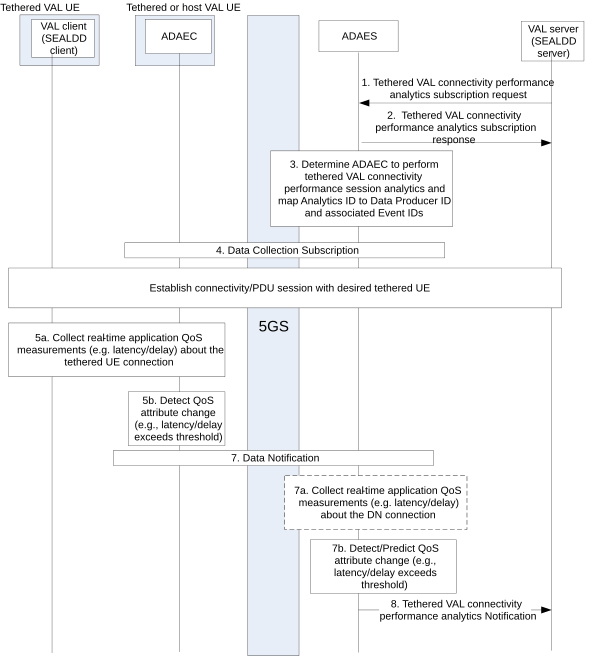

# 8.17 Procedure VAL performance analytics for tethered UEs

## 8.17.1 General

The clause provides a mechanism for analyzing the delay for application layer segments withinan end-to-end XR application service segment, and in particular the link between the VAL Client (e.g., SEALDD client) at the Tethered Device, and the 3GPP VAL UE. Based on this analysis, the mechanism includes the derivation of application layer statistics or predictions for the segment of interest towards the consumer.

## 8.17.2 Procedure

The procedure associated with the ADAE analytics for tethered UE and application connectivity performance is described below as depicted in Figure 8.17.2-1.

Pre-conditions:

1\. A connection between an ADAEC and ADAES is established.

2\. A connection between tethered VAL UE and host VAL UE is established.

Figure 8.17.2-1: Tethered VAL connectivity performance analytics procedure

1\. The consumer of the ADAES analytics service, e.g., the SEALDD server or VAL server, sends a subscription request to ADAES and provides the analytics event ID e.g., "tethered VAL connectivity performance".

2\. The ADAES sends a subscription response as an ACK to the consumer.

3\. The ADAES maps the analytics ID (i.e., tethered VAL UE connectivity performance) to a list of data collection event identifiers, and optionally a list of data producer IDs. Such mapping may be preconfigured by the ADAES itself based on ASP preferred event types, or VAL type, or alternatively may be preconfigured by an MNO by means of the OAM.

4\. The ADAES sends a tethered VAL UE connectivity performance data request to the determined tethered ADAEC with the analytics event ID and the configuration of the reporting required (e.g., periodic, based on maximum delay threshold etc.). Such request also includes additional application QoS attributes to be analyzed additionally based on other metrics (tethered link delay, E2E delay, 5GS PER, 5GS PDB/PSDB etc.). This step reuses the data collection subscription request and data collection subscription response flows as in clauses 8.2.4.4 and 8.2.4.5 respectively.

An application session then starts between the tethered VAL UE and the VAL server.

The next steps may happen asynchronously and in parallel given the 5GC reporting of events for the configured data collection.

5a. The ADAEC starts collecting data from the tethered VAL UE based on the request. The collection and reporting can be similar to ADAE procedure on VAL session performance analytics (as in step 8 of clause 8.2.3 in 3GPP TS 23.436). As enhancement of existing data collection, ADAEC may collect various events related to tethered link delay, e.g., *TetheredLinkDelayExperience*. This data can thus be about the delay measurements, throughput (e.g., max WiFi capacity), QoE measurements, etc.

5b. The ADAEC detects/predicts an application QoS change. Such a change can be for example a change in the QoS attributes requirements by means of detecting an event where the maximum latency threshold (e.g., over the tethered link or end to end) accepted by the ASP is exceeded, whereas the detection mechanism is performed over a given time horizon based on the analytics subscription request.

6\. The ADAES sends a tethered VAL UE connectivity performance data response to the ADAES, including the detected/predicted application QoS change. This step reuses the Data Notification message as in clause 8.2.4.6.

7a. The ADAES may optionally further collect data about the DN performance analytics by means of NWDAF events consumption including service experience analytics etc. This type of analytics will provide statistics/predictions on the user plane performance over a specific application server instance and can be used to predict possible service experience downgrade/deviation that could be used as input to step 7b to predict an application QoS change.

7b. The ADAES predicts an application QoS change. Such a change can be for example a change in the QoS attributes requirements by means of predicting (based on collected metrics and detection in step 5b) an event where the maximum latency threshold (e.g., over the tethered link, over the DN link, or over the E2E connectivity) accepted by the ASP is likely to be exceeded over a given time horizon based on the analytics subscription request.

NOTE: How the DN performance analytics together with the ADAEC measurements are used together to trigger an event related to application QoS change is up to implementation.

8\. The ADAES sends the derived analytics notification to the consumer (e.g., VAL server or any other authorized AF consumer).

## 8.17.3 Information flows

### 8.17.3.1 General

The following information flows are specified for tethered VAL connectivity performance analytics based on 8.17.2.

### 8.17.3.2 Tethered VAL connectivity performance analytics subscription request

Table 8.17.3.2-1 describes information elements for the tethered VAL connectivity performance analytics subscription request from the VAL server / Consumer to the ADAE server.

Table 8.17.3.2-1: Tethered VAL connectivity performance analytics subscription request

| Information element                   | Status | Description                                                                                                                                                                                                                          |
|---------------------------------------|--------|--------------------------------------------------------------------------------------------------------------------------------------------------------------------------------------------------------------------------------------|
| Consumer ID                           | M      | The identifier of the analytics consumer                                                                                                                                                                                             |
| Analytics ID                          | M      | The identifier of the analytics event. This ID can be for example “tethered VAL connectivity performance analytics”.                                                                                                                 |
| Analytics type                        | M      | The type of analytics for the event, e.g. statistics or predictions.                                                                                                                                                                 |
| VAL service ID                        | M      | The identifier of the VAL service for which analytics subscription apply.                                                                                                                                                            |
| Target tethered VAL UE ID(s)          | O      | The tethered VAL UE(s) for which the analytics subscription applies.                                                                                                                                                                 |
| Target VAL server ID                  | O      | If consumer is different from the VAL server, this identifier shows the target VAL server for which the analytics subscription applies.                                                                                              |
| Target data producer profile criteria | O      | Characteristics of the data producers to be used.                                                                                                                                                                                    |
| Preferred confidence level            | O      | The level of accuracy for the analytics service (in case of prediction.                                                                                                                                                              |
| Area of Interest                      | O      | The geographical or service area for which the subscription request applies.                                                                                                                                                         |
| Time validity                         | O      | The time validity of the subscription request                                                                                                                                                                                        |
| Reporting requirements                | O      | It describes the requirements for analytics reporting. This requirement may include e.g. the type and frequency of reporting (periodic or event triggered), the reporting periodicity in case of periodic, and reporting thresholds. |

### 8.17.3.3 Tethered VAL connectivity performance analytics subscription response

Table 8.17.3.3-1 describes information elements for the Tethered VAL connectivity performance analytics subscription response from the ADAE server to the consumer/VAL server.

Table 8.17.3.3-1: VAL performance analytics subscription response

| Information element | Status | Description                                                                              |
|---------------------|--------|------------------------------------------------------------------------------------------|
| Result              | M      | The result of the analytics subscription request (positive or negative acknowledgement). |
