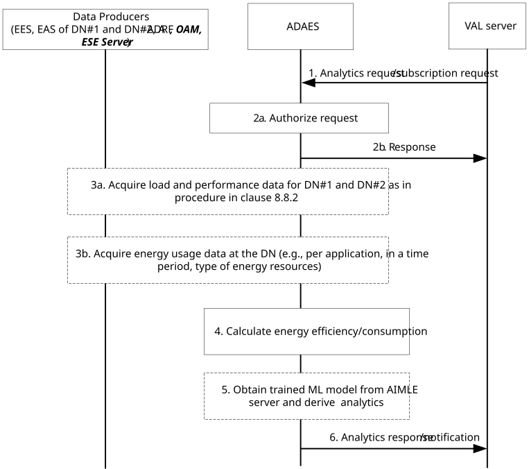

# 8.18 Procedure for supporting DN Energy Efficiency analytics

## 8.18.1 General

This clause describes the procedure for DN energy consumption/efficiency analytics, where the analytics are performed based on data collected from one or more DNs and A-ADRF.

## 8.18.2 Procedure

Figure 8.18.2-1 illustrates the procedure for DN energy efficiency analytics enablement solution.

Pre-conditions:

1\. Data producers (e.g. A-ADRF, EAS, EES, OAM, ESE Server) may be pre-configured with data producer profiles (as in Table 8.2.4.8-1) for the data they can provide. ADAES has discovered available data producers and their data producer profiles.

Figure 8.8.2.1-1: ADAES support for DN energy analytics

1\. The VAL server sends a DN energy analytics request to ADAES to perform analytics on the DN Energy Consumption/Efficiency for one or more DNs/EDNs, Event ID= “DN energy analytics”, “Energy analytics per application service”, and/or “Ratio of renewable energy analytics”, for a given DN service area (or subarea) and a given time window. The message in the request/subscription request is as described in Table 8.18.3.2-1.

2\. The ADAES authorizes the VAL request. The ADAES responses to the analytics request. The message in the response is as described in Table 8.18.3.4-1.

3\. The ADAES requests and receives energy data from the data producers (e.g. EAS /VAL servers hosted at the serving and target DNs (within the VAL service area), OAM, ESE server, A-ADRF) for the analytics.

3a. (If Event ID= “DN energy analytics” in step 1) The data could be the expected application service load and traffic schedules for the ongoing or future sessions within the area. Such data include traffic schedule report for the VAL Server, and this step re-uses the step 3 to 10 of clause 8.8.2.1.

3b. (If Event ID= “Energy analytics per application service”, or “Ratio of renewable energy analytics” in step 1) The data could be energy usage data at the DN per application, and/or in a time period, and/or the type of energy source used.

4\. The ADAES calculates the expected energy consumption or efficiency based on the received traffic and load data for the given DNN/DNAI based on the request.

NOTE: How the collected data are used to calculate energy efficiency metric is up to implementation.

5\. (Optional) The ADAES obtains the corresponding trained ML model based on procedure in 3GPP TS 23.482 clause 8.3.2 and performs analytics to derive the predicted energy consumption at the target area and time horizon. The analytics outputs can be the predicted energy consumption / efficiency for the given DNN/DNAI.

6\. The ADAES sends a DN energy analytics response/notifications with the energy consumption/efficiency analytics output data to the VAL server. The message in the analytics response/notifications is as described in Table 8.18.3.3-1.

Based on 6, the VAL server can use these analytics as input to trigger pro-actively:

\- an application server migration to a different edge cloud or to a centralized cloud as a way of reducing the energy consumption for the edge (if consumption is expected to be very high (e.g. higher than a pre-configured threshold)).

\- an application server offboarding and the instantiation of a new server at the target edge/centralized cloud to minimize energy consumption of the edge platform (taking into account the system wide energy efficiency).

## 8.18.3 Information flows

### 8.18.3.1 General

The following information flows are specified for DN energy analytics based on clause 8.18.2.

### 8.18.3.2 DN energy analytics request/subscription request

Table 8.18.3.2-1 describes information elements for the DN energy analytics request/subscription request from the VAL server to the ADAE server.

Table 8.8.3.2-1: DN energy analytics request/subscription request

<table>
<colgroup>
<col style="width: 33%" />
<col style="width: 16%" />
<col style="width: 50%" />
</colgroup>
<thead>
<tr class="header">
<th>Information element</th>
<th>Status</th>
<th>Description</th>
</tr>
</thead>
<tbody>
<tr class="odd">
<td>Analytics Consumer ID</td>
<td>M</td>
<td>The identifier of the analytics consumer (VAL server, EAS).</td>
</tr>
<tr class="even">
<td>Analytics ID</td>
<td>M</td>
<td>The identifier of the analytics event. This ID can be for example "edge performance analytics". "DN energy analytics", "Energy analytics per application service", and/or "Ratio of renewable energy analytics".</td>
</tr>
<tr class="odd">
<td>Analytics type</td>
<td>M</td>
<td>The type of analytics for the event, e.g. statistics or predictions.</td>
</tr>
<tr class="even">
<td>VAL service ID</td>
<td>O</td>
<td>
The identifier of the VAL service for which the analytics is requested.

This IE shall be provided when the Analytics ID is “Energy analytics per application service”.
</td>
</tr>
<tr class="odd">
<td>DNN/DNAI</td>
<td>M</td>
<td>DNN or DNAIs information for which the subscription applies.</td>
</tr>
<tr class="even">
<td>Energy Efficiency/Consumption metrics</td>
<td>O</td>
<td>The formula and necessary metrics for calculating the EE based on load and traffic information per DN.</td>
</tr>
<tr class="odd">
<td>Target data producer profile criteria</td>
<td>O</td>
<td>Characteristics of the data producers to be used.</td>
</tr>
<tr class="even">
<td>Renewable energy type</td>
<td>O</td>
<td>
Indicate the type of renewable energy for which the analytics applies (e.g., solar, wind).

This IE may be provided when the Analytics ID is "Ratio of renewable energy analytics". If omit, it indicates all types of renewable energy.
</td>
</tr>
<tr class="odd">
<td>Preferred confidence level</td>
<td>O</td>
<td>The level of accuracy for the analytics service (in case of prediction).</td>
</tr>
<tr class="even">
<td>Area of Interest</td>
<td>O</td>
<td>The geographical or service area for which the subscription request applies.</td>
</tr>
<tr class="odd">
<td>Time period of Interest</td>
<td>O</td>
<td>
The time period for which the analytics applies.

This IE shall be provided when the Analytics ID is “Ratio of renewable energy analytics”.
</td>
</tr>
<tr class="even">
<td>Time validity</td>
<td>O</td>
<td>The time validity of the subscription request.</td>
</tr>
<tr class="odd">
<td>Reporting requirements</td>
<td>O</td>
<td>It describes the requirements for the energy analytics reporting. This requirement may include e.g. the type and frequency of reporting (periodic or event triggered), the reporting periodicity in case of periodic, the event in case of event triggered (e.g. the energy consumption/efficiency crosses a threshold, the ratio of renewable energy crosses a threshold), and reporting thresholds.</td>
</tr>
<tr class="even">
<td>Notification endpoints ID or address</td>
<td>O</td>
<td>The identifier or address of the notification endpoints (e.g. VAL server, VAL client, or other network entities).</td>
</tr>
</tbody>
</table>

### 8.18.3.3 DN energy analytics response/notification

Table 8.18.3.3-1 describes information elements for the DN energy analytics response/notification from the VAL server to the ADAE server to the VAL server (or to the notification endpoints provided in the request/subscription request).

Table 8.18.3.3-1: DN energy analytics response/notification

<table>
<colgroup>
<col style="width: 33%" />
<col style="width: 16%" />
<col style="width: 50%" />
</colgroup>
<thead>
<tr class="header">
<th>Information element</th>
<th>Status</th>
<th>Description</th>
</tr>
</thead>
<tbody>
<tr class="odd">
<td>Result</td>
<td>M</td>
<td>The result of the analytics request (positive or negative acknowledgement).</td>
</tr>
<tr class="even">
<td>Analytics ID</td>
<td>O</td>
<td>The identifier of the analytics event.</td>
</tr>
<tr class="odd">
<td>Analytics Output</td>
<td>O</td>
<td>The predictive or statistical parameter, which can be stats or prediction related to the energy consumption or efficiency for the edge platform for a given area/time and based on the event type.</td>
</tr>
<tr class="even">
<td>&gt; DNN</td>
<td>M</td>
<td>Identifies the data network name for which analytics information is provided.</td>
</tr>
<tr class="odd">
<td>&gt; DNAI</td>
<td>M</td>
<td>Identifier of a user plane access to one or more DN(s) of the DN.</td>
</tr>
<tr class="even">
<td>&gt; Energy metrics</td>
<td>O</td>
<td>The predicted energy metrics.</td>
</tr>
<tr class="odd">
<td>&gt;&gt; Energy Consumption (NOTE)</td>
<td>O</td>
<td>The predicted energy consumption per DNAI based on network and edge resource usage</td>
</tr>
<tr class="even">
<td>&gt;&gt; Energy Efficiency (NOTE)</td>
<td>O</td>
<td>The energy efficiency per DNAI based on network and edge resource usage (given a certain optimal energy consumption metric, which can be pre-configured).</td>
</tr>
<tr class="odd">
<td>&gt;&gt; DN Data Volume (NOTE)</td>
<td>O</td>
<td>The predicted data volume per DNAI.</td>
</tr>
<tr class="even">
<td>&gt;&gt; Energy per Application service (NOTE)</td>
<td>O</td>
<td>The statistics or predicted energy consumption or energy efficiency per application service based on network and edge resource usage.</td>
</tr>
<tr class="odd">
<td>&gt;&gt;&gt; VAL service ID</td>
<td>M</td>
<td>The identifier of the VAL service for which the analytics applied.</td>
</tr>
<tr class="even">
<td>&gt;&gt; Ratio of renewable energy (NOTE)</td>
<td>O</td>
<td>The statistics or predicted ratio of renewable energy analytics per DNAI or per application service based on network and edge resource usage.</td>
</tr>
<tr class="odd">
<td>&gt;&gt;&gt; Renewable energy source</td>
<td>O</td>
<td>
Indicate the source of renewable energy used (e.g., solar, wind).

If omit, it indicates all types of renewable energy.
</td>
</tr>
<tr class="even">
<td>&gt;&gt;&gt;&gt; Renewable energy ratio</td>
<td>O</td>
<td>Ratio of the renewable energy.</td>
</tr>
<tr class="odd">
<td>&gt; Area of Interest</td>
<td>O</td>
<td>The area (topological or geographical or edge area) where the analytics apply.</td>
</tr>
<tr class="even">
<td>&gt; Applicable time period</td>
<td>O</td>
<td>The time period that the analytics applies to.</td>
</tr>
<tr class="odd">
<td>&gt;Confidence level</td>
<td>O</td>
<td>For predictive analytics, the achieved confidence level can be provided.</td>
</tr>
<tr class="even">
<td colspan="3">NOTE: At least one of these shall be present.</td>
</tr>
</tbody>
</table>

NOTE: Renewable energy information can be obtained from OAM as defined in 3GPP TS 28.310 \[4\].

### 8.18.3.4 Response to DN energy analytics request

Table 8.18.3.4-1 describes information elements for the ADAES responses to the analytics request to the consumer (e.g. VAL server).

Table 8.18.3.4-1: Response to DN energy analytics request

<table>
<colgroup>
<col style="width: 33%" />
<col style="width: 16%" />
<col style="width: 50%" />
</colgroup>
<thead>
<tr class="header">
<th>Information element</th>
<th>Status</th>
<th>Description</th>
</tr>
</thead>
<tbody>
<tr class="odd">
<td>Successful response (NOTE)</td>
<td>
O

(NOTE)
</td>
<td>Indicates that the request was successful.</td>
</tr>
<tr class="even">
<td>&gt; Subscription Identifier</td>
<td>M</td>
<td>The unique identifier for the event subscription. This IE shall be provided when it’s subscription request.</td>
</tr>
<tr class="odd">
<td>Failure response (NOTE)</td>
<td>
O

(NOTE)
</td>
<td>Indicates that the request failed.</td>
</tr>
<tr class="even">
<td>&gt; Cause</td>
<td>O</td>
<td>Indicates the cause of request failure (e.g. the energy usage data is not available).</td>
</tr>
<tr class="odd">
<td colspan="3">NOTE: One of these IEs shall be present in the message.</td>
</tr>
</tbody>
</table>
