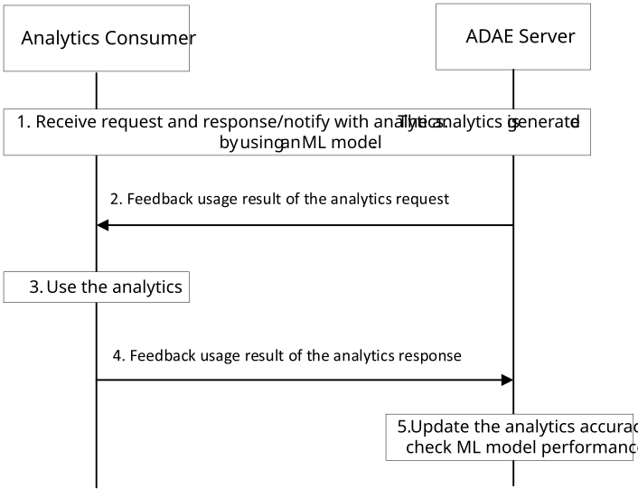

# 8.19 Procedure for ML Model Performance Degradation Detection

## 8.19.1 General

This clause describes a procedure for ML model performance degradation detection for supporting application layer AI/ML operations.

## 8.19.2 Procedure

Pre-conditions:

\- An ADAE Server, acting as an AIMLE consumer, receives a trained ML model (or ML model information) from the AIMLE Server.

Figure 8.19.2-1: ADAES supports for ML model performance degradation detection

1\. The ADAE Server receives a request from the consumer for analytics, generates analytics by using the ML model provided by AIMLE Server, and responds/notifies to the consumer with the required analytics.

2\. The ADAE Server requests the consumer to provide feedback on the usage of the analytics.

3\. The consumer uses the analytics for its operations and collects operation results. Performance degradation may be found from the operation results. The performance degradation may be caused by e.g., insufficient analytics accuracy, or the current analytics cannot fulfill the changed conditions at the consumer.

4\. The consumer provides feedback on the result of usage of the analytics to the ADAE Server.

5\. The ADAE Server updates the analytics accuracy based on feedback information from the consumer, and checks the performance of the ML model, which is used to generate the analytics, e.g., performance degradation of the ML model.
