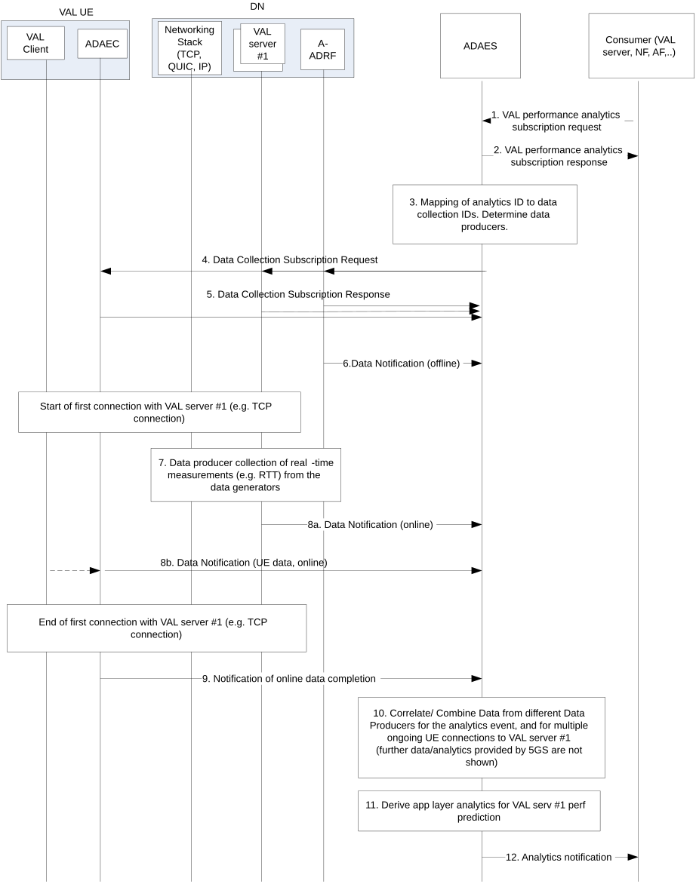
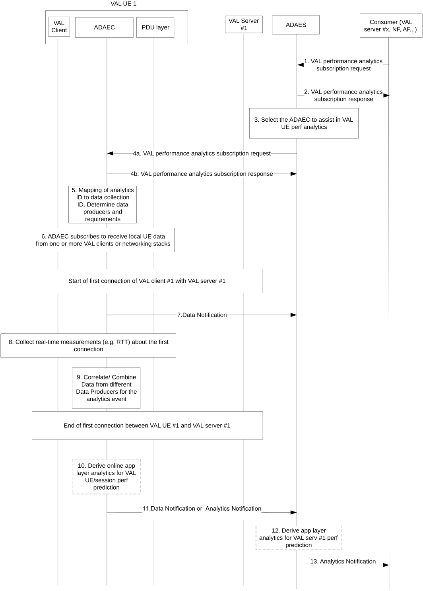

# 8.2 Procedure on support for application performance analytics

## 8.2.1 General

In this functionality, two procedures are described in more detail in clause 8.2.2 and 8.2.3 accordingly:

\- one procedure for VAL server related analytics where an example in provided for VAL server performance,

\- one procedure for VAL session/UE related analytics.

## 8.2.2 Procedure on VAL server performance analytics

Figure 8.2.2-1 illustrates the procedure where the VAL server performance analytics are performed based on data collected from the ongoing VAL sessions as well as data from the DN (VAL server, DN database or networking stack at the DN).

Pre-conditions:

1\. ADAE Client (ADAEC) is connected to ADAES.

2\. Data producers (e.g. A-ADRF, VAL Client) may be pre-configured with data producer profiles for the data they can provide. ADAES and ADAEC have discovered available data producers and their data producer profiles.

Figure 8.2.2-1: ADAES support for VAL server performance analytics

1\. The consumer of the ADAES analytics service sends a VAL performance analytics subscription request to ADAES and provides the analytics event ID e.g. "VAL server performance analytics".

2\. The ADAES sends a subscription response as a positive or negative acknowledgement to the consumer of the analytics service.

3\. The ADAES maps the analytics event ID to a list of data collection event identifiers, and a list of data producer IDs. Such mapping may be preconfigured by OAM or may be determined by ADAES based on the analytics event type / vertical type and/or data producer profile.

4\. The ADAES sends a data collection subscription request to the Data Producers (at the DN side or UE side) with the respective Data Collection Event ID and the requirement for data collection. Such data producers include the A-ADRF, the A-DCCF, the VAL server, SEALDD server, or the VAL UEs.

5\. The Data Producer(s) sends a subscription response as a positive or negative acknowledgement to the ADAES.

NOTE: The ADAES acting as AF may also subscribe to NEF/SMF/PCF/NWDAF to monitor network/UE situation or network data analytics required for the application data analytics event.

6\. The ADAES based on subscription, may receive offline stats/data from A-ADRF on the VAL server performance based on the analytics/data collection event ID. Such offline data can be average/peak throughput, average/maximum e2e delay, jitter, average application layer PER, availability, VAL server load, number of failed transactions, and can be for a given area and time of the day (based on the time/area of the request).

A session starts between the VAL server \#1 and a UE (this could happen for more than one UEs).

7\. The Data Producer at DN side, starts collecting data from the data generating entities, e.g. real-time networking or application data (from networking start at DN or VAL server itself), such as RTT, application layer PER, throughput.

8a. The Data Producer sends the real-time data to the ADAES, where the data correspond to the data collection ID or the analytics event ID for which the ADAES subscribed.

8b. The ADAES may receive also data (periodically or if a threshold is reached based on configuration) from the application of the UE within the ongoing session (via ADAEC). Such data can be about the RTT, average/peak throughput, jitter, QoE measurements (MOS, stalling events, stalling ratios, etc), QoS profile load, VAL server load, etc.

9\. When the VAL UE session with VAL server finishes, the ADAEC notifies the ADAES of the completion of the reporting.

10\. The ADAES abstracts or correlates the data based on the analytics event and the data collection configuration. Such correlation can be filtering of data for the same metrics but with different granularities or be combining/aggregating the data of segments of the end-to-end path (end to end is between VAL client and server). The outcome is an abstracted/correlated/filtered set of data.

11\. The ADAES derives application layer analytics on VAL server \#1 performance, based on the analytics ID and type of request. Such analytics can be stats or prediction for a given area/time and based on the event type for a given network configuration.

12**.** The ADAES sends the analytics to the consumer, where these analytics include the VAL server \#1 predicted or statistic performance for a given area and time horizon, including also the confidence level.

NOTE: If the Data Producer in steps 4-5 and 8a is SEALDD server, procedure in clause 9.7.2.1 of 3GPP TS 23.433 \[13\] is used for the collection of the E2E transmission quality measurement results to ADAES.

## 8.2.3 Procedure on VAL session performance analytics

Figure 8.2.3-1 illustrates the procedure where the VAL session performance analytics are performed based on data collected from the ongoing VAL sessions.

Pre-conditions:

1\. ADAEC is connected to ADAES.

2\. Data producers (e.g. A-ADRF, VAL Client) may be pre-configured with data producer profiles for the data they can provide. ADAES and ADAEC have discovered available data producers and their data producer profiles.

Figure 8.2.3-1: ADAES support for VAL session performance analytics

1\. The consumer of the ADAES analytics service sends a VAL performance analytics subscription request to ADAES and provides the analytics event ID e.g. "VAL session performance analytics", the target VAL UE ID, VAL server ID/VAL application ID, the time validity and area of the request, the required confidence level, exposure level for providing UE analytics. If the consumer is the VAL server, the VAL server can provide to ADAEC application data related to the UE expected route/trajectory and VAL application traffic schedule / expected session time.

2\. The ADAES sends a subscription response as an ACK to the consumer.

3\. The ADAES selects the corresponding ADAEC of the VAL UE for which the local analytics need to be performed.

4a. The ADAES sends a subscription request to the ADAEC with the analytics event ID and the configuration of the reporting required (e.g., periodic, based on event with threshold).

4b. The ADAEC sends a subscription response to ADAES.

5\. The ADAEC maps the analytics event ID to a list of data collection event identifiers or data collected IDs at the VAL UE or other UEs within the service and in proximity (in group-based communications). The ADAEC also determines the data producers using the analytics event ID, target data producer profile and optional preconfigured policies.

6\. The ADAEC subscribes to the VAL clients and/or requests UE local data based on the respective Data Collection Event ID (or the analytics event ID if they already know the mapping). This data may come from the PDU layer of the UE (via listening the traffic), or via VAL client of one or more UEs (if an application consists of a group of UEs).

A session starts between the VAL UE \#1 and a VAL server.

7\. The ADAEC (after being aware from the VAL client that the session started) sends a notification to ADAES that a session started, and it could be possible to provide real-time data analytics for VAL UE performance in the target area.

8\. The ADAEC starts collecting data from the corresponding data producers based on subscription. Such data can be about the RTT, throughput, jitter, QoE measurements, QoS profile load, etc. It can be also possible that VAL client provides to ADAEC application data related to the UE expected route/trajectory and VAL application traffic schedule / expected session time.

9\. The ADAEC filters or correlates the data based on the analytics event and the data collection configuration.

10\. When the VAL UE session finishes, the ADAEC (optionally) derives VAL session analytics to ADAES on VAL UE \#1 performance, based on the analytics ID and type of request. Such analytics (if performed at the ADAEC can be stats or predictions on the RTT or RTT deviation, average/peak throughput, jitter, QoE measurements (MOS, stalling events, buffer related events), QoS profile load, VAL application traffic load etc. In case of prediction, a confidence level shall be also present and a time horizon for the predicted parameters.

11\. The ADAEC sends the data of step 9 or the analytics of step 10 (if ADAEC performs analytics) to the ADAES.

12\. The ADAES derives application layer analytics on VAL session performance (based on the data or analytics received by the ADAEC), based on the analytics ID and type of request. Such analytics can be stats or prediction for a given area/time and based on the event type for a given network configuration. Such analytics (if no analytics is performed at ADAEC) at ADAES can be stats or predictions on the RTT or RTT deviation, average/peak throughput, jitter, QoE measurements, QoS profile load, VAL application traffic load etc. In case of prediction, a confidence level shall be also present and a time horizon for the predicted parameters.

13\. The ADAES sends the analytics to the consumer, where these analytics include the VAL UE \#1 session predicted or statistic performance for a given area and time horizon, including also the confidence level.

## 8.2.4 Information flows

### 8.2.4.1 General

The following information flows are specified for VAL performance analytics based on 8.2.2 and 8.2.3.

### 8.2.4.2 VAL performance analytics subscription request

Table 8.2.4.2-1 describes information elements for the VAL performance analytics subscription request from the consumer (e.g. VAL server, NF, AF) to the ADAE server or from ADAE server to ADAE client.

Table 8.2.4.2-1: VAL performance analytics subscription request

| Information element                   | Status | Description                                                                                                                                                                                                                                                     |
|---------------------------------------|--------|-----------------------------------------------------------------------------------------------------------------------------------------------------------------------------------------------------------------------------------------------------------------|
| Consumer ID                           | M      | The identifier of the analytics consumer.                                                                                                                                                                                                                       |
| Analytics ID                          | M      | The identifier of the analytics event. This ID can be for example “VAL server performance analytics” for procedure in 8.2.2, or “VAL session performance analytics” for procedure in 8.2.3.                                                                     |
| Analytics type                        | M      | The type of analytics for the event, e.g. statistics or predictions.                                                                                                                                                                                            |
| VAL service ID                        | M      | The identifier of the VAL service for which analytics subscription applies.                                                                                                                                                                                     |
| Target VAL UE ID(s)                   | O      | The VAL UE identifier(s) for which the analytics subscription applies.                                                                                                                                                                                          |
| Target VAL server ID                  | O      | If consumer is different from the VAL server, this identifier shows the target VAL server for which the analytics subscription applies (for procedure in 8.2.2).                                                                                                |
| Target data producer profile criteria | O      | Characteristics of the data producers to be used.                                                                                                                                                                                                               |
| ADAE client application data          | O      | Represent ADAE client application data (e.g. related to the UE expected route/trajectory and VAL application traffic schedule/expected session time) that the consumer can provide, if the consumer is VAL server.                                              |
| Preferred confidence level            | O      | The level of accuracy for the analytics service (in case of prediction).                                                                                                                                                                                        |
| Area of Interest                      | O      | The geographical or service area for which the subscription request applies.                                                                                                                                                                                    |
| Time validity                         | O      | The time validity of the subscription request.                                                                                                                                                                                                                  |
| Exposure level requirement            | O      | The level of exposure requirement (e.g. condition on providing UE analytics like threshold is reached) for the UE analytics to be exposed.                                                                                                                      |
| Reporting requirements                | O      | It describes the requirements for analytics reporting. This requirement may include e.g. the type and frequency of reporting (periodic or event triggered), the reporting periodicity in case of periodic, and reporting thresholds in case of event triggered. |

### 8.2.4.3 VAL performance analytics subscription response

Table 8.2.4.3-1 describes information elements for the VAL performance analytics subscription response from the ADAE server to the consumer (e.g. VAL server, NF, AF) or from ADAE client to ADAE server.

Table 8.2.4.3-1: VAL performance analytics subscription response

| Information element | Status | Description                                                                              |
|---------------------|--------|------------------------------------------------------------------------------------------|
| Result              | M      | The result of the analytics subscription request (positive or negative acknowledgement). |

### 8.2.4.4 Data collection subscription request

Table 8.2.4.4-1 describes information elements for the Data collection subscription request from the ADAE server to the Data Producer (e.g., A-DCCF, A-ADRF, VAL server, SEALDD server, or VAL UE via ADAE client).

Table 8.2.4.4-1: Data collection subscription request

<table>
<colgroup>
<col style="width: 33%" />
<col style="width: 16%" />
<col style="width: 50%" />
</colgroup>
<thead>
<tr class="header">
<th>Information element</th>
<th>Status</th>
<th>Description</th>
</tr>
</thead>
<tbody>
<tr class="odd">
<td>ADAE server ID</td>
<td>M</td>
<td>The identifier of the ADAE server.</td>
</tr>
<tr class="even">
<td>Data Collection Event ID</td>
<td>M</td>
<td>The identifier of the data collection event.</td>
</tr>
<tr class="odd">
<td>Data Collection requirements</td>
<td>M</td>
<td>The requirements for data collection, including the format of data, frequency of reporting, level of abstraction of data, level of accuracy of data.</td>
</tr>
<tr class="even">
<td>Analytics ID</td>
<td>O</td>
<td>The identifier of the analytics event, for which the data collection is needed.</td>
</tr>
<tr class="odd">
<td>List of Data Producer IDs</td>
<td>O</td>
<td>In case when this request is performed via A-DCCF, then the list of Data Producer IDs is needed.</td>
</tr>
<tr class="even">
<td>Target VAL UE ID(s) and address(es)</td>
<td>O</td>
<td>The VAL UE identifier(s) and IP address(es) for which the data collection subscription applies.</td>
</tr>
<tr class="odd">
<td>Target VAL server ID</td>
<td>O</td>
<td>This identifier shows the target VAL server for which the data collection subscription applies.</td>
</tr>
<tr class="even">
<td>Target data producer profile criteria</td>
<td>O</td>
<td>Characteristics of the data producers to be used.</td>
</tr>
<tr class="odd">
<td>Area of Interest</td>
<td>O</td>
<td>The geographical or service area for which the requirement request applies.</td>
</tr>
<tr class="even">
<td>Interest time period</td>
<td>
O

(NOTE)
</td>
<td>Interested time period for which the requirement request applies (e.g. time of the day).</td>
</tr>
<tr class="odd">
<td>Time validity</td>
<td>O</td>
<td>The time validity of the request</td>
</tr>
<tr class="even">
<td>Data collection requirements</td>
<td>
O

(NOTE)
</td>
<td>The requirements for data collection and for information to include in the data notification</td>
</tr>
<tr class="odd">
<td>&gt; ML model identifier</td>
<td>
O

(NOTE)
</td>
<td>The identifier of the ML model for which data is collected.</td>
</tr>
<tr class="even">
<td>&gt; AI/ML operation</td>
<td>
O

(NOTE)
</td>
<td>The desired AI/ML operations (e.g., ML model training, inference) for which data is collected.</td>
</tr>
<tr class="odd">
<td>&gt; Energy consumption calculation method</td>
<td>
O

(NOTE)
</td>
<td>The formula and input parameters from application layer for calculating the energy consumption based on factors that impact energy consumption for an AI/ML operation using a particular ML model<strong>.</strong> Examples of input parameters include % utilization and AI/ML operation duration.</td>
</tr>
<tr class="even">
<td colspan="3">NOTE: These IEs are present for AI/ML energy consumption analytics data collection.</td>
</tr>
</tbody>
</table>

### 8.2.4.5 Data collection subscription response

Table 8.2.4.5-1 describes information elements for the Data collection subscription response from the Data Producer (e.g., A-DCCF, A-ADRF, VAL server, SEALDD server, or VAL UE via ADAE client) to the ADAE server.

Table 8.2.4.5-1: Data collection subscription response

| Information element | Status | Description                                                                                    |
|---------------------|--------|------------------------------------------------------------------------------------------------|
| Result              | M      | The result of the data collection subscription request (positive or negative acknowledgement). |

### 8.2.4.6 Data Notification

Table 8.2.4.6-1 describes information elements for the Data Notification from the Data Producer to the ADAE server.

Table 8.2.4.6-1: Data notification

<table>
<colgroup>
<col style="width: 33%" />
<col style="width: 16%" />
<col style="width: 50%" />
</colgroup>
<thead>
<tr class="header">
<th>Information element</th>
<th>Status</th>
<th>Description</th>
</tr>
</thead>
<tbody>
<tr class="odd">
<td>Data Collection Event ID</td>
<td>M</td>
<td>The identifier of the data collection event.</td>
</tr>
<tr class="even">
<td>Target VAL UE ID and address(es)</td>
<td>
M

(NOTE 1)
</td>
<td>The VAL UE identifier(s) and IP address(es) for which the data apply.</td>
</tr>
<tr class="odd">
<td>Target VAL server ID</td>
<td>
M

(NOTE 1)
</td>
<td>This identifier of the target VAL server for which the data applies.</td>
</tr>
<tr class="even">
<td>Analytics ID</td>
<td>O</td>
<td>The identifier of the analytics event. This ID can be for example “VAL server performance analytics” for procedure in 8.2.2, or “VAL session performance analytics” for procedure in 8.2.3.</td>
</tr>
<tr class="odd">
<td>Data Type</td>
<td>O</td>
<td>The type of reported data samples which can be UE data, network data, application data, edge data, or different granularities / abstraction of data (e.g. real time, non real time).</td>
</tr>
<tr class="even">
<td>Data Output</td>
<td>M</td>
<td>
The reported data, which can be in the form of measurements or offline/historical data on the requested parameter based on subscription. For example:

<blockquote>

- offline stats/data from A-ADRF on the VAL server performance based on the analytics/data collection event ID. Such offline data can be average/peak throughput, average/maximum e2e delay, jitter, average application layer PER, availability, VAL server load, number of failed transactions, and can be for a given area and time of the day (based on the time/area of the request).

- from the application of the UE within the ongoing session (via ADAEC). Such data can be about the RTT, average/peak throughput, jitter, QoE measurements (MOS, stalling events, stalling ratios, etc), QoS profile load, VAL server load, etc.

</blockquote></td>
</tr>
<tr class="odd">
<td>&gt; ML model identifier</td>
<td>
O

(NOTE 2)
</td>
<td>The identifier of the ML model for which data was collected.</td>
</tr>
<tr class="even">
<td>&gt; AI/ML operation</td>
<td>
O

(NOTE 2)
</td>
<td>The AI/ML operation (e.g., ML model training, inference) for which data was collected.</td>
</tr>
<tr class="odd">
<td>&gt; Processing capability</td>
<td>
O

(NOTE 2)
</td>
<td>The processing capability of the VAL UE (e.g., entry-level, mid-tier, premium, high performance, high efficiency). The processing capability is used to determine the usage rate of energy per unit time that factors into the determination of energy consumption and is static.</td>
</tr>
<tr class="even">
<td>&gt; Elapse time for AI/ML operation</td>
<td>
O

(NOTE 2)
</td>
<td>The time duration for performing the AI/ML operation.</td>
</tr>
<tr class="odd">
<td>&gt; Resource utilization for AI/ML operation</td>
<td>
O

(NOTE 2)
</td>
<td>The percentage utilization of hardware resources (e.g., compute, memory, storage) determined for performing the AI/ML operation.</td>
</tr>
<tr class="even">
<td colspan="3">
NOTE 1: One of these shall be present based on the data collection event

NOTE 2: These IEs are present for data collection associated with AI/ML energy consumption analytics.
</td>
</tr>
</tbody>
</table>

### 8.2.4.7 Analytics Notification

Table 8.2.4.7-1 describes information elements for the Analytics Notification from the ADAE server to the consumer (e.g. VAL server, NF, AF).

Table 8.2.4.7-1: Analytics notification

<table>
<colgroup>
<col style="width: 33%" />
<col style="width: 16%" />
<col style="width: 50%" />
</colgroup>
<thead>
<tr class="header">
<th>Information element</th>
<th>Status</th>
<th>Description</th>
</tr>
</thead>
<tbody>
<tr class="odd">
<td>Analytics ID</td>
<td>M</td>
<td>The identifier of the analytics event. This ID can be for example “VAL server performance analytics” for procedure in 8.2.2, or “VAL session performance analytics” for procedure in 8.2.3.</td>
</tr>
<tr class="even">
<td>Analytics Output</td>
<td>M</td>
<td>The analytics outputs, which can be predictive or statistical parameter.</td>
</tr>
<tr class="odd">
<td>&gt; VAL server performance analytics output</td>
<td>
O

(see NOTE)
</td>
<td>Statistics or predictions of the VAL server performance, such as RTT, average/peak throughput, jitter, QoE measurements, QoS profile load, VAL server load, VAL server predicted or expected performance change for the requesting consumer.</td>
</tr>
<tr class="even">
<td>&gt; VAL session performance analytics output</td>
<td>
O

(see NOTE)
</td>
<td>Statistics or predictions of the VAL session performance, such as RTT, average/peak throughput, jitter, QoE measurements, QoS profile load, VAL application traffic load, VAL session predicted or expected performance change.</td>
</tr>
<tr class="odd">
<td>Applicable area</td>
<td>M</td>
<td>The service area or geographical area for which the analytics output applies to.</td>
</tr>
<tr class="even">
<td>Confidence level</td>
<td>
O

(see NOTE)
</td>
<td>The achieved confidence level.</td>
</tr>
<tr class="odd">
<td>Time horizon</td>
<td>
O

(see NOTE)
</td>
<td>The time horizon for predictive analytics.</td>
</tr>
<tr class="even">
<td>&gt; Start time</td>
<td>O</td>
<td>The start time point of predictive validity. If omitted, the default value is the current time.</td>
</tr>
<tr class="odd">
<td>&gt; End time</td>
<td>M</td>
<td>The end time point of predictive validity.</td>
</tr>
<tr class="even">
<td colspan="3">NOTE: One of the IEs shall be present based on the Analyitcs ID provided in the subscription request.</td>
</tr>
</tbody>
</table>

### 8.2.4.8 Data producer profile

The data producer profile IE includes information about the data generation/production capability of the data producer to support data collection for data analytics service and the availability/accessibility of the generated/produced data, as defined in Table 8.2.4.8-1.

Table 8.2.4.8-1: Data producer profile

<table>
<colgroup>
<col style="width: 33%" />
<col style="width: 16%" />
<col style="width: 50%" />
</colgroup>
<tbody>
<tr class="odd">
<td><strong>Information element</strong></td>
<td><strong>Status</strong></td>
<td><strong>Description</strong></td>
</tr>
<tr class="even">
<td>Data Producer ID</td>
<td>M</td>
<td>ID of the data producer.</td>
</tr>
<tr class="odd">
<td>Data producer type (NOTE)</td>
<td>M</td>
<td>Specifies the type of the data producer, e.g., ADAEC, A-DCCF, A-ADRF, VAL server, SEAL server, SEAL client, EES, EAS.</td>
</tr>
<tr class="even">
<td>Data type (NOTE)</td>
<td>M</td>
<td>Type of information that can be provided by the data producer, e.g., performance indicators, reproducer usage data, server load data, application performance, edge load, energy consumption.</td>
</tr>
<tr class="odd">
<td>Data producer role (NOTE)</td>
<td>O</td>
<td>Role of the data producer, e.g., generating entity, original producer, repository.</td>
</tr>
<tr class="even">
<td>Original producer ID (NOTE)</td>
<td>O</td>
<td>
If the data producer role is not “original producer” or “generating entity”, specifies the Producer ID of the original data producer for the data provided by this data producer.

If the data producer type is A-DCCF, this is a list of Data Producer IDs.
</td>
</tr>
<tr class="odd">
<td>Data freshness (NOTE)</td>
<td>O</td>
<td>If the data producer role is not “original producer” or “generating entity”, length of time elapsed after the data is generated until is available at the data producer. Alternatively, the data collection rate supported by the producer is provided.</td>
</tr>
<tr class="even">
<td>Data producer capability (NOTE)</td>
<td>O</td>
<td>Indicates data producer capabilities for this data type, e.g. how long the data can be stored, support for anonymization, data generation rate and schedule.</td>
</tr>
<tr class="odd">
<td colspan="3">NOTE: When the Data producer profile IE is used for Target data producer profile criteria (e.g. Table 8.2.4.4-1), this IE may be a list of values.</td>
</tr>
</tbody>
</table>
