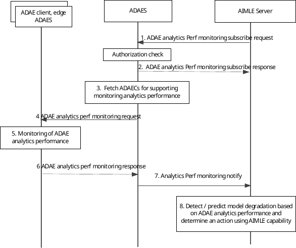

# 8.20 Procedure for monitoring ML-enabled analytics correctness

## 8.20.1 General

This clause describes a procedure monitoring ML-enabled ADAE analytics correctness for supporting application layer AI/ML operations.

## 8.20.2 Procedure

Pre-conditions:

1\. One or more ADAE services (at the ADAE server or clients) using the given ML model training service from AIMLE server (as defined in 3GPP TS 23.482 clause 8.3.2) are ongoing.

2\. The AIMLE server (or VAL server) detects a requirement to monitor the analytics performance. Such trigger is based on VAL server request for the ML model performance monitoring capability as specified in 3GPP TS 23.482 clause 8.22.2.

Figure 8.20.2-1: Procedure for ML-enabled analytics monitoring

1\. The AIMLE server sends an ADAE analytics performance monitoring subscription request to the ADAE server.

2\. The ADAE server authorizes the subscription request and sends an ADAE analytics performance monitoring subscription response to the AIMLE server.

3\. The ADAE server discovers based on the analytics ID the ADAECs or other entities (e.g. edge ADAES) which are undertaking an analytics task for the given analytics ID (e.g. local prediction at UE side or ADAES side).

4\. The ADAES server sends a request to the discovered entities (ADAEC or edge ADAES) indicating a monitoring requirement for the analytics task. Such request can be in form of an analytics correctness feedback request either real time or when the analytics task finishes.

5\. The discovered ADAEC(s) and/or edge ADAES start monitoring the performance of the analytics task and in particular the attributes which are requested (accuracy, delay, evaluation vs ground truth data). This involves the continuous checking of the performance (accuracy, latency) of the analytics service for providing a notification / trigger event to the AIMLE server identifying a deviation in terms of ADAE analytics performance. Such identification can be a detection of a mismatch in the analytics performance with a possible cause (e.g. data producer, ML model, UE/ channel conditions, data drift).

6\. The discovered ADAEC(s) and/or edge ADAES based on the trigger criteria, send to the ADAES a monitoring response, indicating an expected or predicted degradation of the performance of the analytics task. Such message may also include the possible cause as in step 5 (e.g. data producer, ML model, UE/ channel conditions, data drift).

7\. The ADAES identifies or predicts an ADAE service degradation or performance (against the KPIs for that analytics ID) and sends a notification to the AIMLE server detecting a degradation / mismatch at the target performance for the analytics task.

8\. The AIMLE server based on the received monitoring notification from the one or more AIMLE clients, it identifies an expected or predicted ML model degradation using the AIMLE capability for ML model performance monitoring as specified in 3GPP TS 23.482 clause 8.22.2 and can optionally use the ADAE capability for ML model degradation detection in clause 8.19.2.

## 8.20.3 Information flows

### 8.20.3.1 General

The following information flows are specified for monitoring analytics correctness based on clause 8.20.2.

### 8.20.3.2 ADAE analytics monitoring subscription request

Table 8.20.3.2-1 describes information elements for ADAE analytics monitoring subscription request from the AIMLE server to the ADAE server.

Table 8.20.3.2-1: ADAE analytics monitoring subscription request

| Information element                           | Status   | Description                                                                                                                                                                                        |
|-----------------------------------------------|----------|----------------------------------------------------------------------------------------------------------------------------------------------------------------------------------------------------|
| Analytics monitoring consumer ID              | M        | The identifier of the analytics monitoring consumer (VAL server, EAS, AIMLE server).                                                                                                               |
| Analytics ID                                  | M        | The identifier of the analytics event to be monitored. This ID can be for example “edge performance analytics”.                                                                                    |
| \> Analytics type                             | O        | The type of analytics for the event, e.g. statistics or predictions.                                                                                                                               |
| \> Analytics service KPI                      | O        | A KPI for the analytics service to be monitored.                                                                                                                                                   |
| Area of Interest                              | O        | The geographical or service area for which the subscription request applies.                                                                                                                       |
| Time validity                                 | O        | The time validity of the subscription request.                                                                                                                                                     |
| Reporting configuration                       | O (NOTE) | The monitoring reporting configuration i.e. thresholds for triggering a monitoring event, e.g. minimum accuracy, confidence level, whether the reporting is one time or periodical or event based. |
| VAL policies                                  | O (NOTE) | VAL policies for triggering an action based on a monitoring event (e.g. if analytics degradation is detected, re-start the analytics process).                                                     |
| NOTE: At least one of these shall be present. |          |                                                                                                                                                                                                    |

### 8.20.3.3 ADAE analytics monitoring subscription response

Table 8.20.3.3-1 describes information elements for the ADAE analytics monitoring subscription response from the ADAE server to the AIMLE server.

Table 8.20.3.3-1: ADAE analytics monitoring subscription response

<table>
<colgroup>
<col style="width: 33%" />
<col style="width: 16%" />
<col style="width: 50%" />
</colgroup>
<thead>
<tr class="header">
<th>Information element</th>
<th>Status</th>
<th>Description</th>
</tr>
</thead>
<tbody>
<tr class="odd">
<td>Result</td>
<td>M</td>
<td>The result of the analytics monitoring subscription request (positive or negative acknowledgement).</td>
</tr>
<tr class="even">
<td>Subscription identifier</td>
<td>M (NOTE 1)</td>
<td>The generated subscription ID in case of success of subscription.</td>
</tr>
<tr class="odd">
<td>Cause</td>
<td>M (NOTE 2)</td>
<td>A cause in case of failure (e.g. failure to authorize).</td>
</tr>
<tr class="even">
<td colspan="3">
NOTE 1: This shall be present in case of success.

NOTE 2: This shall be present in case of failure.
</td>
</tr>
</tbody>
</table>

### 8.20.3.4 ADAE analytics monitoring request

Table 8.20.3.4-1 describes information elements for ADAE analytics monitoring request from the ADAE server to the ADAE client or edge ADAE server.

Table 8.20.3.4-1: ADAE analytics monitoring request

| Information element      | Status | Description                                                                                                                                                            |
|--------------------------|--------|------------------------------------------------------------------------------------------------------------------------------------------------------------------------|
| Rquestor ID              | M      | The identifier of the requestor (VAL server, ADAES, AIMLE server).                                                                                                     |
| Analytics ID             | M      | The identifier of the analytics event to be monitored. This ID can be for example “edge performance analytics”.                                                        |
| \> Analytics type        | O      | The type of analytics for the event, e.g. statistics or predictions.                                                                                                   |
| \> Analytics service KPI | M      | A KPI for the analytics service to be monitored (e.g. accuracy).                                                                                                       |
| Area of Interest         | O      | The geographical or service area for which the subscription request applies.                                                                                           |
| Time validity            | O      | The time validity of the subscription request.                                                                                                                         |
| Event trigger criteria   | M      | The event trigger criteria for providing a monitoring report (e.g. reaching a threshold) and whether this is a predicted parameter or actual parameter to be monitored |

### 8.20.3.5 ADAE analytics monitoring response

Table 8.20.3.5-1 describes information elements for the ADAE analytics monitoring response from the edge ADAES server or ADAE client to the ADAE server.

Table 8.20.3.5-1: ADAE analytics monitoring response

| Information element                   | Status | Description                                                                                                        |
|---------------------------------------|--------|--------------------------------------------------------------------------------------------------------------------|
| Analytics ID                          | M      | The identifier of the analytics event which is monitored. This ID can be for example “edge performance analytics”. |
| \> Analytics service KPI              | M      | The KPI for the analytics service which was monitored (e.g. accuracy).                                             |
| \> Performance Degradation indication | M      | Indication of the expected or predicted degradation of the performance of the analytics task.                      |
| \>\>predicted timer                   | O      | The predicted timer in case of predicted degradation of the monitored KPI.                                         |
| \>\> Cause                            | O      | The cause of the performance degradation (e.g. data producer, ML model, UE/ channel conditions).                   |

### 8.20.3.6 ADAE analytics monitoring notify

Table 8.20.3.6-1 describes information elements for the ADAE analytics monitoring notify from the ADAE server to the AIMLE server.

Table 8.20.3.6-1: ADAE analytics monitoring notify

| Information element                   | Status | Description                                                                                                        |
|---------------------------------------|--------|--------------------------------------------------------------------------------------------------------------------|
| Subscription ID                       | M      | The subscription ID for the analytics monitoring event.                                                            |
| Analytics ID                          | M      | The identifier of the analytics event which is monitored. This ID can be for example “edge performance analytics”. |
| \> Analytics service KPI              | M      | The KPI for the analytics service which was monitored (e.g. accuracy).                                             |
| \> Performance Degradation indication | M      | Indication of the expected or predicted degradation of the performance of the analytics task.                      |
| \>\>predicted timer                   | O      | The predicted timer in case of predicted degradation of the monitored KPI.                                         |
| \>\> Cause                            | O      | The cause of the performance degradation (e.g. data producer, ML model, UE/ channel conditions).                   |
