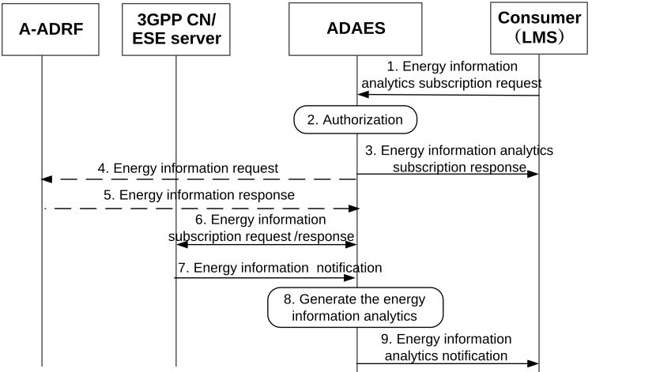

# 8.21 Procedure on support for energy information analytics for location services

## 8.21.1 General

This clause describes a high-level procedure of energy information (e.g. energy consumption) analytics for location services, where the analytics are performed based on data collected from 3GPP CN and A-ADRF.

## 8.21.2 Procedure

Figure 8.21.2-1 illustrates the procedure of energy information analytics for location services.

Pre-conditions:

\- The A-ADRF may have stored the historical energy consumption analytics for the corresponding VAL UE(s) or VAL services.

Figure 8.21.2.1-1: ADAES supporting for energy information analytics for location services

1\. The consumer (i.e. LMS) subscribes the energy information analytics related to location services from ADAES, including the analytics ID (e.g. energy consumption information analytics), the analytics type (e.g. statistics or predictions), the service ID, the target area, the energy type (e.g. energy consumption), the energy information granularity (e.g. per VAL UE per location service), the target VAL UE ID, the trigger events, the time period, preferred confidence level, etc.

2\. The ADAES check if the consumer (i.e. LMS) is authorized to request the energy information analytics subscription. If the request is authorized, the ADAES responds to the consumer (i.e. LMS).

3\. The ADAES sends the energy information analytics subscription response to the consumer (i.e. LMS).

4\. The ADAE server optionally requests the energy consumption historical analytics/information from A-ADRF for the corresponding VAL UE(s) or VAL service (e.g. location service).

5\. Based on the request, the A-ADRF checks the local storage and sends the energy consumption historical analytics/information to ADAES if there is any.

6\. If there is no historical energy consumptionn analytics/information received from A-ADRF, the ADAES may subscribe the energy information (e.g. energy consumption information) from 3GPP core network or ESE server, with the parameters received in step 1.

\- The ADAES may interact with Energy Information Function (EIF) via NEF in3GPP core network to subscribe the energy consumption information per Service Data Flow granularities (i.e. per VAL UE per application) as described in clause 5.51.2.4 of 3GPP TS 23.501 \[9\] and clause 4.29.1 of TS 23.502 \[x\].

\- The ADAES may interact with Energy Saving Enablement (ESE) in application enablement layer to subscribe the energy consumption information as described in clause 7.3.2 of 3GPP TS 23.366 \[21\].

7\. The 3GPP core network or ESE server provide the energy information (e.g. energy consumption information) to the ADAES per requested granularity (e.g. per VAL UE per location service).

8\. Upon receiving the energy information from step 5 and step 7, the ADAES utilizes them and generates the analytics for energy information per VAL UE per location service, including the energy consumption information statistic (e.g. maximum/average/minimum energy consumption information over a certain period of time, etc.), energy consumption information prediction (e.g. the time point of peak energy consumption), confidence level, etc.

NOTE: Whether the energy consumption information includes the statistic or prediction information depends on the analytics type is statistic or prediction included in step 1.

9\. The ADAES notifies the energy information analytics to the consumer (i.e. LMS) as requested, including the analytics results generated in step 8.

## 8.21.3 Information flows

### 8.21.3.1 General

The following information flows are specified for the energy information analytics based on clause 8.21.2.

### 8.21.3.2 Energy information analytics subscription request

Table 8.21.3.2-1 describes information elements for the energy information analytics request from the consumer (i.e. LMS) to the ADAE server.

Table 8.21.3.2-1: Energy information analytics subscription request

| Information element            | Status | Description                                                                                                                                                                                                                                                                                                                 |
|--------------------------------|--------|-----------------------------------------------------------------------------------------------------------------------------------------------------------------------------------------------------------------------------------------------------------------------------------------------------------------------------|
| Analytics Consumer ID          | M      | The identifier of the analytics consumer (i.e. LMS).                                                                                                                                                                                                                                                                        |
| Analytics ID                   | M      | The identifier of the analytics event. This ID can be e.g. “energy consumption information analytics for location services”.                                                                                                                                                                                                |
| Analytics type                 | M      | The type of analytics for the event, e.g. statistics or predictions.                                                                                                                                                                                                                                                        |
| Service ID                     | O      | The identifier of the location service for which the energy information analytics is requested.                                                                                                                                                                                                                             |
| Energy type                    | O      | The type of energy information. E.g. the energy consumption                                                                                                                                                                                                                                                                 |
| Energy information granularity | O      | The granularity when the energy data producers collect/expose the energy data (e.g. per VAL UE per location services).                                                                                                                                                                                                      |
| Target VAL UE ID               |        | The identifier of requested VAL UE(s).                                                                                                                                                                                                                                                                                      |
| Target area                    | O      | The geographical or service area for which the subscription request applies.                                                                                                                                                                                                                                                |
| Time period                    | O      | The time period of the subscription request.                                                                                                                                                                                                                                                                                |
| Reporting requirements         | O      | It describes the requirements for the energy analytics reporting. This requirement may include e.g. frequency of reporting (periodic or event triggered), the reporting periodicity in case of periodic, and event-triggered thresholds (e.g. the maximum energy consumption per VAL UE exceeds the pre-defined threshold). |
| Preferred confidence level     | O      | The level of accuracy for the analytics service (in case of prediction).                                                                                                                                                                                                                                                    |

### 8.21.3.3 Energy information analytics subscription response

Table 8.21.3.3-1 describes information elements for the energy information analytics subscription response from the ADAE server to the consumer (i.e. LMS).

Table 8.21.3.3-1: Energy information analytics subscription response

| Information element | Status | Description                                                                              |
|---------------------|--------|------------------------------------------------------------------------------------------|
| Result              | M      | The result of the analytics subscription request (positive or negative acknowledgement). |

### 8.21.3.4 Energy information analytics notification

Table 8.21.3.4-1 describes information elements for the energy information analytics notification from the ADAE server to the consumer.

Table 8.21.3.4-1: Energy information analytics notification

<table>
<colgroup>
<col style="width: 33%" />
<col style="width: 16%" />
<col style="width: 50%" />
</colgroup>
<thead>
<tr class="header">
<th>Information element</th>
<th>Status</th>
<th>Description</th>
</tr>
</thead>
<tbody>
<tr class="odd">
<td>Analytics ID</td>
<td>O</td>
<td>The identifier of the analytics event.</td>
</tr>
<tr class="even">
<td>Analytics Output</td>
<td>O</td>
<td>The predictive or statistical parameter, which can be stats or prediction related to the energy consumption for e.g. location services for a given area/time and based on the event type.</td>
</tr>
<tr class="odd">
<td>&gt; Energy Consumption information</td>
<td>O</td>
<td>The energy consumption information including the statistical and predictive ones.</td>
</tr>
<tr class="even">
<td>&gt;&gt; Energy Consumption statistic</td>
<td>
O

(NOTE)
</td>
<td>The statistical energy consumption per requested granularity (e.g. maximum/average/minimum energy consumption information) over a certain period of time.</td>
</tr>
<tr class="odd">
<td>&gt;&gt; Energy Consumption prediction</td>
<td>
O

(NOTE)
</td>
<td>The predicted energy consumption (e.g. the time point of peak energy consumption)</td>
</tr>
<tr class="even">
<td>&gt;&gt;Confidence level</td>
<td>
O

(NOTE)
</td>
<td>For predictive analytics, the achieved confidence level can be provided.</td>
</tr>
<tr class="odd">
<td colspan="3">NOTE: At least one of these IE shall be present.</td>
</tr>
</tbody>
</table>
