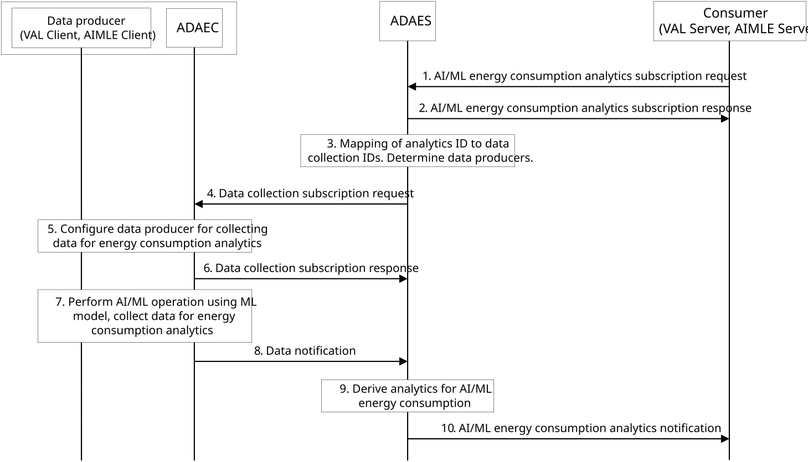
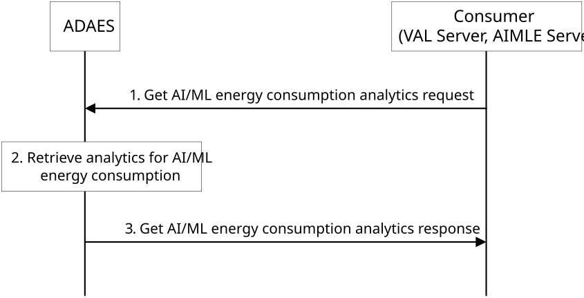

# 8.22 AI/ML energy consumption analytics

## 8.22.1 General

This clause describes a procedure for supporting AI/ML energy consumption analytics.

## 8.22.2 Procedure

### 8.22.2.1 Subscribe-notify model

Figure 8.22.2.1-1 illustrates the procedure for subscribing to AI/ML energy consumption analytics.

Pre-conditions:

1\. ADAEC is connected to ADAES.

2\. Data producers (e.g., AIMLE Client, VAL Client) may be pre-configured with data producer profiles for the data they can provide. ADAES and ADAEC have discovered available data producers and their data producer profiles.

Figure 8.22.2.1-1: AI/ML energy consumption analytics subscription

1\. An analytics consumer (e.g. VAL Server, AIMLE Server) sends an AI/ML energy consumption analytics subscription request to an ADAE server (ADAES). The subscription request includes an Analytics ID “AI/ML energy consumption analytics”, analytics type, ML model identifier, AI/ML operation, and other information as defined in Table 8.22.3.2-1.

2\. The ADAES validates the subscription request and performs authentication and authorization checks to determine if the consumer is authorized to subscribe for the requested analytics. If authorization is successful, the ADAES stores the subscription request information, assigns a subscription ID, and sends a subscription response as defined in Table 8.22.3.3-1.

3\. The ADAES maps the analytics ID to a list of data collection event identifiers and determines a list of data producer IDs for the data collection event identifiers. The determination of the data producer IDs is based on the data producer profiles as described in Table 8.2.4.8-1.

4\. The ADAES sends an AI/ML energy consumption data collection subscription request to the ADAE clients (ADAEC) determined in step 3 as described in step 4a of clause 8.2.3. The subscription request includes the data collection event ID and data collection requirements as defined in Table 8.2.4.4-1.

5\. Each ADAEC configures the data producers (i.e., VAL client or AIMLE client) for collecting data (e.g., duration of AI/ML operation, % resource utilization for AI/ML operation) for AI/ML energy consumption analytics requested in the data collection subscription request.

6\. The ADAEC sends an AI/ML energy consumption data collection subscription response to acknowledge the ADAES as described in step 4b of clause 8.2.3.

7\. The data producers perform AI/ML operations when triggered (e.g., ML model training) using the indicated ML model and collect data for AI/ML energy consumption analytics based on the configured data collection requirements.

8\. At the completion of AI/ML operation, the ADAEC sends an AI/ML energy consumption data collection notification to the ADAES as described in step 7 of clause 8.2.3. The data notification includes the data collection event ID and the information as defined in Table 8.2.4.6-1.

9\. The ADAES performs analytics relevant operations to generate the AI/ML energy consumption analytics based on the data received from the ADAECs. The ADAES uses the data collected by the ADAEC(s) to calculate the AI/ML energy consumption analytics. The ADAES saves the analytics information and makes it available for retrieval.

NOTE: How the collected data are used to calculate energy consumption is up to implementation.

10\. The ADAES sends an AI/ML energy consumption analytics notification to the consumer. The analytics notification includes the subscription and analytics IDs the notification is associated with, energy consumption information, and other information as defined in Table 8.22.3.4-1.

### 8.22.2.2 Request-response model

Figure 8.22.2.2-1 illustrates the procedure for Get AI/ML energy consumption analytics.

Pre-conditions:

1\. ADAE server has analytics data derived from steps 3-9 described in clause 8.22.2.1.

Figure 8.22.2.2-1: Get AI/ML energy consumption analytics request

1\. An analytics consumer (e.g. VAL Server, AIMLE Server) sends a Get AI/ML energy consumption analytics request to an ADAE server (ADAES). The request includes an Analytics ID “AI/ML energy consumption analytics”, analytics type, ML model identifier, AI/ML operation, a processing capability for the analytics, and other information as defined in Table 8.22.3.8-1.

2\. The ADAES validates the request and performs authentication and authorization checks to determine if the consumer is authorized for the requested analytics. If authorization is successful, the ADAES retrieves analytics for AI/ML energy consumption associated with the provided ML model, AI/ML operation, and processing capability.

3\. The ADAES sends a Get AI/ML energy consumption analytics response to the consumer. The get analytics response includes the analytics ID, energy consumption information, and other information as defined in Table  8.22.3.9-1.

## 8.22.3 Information flows

### 8.22.3.1 General

The following information flows are specified for AI/ML energy consumption analytics based on 8.22.2.

### 8.22.3.2 AI/ML energy consumption analytics subscription request

Table 8.22.3.2-1 describes information elements for the AI/ML energy consumption analytics subscription request from an analytics consumer (VAL server / AIMLE server) to the ADAE server.

Table 8.22.3.2-1: AI/ML energy consumption analytics subscription request

| Information element                   | Status | Description                                                                                                                                                                                                                                                                         |
|---------------------------------------|--------|-------------------------------------------------------------------------------------------------------------------------------------------------------------------------------------------------------------------------------------------------------------------------------------|
| Requestor ID                          | M      | The identifier of the analytics consumer (e.g., VAL server, AIMLE server).                                                                                                                                                                                                          |
| Analytics ID                          | M      | The identifier of the analytics event. This ID can be for example "AI/ML energy consumption analytics".                                                                                                                                                                             |
| Analytics type                        | M      | The type of analytics for the event (e.g., statistics or predictions).                                                                                                                                                                                                              |
| ML model identifier                   | M      | The identifier of the ML model for which analytics are determined.                                                                                                                                                                                                                  |
| AI/ML operation                       | M      | The desired AI/ML operations (e.g., ML model training, inference) for which analytics are determined.                                                                                                                                                                               |
| Energy consumption calculation method | M      | The formula and input parameters from application layer for calculating the energy consumption based on factors that impact energy consumption for an AI/ML operation using a particular ML model. Examples of input parameters include % utilization and AI/ML operation duration. |
| Target VAL UE IDs                     | O      | The identifier(s) of VAL UE(s) for which the analytics subscription applies.                                                                                                                                                                                                        |
| Target data producer IDs              | O      | The identifier(s) of VAL clients, AIMLE clients or FL members to target for collecting data for energy consumption analytics.                                                                                                                                                       |
| Target data producer profile criteria | O      | Characteristics of the data producers to be used.                                                                                                                                                                                                                                   |
| Reporting requirements                | O      | Describes the requirements for analytics reporting. This requirement may include e.g. the type and frequency of reporting (periodic or event triggered), the reporting periodicity in case of periodic, and reporting thresholds.                                                   |
| Area of Interest                      | O      | The geographical or service area for which the subscription request applies.                                                                                                                                                                                                        |
| Preferred confidence level            | O      | The level of accuracy for the analytics service (in case of prediction).                                                                                                                                                                                                            |
| Time validity                         | O      | The time validity of the subscription request.                                                                                                                                                                                                                                      |

### 8.22.3.3 AI/ML energy consumption analytics subscription response

Table 8.22.3.3-1 describes information elements for the AI/ML energy consumption analytics subscription response from the ADAE server to the analytics consumer (VAL/AIMLE server).

Table 8.22.3.3-1: AI/ML energy consumption analytics subscription response

<table>
<colgroup>
<col style="width: 33%" />
<col style="width: 16%" />
<col style="width: 50%" />
</colgroup>
<thead>
<tr class="header">
<th>Information element</th>
<th>Status</th>
<th>Description</th>
</tr>
</thead>
<tbody>
<tr class="odd">
<td>Result</td>
<td>M</td>
<td>The result for the request (positive or negative acknowledgement).</td>
</tr>
<tr class="even">
<td>Subscription ID</td>
<td>
O

(NOTE)
</td>
<td>An identifier for the subscription.</td>
</tr>
<tr class="odd">
<td colspan="3">NOTE: This shall be present in case of positive acknowledgement.</td>
</tr>
</tbody>
</table>

### 8.22.3.4 AI/ML energy consumption analytics notification

Table 8.22.3.4-1 describes information elements for the AI/ML energy consumption analytics notification from the ADAE server to the analytics consumer (VAL/AIMLE server).

Table 8.22.3.4-1: AI/ML energy consumption analytics notification

<table>
<colgroup>
<col style="width: 33%" />
<col style="width: 16%" />
<col style="width: 50%" />
</colgroup>
<thead>
<tr class="header">
<th>Information element</th>
<th>Status</th>
<th>Description</th>
</tr>
</thead>
<tbody>
<tr class="odd">
<td>Subscription ID</td>
<td>M</td>
<td>The identifier for the subscription.</td>
</tr>
<tr class="even">
<td>Analytics ID</td>
<td>M</td>
<td>The identifier of the analytics event. This ID can be for example " AI/ML energy consumption analytics".</td>
</tr>
<tr class="odd">
<td>ML model identifier</td>
<td>M</td>
<td>The ML model identifier for which analytics are determined.</td>
</tr>
<tr class="even">
<td>Energy consumption information</td>
<td>M</td>
<td>The range of energy consumption values for a particular ML model with a certain AI/ML operation. The output can be an average, minimum, and/or maximum value for the energy consumption. The output can be for prediction or statistics.</td>
</tr>
<tr class="odd">
<td>&gt; List of AI/ML operations</td>
<td>M</td>
<td>The AI/ML operations for which the analytics are determined.</td>
</tr>
<tr class="even">
<td>&gt; Processing capability</td>
<td>M</td>
<td>The processing capability of the VAL UE (e.g., entry-level, mid-tier, premium, high performance, high efficiency). The processing capability is used to determine the usage rate of energy per unit time that factors into the determination of energy consumption and is static.</td>
</tr>
<tr class="odd">
<td>&gt; Energy consumption</td>
<td>M</td>
<td>The range of energy consumption values for performing an AI/ML operation.</td>
</tr>
<tr class="even">
<td>&gt;&gt; Maximum consumption</td>
<td>
O

(NOTE)
</td>
<td>The maximum energy consumption value.</td>
</tr>
<tr class="odd">
<td>&gt;&gt; Average consumption</td>
<td>
O

(NOTE)
</td>
<td>The average energy consumption value.</td>
</tr>
<tr class="even">
<td>&gt;&gt; Minimum consumption</td>
<td>
O

(NOTE)
</td>
<td>The minimum energy consumption value.</td>
</tr>
<tr class="odd">
<td>Target analytics period</td>
<td>O</td>
<td>The time validity of the analytics.</td>
</tr>
<tr class="even">
<td>Confidence level</td>
<td>O</td>
<td>The level of accuracy for the analytics output (e.g. prediction).</td>
</tr>
<tr class="odd">
<td colspan="3">NOTE: At least one of these shall be present.</td>
</tr>
</tbody>
</table>

### 8.22.3.5 Get AI/ML energy consumption analytics request

Table 8.22.3.5-1 describes information elements for the AI/ML energy consumption analytics request from an analytics consumer (VAL server / AIMLE server) to the ADAE server.

Table 8.22.3.5-1: Get AI/ML energy consumption analytics request

| Information element        | Status | Description                                                                                                                                                                                                                                                                       |
|----------------------------|--------|-----------------------------------------------------------------------------------------------------------------------------------------------------------------------------------------------------------------------------------------------------------------------------------|
| Requestor ID               | M      | The identifier of the analytics consumer (e.g., VAL server, AIMLE server).                                                                                                                                                                                                        |
| Analytics ID               | M      | The identifier of the analytics event. This ID can be for example "AI/ML energy consumption analytics".                                                                                                                                                                           |
| Analytics type             | M      | The type of analytics for the event (e.g., statistics or predictions).                                                                                                                                                                                                            |
| ML model identifier        | M      | The identifier of the ML model for which analytics are determined.                                                                                                                                                                                                                |
| AI/ML operation            | M      | The desired AI/ML operations (e.g., ML model training, inference) for which analytics are determined.                                                                                                                                                                             |
| Processing capability      | M      | The processing capability of the VAL UE (e.g., entry-level, mid-tier, premium, high performance, high efficiency). The processing capability is used to determine the usage rate of energy per unit time that factors into the determination of energy consumption and is static. |
| Area of Interest           | O      | The geographical or service area for which the analytics request applies.                                                                                                                                                                                                         |
| Preferred confidence level | O      | The level of accuracy for the analytics service (in case of prediction).                                                                                                                                                                                                          |

### 8.22.3.6 Get AI/ML energy consumption analytics response

Table 8.22.3.6-1 describes information elements for the AI/ML energy consumption analytics notification from the ADAE server to the analytics consumer (VAL/AIMLE server).

Table 8.22.3.6-1: Get AI/ML energy consumption analytics response

<table>
<colgroup>
<col style="width: 33%" />
<col style="width: 16%" />
<col style="width: 50%" />
</colgroup>
<thead>
<tr class="header">
<th>Information element</th>
<th>Status</th>
<th>Description</th>
</tr>
</thead>
<tbody>
<tr class="odd">
<td>Result</td>
<td>M</td>
<td>The result for the request (positive or negative acknowledgement).</td>
</tr>
<tr class="even">
<td>Analytics ID</td>
<td>M</td>
<td>The identifier of the analytics event. This ID can be for example " AI/ML energy consumption analytics".</td>
</tr>
<tr class="odd">
<td>ML model identifier</td>
<td>M</td>
<td>The ML model identifier for which analytics are determined.</td>
</tr>
<tr class="even">
<td>Energy consumption information</td>
<td>M</td>
<td>The range of energy consumption values for a particular ML model with a certain AI/ML operation. The output can be an average, minimum, and/or maximum value for the energy consumption. The output can be for prediction or statistics.</td>
</tr>
<tr class="odd">
<td>&gt; List of AI/ML operations</td>
<td>M</td>
<td>The AI/ML operations for which the analytics are determined.</td>
</tr>
<tr class="even">
<td>&gt; Processing capability</td>
<td>M</td>
<td>The processing capability of the VAL UE (e.g., entry-level, mid-tier, premium, high performance, high efficiency). The processing capability is used to determine the usage rate of energy per unit time that factors into the determination of energy consumption and is static.</td>
</tr>
<tr class="odd">
<td>&gt; Energy consumption</td>
<td>M</td>
<td>The range of energy consumption values for performing an AI/ML operation.</td>
</tr>
<tr class="even">
<td>&gt;&gt; Maximum consumption</td>
<td>
O

(NOTE)
</td>
<td>The maximum energy consumption value.</td>
</tr>
<tr class="odd">
<td>&gt;&gt; Average consumption</td>
<td>
O

(NOTE)
</td>
<td>The average energy consumption value.</td>
</tr>
<tr class="even">
<td>&gt;&gt; Minimum consumption</td>
<td>
O

(NOTE)
</td>
<td>The minimum energy consumption value.</td>
</tr>
<tr class="odd">
<td>Target analytics period</td>
<td>O</td>
<td>The time validity of the analytics.</td>
</tr>
<tr class="even">
<td>Confidence level</td>
<td>O</td>
<td>The level of accuracy for the analytics output (e.g. prediction).</td>
</tr>
<tr class="odd">
<td colspan="3">NOTE: At least one of these shall be present.</td>
</tr>
</tbody>
</table>
