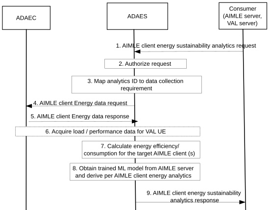

# 8.23 ADAES Support for AIMLE client energy sustainability analytics

## 8.23.1 General

This clause describes the procedure for supporting the AIMLE client energy analytics in ADAES as new analytics service.

## 8.23.2 Procedure

This clause describes the procedure for supporting the AIMLE client energy analytics in ADAES as new analytics service.

Figure 8.23.2-1: ADAES support for AIMLE client energy analytics

1\. The Consumer (AIMLE or VAL server) sends an AIMLE client energy sustainability analytics request to ADAES to perform analytics on the AIMLE client Energy Consumption who is expected to undertake an AIML task, Event ID= “AIMLE client energy sustainability analytics”, for a given service area and a given time window.

2\. The ADAES authorizes the consumer’s request.

3\. The ADAES maps the AIMLE client energy analytics event ID to a list of data collection event identifiers, and a list of data producer IDs. Such mapping may be preconfigured by OAM or may be determined by ADAES based on the analytics event type/vertical type and/or data producer profile.

ADAES determines and maps the analytics event to the energy data to acquire and the data producers which can be functionalities in the target VAL UE(s) and/or data stored in A-ADRF.

4\. The ADAES requests from the ADAEC of the VAL UE(s) of interest energy data using the Data Collection Subscription as in clause 8.16.2 steps 4 and 5.

NOTE 1: In this step, the ADAEC may fetch the requested energy data from SEAL ESE client.

5\. The ADAES receives from the ADAEC an AIMLE client energy data response, including the requested energy data, using the Data Notification as in Table 8.16.3.7-1.

6\. In addition, or complementary to AIMLE client energy data collection, the ADAES may also request and receive from the ADAEC of the VAL UE, performance statistics related to the application layer or enabler layer sessions (based on existing ADAE capabilities on VAL session analytics).

7\. The ADAES calculates the expected AIMLE client energy consumption based on the received energy/ performance data in step 5 and 6, based on the request.

8\. The ADAES obtains the corresponding trained ML model based on procedure in 3GPP TS 23.482 \[10\] clause 8.3.2 and performs analytics to derive the predicted VAL UE energy consumption sustainability at the target area and time horizon.

9\. The ADAES sends the analytics output via the AIMLE client energy sustainability analytics API to the consumer (VAL or AIMLE server) as analytics response with the analytics output data (based on the type of analytics in the request).

NOTE 2: The ADAES and/or the AIMLE (as consumer) may also store the energy data and/or analytics to a repository being A-ADRF or ML repository (if this applies to an ML task).

Based on step 9, the consumer (AIMLE or VAL server) may use these analytics as input to trigger the pro-active selection or re-selection or removal of the AIMLE client from the list of VAL UEs which are capable of undertaking an AI/ML process/task/operation, given the energy factor.

## 8.23.3 Information flows

### 8.23.3.1 General

The following information flows are specified for monitoring analytics correctness based on clause 8.23.2.

### 8.23.3.2 AIMLE client energy sustainability analytics request

Table 8.23.3.2-1 describes information elements for AIMLE client energy sustainability analytics request from the Consumer (e.g. AIMLE server, VAL server) to the ADAE server.

Table 8.23.3.2-1: AIMLE client energy sustainability analytics request

| Information element                 | Status | Description                                                                                                                                                                                                                                                                           |
|-------------------------------------|--------|---------------------------------------------------------------------------------------------------------------------------------------------------------------------------------------------------------------------------------------------------------------------------------------|
| Consumer identifier                 | M      | The identifier of the analytics consumer (VAL server, EAS, AIMLE server).                                                                                                                                                                                                             |
| Analytics ID                        | M      | The identifier of the analytics event. This ID can be equivalent to “UE energy sustainability analytics”.                                                                                                                                                                             |
| Analytics type                      | M      | The type of analytics for the event, e.g. statistics or predictions.                                                                                                                                                                                                                  |
| VAL UE ID(s) and address(es)        | M      | The VAL UE identifier(s) and IP address(es) for which the analytics applies.                                                                                                                                                                                                          |
| VAL/AIMLE service ID                | O      | The identifier of the VAL or AIMLE service for which the subscription applies. This may be an AI/ML task or operation or process (ML training or inference or FL task) for which the prediction/stats apply.                                                                          |
| Preferred confidence level          | O      | The required level of accuracy for the analytics service (in case of prediction).                                                                                                                                                                                                     |
| Reporting configuration             | O      | The configuration for analytics reporting. This requirement may include e.g. the frequency of reporting (periodic or event triggered), the reporting periodicity in case of periodic, and reporting thresholds in case of event triggered, whether data abstraction is needed or not. |
| Energy data collection requirements | O      | The requirements for energy data collection, including the format of data, frequency of reporting, level of abstraction of data, level of accuracy of data.                                                                                                                           |
| Area of Interest                    | O      | The geographical or service area for which the request applies.                                                                                                                                                                                                                       |
| VAL UE mobility / route information | O      | Information on the target VAL UE mobility including the expected route/set of waypoints.                                                                                                                                                                                              |

### 8.23.3.3 AIMLE client energy sustainability analytics response

Table 8.23.3.3-2 describes information elements for AIMLE client energy sustainability analytics response from the ADAE server to the Consumer.

Table 8.23.3.3-1: AIMLE client energy sustainability analytics response

<table>
<colgroup>
<col style="width: 33%" />
<col style="width: 16%" />
<col style="width: 50%" />
</colgroup>
<thead>
<tr class="header">
<th><strong>Information element</strong></th>
<th><strong>Status</strong></th>
<th><strong>Description</strong></th>
</tr>
</thead>
<tbody>
<tr class="odd">
<td>Analytics ID</td>
<td>M</td>
<td>The identifier of the analytics event.</td>
</tr>
<tr class="even">
<td>VAL UE ID(s) and address(es)</td>
<td>M</td>
<td>The VAL UE identifier(s) and IP address(es) for which the analytics apply.</td>
</tr>
<tr class="odd">
<td>Analytics Output</td>
<td>M</td>
<td>
The reported analytics which can be:

- identification on whether the energy consumption is sustainable for a given VAL or AIMLE service, where this service can be an AI/ML service

- a recommendation on whether the AIMLE client is applicable or suitable for the AI/ML task based on the energy prediction or sustainability indicator.
</td>
</tr>
</tbody>
</table>
