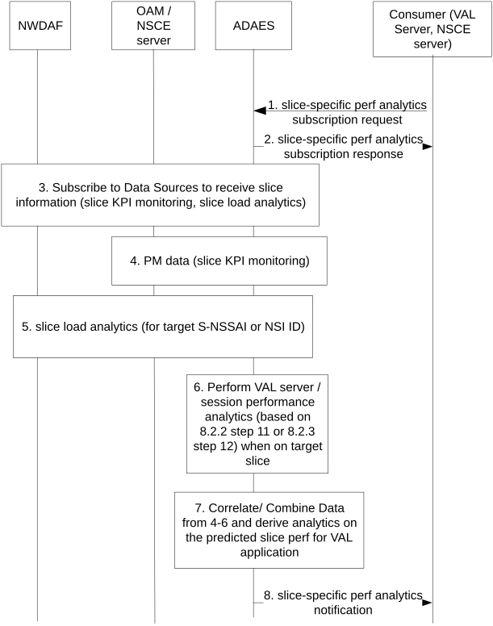

# 8.3 Procedure on support for slice-specific application performance analytics

## 8.3.1 General

This clause describes the procedure for supporting slice-specific application performance analytics. The ADAES service consumer can subscribe and receive notifications about slice specific application performance analytics events. In case that the ADAES consumer needs information about historical data, the procedure in 8.7.3 can be used for retrieving of slice-specific application performance metrics data about a specific area and time window in the past.

## 8.3.2 Procedure

Figure 8.3.2-1 illustrates the procedure where the VAL server performance analytics are performed based on data collected from the ongoing VAL sessions as well as data from the DN (VAL server, DN database or networking stack at DN) for a specific slice.

Pre-conditions:

1\. ADAEC is connected to ADAES.

Figure 8.3.2-1: ADAES support for slice-related performance analytics

1\. The consumer of the ADAES analytics service sends a subscription request to ADAES and provides the analytics event ID e.g. "slice-specific application performance analytics ", the target S-NSSAI, DNN, NSI ID, the time validity of the request, the required confidence level, area and time horizon, etc.

2\. The ADAES sends a subscription response as an ACK to the consumer.

3\. The ADAES subscribes to the Data Sources with the respective Data Collection Event ID and the requirement for data collection related to the request slice(s). Such requests may be towards:

\- OAM for providing PM data related to the requested slice / NSI. Alternatively, if the interaction to OAM happens via NSCE layer (see TS 23.435 \[6\]), such subscription can be performed to NSCE (where ADAES is acting as VAL server).

\- NWDAF for providing slice related analytics for the given area and time horizon (indicated in step 1). Such analytics can be the slice load level related network data analytics, or the service experience related network data analytics for a given slice.

4\. The ADAES based on subscription, receives PM data notification from OAM or from NSCE server (via OAM APIs or NSCE-S APIs)

5\. The ADAES based on subscription, receives the requested NWDAF analytics outputs. Such analytics can be:

\- network slice or NSI statistics or predictions (clause 6.3.3A of TS 23.288 \[4\])

\- per slice instance service experience stats or predictions (clause 6.4.3 of TS 23.288 \[4\])

6\. The ADAES can also provide analytics on the VAL session performance (based on the procedure of clause 8.2.2 step 11 or clause 8.2.3 step 12) and filters the analytics only for the sessions which are connected to that requested slice for the area of interest.

7\. The ADAES abstracts or correlates the data/analytics from steps 4-6 and provides analytics on the slice or NSI performance for the target VAL application/server. For example, such analytics can be about the min/average/max predicted RTT / end to end latency for the VAL application/server if this server uses a given slice/NSI (or for a list of given slices) within an area of interest.

8**.** The ADAES sends the analytics to the consumer, as a slice-specific performance analytics notification message.

## 8.3.3 Information flows

### 8.3.3.1 General

The following information flows are specified for slice-specific application performance analytics based on 8.3.2.

### 8.3.3.2 Slice-specific performance analytics subscription request

Table 8.3.3.2-1 describes information elements for the slice-specific performance analytics subscription request from the consumer (VAL server / NSCE server) to the ADAE server.

Table 8.3.3.2-1: Slice-specific performance analytics subscription request

| Information element        | Status | Description                                                                                                                                                                                                                          |
|----------------------------|--------|--------------------------------------------------------------------------------------------------------------------------------------------------------------------------------------------------------------------------------------|
| Consumer ID                | M      | The identifier of the analytics consumer.                                                                                                                                                                                            |
| Analytics ID               | O      | The identifier of the analytics event. This ID can be for example “slice-specific application performance analytics”.                                                                                                                |
| Analytics type             | M      | The type of analytics for the event, e.g. statistics or predictions.                                                                                                                                                                 |
| Slice identifier(s)        | M      | The identifier(s) of the target slice(s) or slice instance(s), i.e. S-NSSAI, NSI ID or ENSI.                                                                                                                                         |
| DNN                        | O      | The target DNN for which the request applies.                                                                                                                                                                                        |
| Target VAL UE ID(s)        | O      | The VAL UE(s) for which the analytics subscription applies.                                                                                                                                                                          |
| Target VAL server ID       | O      | If consumer is different from the VAL server, this identifier shows the target VAL server for which the analytics subscription applies (for procedure in clause 8.3.2).                                                              |
| Target VAL service ID      | O      | The identifier of the VAL service for which the analytics applies.                                                                                                                                                                   |
| Preferred confidence level | O      | The required level of accuracy for the analytics service (in case of prediction).                                                                                                                                                    |
| Area of Interest           | O      | The geographical or service area for which the subscription request applies.                                                                                                                                                         |
| Time validity              | O      | The time validity of the subscription request.                                                                                                                                                                                       |
| Time horizon               | O      | The required time horizon for predictive analytics.                                                                                                                                                                                  |
| \> Start time              | O      | The start time point of predictive validity. If omitted, the default value is the current time.                                                                                                                                      |
| \> End time                | M      | The end time point of predictive validity.                                                                                                                                                                                           |
| Reporting requirements     | O      | It describes the requirements for analytics reporting. This requirement may include e.g. the type and frequency of reporting (periodic or event triggered), the reporting periodicity in case of periodic, and reporting thresholds. |

### 8.3.3.3 Slice-specific performance analytics subscription response

Table 8.3.3.3-1 describes information elements for the slice-specific performance analytics subscription response from the ADAE server to the consumer (VAL/NSCE server).

Table 8.3.3.3-1: Slice-specific performance analytics subscription response

| Information element | Status | Description                                                                              |
|---------------------|--------|------------------------------------------------------------------------------------------|
| Result              | M      | The result of the analytics subscription request (positive or negative acknowledgement). |

### 8.3.3.4 Slice-specific performance analytics notification

Table 8.3.3.4-1 describes information elements for the slice-specific performance analytics notification from the ADAE server to the Consumer.

Table 8.3.3.4-1: Slice-specific performance analytics notification

<table>
<colgroup>
<col style="width: 33%" />
<col style="width: 16%" />
<col style="width: 50%" />
</colgroup>
<thead>
<tr class="header">
<th>Information element</th>
<th>Status</th>
<th>Description</th>
</tr>
</thead>
<tbody>
<tr class="odd">
<td>Analytics ID</td>
<td>O</td>
<td>The identifier of the analytics event. This ID can be for example “slice-specific application performance analytics”.</td>
</tr>
<tr class="even">
<td>Analytics Output</td>
<td>M</td>
<td>The predictive or statistical parameter on performance for the target VAL application/server, with the target slice or slice instance (e.g. the min/average/max predicted RTT / end to end latency for the VAL application/server if this server uses a given slice/NSI (or for a list of given slices) in the area of interest).</td>
</tr>
<tr class="odd">
<td>Confidence level</td>
<td>
O

(NOTE)
</td>
<td>For predictive analytics, the achieved confidence level.</td>
</tr>
<tr class="even">
<td>Time horizon</td>
<td>
O

(NOTE)
</td>
<td>The time horizon for predictive analytics.</td>
</tr>
<tr class="odd">
<td>&gt; Start time</td>
<td>O</td>
<td>The start time point of predictive validity. If omitted, the default value is the current time.</td>
</tr>
<tr class="even">
<td>&gt; End time</td>
<td>M</td>
<td>The end time point of predictive validity.</td>
</tr>
<tr class="odd">
<td colspan="3">NOTE: These information elements shall be provided for the predictive analytics.</td>
</tr>
</tbody>
</table>
