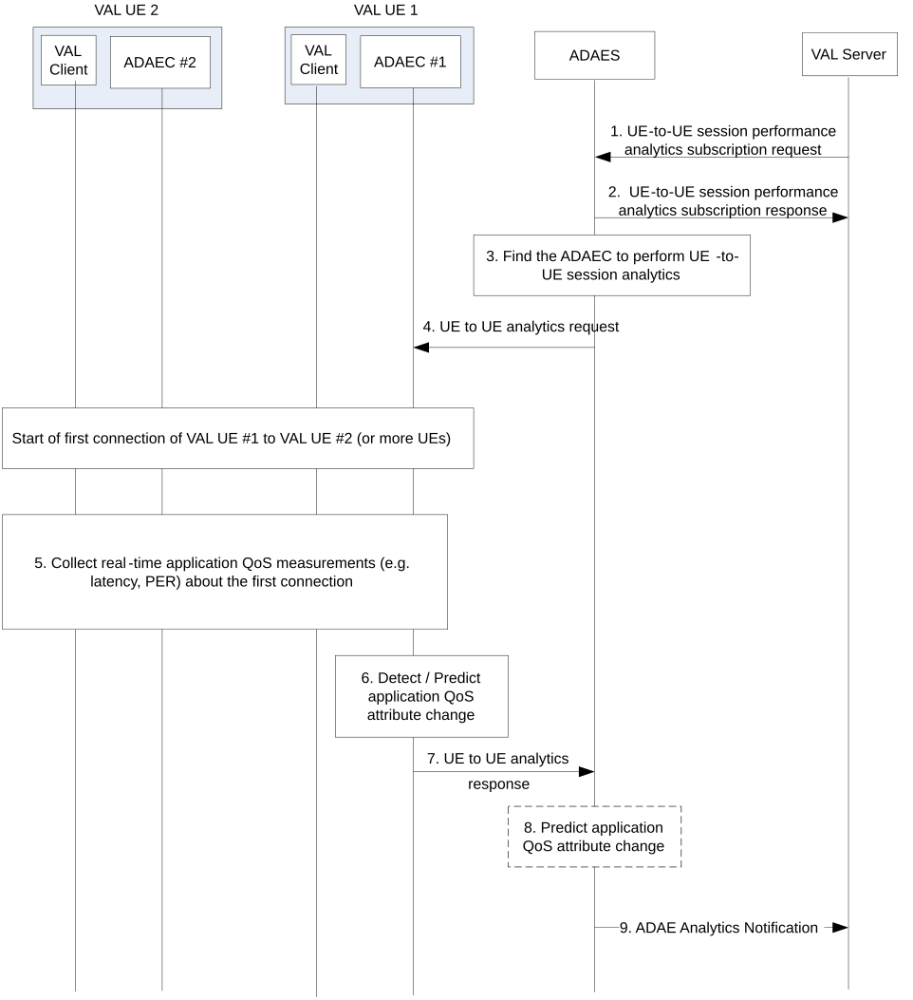

# 8.4 Procedure on support for UE-to-UE application performance analytics

## 8.4.1 General

This clause describes the procedure for supporting UE-to-UE application performance analytics.

## 8.4.2 Procedure

Figure 8.4.2-1 illustrates the procedure where the VAL session performance analytics are performed based on data collected from the ongoing VAL UE-to-UE sessions.

Pre-conditions:

1\. ADAECs are connected to ADAES.

Figure 8.4.2-1: ADAES support for UE-to-UE application performance analytics

> 1\. The consumer of the ADAES analytics service sends a subscription request to ADAES and provides the analytics event ID e.g. "UE-to-UE session performance analytics", the target VAL UE ID or group of UE IDs, the VAL service ID, the time validity and area of the request, the required confidence level, exposure level for providing UE to UE analytics. Such request can also include whether the analytics notification shall be periodic or based on an expected application QoS change (in that case also the thresholds can be provided at the request)
>
> 2\. The ADAES sends a subscription response as an ACK to the consumer.
>
> 3\. The ADAES selects the corresponding ADAEC \#1 of the VAL UE 1 where the session performance analytics need to be performed. Such UE can be for example a capable and authorized UE from the involved VAL UE(s) within the service or group, e.g. a group lead.
>
> 4\. The ADAES sends a UE-to-UE analytics request to the ADAEC \#1 with the analytics ID e.g. "UE-to-UE analytics" and the configuration of the reporting required (e.g., periodic, event triggered based on threshold(s)). Such request also includes the application QoS attributes to be analyzed (latency, bitrate, jitter, application layer PER). A session starts between the VAL UE \#1 and a VAL UE \#2 (or more VAL UEs).
>
> 5\. The ADAEC \#1 starts collecting data from the corresponding VAL UE(s) based on the request. Such data can be about the latency, throughput, jitter, QoE measurements, PQI load, etc. The data can be collected by ADAEC \#1 from other ADAECs via ADAE-C interface, or from the VAL clients (VAL client to VAL client interaction is out of scope).
>
> 6\. The ADAEC either detects or predicts an application QoS change (depending on the authorization of ADAEC to perform analytics). Such change can be for example an application QoS downgrade related to the UE-to-UE session latency, or the application layer PER/channel losses higher than a predefined threshold, for a given time horizon with a certain confidence level.
>
> 7\. The ADAEC sends the analytics to the ADAES in a UE-to-UE analytics response message.
>
> 8\. The ADAES based on the received response, confirms/verifies the analytics received or provides analytics (in case that data were reported) for the UE-to-UE session. Such analytics can be about predicting the application QoS change for the UE-to-UE session.
>
> 9**.** The ADAES sends the derived analytics notification to the consumer.

NOTE: The mechanism for analytics collection from the UE side (steps 4, 7) shall align with the SA4 mechanism for generic data collection from the UE (TS 26.531 \[3\]).

## 8.4.3 Information flows

### 8.4.3.1 General

The following information flows are specified for UE-to-UE session performance analytics based on 8.4.2

### 8.4.3.2 UE-to-UE session performance analytics subscription request

Table 8.4.3.2-1 describes information elements for the UE-to-UE session performance analytics subscription request from the consumer (VAL server) to the ADAE server.

Table 8.4.3.2-1: UE-to-UE session performance analytics subscription request

| Information element          | Status | Description                                                                                                                                                                                                                                                                                                                                                                                     |
|------------------------------|--------|-------------------------------------------------------------------------------------------------------------------------------------------------------------------------------------------------------------------------------------------------------------------------------------------------------------------------------------------------------------------------------------------------|
| VAL server ID                | M      | The identifier of the analytics consumer (VAL server).                                                                                                                                                                                                                                                                                                                                          |
| Analytics ID                 | O      | The identifier of the analytics event. This ID can be equivalent to “UE-to-UE session performance analytics”.                                                                                                                                                                                                                                                                                   |
| Analytics type               | M      | The type of analytics for the event, e.g. statistics or predictions.                                                                                                                                                                                                                                                                                                                            |
| Analyitcs category           | M      | The category of analytics for the event, e.g. performance change, performance sustainability for given QoS parameters (e.g., latency, PER, bitrate, jitter), or both.                                                                                                                                                                                                                           |
| VAL UE ID(s) and address(es) | M      | The VAL UE identifier(s) and IP address(es) for which the analytics subscription applies.                                                                                                                                                                                                                                                                                                       |
| VAL service ID               | O      | The identifier of the VAL service for which the subscription applies.                                                                                                                                                                                                                                                                                                                           |
| Preferred confidence level   | O      | The required level of accuracy for the analytics service (in case of prediction).                                                                                                                                                                                                                                                                                                               |
| Area of Interest             | O      | The geographical or service area for which the subscription request applies.                                                                                                                                                                                                                                                                                                                    |
| Time validity                | O      | The time validity of the subscription request.                                                                                                                                                                                                                                                                                                                                                  |
| Exposure level requirement   | O      | The level of exposure requirement (e.g. condition on providing the analytics like threshold is reached) for the analytics to be exposed.                                                                                                                                                                                                                                                        |
| Reporting requirements       | O      | It describes the requirements for analytics reporting. This requirement may include e.g. the type and frequency of reporting (periodic or event triggered (e.g. based on an expected application QoS change) with the reporting granularity (e.g. individual session or group of sessions), the reporting periodicity in case of periodic, and reporting thresholds in case of event triggered. |

### 8.4.3.3 UE-to-UE session performance analytics subscription response

Table 8.4.3.3-1 describes information elements for the UE-to-UE session performance analytics subscription response from the ADAE server to the VAL server.

Table 8.4.3.3-1: UE-to-UE session performance analytics subscription response

| Information element | Status | Description                                                                              |
|---------------------|--------|------------------------------------------------------------------------------------------|
| Result              | M      | The result of the analytics subscription request (positive or negative acknowledgement). |

### 8.4.3.4 UE-to-UE analytics request

Table 8.4.3.4-1 describes information elements for the UE-to-UE analytics request from the ADAE server to the ADAE client.

Table 8.4.3.4-1: UE-to-UE analytics request

| Information element          | Status | Description                                                                                                                                                                                                                                                                           |
|------------------------------|--------|---------------------------------------------------------------------------------------------------------------------------------------------------------------------------------------------------------------------------------------------------------------------------------------|
| ADAE server ID               | M      | The identifier of the ADAE server.                                                                                                                                                                                                                                                    |
| Analytics ID                 | O      | The identifier of the analytics event (Analytics ID= UE-to-UE analytics’).                                                                                                                                                                                                            |
| VAL UE ID(s) and address(es) | M      | The VAL UE identifier(s) and IP address(es) for which the data/analytics apply.                                                                                                                                                                                                       |
| Application QoS attributes   | M      | The QoS attributes (latency, bitrate, jitter, application layer PER) to be analyzed at the ADAE client.                                                                                                                                                                               |
| Reporting configuration      | O      | The configuration for analytics reporting. This requirement may include e.g. the frequency of reporting (periodic or event triggered), the reporting periodicity in case of periodic, and reporting thresholds in case of event triggered, whether data abstraction is needed or not. |
| Data collection requirements | O      | The requirements for data collection, including the format of data, frequency of reporting, level of abstraction of data, level of accuracy of data.                                                                                                                                  |
| Area of Interest             | O      | The geographical or service area for which the request applies.                                                                                                                                                                                                                       |
| Time validity                | O      | The time validity of the request.                                                                                                                                                                                                                                                     |

### 8.4.3.5 UE-to-UE analytics response

Table 8.4.3.5-1 describes information elements for the UE-to-UE analytics response from the ADAE client to the ADAE server.

Table 8.4.3.5-1: UE-to-UE analytics response

| Information element          | Status | Description                                                                                                                                                                         |
|------------------------------|--------|-------------------------------------------------------------------------------------------------------------------------------------------------------------------------------------|
| Analytics ID                 | M      | The identifier of the analytics event.                                                                                                                                              |
| VAL UE ID(s) and address(es) | M      | The VAL UE identifier(s) and IP address(es) for which the analytics apply.                                                                                                          |
| Analytics Output             | M      | The reported analytics for the UE to UE sessions, which can be in form of offline stats/historical data or predictions on the requested QoS parameter based on the analytics event. |

### 8.4.3.6 ADAE Analytics Notification

Table 8.4.3.6-1 describes information elements for the ADAE Analytics Notification from the ADAE server to the consumer (VAL server).

Table 8.4.3.6-1: ADAE Analytics notification

<table>
<colgroup>
<col style="width: 33%" />
<col style="width: 16%" />
<col style="width: 50%" />
</colgroup>
<thead>
<tr class="header">
<th>Information element</th>
<th>Status</th>
<th>Description</th>
</tr>
</thead>
<tbody>
<tr class="odd">
<td>Analytics ID</td>
<td>O</td>
<td>The identifier of the analytics event. This ID can be “UE-to-UE session performance analytics”.</td>
</tr>
<tr class="even">
<td>Analytics Output</td>
<td>M</td>
<td>The analytics outputs, which can be predictive or statistical parameter.</td>
</tr>
<tr class="odd">
<td>&gt; Performance change</td>
<td>
O

(NOTE)
</td>
<td>A VAL UE to UE session predicted or expected performance change.</td>
</tr>
<tr class="even">
<td>&gt;&gt; Time for change</td>
<td>M</td>
<td>The predicted or expected time when the performance change happens.</td>
</tr>
<tr class="odd">
<td>&gt;&gt; Confidence level</td>
<td>O</td>
<td>The achieved confidence level for the predictive analytics.</td>
</tr>
<tr class="even">
<td>&gt; Performance sustainability</td>
<td>
O

(NOTE)
</td>
<td>A VAL UE to UE session performance sustainability over a given time horizon/area.</td>
</tr>
<tr class="odd">
<td>&gt;&gt; Time horizon</td>
<td>M</td>
<td>The time horizon for predictive analytics.</td>
</tr>
<tr class="even">
<td>&gt;&gt;&gt; Start time</td>
<td>O</td>
<td>The start time point of predictive validity. If omitted, the default value is the current time.</td>
</tr>
<tr class="odd">
<td>&gt;&gt;&gt; End time</td>
<td>M</td>
<td>The end time point of predictive validity.</td>
</tr>
<tr class="even">
<td>&gt;&gt; Applicable area</td>
<td>M</td>
<td>The service area or geographical area for which the analytics output applies to.</td>
</tr>
<tr class="odd">
<td>&gt;&gt; Confidence level</td>
<td>O</td>
<td>For predictive analytics, the achieved confidence level can be provided.</td>
</tr>
<tr class="even">
<td colspan="3">NOTE: At least one of the IEs shall be present based on the Analytics category IE provided in the subscription request.</td>
</tr>
</tbody>
</table>
