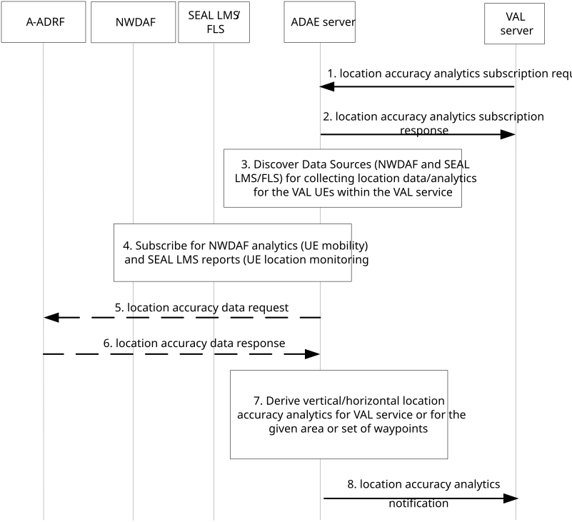

# 8.5 Procedure on support for location accuracy analytics

## 8.5.1 General

This clause describes the procedure for supporting location accuracy analytics.

## 8.5.2 Procedure

Figure 8.5.2-1 illustrates the procedure for location accuracy analytics enablement solution.

Pre-conditions:

1\. ADAES is connected to A-ADRF.

2\. ADAES has discovered SEAL LMS or FLS.

Figure 8.5.2-1: Location accuracy analytics procedure

1\. The VAL server makes a subscription request to ADAE server for location accuracy prediction/stats, including an analytics event ID (e.g. "location accuracy prediction" or "location accuracy sustainability"), an analytics request type (if not identified specifically at the event ID) which can be the location accuracy prediction for a given location X and/or for a given UE/app. The request may include also the target area, a target VAL service, or a VAL UE, or group of UEs of the VAL service, time validity, accuracy threshold and requirements. If the VAL UEs are provided by the VAL server, this request may also include the expected route or a set of waypoints for the UEs of the VAL application.

2\. The ADAE server sends a location accuracy analytics subscription response as an ACK to the VAL server.

3\. The ADAE server discovers and maps the Data Sources with the respective analytics event ID for collecting location data for the corresponding VAL UEs or VAL service area.

4\. The ADAE server subscribes for NWDAF UE mobility analytics per VAL UE (for all the VAL UEs) and gets notification on the per UE location/mobility analytics based on TS 23.288 clause 6.7.2. Such analytics may be requested for a list of waypoints per UE route (if indicated at step 1). The ADAE server subscribes also for SEAL LMS location reports for the respective VAL UEs or location reports from all VAL UEs within the requested area.

5\. The ADAE server optionally requests location accuracy historical analytics /data from A-ADRF for the corresponding VAL UEs or VAL service area.

6\. Based on the request, the ADAE server receives location accuracy historical analytics /data from A-ADRF for the corresponding VAL UEs or VAL service area.

7\. The ADAE server abstracts or correlates the data/analytics from steps 4-6 and provides analytics on the location accuracy for the target VAL application. Depending on the event ID in step 1, the ADAE server can indicate whether the location accuracy is sustainable or is predicted to be downgraded or can be upgraded and become more granular (e.g. from meter to decimetre).

8\. The ADAE server sends the location accuracy analytics notification to the consumer.

## 8.5.3 Information flows

### 8.5.3.1 General

The following information flows are specified for location accuracy analytics based on 8.5.2

### 8.5.3.2 Location accuracy analytics subscription request

Table 8.5.3.2-1 describes information elements for the location accuracy analytics subscription request from the VAL server to the ADAE server.

Table 8.5.3.2-1: Location accuracy analytics subscription request

| Information element             | Status | Description                                                                                                                                                                                                                          |
|---------------------------------|--------|--------------------------------------------------------------------------------------------------------------------------------------------------------------------------------------------------------------------------------------|
| VAL server ID                   | M      | The identifier of the VAL server.                                                                                                                                                                                                    |
| Analytics ID                    | M      | The identifier of the location accuracy analytics event. This ID can be for example "location accuracy prediction" or "location accuracy sustainability" depending on the expected outcome.                                          |
| Analytics type                  | M      | The type of analytics for the event, e.g. statistics or predictions.                                                                                                                                                                 |
| VAL UE ID(s) or Group ID        | M      | The identity of the VAL UE(s) or group of UEs for which the analytics subscription applies                                                                                                                                           |
| VAL service ID                  | O      | The identifier of the VAL service for which location accuracy analytics is requested.                                                                                                                                                |
| Location accuracy requirements  | M      | The accuracy threshold and VAL requirements.                                                                                                                                                                                         |
| Preferred confidence level      | O      | The level of accuracy for the analytics service (in case of prediction).                                                                                                                                                             |
| Area of Interest                | O      | The geographical or service area for which the subscription request applies.                                                                                                                                                         |
| Time validity                   | O      | The time validity of the subscription request.                                                                                                                                                                                       |
| UE mobility / route information | O      | Information on the target UE or group UE mobility including the expected route/set of waypoints.                                                                                                                                     |
| Reporting requirements          | O      | It describes the requirements for analytics reporting. This requirement may include e.g. the type and frequency of reporting (periodic or event triggered), the reporting periodicity in case of periodic, and reporting thresholds. |

### 8.5.3.3 Location accuracy analytics subscription response

Table 8.5.3.3-1 describes information elements for the location accuracy analytics subscription response from the ADAE server to the VAL server.

Table 8.5.3.3-1: Location accuracy analytics subscription response

| Information element | Status | Description                                                                             |
|---------------------|--------|-----------------------------------------------------------------------------------------|
| Result              | M      | The result of the analytics subscription request (positive or negative acknowledgement) |

### 8.5.3.4 Location accuracy data request

Table 8.5.3.4-1 describes information elements for the location accuracy data request from the ADAE server to the A-ADRF.

Table 8.5.3.4-1: Location accuracy data request

| Information element              | Status | Description                                                                                                                                                                                                                        |
|----------------------------------|--------|------------------------------------------------------------------------------------------------------------------------------------------------------------------------------------------------------------------------------------|
| ADAE server ID                   | M      | The identifier of the ADAE server                                                                                                                                                                                                  |
| Analytics ID                     | M      | The identifier of the analytics event                                                                                                                                                                                              |
| List of VAL UE IDs and addresses | M      | The VAL UE(s) identifiers and IP address(es) for which the data/analytics apply                                                                                                                                                    |
| VAL service ID                   | O      | The service ID, in case of requesting historical data for a particular VAL service.                                                                                                                                                |
| Reporting configuration          | O      | The configuration for data reporting. This requirement may include e.g. the frequency of reporting (periodic), the reporting periodicity in case of periodic, and reporting thresholds, whether data abstraction is needed or not. |
| Data collection requirements     | O      | The requirements for data collection, including the format of data, frequency of reporting, level of abstraction of data, level of accuracy of data.                                                                               |
| Area of Interest                 | O      | The geographical or service area for which the subscription request applies                                                                                                                                                        |
| Time validity                    | O      | The time validity of the request                                                                                                                                                                                                   |

### 8.5.3.5 Location accuracy data response

Table 8.5.3.5-1 describes information elements for the location accuracy data response from the A-ADRF to the ADAE server.

Table 8.5.3.5-1: Location accuracy data response

| Information element              | Status | Description                                                                                                                                                                |
|----------------------------------|--------|----------------------------------------------------------------------------------------------------------------------------------------------------------------------------|
| Analytics ID                     | M      | The identifier of the analytics event.                                                                                                                                     |
| List of VAL UE IDs and addresses | M      | The VAL UE(s) identifiers and IP address(es) for which the analytics apply                                                                                                 |
| VAL service ID                   | O      | The service ID, in case of requesting historical data for a particular VAL service.                                                                                        |
| Analytics Output                 | M      | The reported analytics for the location accuracy, which can be in form of offline stats/historical data for a specific VAL service or for particular UE(s) or group of UEs |

### 8.5.3.6 Location accuracy analytics notification

Table 8.5.3.6-1 describes information elements for the location accuracy analytics notification from the ADAE server to the VAL server.

Table 8.5.3.6-1: Location accuracy analytics notification

<table>
<colgroup>
<col style="width: 33%" />
<col style="width: 16%" />
<col style="width: 50%" />
</colgroup>
<thead>
<tr class="header">
<th>Information element</th>
<th>Status</th>
<th>Description</th>
</tr>
</thead>
<tbody>
<tr class="odd">
<td>Analytics ID</td>
<td>M</td>
<td>The identifier of the analytics event.</td>
</tr>
<tr class="even">
<td>VAL UE ID(s)</td>
<td>O</td>
<td>The identity of the VAL UE(s) for which the analytics applies.</td>
</tr>
<tr class="odd">
<td>VAL service ID</td>
<td>O</td>
<td>The identifier of the VAL service for which location accuracy analytics applies.</td>
</tr>
<tr class="even">
<td>Analytics Output</td>
<td>M</td>
<td>The analytics outputs, which can be predictive or statistical parameter</td>
</tr>
<tr class="odd">
<td>&gt; Location accuracy prediction</td>
<td>
O

(see NOTE)
</td>
<td>
A predicted or expected location accuracy change (downgrade or upgrade) for a particular VAL service or UEs.

The IE shall be provided if the Analytics ID is "location accuracy prediction".
</td>
</tr>
<tr class="even">
<td>&gt;&gt; Applicable area</td>
<td>O</td>
<td>A list of service area or geographical area for which the analytics applies to.</td>
</tr>
<tr class="odd">
<td>&gt;&gt; Applicable time period</td>
<td>O</td>
<td>The time period that the analytics applies to.</td>
</tr>
<tr class="even">
<td>&gt;&gt; Confidence level</td>
<td>O</td>
<td>For predictive analytics, the achieved confidence level can be provided.</td>
</tr>
<tr class="odd">
<td>&gt; Location accuracy sustainability</td>
<td>
O

(see NOTE)
</td>
<td>
The location accuracy sustainability for a VAL service or UE/group of UEs over a given time horizon/area.

The IE shall be provided if the Analytics ID is "location accuracy sustainability".
</td>
</tr>
<tr class="even">
<td>&gt;&gt; Applicable area</td>
<td>O</td>
<td>A list of service area or geographical area for which the analytics applies to.</td>
</tr>
<tr class="odd">
<td>&gt;&gt; Applicable time period</td>
<td>O</td>
<td>The time period that the analytics applies to.</td>
</tr>
<tr class="even">
<td>&gt;&gt; Crossed reporting threshold(s)</td>
<td>O</td>
<td>The Reporting Threshold(s) that are met or exceeded or crossed by the statistics value or the expected value of the location accuracy.</td>
</tr>
<tr class="odd">
<td>&gt;&gt; Confidence level</td>
<td>O</td>
<td>For predictive analytics, the achieved confidence level can be provided.</td>
</tr>
<tr class="even">
<td colspan="3">NOTE: At least one of the IEs shall be present.</td>
</tr>
</tbody>
</table>
