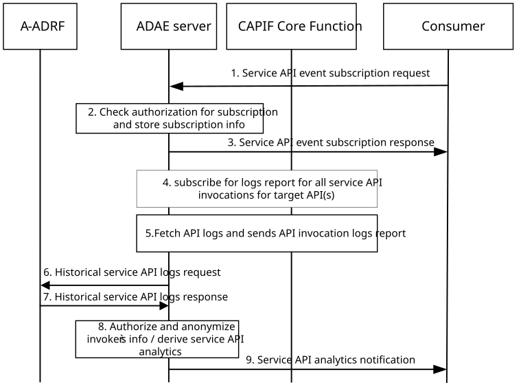

# 8.6 Procedure for supporting service API analytics

## 8.6.1 General

This clause describes the procedure for supporting service API analytics. Such analytics can be for one or more service APIs for a service produced by one or more service producers within the 5GS or enablement layer or the DN side (e.g., application server).

## 8.6.2 Procedure

Figure 8.6.2-1 illustrates the procedure for service API analytics enablement solution.

Pre-conditions:

1\. ADAES acts as API management function in CAPIF

Figure 8.6.2-1: Service API analytics procedure

1\. The consumer (VAL server, API provider) sends a service API event subscription request to the ADAE server to receive analytics for one or more service APIs.

2\. Upon receiving the subscription request from the subscribing entity, the ADAE server checks for the relevant authorization for the event subscription. If the authorization is successful, the ADAE server stores the subscription information.

3\. The ADAE server sends a service API event subscription response indicating successful subscription.

NOTE: When CCF and ADAE server are implemented together, the CCF generates the requested analytics based on the service API information available at the CCF and provides to the consumer.

4\. Upon sending the subscription response, the ADAE server requests to collect API logs to be used to derive analytics and triggers API invocation log pull request towards the CAPIF core function. The API invocation log fetch request indicates the API (or list of APIs) for which logs are required. Based on the ADAE server deployment, this can be a Query service API log request which is performed via CAPIF_Auditing API as specified in 3GPP TS 23.222 \[8\].

5\. The CCF authorizes the request and fetches the API logs from the storage unit. CCF then sends the requested information to the ADAE server via a query service API log response.

6\. The ADAES may also request service API historical analytics /data from A-ADRF for the corresponding service APIs.

7\. Based on the request, the ADAES receives historical analytics/data for the service APIs from the A-ADRF.

8\. The ADAE server authorizes and anonymizes the API logs (if not performed by CCF) and abstracts based on exposure level. The exposure level can be known based on pre-configuration by the OAM or based on the subscription and type of invoker. The ADAE server then derives analytics on the target service API(s) based on the logs received from the CCF. Such analytics are predictions/stats for the API status based on the analytics event. If Preference Information is received in the step 1, then the CCF generates the requested analytics using the service API invocation logs from multiple API provider domains, as given in the Preference Information. In step 4, if the usage information is received related to the API invocation logs from the CCF, then the usage information takes precedence over preference information from the analytics consumer.

9\. The ADAE server sends the analytics as event notifications to all the subscribing entities that have subscribed for the event matching the criteria. If a notification reception information is available as part of the subscribing entity event subscription, then the notification reception information is used by the ADAE server to send event notifications to the subscribing entity.

## 8.6.3 Information flows

### 8.6.3.1 General

The following information flows are specified for service API analytics based on 8.6.2.

### 8.6.3.2 Service API event subscription request

Table 8.6.3.2-1 describes information elements for the service API event subscription request from the consumer (VAL server, API provider) to the ADAE server.

Table 8.6.3.2-1: Service API event subscription request

| Information element                | Status | Description                                                                                                                                                                                                                                                                                                                                 |
|------------------------------------|--------|---------------------------------------------------------------------------------------------------------------------------------------------------------------------------------------------------------------------------------------------------------------------------------------------------------------------------------------------|
| Consumer ID                        | M      | The information to determine the identity of the subscribing entity (consumer).                                                                                                                                                                                                                                                             |
| Service API information            | M      | The service API name or type.                                                                                                                                                                                                                                                                                                               |
| Analytics ID                       | O      | The identifier of the analytics event. This ID can be for example “service API analytics”.                                                                                                                                                                                                                                                  |
| Analytics type                     | M      | The type of analytics for the event, e.g. statistics or predictions.                                                                                                                                                                                                                                                                        |
| Criteria                           | M      | The event criteria include event type information relevant to the prediction or stats on the number of failure API invocations, API availability, frequency and occurrence of API version changes, API location changes for the target API, Usage Metrics, Error Tracking, Most Used Endpoints, Security Monitoring, Latency Analysis, etc. |
| Preference Information             | O      | List of preferences related to the usage of set of other API provider domain’s service API information for generating the analytics (e.g., service API invocation logs).                                                                                                                                                                    |
| \>preference value                 | M      | Preference issued: “Allowed”, “Not Allowed”.                                                                                                                                                                                                                                                                                                |
| \>target identities                | O      | List of identities (e.g., API provider name, identities of the API provider functions, as specified in clause 8.28 of 3GPP TS 23.222 \[8\]) for which the “preference value” applies.                                                                                                                                                       |
| Time Validity                      | O      | Time validity of the subscription request.                                                                                                                                                                                                                                                                                                  |
| Time horizon                       | O      | The time horizon for predictive analytics.                                                                                                                                                                                                                                                                                                  |
| \> Start time                      | O      | The start time point of predictive validity. If omitted, the default value is the current time.                                                                                                                                                                                                                                             |
| \> End time                        | M      | The end time point of predictive validity.                                                                                                                                                                                                                                                                                                  |
| Area of interest                   | O      | Geographical or topological area for which the subscription applies.                                                                                                                                                                                                                                                                        |
| Notification reception information | O      | The information of the subscribing entity for receiving the notifications for the event.                                                                                                                                                                                                                                                    |
| Reporting requirements             | O      | It describes the requirements for analytics reporting. This requirement may include e.g. the type and frequency of reporting (periodic or event triggered), the reporting periodicity in case of periodic, and reporting thresholds in case of event triggered.                                                                             |

### 8.6.3.3 Service API event subscription response

Table 8.6.3.3-1 describes information elements for the service API event subscription response to the consumer (VAL server, API provider) from the ADAE server.

Table 8.6.3.3-1: Service API event subscription response

| Information element | Status | Description                                                                              |
|---------------------|--------|------------------------------------------------------------------------------------------|
| Result              | M      | The result of the analytics subscription request (positive or negative acknowledgement). |

### 8.6.3.4 Historical service API logs request

Table 8.6.3.4-1 describes information elements for the historical service API logs request from the ADAE server to the A-ADRF.

Table 8.6.3.4-1: Historical service API logs request

| Information element                   | Status | Description                                                                                                                                  |
|---------------------------------------|--------|----------------------------------------------------------------------------------------------------------------------------------------------|
| Service API log requestor information | M      | Identity information of the originated application querying service API log request.                                                         |
| ADAES ID                              | M      | Identity information of the ADAES.                                                                                                           |
| Service ID or UE ID                   | M      | Identity of the application service or UE for which the historical API invocations apply.                                                    |
| Target API(s) information             | M      | Information on target API or list of target APIs (name or type).                                                                             |
| \>Query information                   | O      | List of query filters such as invoker's ID and IP address, service API name and version, input parameters, and invocation result.            |
| \> API aggregation abstraction flag   | O      | What type of aggregation or abstraction/filtering needs to be applied.                                                                       |
| Reporting configuration               | O      | The configuration for the logs reporting. This requirement may include e.g. reporting thresholds, whether data abstraction is needed or not. |
| Area of validity                      | O      | The geographical area for which the request applies.                                                                                         |
| Time validity                         | O      | The time validity for the request.                                                                                                           |
| Exposure level requirement            | O      | The level of exposure requirement (e.g. permissions on the logs like read/write/delete) for the logs to be exposed.                          |

### 8.6.3.5 Historical service API logs response

Table 8.6.3.5-1 describes information elements for the historical service API logs response to the ADAE server from the A-ADRF.

Table 8.6.3.5-1: Historical service API logs response

| Information element        | Status | Description                                                                                                                                                                                                                                                                                       |
|----------------------------|--------|---------------------------------------------------------------------------------------------------------------------------------------------------------------------------------------------------------------------------------------------------------------------------------------------------|
| Result                     | M      | Identity information of the originated application querying service API log request.                                                                                                                                                                                                              |
| VAL service ID or UE ID    | M      | Identity of the application service or UE for which the API invocations apply.                                                                                                                                                                                                                    |
| Target API (s) information | M      | The target service API name or type.                                                                                                                                                                                                                                                              |
| \>Target API(s) logs       | M      | The API logs based on the subscription event. This may include the number of failure API invocations, API availability, frequency and occurrence of API version changes, API location changes for the target API, API throttling events, number of API invocations for a given area and time etc. |
| \>Reporting info           | O      | The time and area for which the reporting applies.                                                                                                                                                                                                                                                |

### 8.6.3.6 Service API analytics notification

Table 8.6.3.6-1 describes information elements for the service API analytics notification to the subscriber/consumer from the ADAE server.

Table 8.6.3.6-1: Service API analytics notification

| Information element     | Status | Description                                                                                                                                                                                                                                                                                                                                                                                                                                                                                                                                                                                     |
|-------------------------|--------|-------------------------------------------------------------------------------------------------------------------------------------------------------------------------------------------------------------------------------------------------------------------------------------------------------------------------------------------------------------------------------------------------------------------------------------------------------------------------------------------------------------------------------------------------------------------------------------------------|
| Service API information | M      | The service API name or type for which analytics apply.                                                                                                                                                                                                                                                                                                                                                                                                                                                                                                                                         |
| Analytics ID            | O      | The identifier of the analytics event. This ID can be for example “service API analytics”.                                                                                                                                                                                                                                                                                                                                                                                                                                                                                                      |
| Analytics Output        | M      | Stats or predictions based on abstracted or anonymized API logs (for example number of failure API invocations, API availability, frequency and occurrence of API version changes, API location changes for the target API, API throttling events, number of API invocations for a given area and time, API load statistics for a given edge network, Usage Metrics (Requests per Second, Total Requests, Response Times), Error Tracking (Error Rates), Most Used Endpoints, Security Monitoring (Unauthorized Access Attempts, Rate Limiting Violations), Latency Analysis, Audit Logs, etc). |
| Confidence level        | O      | For predictive analytics, the achieved confidence level can be provided.                                                                                                                                                                                                                                                                                                                                                                                                                                                                                                                        |
| Area of validity        | O      | Geographical or topological area for which the analytics apply.                                                                                                                                                                                                                                                                                                                                                                                                                                                                                                                                 |
