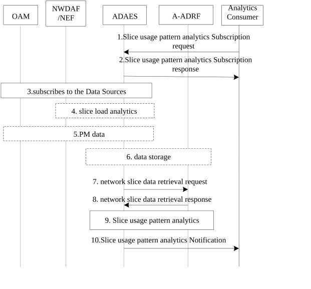
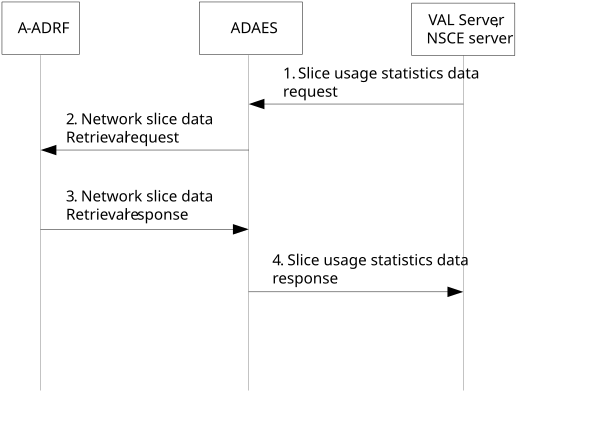

# 8.7 Slice usage pattern analytics

## 8.7.1 General

This clause provides a procedure for network slice usage pattern analytics based on collected network slice performance and analytics, historical network slice status, and network performance. The analytics consumer can be either the VAL server or other analytics consumers such as SEAL NSCE server.

## 8.7.2 Procedure on slice usage pattern analytics

Figure 8.7.2-1 illustrates the procedure for network slice usage pattern analytics.

Pre-conditions:

1\. The ADAES is registered and capable of interacting with 5GS to collected network slice data.

Figure 8.7.2-1: Procedure for network slice usage pattern analytics

> 1\. The analytics consumer (VAL server/NSCE server) sends a slice usage pattern analytics subscription request to ADAES and provides the target S-NSSAI, DNN, area of the interest, interest time period of the historical data (e.g., last year), the required confidence level, etc. Optionally, the slice requirement could also be provided.
>
> 2\. The ADAES sends a slice usage pattern analytics subscription response to the analytics consumer.
>
> 3\. The ADAES subscribes to the Data Sources with the respective Data Collection Event ID and the requirement for data collection related to the request slice(s). Such requests can be sent to OAM, NWDAF or the combination of them.
>
> 4\. Based on subscription, the ADAES may receive Network slice related Observed Service experience statistics, Load level information of a Network Slice from NWDAF (or via NEF) as defined in TS 23.288 \[4\].
>
> 5\. Based on subscription, the ADAES may receive Network slice / NSI related performance data from OAM as defined in TS 28.552 \[7\] and the alarms of network slice instances from OAM system via the procedures defined in clause 6.1 of TS 28.545 \[12\].
>
> 6\. If the data is collected from multiple sources, the ADAES combines or correlates the data/analytics from steps 3-5 and stores the data into A-ADRF if needed.
>
> 7\. The ADAES server sends the network slice data retrieval request to collect the historical data from A-ADRF.
>
> 8\. The A-ADRF provides network slice historical data to the ADAES.
>
> 9\. The ADAES analyzes the network slice usage pattern based on the network slice historical data and collected slice performance. When the stored historical data does not cover the required interest time period of the historical data, ADAES analyzes the slice usage pattern based on the existing stored historical data.
>
> 10**.** The ADAES sends the slice usage pattern analytics notification to the analytics consumer.

## 8.7.3 Procedure on retrieving slice usage statistics data

In the procedure shown in Figure 8.7.3-1, a mechanism is provided to allow for vertical/ASP using VAL server, NSCE server to initiate request for retrieving of statistics data and receive all the historical data for a specific time window.

Pre-conditions:

1\. Enterprise hosting the VAL server or NSCE server has SLA for analytics services with ADAES service provider.

2\. The VAL server or NSCE server has subscribed to slice usage patterns analytics from ADAES, and statistics are available.

3\. The VAL server or NSCE server has identified there is specific statistics data needed in a specific time window.

Figure 8.7.3-1: Retrieving of slice usage statistics data procedure

1\. The VAL server/NSCE server sends to ADAES server a slice usage statistics data request containing information about specific time and needed statistics parameters.

2\. ADAES server, based on the input in step 1, determines the needed analytics ID and data producer IDs, slice metrics for a specific slice area and specific period of time and uses the network slice data retrieval request to request the needed data from the A-ADRF.

3\. A-ADRF sends back the network slice data retrieval response with the required information from its database.

> 4\. The ADAES sends slice usage statistics data response to VAL server/NSCE server.

## 8.7.4 Information flows

### 8.7.4.1 General

The following information flows are specified for network slice usage pattern analytics based on 8.7.2.

### 8.7.4.2 Network slice usage pattern analytics subscription request

Table 8.7.4.2-1 describes information elements for the network slice usage pattern analytics subscription request from the analytics consumer (VAL server / NSCE server) to the ADAE server.

Table 8.7.4.2-1: Network slice usage pattern analytics subscription request

| Information element                         | Status | Description                                                                                                                                                                                                                                                                                             |
|---------------------------------------------|--------|---------------------------------------------------------------------------------------------------------------------------------------------------------------------------------------------------------------------------------------------------------------------------------------------------------|
| Consumer ID                                 | M      | The identifier of the analytics consumer                                                                                                                                                                                                                                                                |
| Analytics ID                                | O      | The identifier of the analytics event. This ID can be for example “Network slice usage pattern analytics”.                                                                                                                                                                                              |
| Analytics type                              | M      | The type of analytics for the event, e.g. statistics or predictions.                                                                                                                                                                                                                                    |
| Analytics filter information                | M      | Filter information for the analytics event.                                                                                                                                                                                                                                                             |
| \>Slice identifier                          | M      | The identifier of the target slice or slice instance, i.e. S-NSSAI.                                                                                                                                                                                                                                     |
| \>Slice requirement                         | O      | The requirement of network requirements or updated requirements when the network slice was created. The GST defined by GSMA (see clause 2.2 in \[10\]) and the performance requirements defined in clause 7 of TS 22.261 \[11\] are all considered as input for the network slice related requirements. |
| \>DNN                                       | O      | The target DNN for which the request applies.                                                                                                                                                                                                                                                           |
| \>Target VAL UE ID(s)                       | O      | The VAL UE(s) for which the analytics subscription applies                                                                                                                                                                                                                                              |
| \>Target VAL server ID                      | O      | If consumer is different from the VAL server, this identifier shows the target VAL server for which the analytics subscription applies.                                                                                                                                                                 |
| \>Area of Interest                          | O      | The geographical or service area for which the subscription request applies.                                                                                                                                                                                                                            |
| Preferred confidence level                  | O      | The level of accuracy for the analytics service (in case of prediction.                                                                                                                                                                                                                                 |
| Time validity                               | O      | The time validity of the request.                                                                                                                                                                                                                                                                       |
| Interest time period of the historical data | O      | Interest time period of the historical data (e.g. last year),                                                                                                                                                                                                                                           |
| Reporting requirements                      | O      | It describes the requirements for analytics reporting. This requirement may include e.g. the type and frequency of reporting (periodic or event triggered), the reporting periodicity in case of periodic, and reporting thresholds in case of event triggered.                                         |

### 8.7.4.3 Network slice usage pattern analytics subscription response

Table 8.7.4.3-1 describes information elements for the Network slice usage pattern analytics subscription response from the ADAE server to the analytics consumer (VAL/NSCE server).

Table 8.7.4.3-1: Network slice usage pattern analytics subscription response

| Information element                                     | Status | Description                                |
|---------------------------------------------------------|--------|--------------------------------------------|
| Successful response (NOTE)                              | O      | Indicates that the request was successful. |
| Failure response (NOTE)                                 | O      | Indicates that the request failed.         |
| \> Cause                                                | O      | Indicates the cause of request failure.    |
| NOTE: One of these IEs shall be present in the message. |        |                                            |

### 8.7.4.4 Network slice usage pattern analytics notification

Table 8.7.4.4-1 describes information elements for the network slice usage pattern analytics notification from the ADAE server to the analytics Consumer.

Table 8.7.4.4-1: Network slice usage pattern analytics notification

| Information element | Status | Description                                                                                                                            |
|---------------------|--------|----------------------------------------------------------------------------------------------------------------------------------------|
| Analytics ID        | O      | The identifier of the analytics event. This ID can be for example “Network slice usage pattern analytics”.                             |
| Analytics Output    | M      | The predictive or statistical parameter, which can be analytics of network slice usage pattern (e.g. periodicity of slice usage peak). |
| Confidence level    | O      | For predictive analytics, the achieved confidence level can be provided.                                                               |

### 8.7.4.5 Network slice data retrieval request

Table 8.7.4.5-1 describes information elements for the Network slice data retrieval request from the ADAE server to the A-ADRF.

Table 8.7.4.5-1: Network slice data retrieval request

| Information element                         | Status | Description                                                                                                                                          |
|---------------------------------------------|--------|------------------------------------------------------------------------------------------------------------------------------------------------------|
| ADAE server ID                              | M      | The identifier of the ADAE server.                                                                                                                   |
| Data Collection Event ID                    | M      | The identifier of the data collection event.                                                                                                         |
| Network slice identifier                    | M      | The identifier of the interested network slice.                                                                                                      |
| VAL service ID                              | O      | The identifier of the VAL service which is associated with network slice.                                                                            |
| Data Collection requirements                | M      | The requirements for data collection, including the format of data, frequency of reporting, level of abstraction of data, level of accuracy of data. |
| Analytics ID                                | O      | The identifier of the analytics event, for which the data collection is needed.                                                                      |
| List of Data Producer IDs                   | O      | In case when this request is performed via A-DCCF, then the list of Data Producer IDs is needed.                                                     |
| Target VAL UE ID(s) and address(es)         | O      | The VAL UE(s) identifiers and IP address(es) for which the data collection subscription apply.                                                       |
| Target VAL server ID                        | O      | This identifier of the target VAL server for which the data collection subscription applies.                                                         |
| Area of Interest                            | O      | The geographical or service area for which the requirement request applies.                                                                          |
| Interest time period of the historical data | O      | Interest time period of the historical data.                                                                                                         |
| Time validity                               | O      | The time validity of the request.                                                                                                                    |

### 8.7.4.6 Network slice data retrieval response

Table 8.7.4.6-1 describes information elements for the Network slice data retrieval response from the A-ADRF to the ADAE server.

Table 8.7.4.6-1: Network slice data retrieval response

| Information element                                                     | Status   | Description                                                                                                                                                                          |
|-------------------------------------------------------------------------|----------|--------------------------------------------------------------------------------------------------------------------------------------------------------------------------------------|
| Data Collection Event ID                                                | M        | The result of the data collection subscription request (positive or negative acknowledgement).                                                                                       |
| Network slice identifier                                                | M        | The identifier of the interested network slice                                                                                                                                       |
| Target VAL UE ID(s) and address(es)                                     | O (NOTE) | The VAL UE(s) identifiers and IP address(es) for which the data apply.                                                                                                               |
| Target VAL server ID                                                    | O (NOTE) | This identifier of the target VAL server for which the data applies.                                                                                                                 |
| Analytics ID                                                            | O        | The identifier of the analytics event.                                                                                                                                               |
| Data Type                                                               | O        | The type of reported data samples which can be UE data, network data, application data, edge data, or different granularities / abstraction of data (e.g. real time, non real time). |
| Data Output                                                             | M        | The reported data, which can be inform of measurements or offline/historical data on the requested parameter (e.g. RTT deviation) based on subscription.                             |
| Timestamp                                                               | O        | Time stamp of the collected report data.                                                                                                                                             |
| NOTE: One of these shall be present based on the data collection event. |          |                                                                                                                                                                                      |

### 8.7.4.7 Slice usage statistics data request

Table 8.7.4.7-1 describe information elements for the slice usage statistics data request between the VAL server, NSCE server and the ADAE server.

Table 8.7.4.7-1: Slice usage statistics data request

| Information element                 | Status | Description                                                                             |
|-------------------------------------|--------|-----------------------------------------------------------------------------------------|
| Consumer ID                         | M      | The identifier of the statistics consumer.                                              |
| Slice usage statistics data ID      | M      | Identifier of the slice usage data statistics, for which the data collection is needed. |
| Statistics data filter information  | M      | Filter information for the statistics data event.                                       |
| \> VAL service ID                   | M      | Identifier of the VAL service for which the request applies.                            |
| \> Network slice Identifier(s)      | M      | Identifier(s) of the network slice for which the request applies.                       |
| \> Network slice related parameters | O      | Slice parameters statistics needed.                                                     |
| \>DNN                               | O      | The target DNN for which the request applies.                                           |
| \> UE(s) related Identifier(s)      | O      | Identifier(s) of the related UE(s).                                                     |
| Area of Interest                    | O      | The geographical or service area for which the request applies.                         |
| StartTime                           | M      | The start time point of the requested statistics data.                                  |
| EndTime                             | M      | The end time point of the requested statistics data.                                    |

### 8.7.4.8 Slice usage statistics data response

Table 8.7.4.8-1- describe information elements for the slice usage statistics data response between the VAL server, NSCE server and the ADAE server.

Table 8.7.4.8-1: Slice usage statistics data response

<table>
<colgroup>
<col style="width: 33%" />
<col style="width: 16%" />
<col style="width: 50%" />
</colgroup>
<thead>
<tr class="header">
<th>Information element</th>
<th>Status</th>
<th>Description</th>
</tr>
</thead>
<tbody>
<tr class="odd">
<td>Result</td>
<td>M</td>
<td>Indicates the success or failure of slice usage pattern statistics data request.</td>
</tr>
<tr class="even">
<td>Slice usage statistics data ID</td>
<td>M</td>
<td>Identifier of the slice usage data statistics.</td>
</tr>
<tr class="odd">
<td>Network slice identifier</td>
<td>M</td>
<td>The identifier of the interested network slice.</td>
</tr>
<tr class="even">
<td>&gt;Data output</td>
<td>
O

(NOTE 1)
</td>
<td>The reported data related to the network slice usage pattern statistics data request.</td>
</tr>
<tr class="odd">
<td>&gt;&gt; Timestamp</td>
<td>O</td>
<td>Time stamp of the collected report data.</td>
</tr>
<tr class="even">
<td>&gt;Cause</td>
<td>
O

(NOTE 2)
</td>
<td>Indicates the cause of the slice usage pattern statistics data request failure.</td>
</tr>
<tr class="odd">
<td colspan="3">
NOTE 1: Shall be present if the result is success.

NOTE 2: Shall be present if the result is failure.
</td>
</tr>
</tbody>
</table>
