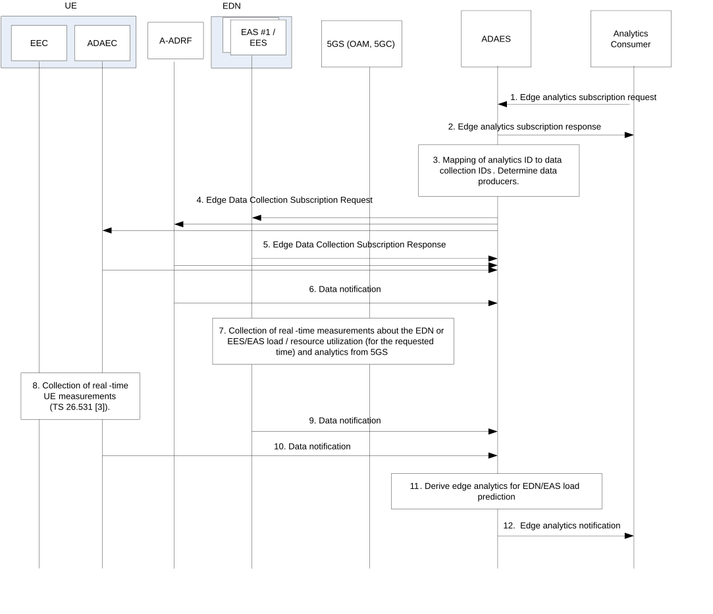
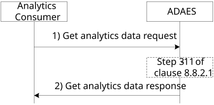

# 8.8 Procedure for supporting edge load analytics

## 8.8.1 General

This clause describes two procedures (covering both subscribe-notify and request-response models in 8.8.2.1 and 8.8.2.2 respectively) for supporting edge load analytics, where the edge analytics are performed based on data collected from the EDN (EAS and/or EES) and A-ADRF.

## 8.8.2 Procedure

### 8.8.2.1 Subscribe-notify model

Figure 8.8.2.1-1 illustrates the procedure for edge load analytics enablement solution.

Pre-conditions:

1\. ADAES has discovered the APIs to access the edge services at EDN.

2\. ADAES has subscribed to OAM and NWDAF for receiving management and DN performance analytics respectively.

3\. Data producers (e.g. A-ADRF, EAS, EES) may be pre-configured with data producer profiles (as in Table 8.2.4.8-1) for the data they can provide. ADAES and ADAEC have discovered available data producers and their data producer profiles.

Figure 8.8.2.1-1: ADAES support for edge analytics

1\. The consumer of the ADAES analytics service sends an edge analytics subscription request to ADAES.

2\. The ADAES sends an edge analytics subscription response as an ACK to the analytics consumer.

3\. The ADAES maps the analytics event ID to a list of data collection event identifiers, and a list of data producer IDs. Such mapping may be preconfigured by OAM or may be determined by ADAES based on the analytics event ID and/or data producer profile (Table 8.2.4.8-1). Such Data Producers can be EASs onboarded to EDN, EESs, A-ADRF, as well as MEC Platform services.

4\. The ADAES sends a subscription request to the Data Producers (EASs onboarded to EDN, EESs, A-ADRF, ADAEC) or the A-DCCF with the respective Data Collection Event ID and the requirement for data collection.

5\. The Data Producers (e.g., EASs onboarded to EDN, EESs, A-ADRF, ADAEC) or the A-DCCF send a subscription response as a positive or negative acknowledgement to the ADAES.

6\. The ADAES based on subscription receive offline stats/data on the edge DN load based on the analytics/data collection event ID from A-ADRF. Such stats can be about the load in terms of number of EAS or EES connections for a given area or time window, or the average edge computational resource usage or usage ratio based on the EDN total resource availability, EDN overload/high load indication events, probability of EAS/EES unavailability due to high load, etc.

7\. The Data Producers at the edge start collecting data from the data generating entities. Such data can be measurements or analytics based on the data source/producer, as follows:

\- from OAM or EAS/ASP (for EAS load info): Per EAS/EES computational resource load, number of connections per EES/EAS

\- from N6 endpoint: N6 load

\- from 5GC / NWDAF: DN performance analytics

\- from OAM / MDAS: UPF load analytics (per DNAI)

\- from MEC platform services (e.g., RNIS): per cell radio conditions / load for all cells within EDN coverage

NOTE 1: How the ADAES obtains the EAS load information from EAS/ASP is up to implementation.

NOTE 2: Steps 6 and 7 are not necessarily sequential and can be performed in parallel or in different order.

8\. If in step 4 ADAES sent a subscription request to ADAEC as Data Producer, data collection is initiated by ADAEC from UE data generating entities.

NOTE 3: Data collection at the UE reuses the SA4 mechanism based on EVEX study (TS 26.531 \[3\]).

9\. The edge Data Producers (targets of the subscription requests in step 4) send the data to the ADAES (based on step 7 measurements or analytics) as a data notification message. Such data can be about the load in terms of number of EAS or EES connections for a given area or time window, or the average edge computational resource usage or usage ratio based on the EDN total resource availability, EDN overload/high load indication events, probability of EAS/EES unavailability due to high load, etc.

10\. ADAEC sends data (periodically or if a threshold is reached based on configuration) about the edge load as collected at the UE, e.g. in terms of number of AC or EEC connections for a given UE in a given time window, number of edge service sessions, etc.

11\. The ADAES derives edge analytics on EDN / DNAI load or per EES/EAS load, based on the analytics ID and type of request. The analytics are derived based on the performance analytics received per DN or load analytics per DNAI/UPF; as well as considering measurements on the computational or RAN resource load or number of connections for the EES/EASs which are active at the EDN.

12**.** The ADAES sends the edge analytics to the consumer, based on the request and the derived analytics in step 9. Such analytics indicate a prediction of the EDN load considering inputs from both 5GS as well as from edge platform services. Such prediction can also be in form of a recommendation for triggering an EAS relocation to a different platform.

### 8.8.2.2 Request-response model

Figure 8.8.2.2-1 illustrates the procedure for the analytics consumer to request analytics data of the application server(s) from the ADAE server.

Figure 8.8.2.2-1: ADAES support for edge analytics

1\. The analytics consumer sends a request message to the ADAE server to receive analytics data for one or more application servers. The request message includes the identity of the analytics consumer, security credential(s) for authorization and verification, identity of all the application server for which analytics data is requested, type of analytics data, time duration since when analytics data is required.

2\. Upon receiving the request, the ADAE server authenticates and authorizes the analytics consumer. If the analytics consumer is authorized, the ADAE server may get the analytics by performing step 3 to 11 of clause 8.8.2.1. The ADAE server sends a response message including the statistical and predictive analytics of the edge performance/load for the edge platform or EES/EAS for the requested duration period (if the time duration is available).

## 8.8.3 Information flows

### 8.8.3.1 General

The following information flows are specified for edge load analytics based on 8.8.2.

### 8.8.3.2 Edge analytics subscription request

Table 8.8.3.2-1 describes information elements for the edge analytics subscription request from the VAL server / Consumer to the ADAE server.

Table 8.8.3.2-1: Edge analytics subscription request

| Information element                           | Status   | Description                                                                                                                                                                                                                          |
|-----------------------------------------------|----------|--------------------------------------------------------------------------------------------------------------------------------------------------------------------------------------------------------------------------------------|
| Analytics Consumer ID                         | M        | The identifier of the analytics consumer (VAL server, EAS).                                                                                                                                                                          |
| Analytics ID                                  | M        | The identifier of the analytics event. This ID can be for example “Edge platform analytics”, “EES analytics”, “EAS analytics”.                                                                                                       |
| Analytics type                                | M        | The type of analytics for the event, e.g. statistics or predictions.                                                                                                                                                                 |
| Destination EAS information                   | O (NOTE) | This identifier shows the destination EAS information including destination EAS ID and destination EAS endpoint for which the analytics subscription applies.                                                                        |
| Destination EES information                   | O (NOTE) | This identifier shows the destination EES information including destination EES ID and destination EES endpoint for which the analytics subscription applies.                                                                        |
| DNN/DNAI                                      | O (NOTE) | DNN or DNAIs information for which the subscription applies.                                                                                                                                                                         |
| Target data producer profile criteria         | O        | Characteristics of the data producers to be used.                                                                                                                                                                                    |
| Preferred confidence level                    | O        | The level of accuracy for the analytics service (in case of prediction).                                                                                                                                                             |
| Area of Interest                              | O        | The geographical or service area for which the subscription request applies.                                                                                                                                                         |
| Time validity                                 | O        | The time validity of the subscription request.                                                                                                                                                                                       |
| Reporting requirements                        | O        | It describes the requirements for analytics reporting. This requirement may include e.g. the type and frequency of reporting (periodic or event triggered), the reporting periodicity in case of periodic, and reporting thresholds. |
| NOTE: At least one of these shall be present. |          |                                                                                                                                                                                                                                      |

### 8.8.3.3 Edge analytics subscription response

Table 8.8.3.3-1 describes information elements for the edge analytics subscription response from the ADAE server to the consumer.

Table 8.8.3.3-1: Edge analytics subscription response

| Information element | Status | Description                                                                              |
|---------------------|--------|------------------------------------------------------------------------------------------|
| Result              | M      | The result of the analytics subscription request (positive or negative acknowledgement). |

### 8.8.3.4 Edge data collection subscription request

Table 8.8.3.4-1 describes information elements for the edge data collection subscription request from the ADAE server to the Data Producer at the EDN or the A-DCCF, or from ADAE server to ADAE client.

Table 8.8.3.4-1: Data collection subscription request

| Information element                           | Status   | Description                                                                                                                                                   |
|-----------------------------------------------|----------|---------------------------------------------------------------------------------------------------------------------------------------------------------------|
| ADAE server ID                                | M        | The identifier of the ADAE server                                                                                                                             |
| Data Collection Event ID                      | M        | The identifier of the data collection event                                                                                                                   |
| Data Collection requirements                  | M        | The requirements for data collection, including the format of data, frequency of reporting, level of abstraction of data, level of accuracy of data.          |
| Analytics ID                                  | O        | The identifier of the analytics event, for which the data collection is needed.                                                                               |
| List of Data Producer IDs                     | O        | In case when this request is performed via A-DCCF, then the list of Data Producer IDs is needed.                                                              |
| Destination EAS information                   | O (NOTE) | This identifier shows the destination EAS information including destination EAS ID and destination EAS endpoint for which the analytics subscription applies. |
| Destination EES information                   | O (NOTE) | This identifier shows the destination EES information including destination EES ID and destination EES endpoint for which the analytics subscription applies. |
| DNN/DNAI                                      | O (NOTE) | DNN or DNAIs information for which the subscription applies.                                                                                                  |
| Target data producer profile criteria         | O        | Characteristics of the data producers to be used.                                                                                                             |
| Area of Interest                              | O        | The geographical or service area for which the requirement request applies.                                                                                   |
| Time validity                                 | O        | The time validity of the request.                                                                                                                             |
| NOTE: At least one of these shall be present. |          |                                                                                                                                                               |

### 8.8.3.5 Edge data collection subscription response

Table 8.8.3.5-1 describes information elements for the Data collection subscription response from the edge Data Producer at the EDN or the A-DCCF to the ADAE server, or from ADAE client to ADAE server.

Table 8.8.3.5-1: Data collection subscription response

| Information element | Status | Description                                                                                         |
|---------------------|--------|-----------------------------------------------------------------------------------------------------|
| Result              | M      | The result of the edge data collection subscription request (positive or negative acknowledgement). |

### 8.8.3.6 Data Notification

Table 8.8.3.6-1 describes information elements for the Data Notification from the Data Producer to the ADAE server.

Table 8.8.3.6-1: Data notification

| Information element                                                              | Status   | Description                                                                                                                                                                                                                                                                                      |
|----------------------------------------------------------------------------------|----------|--------------------------------------------------------------------------------------------------------------------------------------------------------------------------------------------------------------------------------------------------------------------------------------------------|
| Data Collection Event ID                                                         | M        | The identifier of the data collection event.                                                                                                                                                                                                                                                     |
| Data Producer ID                                                                 | M        | The identity of Data Producer.                                                                                                                                                                                                                                                                   |
| Destination EAS information                                                      | O (NOTE) | This identifier shows the destination EAS information including destination EAS ID and destination EAS endpoint for which the analytics subscription applies.                                                                                                                                    |
| Destination EES information                                                      | O (NOTE) | This identifier shows the destination EES information including destination EES ID and destination EES endpoint for which the analytics subscription applies.                                                                                                                                    |
| DNN/DNAI                                                                         | O (NOTE) | DNN or DNAIs information for which the subscription applies.                                                                                                                                                                                                                                     |
| Analytics ID                                                                     | O        | The identifier of the analytics event.                                                                                                                                                                                                                                                           |
| Data Type                                                                        | M        | The type of reported data samples which can be network data, application data, edge data, or different granularities / abstraction of data (e.g. real time, non-real time). This also indicates whether data are offline (from A-ADRF or not).                                                   |
| Data Output                                                                      | M        | The reported data, which can be inform of measurements or offline/historical data on the requested parameter based on subscription. Such data can be per EDN or per DNAI or per EAS/EES load statistics and edge computational resource utilization stats for a given time and area of interest. |
| NOTE: At least one of these shall be present based on the data collection event. |          |                                                                                                                                                                                                                                                                                                  |

### 8.8.3.7 Edge analytics Notification

Table 8.8.3.7-1 describes information elements for the Edge analytics Notification from the ADAE server to the VAL server / Consumer.

Table 8.8.3.7-1: Edge analytics notification

<table>
<colgroup>
<col style="width: 33%" />
<col style="width: 16%" />
<col style="width: 50%" />
</colgroup>
<thead>
<tr class="header">
<th>Information element</th>
<th>Status</th>
<th>Description</th>
</tr>
</thead>
<tbody>
<tr class="odd">
<td>Analytics ID</td>
<td>M</td>
<td>The identifier of the analytics event.</td>
</tr>
<tr class="even">
<td>Analytics Output</td>
<td>M</td>
<td>The analytics outputs, which can be predictive or statistical parameter.</td>
</tr>
<tr class="odd">
<td>&gt; Edge platform analytics</td>
<td>
O

(see NOTE)
</td>
<td>Statistics/predictions of the performance/load of the EDN or the associated edge platform, such as the number of EAS or EES connections.</td>
</tr>
<tr class="even">
<td>&gt;&gt; Applicable time period</td>
<td>O</td>
<td>The time period that the analytics applies to.</td>
</tr>
<tr class="odd">
<td>&gt;&gt; Confidence level</td>
<td>O</td>
<td>For predictive analytics, the achieved confidence level can be provided.</td>
</tr>
<tr class="even">
<td>&gt; EES analytics</td>
<td>
O

(see NOTE)
</td>
<td>Statistics/predictions of the performance/load of the EES, such as the EES unavailability.</td>
</tr>
<tr class="odd">
<td>&gt;&gt; Applicable time period</td>
<td>O</td>
<td>The time period that the analytics applies to.</td>
</tr>
<tr class="even">
<td>&gt;&gt; Confidence level</td>
<td>O</td>
<td>For predictive analytics, the achieved confidence level can be provided.</td>
</tr>
<tr class="odd">
<td>&gt; EAS analytics</td>
<td>
O

(see NOTE)
</td>
<td>Statistics/predictions of the performance/load of the EAS, such as the EAS unavailability.</td>
</tr>
<tr class="even">
<td>&gt;&gt; Applicable time period</td>
<td>O</td>
<td>The time period that the analytics applies to.</td>
</tr>
<tr class="odd">
<td>&gt;&gt; Confidence level</td>
<td>O</td>
<td>For predictive analytics, the achieved confidence level can be provided.</td>
</tr>
<tr class="even">
<td colspan="3">NOTE: At least one of these information elements shall be provided based on the analytics ID specified in the edge analytics subscription request as in Table 8.8.3.2-1.</td>
</tr>
</tbody>
</table>

### 8.8.3.8 Get analytics data request

Table 8.8.3.8-1 describes information elements for the Get analytics data request from the analytics consumer to the ADAE server.

Table 8.8.3.8-1: Get analytics data request

| Information element                          | Status   | Description                                                                                                                                                          |
|----------------------------------------------|----------|----------------------------------------------------------------------------------------------------------------------------------------------------------------------|
| Analytics Consumer ID                        | M        | The identifier of the analytics consumer (VAL server, EAS, EES).                                                                                                     |
| Analytics ID                                 | M        | The identifier of the analytics event. This ID can be for example “Edge platform analytics”, “EES analytics”, “EAS analytics”.                                       |
| Analytics type                               | M        | The type of analytics, e.g. statistics or predictions.                                                                                                               |
| Destination EASs information                 | O (NOTE) | This identifier provides the list of destination EASs information including destination EAS ID and destination EAS endpoint for which the analytics request applies. |
| Destination EESs information                 | O (NOTE) | This identifier provides the list of destination EESs information including destination EES ID and destination EES endpoint for which the analytics request applies. |
| Preferred confidence level                   | O        | The level of accuracy for the analytics service (in case of prediction).                                                                                             |
| Time duration                                | O        | Time duration since when analytics data is required.                                                                                                                 |
| NOTE: At least one of these shall be present |          |                                                                                                                                                                      |

### 8.8.3.9 Get analytics data response

Table 8.8.3.9-1 describes information elements for the Get analytics data response from the ADAE server to the consumer.

Table 8.8.3.9-1: Get analytics data response

<table>
<colgroup>
<col style="width: 33%" />
<col style="width: 16%" />
<col style="width: 50%" />
</colgroup>
<thead>
<tr class="header">
<th>Information element</th>
<th>Status</th>
<th>Description</th>
</tr>
</thead>
<tbody>
<tr class="odd">
<td>Result</td>
<td>M</td>
<td>The result of the analytics data request (positive or negative acknowledgement).</td>
</tr>
<tr class="even">
<td>Analytics ID</td>
<td>O</td>
<td>The identifier of the analytics event.</td>
</tr>
<tr class="odd">
<td>Analytics Output</td>
<td>O</td>
<td>The analytics outputs, which can be predictive or statistical parameter.</td>
</tr>
<tr class="even">
<td>&gt; Edge platform analytics</td>
<td>
O

(see NOTE)
</td>
<td>Statistics/predictions of the performance/load of the EDN or the associated edge platform, such as the number of EAS or EES connections.</td>
</tr>
<tr class="odd">
<td>&gt;&gt; Applicable time period</td>
<td>O</td>
<td>The time period that the analytics applies to.</td>
</tr>
<tr class="even">
<td>&gt;&gt; Confidence level</td>
<td>O</td>
<td>For predictive analytics, the achieved confidence level can be provided.</td>
</tr>
<tr class="odd">
<td>&gt; EES analytics</td>
<td>
O

(see NOTE)
</td>
<td>Statistics/predictions of the performance/load of the EES, such as the EES unavailability.</td>
</tr>
<tr class="even">
<td>&gt;&gt; Applicable time period</td>
<td>O</td>
<td>The time period that the analytics applies to.</td>
</tr>
<tr class="odd">
<td>&gt;&gt; Confidence level</td>
<td>O</td>
<td>For predictive analytics, the achieved confidence level can be provided.</td>
</tr>
<tr class="even">
<td>&gt; EAS analytics</td>
<td>
O

(see NOTE)
</td>
<td>Statistics/predictions of the performance/load of the EAS, such as the EAS unavailability.</td>
</tr>
<tr class="odd">
<td>&gt;&gt; Applicable time period</td>
<td>O</td>
<td>The time period that the analytics applies to.</td>
</tr>
<tr class="even">
<td>&gt;&gt; Confidence level</td>
<td>O</td>
<td>For predictive analytics, the achieved confidence level can be provided.</td>
</tr>
<tr class="odd">
<td colspan="3">NOTE: At least one of these information elements shall be provided based on the analytics ID specified in the get analytics data request as in Table 8.8.3.8-1.</td>
</tr>
</tbody>
</table>
