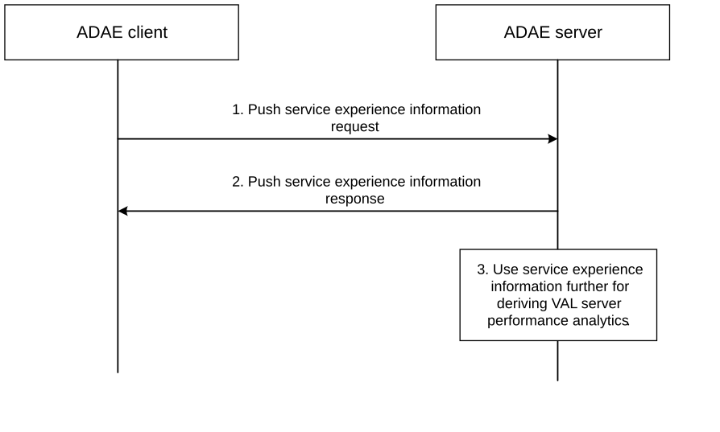
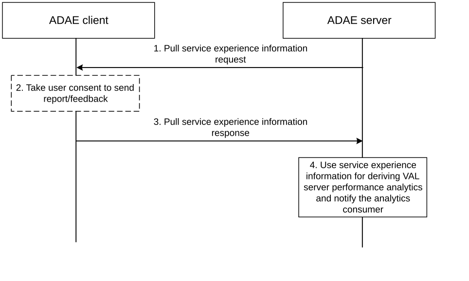

# 8.9 Procedure on Service experience to support application performance analytics

## 8.9.1 General

When Application server (like VAL server) is not available to provide analytics data due to overload or any other reasons or the application server is not providing the required quality of service experience at the UE side, the ADAE server may need to rely on alternate information sources like the application clients (like VAL clients) that provide the visibility on application service status. ADAE server can use this information from the clients alone, for the predictions and share with the consumer of the analytics. This clause provides a mechanism for the ADAE client to send service experience report to the ADAE server. ADAE server upon receiving the service experience information from the UE side entities can use it for predictions of application performance analytics.

NOTE: In this solution, if DDCC client is available in the UE, ADAE server uses data collection and reporting mechanisms as defined in 3GPP TS 26.531 \[3\], where the ADAE client acts as a UE application and ADAE server acts as an AF from Application service provider. The indirect reporting procedure (between ADAE client and ADAE server over ADAE-UU interface) may be used when a Direct Data Collection Client is not available in the UE.

## 8.9.2 Procedure

### 8.9.2.1 Push service experience information

The ADAE client determines the service experience information based on information received from the VAL client. The service experience information includes application specific performance measurements like end-to-end response time, connection bandwidth, request rate, server availability time, etc. On request from VAL client or any other trigger conditions, the ADAE client sends the service experience report about a VAL server to the ADAE server. The ADAE client may use the direct reporting mechanism as defined in clause 5.5 of 3GPP TS 26.531 \[3\]. The indirect reporting procedure (between ADAE client and ADAE server over ADAE-UU interface) may be used when a Direct Data Collection Client is not available in the UE or when the ADAE server (having Indirect Data Collection Client) needs to modify the collected UE data to satisfy the requirements of its data collection and reporting configuration. The information elements as defined in clause 8.9.3.1 are used by ADAE client to send the request and clause 8.9.3.2 are used by ADAE server to send the response.

For direct reporting, if data reporting session is not available, the ADAE client creates data reporting session as specified in clause 5.4 of 3GPP TS 26.531 \[3\]. Once data reporting session is available, the ADAE client (acting as a UE client) sends reports to ADAE server using direct reporting method as specified in clause 5.5 of 3GPP TS 26.531 \[3\].

For indirect reporting, Figure 8.9.2.1-1 illustrates the procedure where the ADAE client pushes the service experience information to the ADAE server.

Figure 8.9.2.1-1: Push service experience informtion from UE

1\. The ADAE client sends Push service experience request to the ADAE server. The request contains service experience report about a VAL server and includes the information elements as specified in Table 8.9.3.1-1.

2\. The ADAE server sends Push service experience response to the ADAE client.

3\. Upon receiving the Push service experience request from the ADAE client, the ADAE server uses the service experience report for derivation of VAL server performance analytics.

Once UE data is collected (either using direct reporting or indirect reporting), the ADAE server may take further actions based on the analysis of the report as shared by the ADAE client. A service experience information from certain UEs, can trigger the ADAE server to fetch further service experience information from other UEs. The ADAE server can use the service experience information report from other UEs to determine/predict analytics.

\- If most of the UE side entities report similar service experience, then it could be the application server problem across globally.

\- If only some UEs report a bad service experience, the problem could be localized among a group of UEs.

\- If the bad service experience from only one UE, the problem is localized to the UE.

### 8.9.2.2 Pull service experience information

The procedure can be initiated by the ADAE server upon receiving a service experience from an ADAE client, to fetch service experience information from other ADAE clients or upon receiving VAL server performance analytics request from application service provider (application server) or any other event that requires the ADAE server to determine the service experience data.

Figure 8.9.2.2-1: Pull service experience information from UE

1\. The ADAE server sends Pull service experience information request to the ADAE client. The request contains identifier of the specific VAL server and VAL service ID, for which the service experience report is required, as mentioned in Table 8.9.3.3-1.

2\. Upon receiving the Pull service experience information request from the ADAE server, the ADAE client may take user consent to send the report if the user consent is not available already.

3\. The ADAE client sends the Pull service experience information response to the ADAE server. The ADAE client instructs the Direct Data Collection Client to prioritise immediate delivery of a UE data report to the Data Collection AF as specified in clause 5.5 of 3GPP TS 26.531 \[3\]. The service experience contains parameters as specified in Table 8.9.3.4-1.

4\. The ADAE server uses the service experience report for derivation of VAL server performance analytics.

### 8.9.2.3 Service experience information based on triggers

The ADAE server configures triggers to the ADAE client to send the service experience report using the mechanism defined in clause 5.4 of 3GPP TS 26.531 \[3\].

The procedure can be initiated by the ADAE server upon receiving VAL server performance analytics request from application service provider (application server). The information elements as defined in clause 8.9.3.5 are used by ADAE server to send the request and clause 8.9.3.6 are used by ADAE client to send the response.

## 8.9.3 Information flows

### 8.9.3.1 Push service experience information request

Table 8.9.3.1-1 describes information elements for the Push service experience information request from the ADAE client to the ADAE server.

Table 8.9.3.1-1: Push service experience information request

| Information element           | Status | Description                                                                                                                                               |
|-------------------------------|--------|-----------------------------------------------------------------------------------------------------------------------------------------------------------|
| VAL UE ID                     | M      | The identifier of the VAL UE.                                                                                                                             |
| VAL service ID                | O      | The identifier of the VAL service for which the service experience report applies.                                                                        |
| VAL server ID                 | M      | The identifier of the VAL server for which the service experience report is sent.                                                                         |
| Timestamp                     | O      | Time stamp of the collected report.                                                                                                                       |
| VAL service experience report | O      | Information related to VAL service experience. It may include end-to-end response time, connection bandwidth, request rate, VAL server availability, etc. |

### 8.9.3.2 Push service experience information response

Table 8.9.3.2-1 describes information elements for the Push service experience information response from the ADAE server to the ADAE client.

Table 8.9.3.2-1: Push service experience information response

| Information element | Status | Description                                  |
|---------------------|--------|----------------------------------------------|
| Result              | M      | Indicates success or failure of the request. |

### 8.9.3.3 Pull service experience information request

Table 8.9.3.3-1 describes information elements for the Pull service experience information request from the ADAE server to the ADAE client.

Table 8.9.3.3-1: Pull service experience information request

| Information element | Status | Description                                                                                  |
|---------------------|--------|----------------------------------------------------------------------------------------------|
| VAL server ID       | M      | The identifier of the VAL server for which the service experience information is requested.  |
| VAL service ID      | O      | The identifier of the VAL service for which the service experience information is requested. |

### 8.9.3.4 Pull service experience information response

Table 8.9.3.4-1 describes information elements for the Pull service experience information response from the ADAE client to the ADAE server.

Table 8.9.3.4-1: Pull service experience information request response

| Information element                                         | Status | Description                                                                                                                                               |
|-------------------------------------------------------------|--------|-----------------------------------------------------------------------------------------------------------------------------------------------------------|
| Result                                                      | M      | Indicates success or failure of the request.                                                                                                              |
| VAL UE ID                                                   | M      | The identifier of the VAL UE.                                                                                                                             |
| VAL service ID (NOTE)                                       | O      | The identifier of the VAL service for which the service experience report applies.                                                                        |
| VAL Server ID                                               | M      | The identifier of the VAL server for which the service experience report is sent.                                                                         |
| Timestamp (NOTE)                                            | O      | Time stamp of the collected report.                                                                                                                       |
| VAL service experience report (NOTE)                        | O      | Information related to VAL service experience. It may include end-to-end response time, connection bandwidth, request rate, VAL server availability, etc. |
| NOTE: These IEs are included only if the result is success. |        |                                                                                                                                                           |

### 8.9.3.5 Configure service experience report trigger request

Table 8.9.3.5-1 describes information elements for the Configure service experience report trigger request from the ADAE server to the ADAE client.

Table 8.9.3.5-1: Configure service experience report trigger request

| Information element                       | Status | Description                                                                                                                                                                  |
|-------------------------------------------|--------|------------------------------------------------------------------------------------------------------------------------------------------------------------------------------|
| VAL server specific criteria              | M      | List of VAL server specific criteria.                                                                                                                                        |
| \> VAL server ID                          | M      | The identifier of the VAL server.                                                                                                                                            |
| \> Triggering Criteria                    | M      | Information about the triggers on which the service experience is to be reported for the VAL server.                                                                         |
| Common Triggering criteria                | O      | Information about the triggers (applicable to all VAL servers) on which the service experience is fetched.                                                                   |
| Service experience measurement to monitor | O      | Information about the service experience measurements which needs to be fetched and included in the report. If not present, by default end-to-end response time is measured. |
| Notification Target Address               | O      | The Notification target address (e.g. URL) where the notifications destined for the ADAE Server should be sent to.                                                           |

### 8.9.3.6 Configure service experience report trigger response

Table 8.9.3.6-1 describes information elements for the Configure service experience report trigger response from the ADAE client to the ADAE server.

Table 8.9.3.6-1: Configure service experience report trigger response

| Information element | Status | Description                                  |
|---------------------|--------|----------------------------------------------|
| Result              | M      | Indicates success or failure of the request. |
