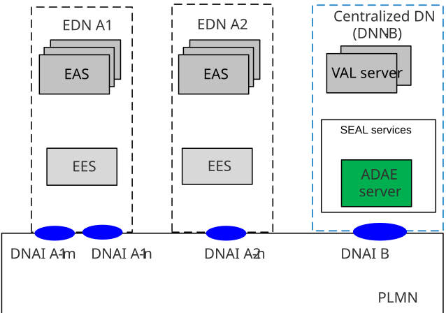
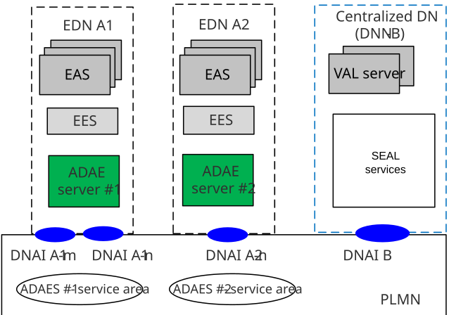
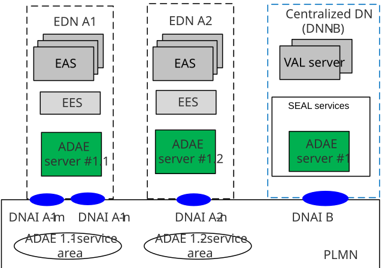

# Annex A (informative): Deployment scenarios

## A.1 General

This clause provides the different deployment models for ADAE services. There could be three deployment options:

\- ADAES can be deployed at a centralized cloud platform, and collects data from multiple EDNs

\- ADAES can be deployed at the edge platform

\- Coordinated ADAES deployment, where multiple ADAE services are deployed in edge or central clouds. Such deployment allows for local-global analytics for system wide optimization

## A.2 Deployment model #1: Cloud-deployed ADAES

In this deployment, as shown in Figure A.2-1, the ADAES is centrally located and can provide analytics services to different consumers including, edge servers, VAL servers, as well as to other SEAL servers (e.g. NSCE).

The statistics/predictions that the ADAES provides are applicable to the ADAES service area, which can be provided for the entire PLMN.

Figure A.2-1: Cloud deployed ADAES

## A.3 Deployment model #2 Edge-deployed ADAES

In this deployment, as shown in Figure A.3-1, the ADAES is located at the EDN and provides analytics services to the EAS and EES at the edge platform. ADAES can be deployed by the ECSP or the MNO to provide analytics for the application or edge parameters.

The statistics/predictions that the edge deployed ADAES are applicable to the ADAES service areas (as shown in the example in Fig A.2-2), which are equivalent to the EES/EAS service areas. Such analytics can be about the edge load or the EAS performance and can be provided to consumers within EDN.

In this deployment the interaction between edge deployed ADAES is possible for exchanging edge/application analytics for application mobility scenarios or for cases when ADAES \#1 and \#2 service areas have overlapping coverage.

Figure A.3-1: Edge deployed ADAES

## A.4 Deployment model #3: Coordinated ADAES deployment

In this deployment, multiple ADAESs can be located at different EDNs/DNs and can be deployed by the same ADAE provider. Such coordinated deployments allow the local – global analytics derivation (which may be needed for improving the analytics confidence level). The centrally deployed ADAES can also act as ADAE analytics aggregator entity and configures the edge deployed ADAES to derive analytics on different sub-areas.

One example is the use of analytics for the EDN#1 or EDN#2 load which will help predicting the VAL server performance at a centrally located ADAES. Such deployment is also applicable for ML-based analytics methods, like supervised learning, where the centrally located ADAES acts as ML model training entity, and the edge located ADAESs can act as ML model inference entities (using edge data to improve the prediction accuracy).

The statistics/predictions that the edge deployed ADAES correspond to the ADAES service areas (as shown in the example in Fig A.4-1), which is equivalent to the EES/EAS service areas. The central ADAE server covers all PLMN area and is used to coordinate or jointly perform analytics with the distributed ADAES. Such analytics services can be provided to consumers at the central DN, like the VAL servers or SEAL services or even at the PLMN side (e.g. NWDAF consuming service experience analytics).

Figure A.4-1: Coordinated deployment of ADAES
