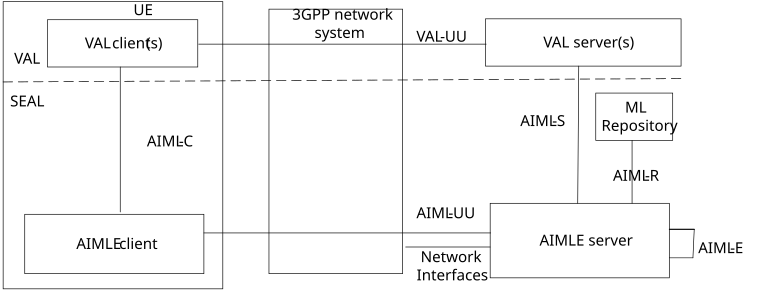
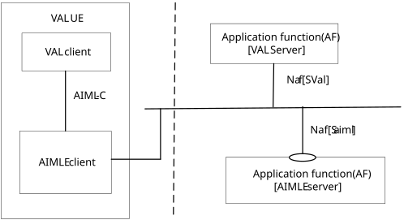
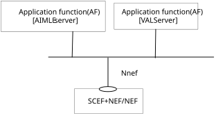
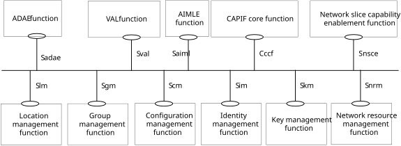
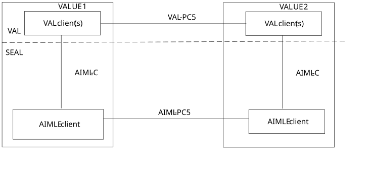
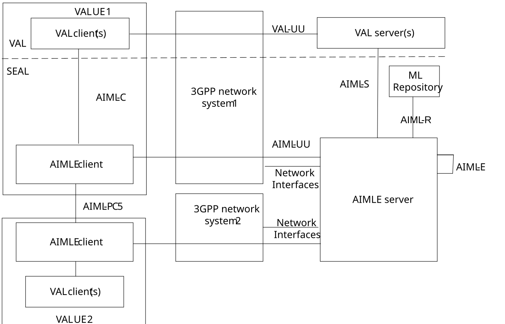
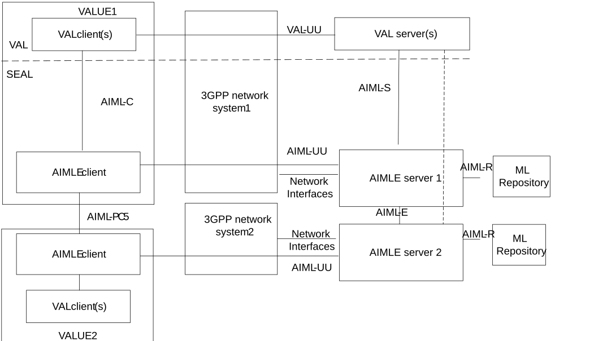
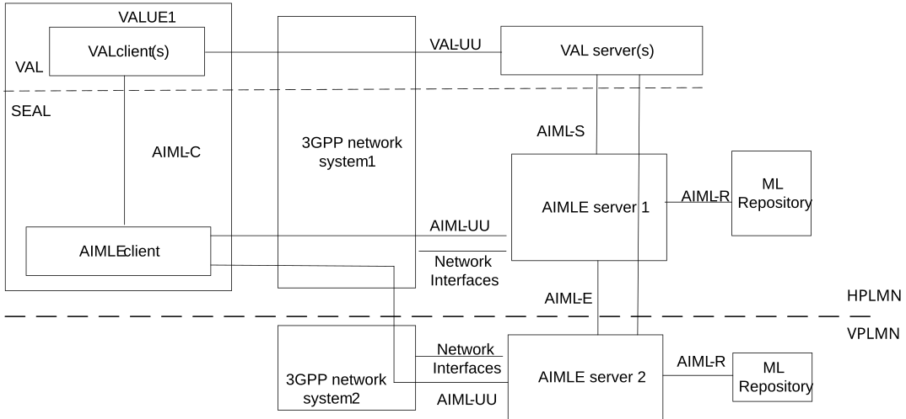

# 5 Application architecture for enabling AI/ML services

## 5.1 General

The functional architecture enhancements for the AIML enablement service are based on the generic functional model specified in clause 6.2 of 3GPP TS 23.434 \[5\]. The architecture enhancements are organized into functional entities to describe a functional architecture enhancement which addresses the support for AIML enablement aspects for vertical applications.

## 5.2 Application enablement architecture

### 5.2.1 On-Network AIML Enablement (AIMLE) Functional Architecture

Figure 5.2.1-1: On-network AIMLE functional model

Figure 5.2.1-1 illustrates the on-network functional model of AIMLE. In the vertical application layer, the VAL client communicates with the VAL server over VAL-UU reference point. VAL-UU supports both unicast and multicast delivery modes. The AIMLE functional entities on the UE and the server are grouped into AIMLE client(s) and AIMLE server(s) respectively.

The AIMLE includes of a common set of services for comprehensive enablement of AIML functionality, including federated and distributed learning (e.g., FL client registration management, FL client discovery and selection), and reference points. The AIMLE services are offered to the vertical application layer (VAL).

The AIMLE client communicates with the AIMLE server(s) over the AIML-UU reference points. The AIMLE client provides functionality to the VAL client(s) over AIML-C reference point. The VAL server(s) communicate with the AIMLE server(s) over AIML-S reference points. The AIMLE servers communicate with the underlying 3GPP network systems using the respective 3GPP interfaces specified by the 3GPP network system. AIML-E reference point enables interactions between two AIMLE servers (e.g., central and edge AIMLE servers).

NOTE: AIMLE client can be implemented as a separated software and provide APIs to VAL client over AIML-C as the above. It can also be implemented as part of VAL client.

The AIMLE server interacts with the ML repository which serves as repository for ML model and ML participants over AIML-R.

#### 5.2.1.1 Service-based AIMLE architecture representation

Figure 5.2.1.1-1 exhibits the service-based interfaces for providing and consuming AIMLE services. The AIMLE server could provide service to VAL server and AIMLE client through interface Saiml.

Figure 5.2.1.1-1: Architecture for AIML enablement – Service based representation.

Figure 5.2.1.1-2 illustrates the service-based representation for utilization of the 5GS network services based on the 5GS SBA specified in 3GPP TS 23.501 \[6\].

Figure 5.2.1.1-2: Architecture for AIMLE utilizing the 5GS network services based on the 5GS SBA – Service based representation,

The AIMLE server as well as ADAES is deployed as a SEAL server; hence enhancements to SEAL architecture (as specified in 3GPP TS 23.434 \[5\]) are needed to incorporate the AIMLE service. Figure 5.2.1.1-3 illustrates the service-based representation including AIMLE server as part of the SEAL framework.

Figure 5.2.1.1-3: SEAL functional model representation using service-based interfaces and including AIMLE function.

### 5.2.2 Off-Network AIMLE Functional Architecture

Figure 5.2.2-1: Off-network AIMLE functional model

Figure 5.2.2-1 illustrates the off-network (UE-to-UE) functional model of AIML enablement. In the vertical application layer, the VAL client communicates with a further VAL client over VAL-PC5 reference point. VAL-PC5 supports both unicast and multicast delivery modes. The UE1, if connected to the network via Uu reference point, can also act as a UE-to-network relay, to enable UE2 to access the VAL server(s) over the VAL-UU reference point.

The AIMLE client communicates with a further AIMLE client(s) over the AIML-PC5 reference points. The AIMLE client provides functionality to the VAL client(s) over AIML-C reference point. Such communication is performed for supporting local ML operations (training, distribution, inference) in a coordinated manner.

The off network functional architecture is similar to SEAL off-network architecture (as specified in 3GPP TS 23.434 \[5\]).

### 5.2.2a Enhanced AIMLE Functional Architecture for multi-operator services

There are two cases for the multi-operator service support:

\- An AIMLE server connected to AIMLE clients over different PLMNs

\- Each AIMLE server connected to AIMLE clients of single PLMN, whereas the AIMLE server interact each other via AIML-E.

An AIMLE server connected to AIMLE clients over different PLMNs

Each AIMLE server connected to AIMLE clients of single PLMN, whereas the AIMLE server interact each other via AIML-E.

In the first scenario, the AIML service (VAL service, ASP service) runs in a certain service area, which can be an edge or cloud service area or geographical area, where UEs connected to different PLMNs are present. Such service can be considered multi-operator service. VAL UEs are assumed to have AIMLE clients installed and active and connect to AIMLE server via different PLMN.

In Figure 5.2.2a-1, the VAL UE#1 is connected to PLMN#1 and VAL UE#2 to PLMN#2. Both UEs are connected to the same AIMLE server. In this scenario, different VAL server may connect to UE#1 VAL client and different VAL server to UE#2; however, both VAL servers are connected to the same AIMLE server.

Figure 5.2.2a-1 architecture for multi-operator support with common AIMLE server

In the second scenario, as depicted in Figure 5.2.2a-2, the VAL UEs are assumed to have AIMLE clients installed and active and connect to different AIMLE servers provided by different MNOs or trusted 3rd parties of the MNOs. In Figure 5.2.2a-2, each AIMLE server connects to each PLMN. The VAL UE 1 is connected to PLMN1 and AIMLE server 1 and VAL UE 2 is connected to PLMN 2 and AIMLE server 2.

Figure 5.2.2a-2 architecture for multi-operator support with distributed AIMLE servers

The VAL server may have service agreements with one or more 3GPP network system operators, where scenarios for different interactions are based on the concluded solution

NOTE: In multi-operator support with distributed AIMLE servers, the ML repositories are deployed per each AIMLE server / PLMN, and any cross-operator ML repository interaction is not supported in this release.

### 5.2.2b AIMLE Functional Architecture for roaming scenarios

This architecture is aligned with network roaming architecture, since it re-uses existing network roaming principles and describes the AIML service continuity while VAL UEs are roaming; hence how AIMLE spans across HPLMN and VPLMN is discussed. Such architecture applies to both roaming models (LBO and HR roaming architectures).

In Figure 5.2.2b-1, the AIMLAPP architecture for enabling AI/ML services for roaming scenarios is showcased. In this architecture, AIML-UU is the interface between the AIMLE client and the AIMLE server, which can be over HPLMN or VPLMN which VAL UE is roaming. AIML-E supports the interaction among AIMLE servers deployed by different MNOs, whereas the MLR-E is the new interface supporting the interaction among repositories for aligning the information on the ML models and ML/FL members to allow the continuity of the AIML service while the VAL UE is roaming.

Figure 5.2.2b-1 architecture for roaming support

### 5.2.3 Functional Entities Description

#### 5.2.3.1 General

Each subclause is a description of a functional entity and does not imply a physical entity.

#### 5.2.3.2 AIMLE client

The AIMLE client functional entity acts as the application client supporting AIMLE services. It interacts with the AIMLE server.

#### 5.2.3.3 AIMLE server

The AIMLE server functional entity provides AIMLE services supported within the vertical application layer. It interacts with the AIMLE client, the 3GPP network, other SEAL services, and VAL server.

#### 5.2.3.4 ML repository

The ML repository is a logical entity that serves both as a registry for ML/FL members and as a repository for application layer ML model related information. It can be accessed by the AIMLE server.

### 5.2.4 Reference Points Description

#### 5.2.4.1 General

The reference points for the functional model related to AIMLE are described in the following subclauses.

#### 5.2.4.2 AIML-UU

The interactions related to AIML enablement functions between the AIMLE client and AIMLE server are supported by AIML-UU reference point. This reference point utilizes Uu reference point as described in 3GPP TS 23.401 \[7\] and 3GPP TS 23.501 \[6\].

#### 5.2.4.3 AIML-S

The interactions related to AIML enablement functions between the VAL server(s) and the AIMLE server are supported by AIML-S reference point.

#### 5.2.4.4 AIML-C

The interactions related to AIML enablement functions between the VAL client(s) and the AIMLE client within a VAL UE are supported by AIML-C reference point.

#### 5.2.4.5 AIML-R

The interactions related to AIML enablement functions between the AIMLE server, and the ML repository are supported by AIML-R reference point.

#### 5.2.4.6 AIML-E

The interactions related to AIML enablement functions between AIMLE servers (e.g., central and edge AIMLE servers). It supports:

a\) coordination of AIML enablement functions between AIMLE servers, including exchange of AIMLE-related information;

b\) federation between AIMLE servers, subject to operator policy and agreements (e.g. inter-domain/PLMN); and

c\) support of AIMLE client management across AIMLE servers, including discovery/selection related information exchange and status update handling.

#### 5.2.4.7 AIML-PC5

The interactions related to AIML enablement functions between AIMLE clients in off-network deployments.
